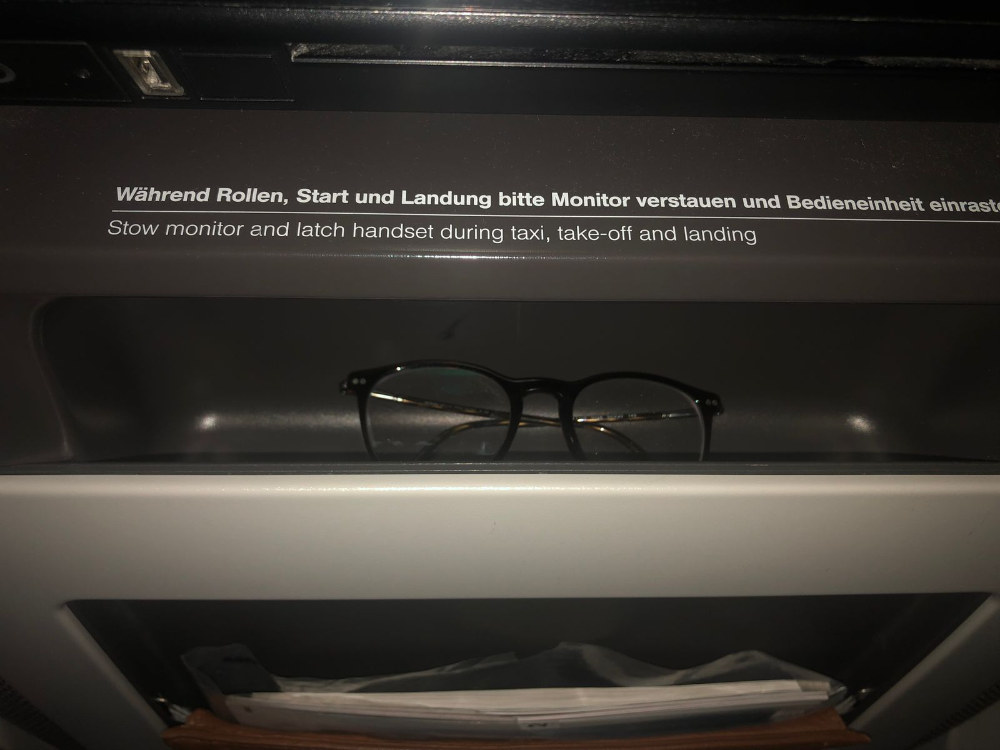
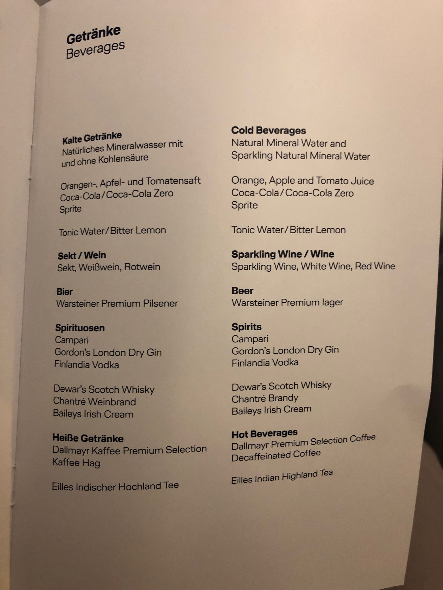

I recently had the opportunity to try Lufthansa's Premium Economy in their A380 between Munich and Hong Kong. This is a brief review of the flight (Both there an back in combination).

My outbound flight started with horrible delays in Stockholm which left me running through Munich airport trying to make the connection in 13 minutes, so as I arrived sweaty and exhausted to the flight it wasn't the best of starts.

## Cabin

Lufthansa's Premium Economy cabin in the A380 is situated at the lower front of the airplane which has some great benefits (More on that later). It's set up in a 2-4-2 configuration meaning that the seats along the window are of course the best. My seat for the outbound leg was 56K, which is a window seat on the second last row. Overall I was not happy with this seat as the proximity to galley and lavatory made it quite hard to sleep. For the return trip I had 50K which is the equivalent bulkhead seat which was much better. One interesting thing to note however was the large temperature difference in the cabin, the front was warm, to the point where I barely needed to use the blanket, whereas the back was very cold. Your mileage may vary but I experienced this on both flights so something to keep in mind if you're sensitive to temperature.

## Amenity Kit

Each seat comes with a standard blanket and pillow (Probably the same as standard economy) as well as a small amenity kit which contains (Most) of the essentials you'll need. It came with socks (Same kind of useless polyester socks as all other airlines), dental kit, earplugs, face mask and a wet tissue. Blatantly lacking is a comb, which is something I always tend to need after a night's sleep, in my opinion skipping the socks in favor of this or the combined comb/hair brush Lufthansa has in their First class would be great.

## Food & Drink Service

Soon after boarding completed the crew came out with some pre-departure drinks. There were no options but everyone was offered the same mango flavored drink which was actually a good one.

The time during taxi gave me the opportunity to explore the seat a bit more. One thing that immediately stood out to me was the amount of clever storage! I always find that even business and first class seats greatly lack places to store smaller items such as phone, glasses, Kindle etc which I want to keep close but not necessarily on a table. In this case there was both a small hole under the IFE which fit my glasses perfectly.

Of course it fits your phone too (Which I for obvious reasons couldn't take a picture of) as well as any other smaller item. Additionally there's a small storage area next to the seat, in the middle armrest, with a small strap around it which fits for example a Kindle perfectly. This is where the amenity kit was stored originally.

And finally there is of course the standard pocket in the seat in front of you which holds magazines and safety on board instructions. Additionally, due to the size of the A380 there is quite a bit of space between the seat and the airframe which means that you can easily fit a smaller bag next to your legs without feeling cramped.

Shortly after take-off the first drink was served. As I always do I opted for the sparkling wine, in this case of the German variety. Interestingly the menu does not say the brand but simply says "Sparkling Wine". Sadly it was served in a normal plastic drinking glass, not even the fancy kind that the pre departure drink was served in, this did naturally take away some of the "Premium" feel. The drink came with a small bag of salty snacks which were quite good.

Shortly after the food service started, first with a hot tissue and then with the food and drinks itself.. On both flights we had the choice between Western and Chinese main courses, however the appetizer and desserts were the same. I opted for the Western course in both cases and the Goulash on the outbound leg was among the best main courses I've had on a flight, including more premium cabins. I don't understand why airlines stubbornly serve things like pasta and chicken (As on the return leg) which don't taste that well after reheating, and why we don't see more stews like the Goulash which tastes excellent after reheating. Appetizers and desserts were both decent but nothing out of the ordinary, the pretzel-like bread was a nice touch.

With the food I had the generic Red Wine which this time was served in a proper glass.

## IFE 

While eating I tried out the IFE which I had kept to only showing the map so far. This turned out to be quite the horrible experience. Not only was it slow and clunky which made it hard to navigate, the filter I set up for movies (Only English movies) kept resetting as I was scrolling through the list of movies. In the end I opted for one of the movies near the top (8 Mile) and enjoyed it. The crew did distribute headphones (Of the over-ear variant) but I opted not to take them and used my own instead.

To add to the horrible IFE experience, I cannot understand why so many airlines have a "shared" moving map between all IFEs instead of letting me pick the zoom, angle etc myself. Instead it circles different zooms, some of which barely even show the flight route, and on top of it the moving map software crashed and restarted several times during the flight home.

## Sleep

After dinner I tried to get a few hours of sleep and to my surprise found that I could sleep very well in this seat. Not only was it reasonably comfortable, the backrest also leaned far away back to provide a good sleeping position and one of the perks of being at the far front is the silence due to being so far away from the engine. The only position more quite on the A380 is the far front upper deck where the first class cabin is located, although for example Asiana locate their first class cabin on the lower deck, i.e. in the same position as Lufthansa's Premium Economy. Interestingly the business class cabin is further back on the upper deck.

A few hours before landing I was woken up, surprisingly well rested, by the cabin lights turning on in a smooth simulated sunset. This was followed by a breakfast service, once again with the choice between Western and Chinese breakfasts. I opted for the scrambled eggs, tomato and mushrooms. This was quite delicious, unlike the sausages and cabbabe on the way back. The eggs was followed by some apple oatmeal and some orange juice.

## Landing

Finally during landing I realized the other great perk of the cabin location (More so on the return trip where I had the very front seat) and it's the short distance to the door. I was the first passenger to leave the plane when landing in Munich by quite a wide margin, as even business and first class passengers have a longer walk down from the upper deck. If you expect to be in a hurry then these seats are definitely great as being first to immigrations can make a big difference in many countries. Unfortunately when arriving to Hong Kong Lufthansa hadn't handed out any arrival cards which you need to fill in and I didn't realize this until after waiting quite a while at the border checkpoint. This led to me losing and head start I got from leaving the plane early. Not sure if this was a mistake or if Lufthansa doesn't do this in certain cabins (They did when I flew them in first class to Beijing a few months ago). Regardless it was my mistake to not realize earlier.

## Stats

<table>
<tr>
<td>Distance</td> <td>5614 mi</td>
</tr>
<tr>
<td>Points per leg</td> <td>5700 EB (Plus 1250 EB for ARN-MUC)</td>
</tr>
<tr>
<td>Total points</td> <td>13 900 EB</td>
</tr>
<tr>
<td>Cost per point</td><td>0.058€</td>
</tr>
</table>

## Summary

Overall I had a very good experience with Lufthansa Premium Economy. The food was good, the seat was comfortable and the price was right. I would definitely consider this an alternative to Business Class if you are able to sleep well without the lie-flat seats as the other perks of business class are, in my opinion, simply luxury extras rather than large value adds. In this case I payed only a few 100€ more than a regular economy ticket, and it gave me a huge amount of extra frequent flyer miles (Which was my primary reason for the upgrade) so it was very much worth it.
