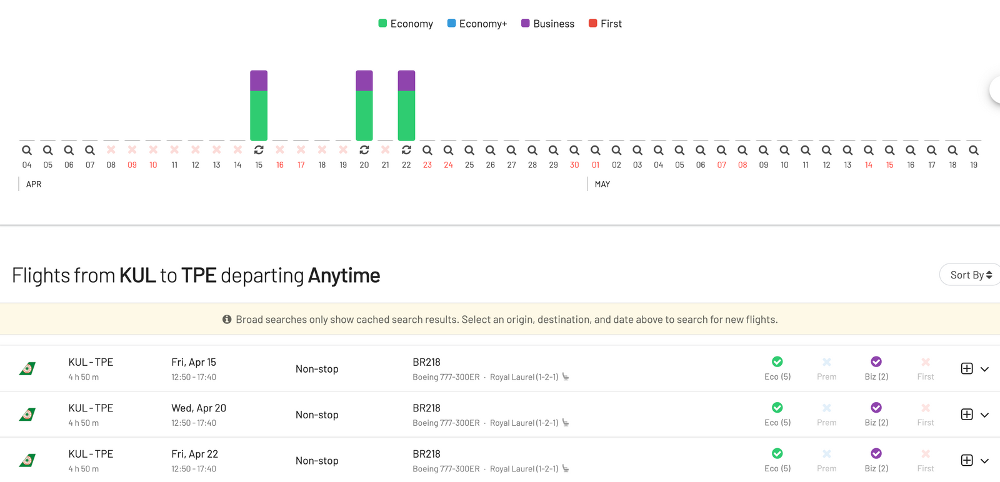
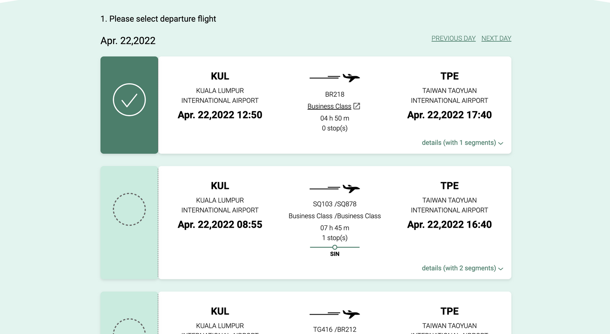
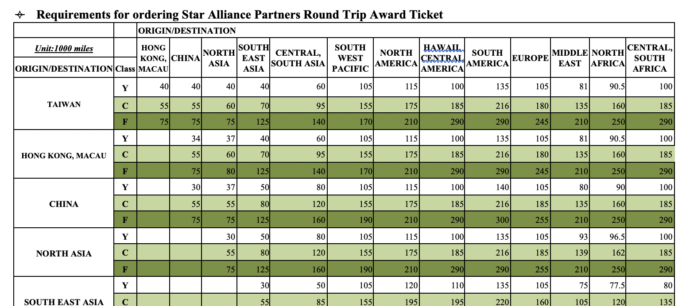
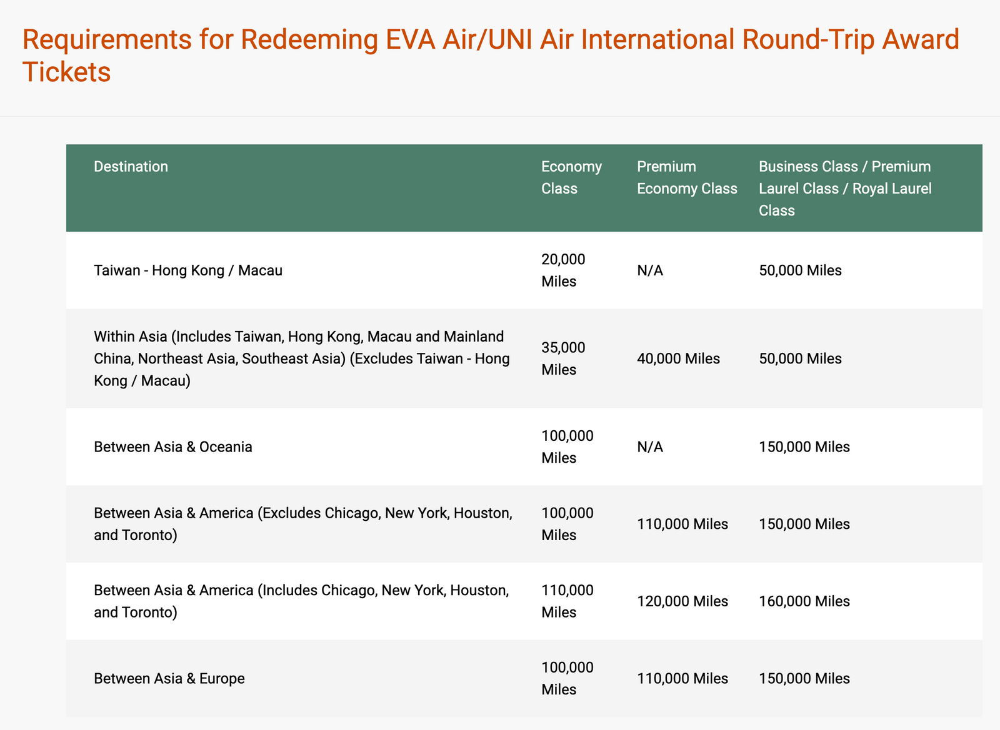
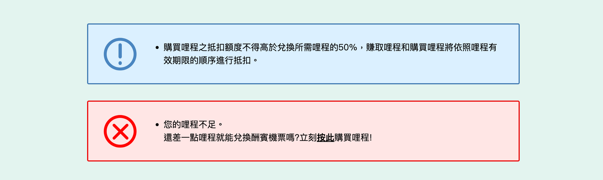
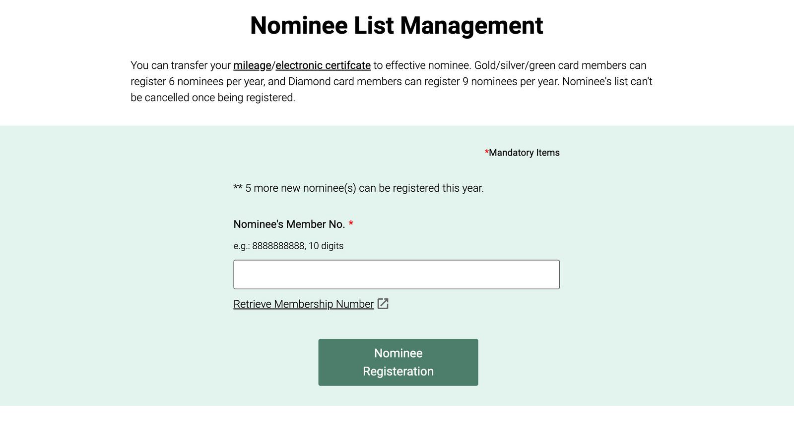
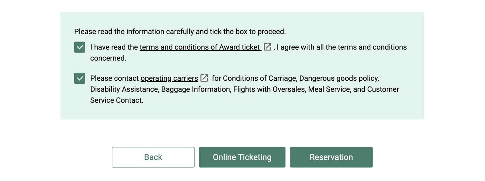
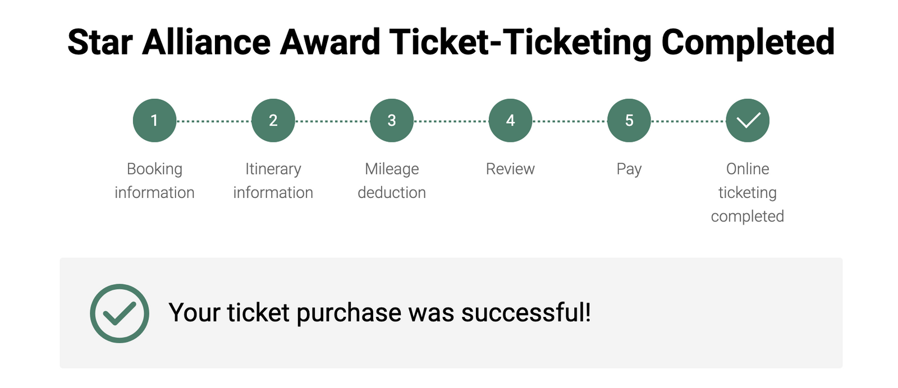

不得不說，長榮航空的哩程兌換方式是有點特殊。我最近才剛有機會用長榮的飛行常客計劃（哩程獎勵計劃）兌換哩程，流程不是很簡單，尤其是這次我還需要用哩程幫我自己和同行夥伴訂兩張機票，過程更是複雜。

## 1. 在長榮網站上搜尋哩程可兌換的機票

當然要搜尋可兌換的哩程機位，[AwardFares](https://awardfares.com)是最方便快速的方式，在AwardFares網站上就可以直接查詢手上的哩程能夠兌換哪些航空的機位，雖然AwardFares目前還沒有直接支援長榮的飛行常客計劃，但我們還是提供了不錯的方式來預測可兌換哩程的機票艙位（如圖）。以我個人的經驗為例，我在AwardFares的系統上很快找到了兩個吉隆坡（KUL）飛台北桃園（TPE）的商務艙位置，之後在長榮航空的官網上的訂票系統也驗證了這件事。

你也可以直接在長榮航空的網站上搜尋哩程可兌換的機位，不過需要注意一件事：在長榮的官網上有兩個系統，一個是專屬*長榮/立榮航空*的訂票系統，另一個才是*Star Alliance星空聯盟*的訂票系統。

路徑：無限萬哩遊>哩程獎勵計畫>哩程兌換>酬賓機票兌換>長榮/立榮航空

儘管這次我想訂的機票是長榮運營的，但我在剛剛所說的 *長榮/立榮航空*系統上卻找不到我想找的機位，卻能在*星空聯盟*的系統上找到。

Note:要開始搜尋機位需要點擊 *行程定位* 的按鈕，也需要預先登入會員帳戶.

*另一件有趣的事：最近一些航空聯盟像是 United MileagePlus（美聯的萬里飛行常客計劃）和 SAS EuroBonus都沒有提供兌換新加坡航空的機位，但在長榮航空系統上卻是可以用哩程兌換新加坡航空機位的*

## 2. 抵扣哩程

大部分的航空公司都會在會員用自家哩程兌換其他聯盟成員機票時，要求用更多的哩程點數兌換（例如用長榮的哩程兌換其他星空聯盟航空的機票，就會比訂長榮的扣更多點），一般用星空聯盟里程兌換台灣到東南亞的商務艙機票要扣抵70,000哩（來回機票）。

但如果想要兌換長榮航空的來回商務艙機位就只需要扣50,000哩，單程只要一半（25,000哩）。這裡可以留意一下，即使是用長榮網站上 *星空聯盟* 的搜尋功能，只要你是訂**長榮航空** 的機票，就只需要付比較少的哩程點數。

## 3. 用哩程幫同行夥伴訂位

長榮航空比較與眾不同的地方就在於你沒有辦法直接用自己的哩程幫其他人訂機位。首先你會發現長榮的星空聯盟酬賓系統上並沒有可以勾選訂位人數的選項，但卻可以新增**同行旅客**的會員卡號和密碼，最多可以新增三組。

對，你因此會需要同行夥伴的登入資訊和授權（當然你也可以請他們幫你輸入），這個聽起來就不太妥當……。

不過幸好我和我的同行夥伴都有長榮航空的會員帳號（雖然我們只有一個人有在長榮航空上累積哩程），我在系統上輸入了我們的個人資訊也找到了機位，但當我要繼續下一步時，卻跳出了紅字訊息顯示 *「您的哩程不足（Your mileage is not eligible）」* 。老實說這非常奇怪，因為我確定我們的哩程超過了需要扣抵的點數，絕對可以兌換兩個人的機位。

到這個關頭我決定聯絡長榮航空客服來了解卡關的原因。我先打了電話到台灣辦公室，不過他們剛好因為連假不在服務時間（台灣的週一），接著我試著打到美國辦公室，不過他們週日也不營業，最後我打了澳洲的客服電話，非常開心他們立刻接了，剛好一個非常親切的客服正在線上。

她告訴我如果要用哩程幫兩個人訂機票，那**我必須先把需要的哩程點數轉給我的同行旅客**。簡單來說就是不能用自己的哩程幫別人訂位，每一個同行旅客的會員帳戶上都要有足夠的哩程點數才行。 

接著她說如果要這樣做，持有旅程的人必須要先把同行夥伴設為「受讓人（Nominee）」，如果想**這樣做** ，我還必須要 **申請開啟一個叫做「網路服務」的東西**。

而申請這個我需要填一個PDF表單再寄回給他們，客服甚至問我希望掃描寄回呢，還是傳真回去給他們 （哈，真的只有亞洲公司才會這樣……）

路徑：無限萬哩遊>帳戶管理>受讓人清單管理

於是我快速回填了表單寄回去，幸運的是大約過了一個小時就收到「網路服務已開通」的email。

接著**我需要把我的同行夥伴設為受讓人**，但不幸的是這個程序**可能會需要24小時**才能完成，這點還滿煩的，因為你不知道這段期間中會不會有人突然佔走了你的機位。

最後這個受讓人在申請隔天凌晨順利被建立（台灣時間）。我在台灣時間4/4申請，等到4/5台灣過半夜才總算啟用了！

再來就要開始轉讓哩程了！我先確認哩程機位還是有效，接著設定轉讓旅程給同行夥伴，這時我有點擔心這個步驟也要花一點時間，不過所幸這一步倒是立刻就轉好了，而且沒有扣其他手續費用。

到這裡做一個總結吧：

1. 你的同行夥伴也要有長榮航空的會員帳號（免費註冊）
2. 你需要先填寫表單為自己的線上帳戶申請開通「網路服務」。建議也幫你的同行夥伴一起申請，以免之後退還哩程不能使用
3. 將同行夥伴設為哩程「受讓人」
4. 受讓人登記的生效時間會是台灣時間的第二天，或者最多等候24小時
5. 轉讓足夠的哩程給同行夥伴

## 4. 訂機位

好了，現在哩程的狀況都解決了，終於可以開始訂機票了，這個階段的實際作業其實就很簡單也很快速，我再次開始搜尋機位、填寫好會員號碼、找到機位之後就來到了付款畫面，這時也能看到兩個乘客都有足夠的哩程來抵扣了。

接著也能順利填寫乘客資訊、確認訂位資料，並支付其他稅金。這個費用算是非常合理，兩個人大概只需要再多付$140美金，對一趟五小時的商務艙旅程來說，這價格並不壞。

最後一個畫面稍微有點讓我困惑，你有兩個選項，一個是線上開票，另一個是行程訂位，對我來說差別不大……

不管怎麼樣，我點了線上開票，看起來是對的，很快就收到了我的電子機票和訂位資訊。

我想這個故事告訴我們的是，如果你正在累積長榮航空的哩程點數，並且有計劃要用長榮航空的點數兌換哩程，請記得要提前作業，不要等到最後一刻了！