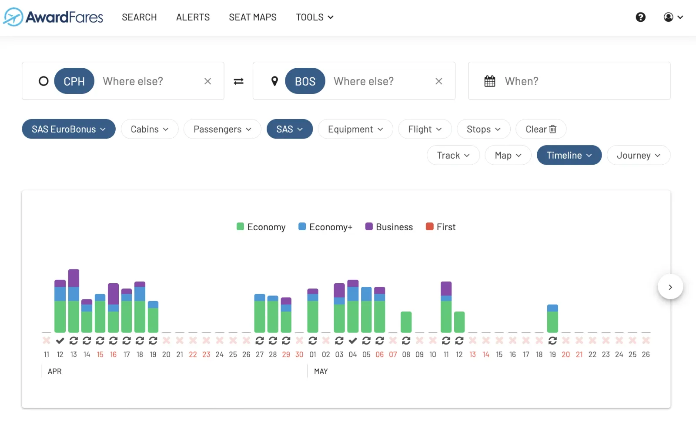

Knowing where to spend your SAS EuroBonus points is always challenging. Are you getting good value for them? How much is a EuroBonus point worth? Should you book cash, points or points+cash? We get it, it's tricky.

On average, a standard redemption is around 1-1.5 cents (€) per point. If you are getting close to that, you are getting a decent value. But there are tricks and ways to bring that value up to 

In this post, we collect our top pick redemptions for April 2023. Keep in mind that award space is limited and doesn't last very much, so make sure to book ASAP if you are interested in any of the routes.

## Best SAS EuroBonus Redemptions (April 2023)

### 1. [Copenhagen to Boston with SAS](https://awardfares.com/search?CPH.BOS.;a:SK;z:eurobonus) (Economy/Business)

Round trip in Economy Class (SAS Go)

* Standard Price: €1414
* EuroBonus Price: 60.000 points + €49 [Value per point: 2.35 cents (€)]

Round trip in Business Class (SAS Business)

* Standard Price: €6551
* EuroBonus Price: 100.000 points + €49 [Value per point: 6.5 cents (€)]

### 2. [Frankfurt to Dubai with Lufthansa](https://awardfares.com/search?FRA.DXB.;a:LH;z:eurobonus) (Economy)

Round trip in Economy Class
* Standard Price: €919 (On Lufthansa's website)
* EuroBonus Price: 60.000 points + €170 [Value per point: 1.2 cents (€)]

### 3. [Brussels to Houston with United](https://awardfares.com/search?BRU.IAD.;z:eurobonus) (Business)

Round trip in Business Class

* Standard Price: €4995 (On United or Lufthansa's website)
* EuroBonus Price: 130.000 points + €0 [Value per point: 3.8 cents (€)]

### 4. [Stockholm to Buenos Aires With Lufthansa](https://awardfares.com/search?ARN.EZE.;a:LH;z:eurobonus) (Business)

One-way in Business Class

* Standard Price: €1848 (On Lufthansa's website)
* EuroBonus Price: 99.000 points + €135 [Value per point: 1.73 cents (€)]

This flight can also be booked from Oslo, Copenhagen and Frankfurt.

### 5. [Frankfurt to Miami with Swiss](https://awardfares.com/search?FRA.MIA.;a:LX;z:eurobonus) (Mixed)

Round trip in mixed classes, Business (outbound) + Economy (return)

* Standard Price: €3498 (On Swiss or Lufthansa's website)
* EuroBonus Price: 100.000 points + €198 [Value per point: 3.3 cents (€)]

This flight can also be booked from Oslo, Copenhagen and Stockholm, connecting with Swiss or Lufthansa.

## How To Find Good SAS EuroBonus Redemptions Using AwardFares?

1. Log-in to [AwardFares](https://awardfares.com/).
2. Under FFPs, select **SAS EuroBonus Only**.
3. Select the **Departure City**.
4. You'll see a list of available award flights to different destinations and dates.
5. **Pro Tip**: For a given flight you select, check the price on [SAS Website](https://www.flysas.com/), and compare that with the price in cash, to determine the "value per point".

With **AwardFares Diamond** you can get real-time availability, unlimited alerts, and unlimited custom searches!

[Upgrade Now](https://awardfares.com/pricing)	