As an Aeroplan member, you have access to a world of travel possibilities through Air Canada and its partners. However, navigating the program to find the most valuable redemptions and sweet spots can be a daunting task. Don’t worry, we’ve got you covered!

In this guide, we'll show you how AwardFares simplifies this process, and share expert tips on how to search for and book award flights that offer the best value for your hard-earned miles. Start turning your Aeroplan miles into unforgettable travel experiences!

### In this post

- [What is Aeroplan?](#what-is-aeroplan)
- [Aeroplan Award Chart Sweet Spots](#aeroplan-award-chart-sweet-spots)
- [How To Find Aeroplan Sweet Spots In 2024](#how-to-find-aeroplan-sweet-spots-in-2024)
- [Bonus: Find Emirates Awards](#bonus-find-emirates-awards)
- [Aeroplan Award Chart (2024)](#aeroplan-award-chart-2024)
- [Get Started and Stay Tuned](#get-started-and-stay-tuned)

## What is Aeroplan?

[**Aeroplan**](https://aeroplan.com/) is Air Canada’s frequent flyer program (Canada’s largest airline). Members can earn miles through various activities, such as flying with Air Canada or its Star Alliance partners, using Aeroplan-affiliated credit cards, booking hotels and car rentals, shopping at participating retailers, and more. Miles can be redeemed for a wide range of rewards, including flights, hotel stays, car rentals, vacation packages, merchandise, and gift cards.

If you are curious like us, Aeroplan was originally launched in 1984 as a division of Air Canada and later became a separate company. In 2020, Air Canada reacquired Aeroplan and integrated it back into the airline's operations.

### How Much Are Aeroplan Miles Worth?

As with any other frequent flyer program, the value of Aeroplan miles varies greatly depending on how they are redeemed. As a general rule of thumb, Aeroplan miles are worth between 1.2 and 2.5 USD cents per mile when redeemed for flights, but this value is not fixed and can fluctuate based on various factors such as the route, cabin class, demand, and redemption type.

When redeeming miles for Business or First Class flights, you may get a higher value per mile compared to economy-class redemptions.

## Aeroplan Award Chart Sweet Spots

In 2021, Aeroplan has moved to a dynamic pricing model for its reward flights, which means that there isn't a fixed award chart with set redemption rates. This makes it more difficult to find good redemptions. However, there are still some sweet spots where you can get great value from your Aeroplan miles.

Here are ten examples of such routes:

### 1. [North America to Europe in Business Class](https://awardfares.com/search?continent:NA.zone:Europe.;c:business;z:aeroplan)

Look for flights with low taxes and fees, such as those operated by Swiss or Turkish Airlines. This can offer exceptional value for your miles, especially on longer routes.

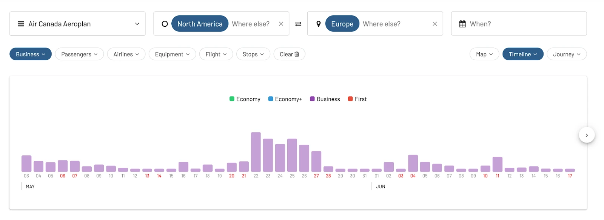

### 2. [North America to Deep South America](https://awardfares.com/search?continent:NA.country:AR,country:BR,country:CL.;z:aeroplan)

Redeeming miles for flights to countries like Argentina, Brazil, and Chile can provide good value, especially when flying in Business Class.

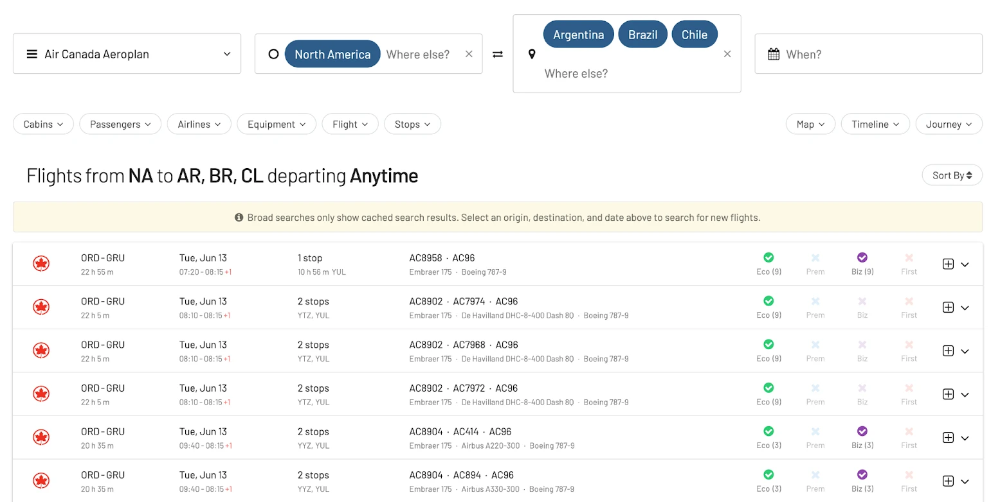

### 3. [Intra-Asia flights](https://awardfares.com/search?continent:AS.continent:AS.;z:aeroplan)

Redeeming miles for flights within Asia, particularly on carriers like EVA Air or ANA, can offer a great value for shorter routes in Business or First class.

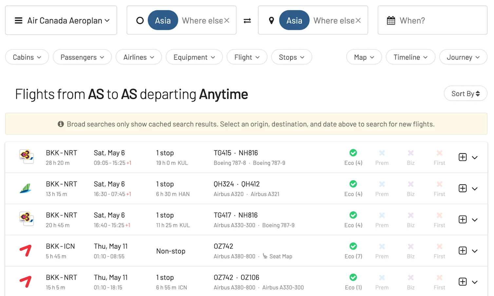

### 4. [North America to Australia or New Zealand](https://awardfares.com/search?continent:NA.country:AU,country:NZ.;z:aeroplan)

Finding availability can be challenging, but redeeming miles for Business or First-class flights to Australia or New Zealand can yield excellent value! Pro tip: Be specific in your searches and you might have a better chance of detecting awards. Remeber you can also set up alerts!

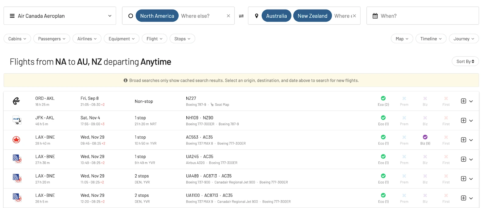

### 5. [North America to the Middle East or North Africa](https://awardfares.com/search?continent:NA.zone:North%20&%20Central%20Africa,%20Middle%20East.;c:business;z:aeroplan)

Routes to destinations like the United Arab Emirates, Qatar, and Morocco can offer good value. There are multiple Star Alliance partners that oprate these routes, so availability is often decent.

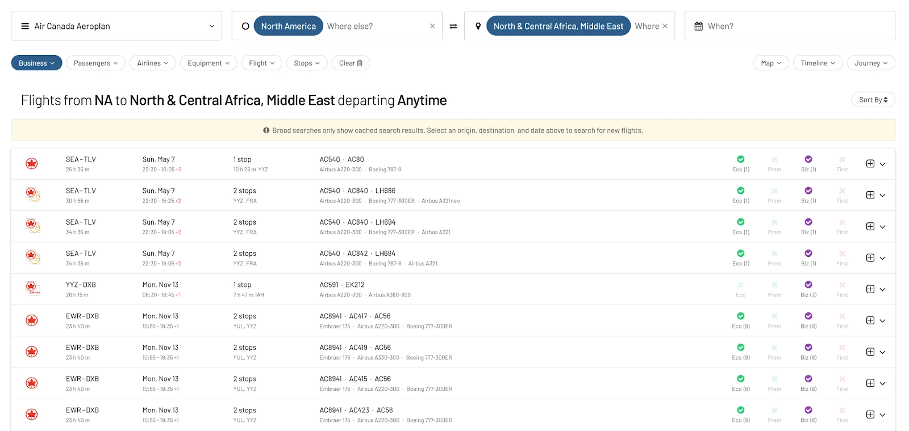

### 6. [Domestic short-haul flights within Canada](https://awardfares.com/search?country:CA.country:CA.;o:price;so:asc;z:aeroplan)

Aeroplan can provide good value on shorter domestic routes within Canada, especially when cash fares are high.

### 7. [Short-haul flights within Europe](https://awardfares.com/search?zone:Europe.zone:Europe.;o:price;so:asc;z:aeroplan)

We typically don't recommend redeeming miles on short-haul flights, but during some weeks or seasons the cash fares can be incredibly high, and miles can helpy you save a ton of money. For short-haul flights on Star Alliance partners within Europe.

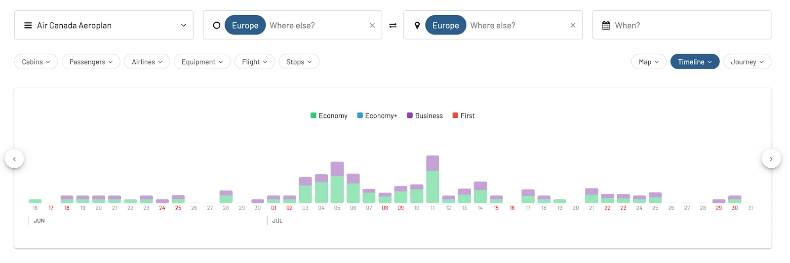

### 8. [Flights within North America](https://awardfares.com/search?continent:NA.continent:NA.;o:price;so:asc;z:aeroplan)

The award chart for flights within North America is quite decent, and availability has been historically good if you need to get that last-minute seat!

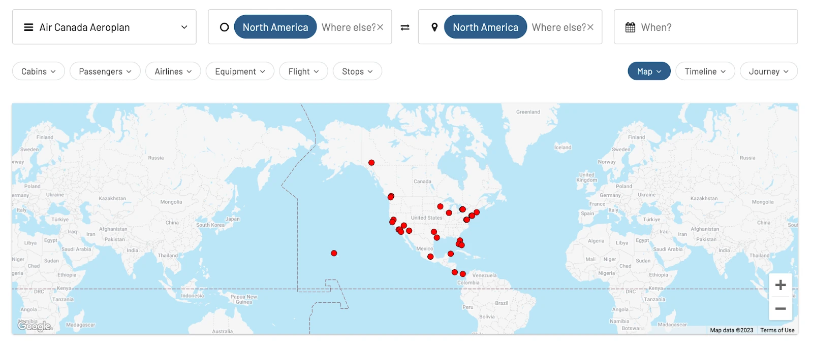

**Aeroplan Chart Within North America [Air Canada (Partners)]**

<table>
  <tr>
   <td>Distance
   </td>
   <td>Economy
   </td>
   <td>Premium Eco
   </td>
   <td>Business
   </td>
  </tr>
  <tr>
   <td>0 - 500
   </td>
   <td>6k-10k (6k)
   </td>
   <td>10k-20k (NA)
   </td>
   <td>15k-25k (15k)
   </td>
  </tr>
  <tr>
   <td>501 - 1500
   </td>
   <td>10k-15k (10k)
   </td>
   <td>15k-25k (NA)
   </td>
   <td>20k-35k (20k)
   </td>
  </tr>
  <tr>
   <td>1501 - 2750
   </td>
   <td>12.5k-17.5k (12.5k)
   </td>
   <td>20k-25k (NA)
   </td>
   <td>25k-60k (25k)
   </td>
  </tr>
  <tr>
   <td>2751+
   </td>
   <td>17.5k-25k (22.5k)
   </td>
   <td>30k-45k (NA)
   </td>
   <td>35k-70k (35k)
   </td>
  </tr>
</table>

### 9. [North America to Asia](https://awardfares.com/search?continent:NA.continent:AS.;o:price;so:asc;z:aeroplan)

Redeeming Aeroplan miles for flights to Asia on carriers like ANA or EVA Air can offer exceptional value in both Business and First Class. Try filtering out by cabin type when searching on AwardFares.

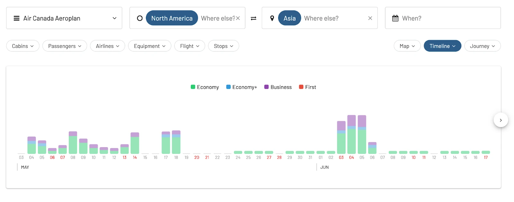

### When Does Aeroplan Release Award Seats?

Air Canada Aeroplan releases award seats a year in advance (365 days). Read more about when different programs open award space [in our ultimate guide here](https://blog.awardfares.com/ultimate-guide-to-award-release-dates/).

## How To Find Aeroplan Sweet Spots In 2024

### Easily Identify Available Aeroplan Awards

AwardFares can help Aeroplan members quickly find available award flights by scanning partner airlines' inventory, saving time and effort, instead of searching on Aeroplan’s website individually.

### Alerts

Aeroplan users will find it very simple to set up alerts on AwardFares, for specific destinations, travel dates, and cabin classes. This way, members receive notifications when reward seats become available, increasing their chances of securing the perfect flight.

### Advanced Search Options

Filtering down results with AwardFares is just a matter of clicks. Search for non-stop flights, preferred airlines, and specific layover cities. It’s easy to tailor searches for award flights according to preferences and travel needs.

With the [recently introduced features](https://blog.awardfares.com/new-programs-and-features/), users can now search across all airports in a metropolitan area such as Toronto [by just typing YTO](https://awardfares.com/search?area:YTO..;o:price;so:asc;z:aeroplan).

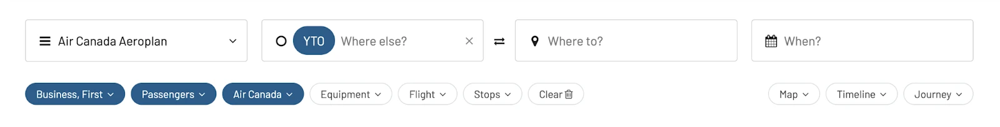

### Route Suggestions

AwardFares can suggest alternative routes or layover cities, helping you find more availability or better redemption rates. This feature is particularly helpful when searching for complex itineraries or during high-demand travel periods.

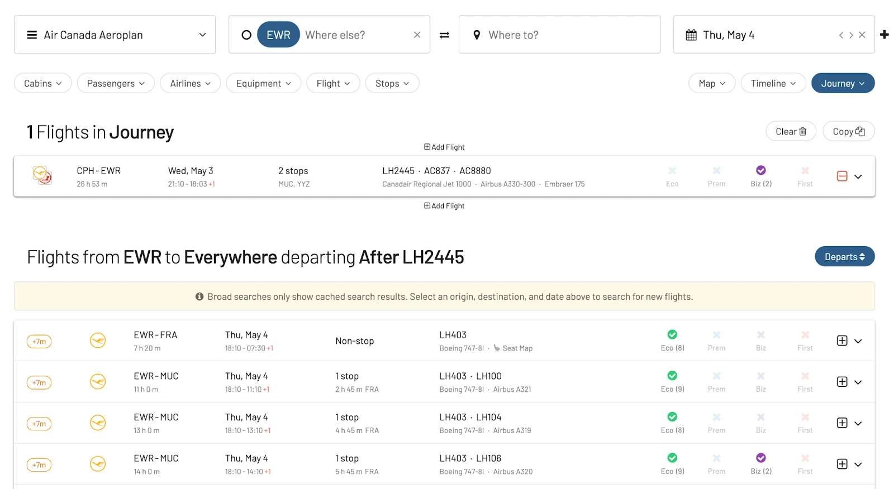

### Timeline View

AwardFares provides an award calendar feature that displays availability for a range of dates, making it easier for Aeroplan members to plan their trips and identify periods with better award flight options.

## Bonus: Find Emirates Awards

Emirates [recently became a partner airline of Aeroplan](https://www.aircanada.com/ca/en/aco/home/aeroplan/news/emirates.html#/) (December 2022), and even though redemption rates can be all over the place, there are also some sweet spots in their award chart, such as Chicago to Dubai in Business or First Class, and other routes to Asia.

With AwardFares, it’s easy to identify available award flights on Emirates. Simply filter by program Aeroplan, airline Emirates, and then Cabin (e.g., Business and First). You will[ see all the available seats](https://awardfares.com/search?;c:business,first;a:EK;o:departs;so:a;z:aeroplan) in a matter of seconds.

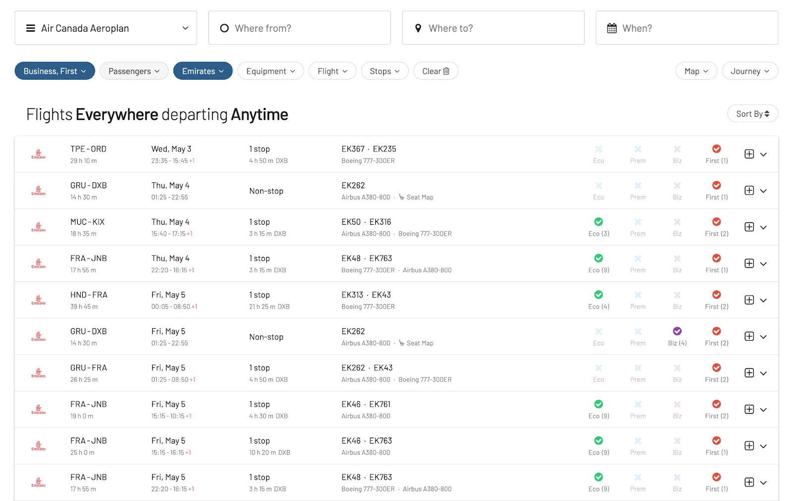

**Aeroplan Awards on Emirates (one-way)**

<table>
  <tr>
   <td>Distance (miles)
   </td>
   <td>Economy
   </td>
   <td>Business
   </td>
   <td>First
   </td>
  </tr>
  <tr>
   <td>0 - 2000
   </td>
   <td>15k - 35k
   </td>
   <td>30k - 77,5k
   </td>
   <td>65k - 175k
   </td>
  </tr>
  <tr>
   <td>2001 - 5000
   </td>
   <td>21k - 65k
   </td>
   <td>45k - 140k
   </td>
   <td>110k - 325k
   </td>
  </tr>
  <tr>
   <td>5001 - 9000
   </td>
   <td>40k - 85k
   </td>
   <td>80k - 185k
   </td>
   <td>225k - 475k
   </td>
  </tr>
  <tr>
   <td>9001 - 12000
   </td>
   <td>60k - 110k
   </td>
   <td>120k - 225k
   </td>
   <td>300k - 600k
   </td>
  </tr>
  <tr>
   <td>12001
   </td>
   <td>85k - 150k
   </td>
   <td>180k - 300k
   </td>
   <td>400k - 750k
   </td>
  </tr>
</table>

## Aeroplan Award Chart (2024)

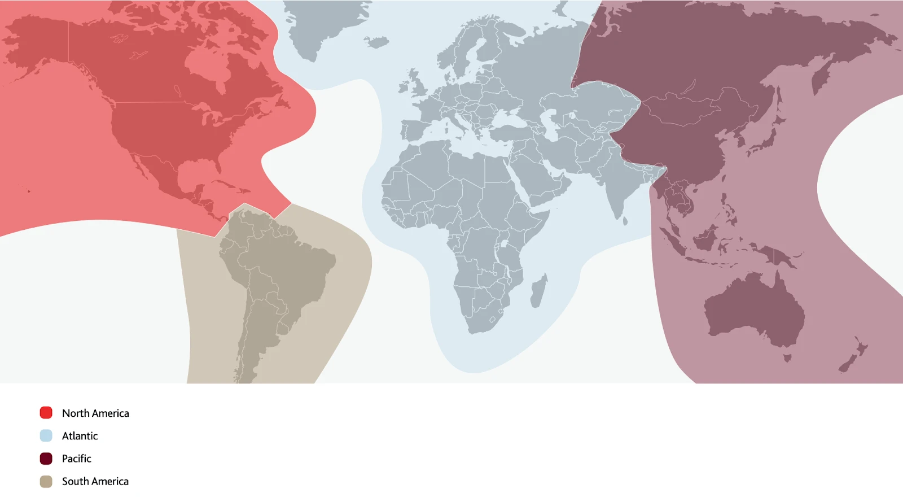

Check the complete and [updated Aeroplan award chart on Air Canada’s website](https://www.aircanada.com/content/dam/aircanada/loyalty-content/documents/flight-rewards-chart-en.pdf).

## Get Started and Stay Tuned

We are rolling out new features and improvements regularly, so make sure to [create a (free) account](https://awardfares.com/signup) to stay on top of the latest news, announcements and guide through our newsletter.
