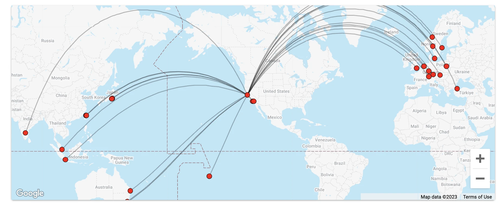

Every year, cities around the world celebrate Pride Month with a variety of events to honor and uplift the LGBTQ+ community. These celebrations vary from parades and parties to concerts and exhibitions. Pride events have become vibrant expressions of acceptance, unity, and love for everyone.

During these very busy weeks, **cash prices can skyrocket**! Thus, it can be a great opportunity to use your points, maximizing their value.

Here, we've curated a list of the top nine pride-friendly destinations with great availability right now.

## Top Pride Destinations You Can Book With Points

### [1. New York City, USA](https://awardfares.com/search?.area:NYC.)

With more than 50 events in 30 days, New York draws an incredible crowd of 3 million people. Heritage of Pride, the nonprofit organization associated with the event, is responsible for planning and executing the city's official LGBTQIA+ Pride events every year. These events are held in remembrance of the historic Stonewall Riots of 1969, marking the dawn of the contemporary Gay Rights movement.

The NYC Pride Parade starts at the intersection of 26th Street & 5th Ave and concludes at 23rd Street & 7th Ave.

* NYC Pride Parade: **June 26th, 2023**

#### How to book
New York City is served by three major airports: John F. Kennedy International Airport (JFK), LaGuardia Airport (LGA), and Newark Liberty International Airport (EWR).

On AwardFares, you can search the entire metro area by typing NYC. There are plenty of flights from both Europe and Asia on programs such as Aeroplan, Mileage Plan, SAS EuroBonus and AAdvantage.

<figure>

</figure>

<figure>

</figure>

### [2. San Francisco, USA](https://awardfares.com/search?.area:SFO.)

San Francisco Pride holds the distinction of being one of the earliest and largest LGBTQIA parades globally. Marching contingents traverse the city's core, along Market Street, captivating an audience of over 100,000 spectators. The procession embarks from Embarcadero, with festivities unfurling all the way to the Civic Center.

* San Fransisco Pride Parade: **June 25, 2023**

#### How to book

Great availability during June and July using SAS EuroBonus, Aeroplan and AAdvantage.

<figure>

</figure>

<figure>

</figure>

### [3. Paris, France](https://awardfares.com/search?.area:PAR.)

Assemble your squad and make your way to Le Marais, the heart of gay Paris, for a week-long festivity that culminates in the grand finale: Marche des Fiertés LGBTQ (Paris Gay Pride Parade). Born in the 80s, Marche des Fiertés LGBTQ holds historical significance for the City of Lights, tracing its origins back to when local community members rallied together in the battle for LGBTQ+ rights.

The parade kicks off at 2pm at Place de la Concorde, directly opposite the National Assembly, and goes through various iconic locations such as Châtelet, Le Marais, Pont de Sully, and Bastille, before wrapping up with a colossal party at Place de la République, free for all to join!

* Paris Pride Parade: **June 24, 2023**

#### How to book

There's also different airports that serve Paris (CDG, ORY, etc.). On AwardFares you can just type the city **Paris** to see flights available to all airports.

**Beware!** Only few seats left to CDG during June and July. Hurry up. Connections from the US, Brazil, Africa and Asia.

<figure>

</figure>

### [4. Toronto, Canada](https://awardfares.com/search?.area:YTO.)

Pride Toronto is one of the largest organized pride festivals in the world, with events spanning the entire month of June. The city's pride celebration is characterized by a massive parade, parties, and numerous cultural activities.

The pride parade starts from the corner of Church St and Bloor St all continues to Yonge St to Yonge-Dundas Square. The city of Toronto advises visitors to use public transportation to make travel easy.

* Toronto Pride Parade: **June 25, 2023**

#### How to book

Toronto Pearson International Airport (YYZ) is a major international hub, with plenty of airlines flying to and from it. Lots of available seats during June on Air Canada using Aeroplan and other partners.

<figure>

</figure>

### [5. Madrid, Spain](https://awardfares.com/search?.area:MAD.)

Madrid hosts Madrid Orgullo, the largest pride parade in Europe. The festivities take over the city for a week, celebrating the rights and freedoms of the LGBTQ+ community.

The pride parade starts at Atocha Station and ends in Plaza de Colón. At the Plaza, a huge crowd and stage will welcome all the participants with music, dancing, and a reading of the manifesto of freedom, inclusion and diversity.

* Madrid Pride Parade: **July 1, 2023**

#### How to book

Award flights can be booked to Adolfo Suárez Madrid–Barajas Airport (MAD).

<figure>

</figure>

### [6. Amsterdam, Netherlands](https://awardfares.com/search?.area:AMS.)

Amsterdam Pride, with its unique canal parade on water, creates a spectacle unlike any other. The city, known for its rich history and openness towards the LGBTQ+ community, is a fantastic destination to join the Pride celebrations.

The boats start at the Scheepvaart museum at the eastern part of the city center moving towards the Amstel river. The floats will continue from there taking the Prinsengracht towards the Westerdok. The Canal Parade starts around 12:30 pm and will cruise until late afternoon.

* Amsterdam Pride Parade: **July 29, 2023**

#### How to book

Search for flights to Amsterdam Airport Schiphol (AMS). Multiple flights available on United, Lufthansa, American Airlines and Air Canada. Many award seats using Lifemiles.

<figure>

</figure>

### [7. São Paulo, Brazil](https://awardfares.com/search?.area:SAO.)

São Paulo's Gay Pride Parade is known as the largest gay pride parade in the world, with over 3.5 million attendees! The city becomes a vibrant hub of celebration, affirming the diversity and vibrancy of the LGBTQ+ community.

* São Paulo Pride Parades: **June 7 – June 23, 2023**

#### How to book

Flights can be booked to São Paulo-Guarulhos International Airport (GRU) with airline points. There are also plenty of connections via Rio de Janeiro (GIG)

<figure>

</figure>

### [8. Taipei, Taiwan](https://awardfares.com/search?.area:TPE.)

As the host of Asia's largest pride parade, Taiwan Pride in Taipei is a significant event for the continent's LGBTQ+ community. It's a celebration of love, acceptance, and pride, amid the city's vibrant streets and tall skyscrapers.

* Taipei Pride Parade: **October 28, 2023**

#### How to book

Search for flights to Taoyuan International Airport (TPE).

<figure>

</figure>

### [9. Buenos Aires, Argentina](https://awardfares.com/search?.area:EZE.)

Every November, Buenos Aires bursts into vibrant colors as it hosts its grandest celebration of diversity, featuring a week of LGBT events, culminating in the annual Pride Parade. The march commences from the Casa Rosada, or "Pink House" - the nerve center of the Argentine national government in Plaza de Mayo, and ends at the National Congress building.

* Buenos Aires Pride Parades: **October 27 – November 4th, 2023**

#### How to book

Search for flights to Ezeiza International Airport (EZE) or Aeroparque (AEP) city airport. Plenty of seats available on Lufthansa and American Airlines.

<figure>

</figure>

## Get started, and stay tuned.

You can [try AwardFares for free](https://awardfares.com/). We are rolling out new features and improvements regularly, so sign up for our newsletter to stay on top of the latest news, announcements, and pro tips!

## Read more

Make sure to also check these posts out

- [AwardFares vs. ExpertFlyer](https://blog.awardfares.com/awardfares-vs-expertflyer/)
- [Essential Guide To Book Lufthansa Flights With SAS EuroBonus Points](https://blog.awardfares.com/lufthansa-with-eurobonus-guide/)