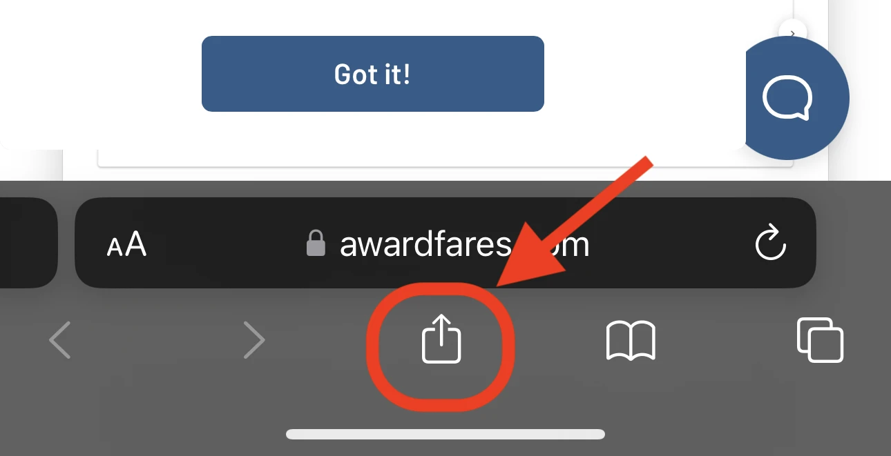

AwardFares looks great on mobile, and it doesn't sacrifice any of the features compared its the desktop version. You can use AwardFares on-the-go to easily set up alerts, perform broad searches and check seat maps.

Here's a step-by-step guide on how to add it to your home screen for quick access.

### iPhone

#### 1. Open the AwardFares website in Safari.

<figure>

</figure>

#### 2. Tap the Share button in the bottom-left corner of the screen. It looks like a square with an arrow coming out of it.

<figure>

</figure>

#### 3. Tap Add to Home Screen.

<figure>

</figure>

#### 4. A pop-up will appear asking you to name the app. Enter a name and tap Add.

<figure>

</figure>

The AwardFares app will now be added to your home screen. You can launch it by tapping on the app icon.

<figure>

</figure>

### Android

1. Open the AwardFares website in Chrome.
2. Tap the three dots in the top-right corner of the screen. They are located in the top right corner of the screen, next to the address bar.
3. Tap Add to Home screen.
4. A pop-up will appear asking you to name the app. Enter a name and tap Add.

The AwardFares app will now be added to your home screen. You can launch it by tapping on the app icon.

Here are some additional tips:

* You can change the name of the app by tapping on it and then tapping on the Edit button.
* You can move the app icon around on your home screen by tapping and holding it, then dragging it to a new location.
* You can delete the app by tapping and holding it, then tapping on the Delete button.

## Get started, and stay tuned.

You can [try AwardFares for free](https://awardfares.com/). We are rolling out new features and improvements regularly, so sign up for our newsletter to stay on top of the latest news, announcements, and pro tips!

## Read more

Make sure to also check these posts out

- [Introducing New Frequent Flyer Programs, Area Searches & More Exciting Features
  ](https://blog.awardfares.com/new-programs-and-features/)
- [AwardFares vs. ExpertFlyer](https://blog.awardfares.com/awardfares-vs-expertflyer/)