Whether you haven't booked your summer holidays yet, or you are looking for cool places for a quick trip, this post is for you. SAS has announced over 5000 new routes and frequency increases for this summer, and there are still plenty of seats left to book using EuroBonus points.

Some of these destinations start during July or August until September, which is easy to see using AwardFares' Timeline View.

Here are our top 5 SAS routes to book using EuroBonus points during this July.

## New SAS Routes With EuroBonus Points

### 1. [Florence, Italy](https://awardfares.com/search?zone:Scandinavia.FLR.;a:SK;z:eurobonus)

Awards available on multiple cabins from Copenhagen and Oslo.

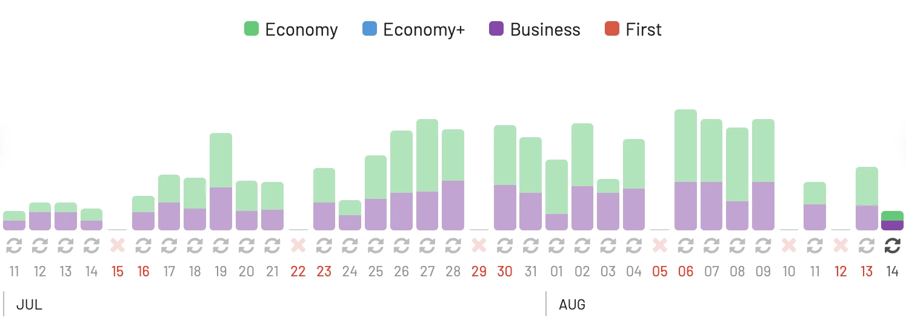

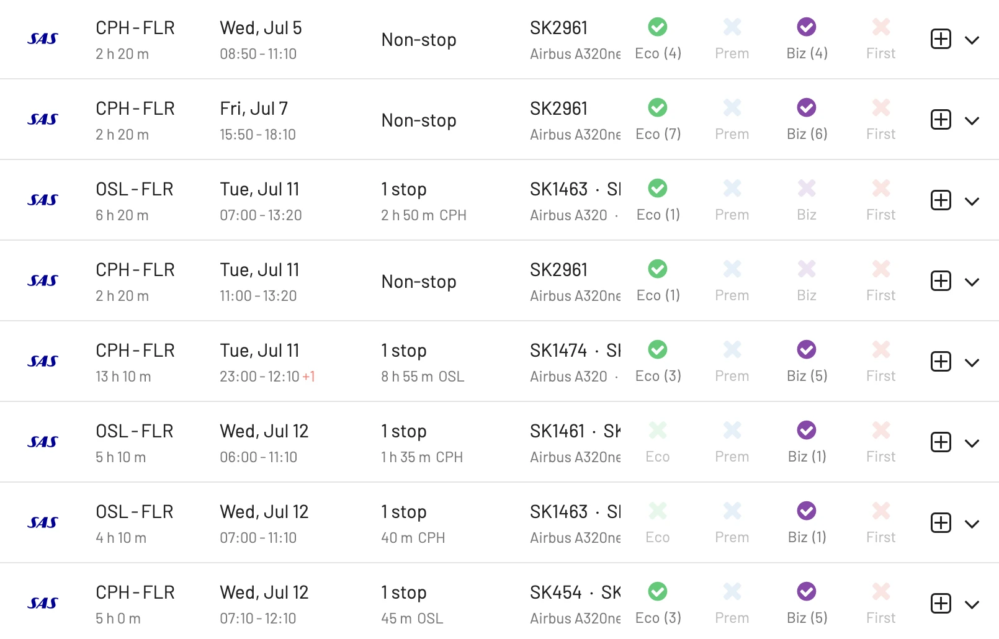

### 2. [Catania, Italy](https://awardfares.com/search?zone:Scandinavia.CTA.;a:SK;z:eurobonus)

SAS has increased its frequency to Catania and Palermo since June 2023. Search for non-stop flight from Copenhagen. Plenty of seats available during August.

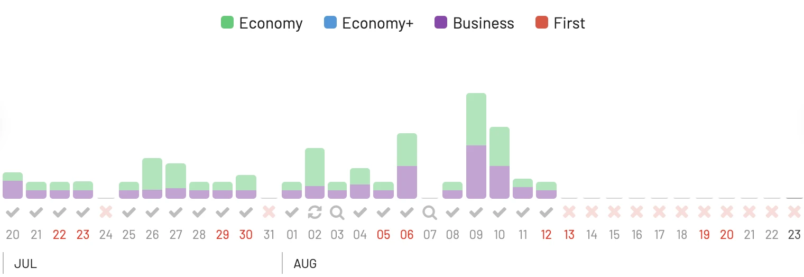

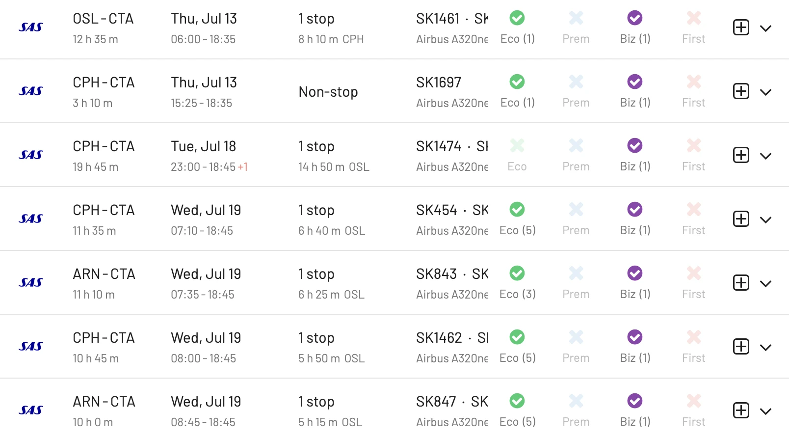

### 3. [Palma de Mallorca, Spain](https://awardfares.com/search?zone:Scandinavia.SPU.;a:SK;o:duration;so:asc;z:eurobonus)

See how crazy the availability is towards the first week of August! Over 200 seats in economy form Oslo, Stockholm and Copenhagen.

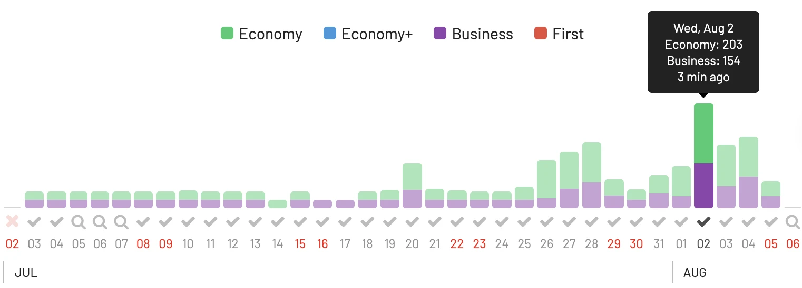

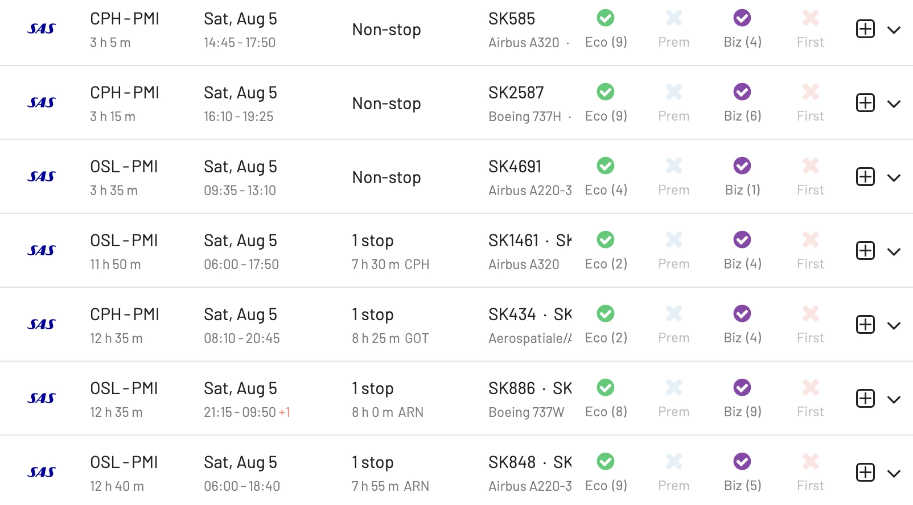

### 4. [Split, Croatia](https://awardfares.com/search?zone:Scandinavia.SPU.;a:SK;z:eurobonus)

Split has become a significantly popular destination in the past few years. It's great to see SAS flying directly from its major hubs. 

Towards August, the open space increase considerably. 

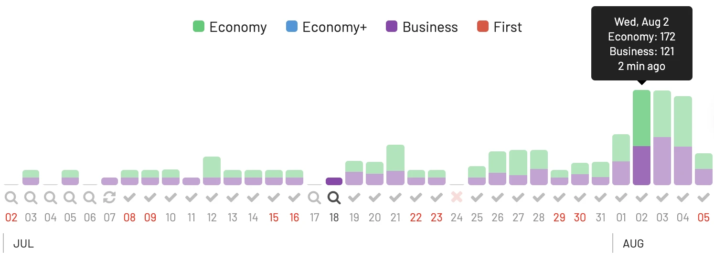

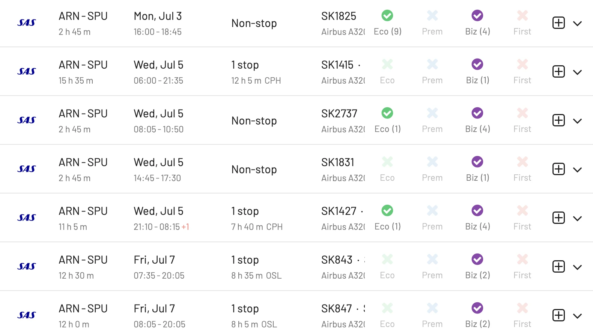

### 5. [Manchester, UK](https://awardfares.com/search?BGO.MAN.;a:SK;z:eurobonus)

This new route from Bergen (BGO) has been very popular among UK travelers, but also great for Nordic travellers willing to explore the United Kingdom. There's plenty of open space on SAS Plus throghout July and August.

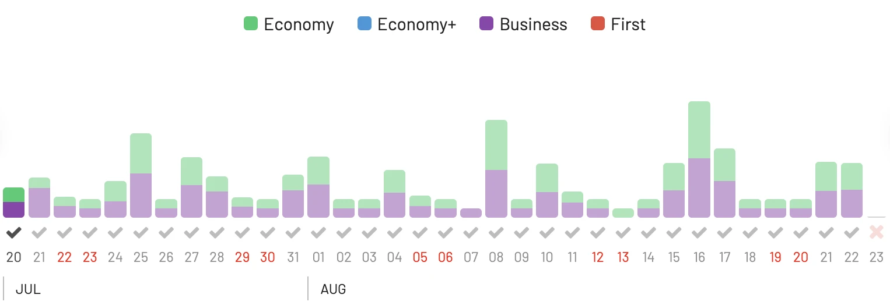

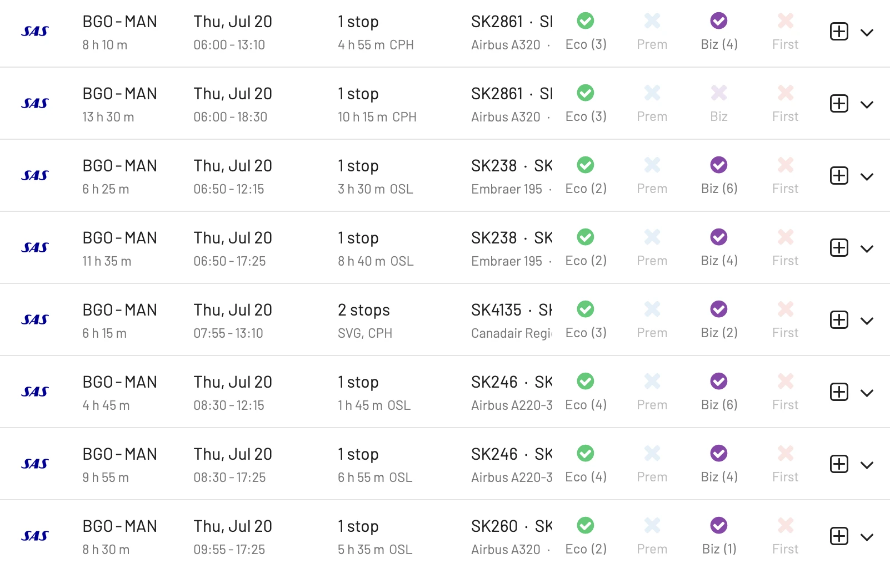

## How To Find SAS EuroBonus Awards With AwardFares

1. Go to [AwardFares](https://awardfares.com/search).

2. Under FFPs, select **SAS EuroBonus Only**.
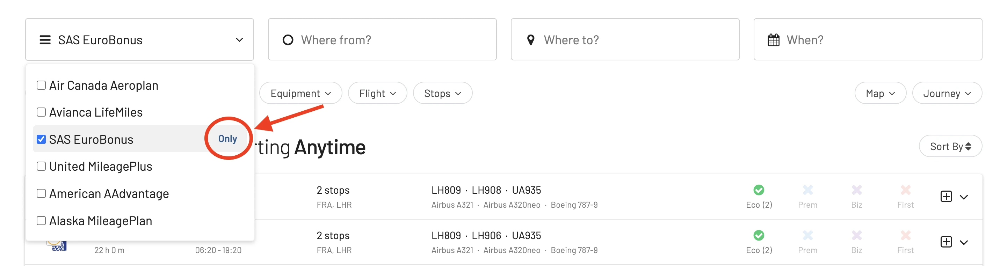

3. Under Airlines, select **SAS Only**.
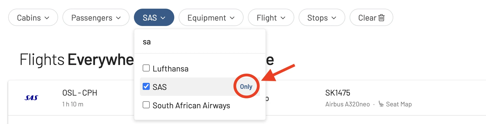

4. Select your destination City or Region (e.g. Florence).
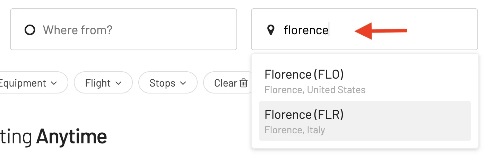

5. Select the potential dates or browse in the Timline View.

6. Done! You'll see the available seats in the result list.

## Upgrade for more features

With our [premium features on Gold and Diamond](https://awardfares.com/pricing), you can also set up alerts to get notified when a certain route or flight gets opened, as well as check seat maps, flight schedules, and more.

You can [try AwardFares for free](https://awardfares.com/). We are rolling out new features and improvements regularly, so sign up for our newsletter to stay on top of the latest news, announcements, and pro tips!

## Read more

Make sure to also check these posts out

- [Essential Guide To Book Lufthansa Flights With SAS EuroBonus Points](https://blog.awardfares.com/lufthansa-with-eurobonus-guide/)
- [How To Install AwardFares On Your Phone](https://blog.awardfares.com/awardfares-mobile-app/)
- [SAS Opens New Route To Morocco (And You Can Book It With Points)](https://blog.awardfares.com/sas-opens-route-to-morocco/)

