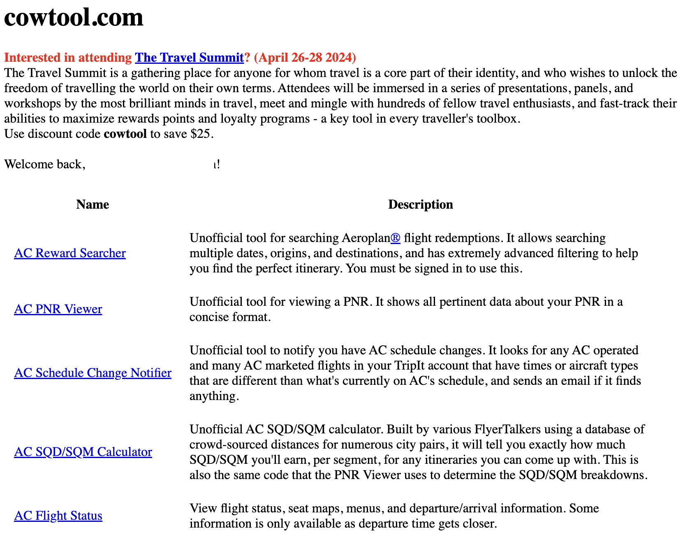
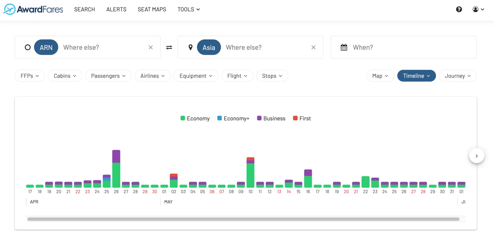
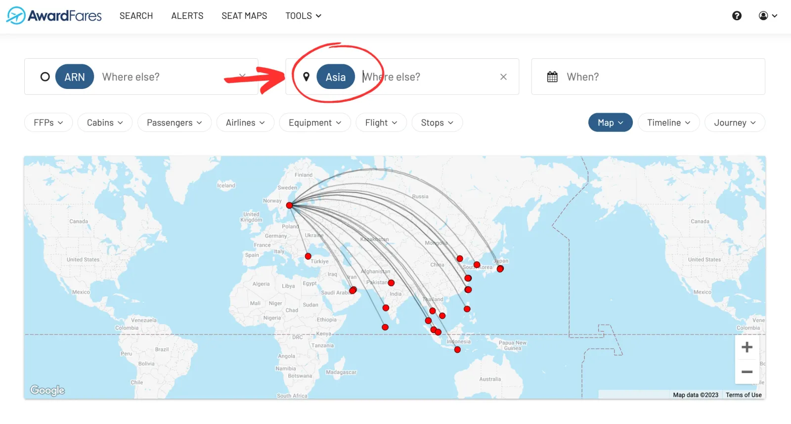

AwardFares is a modern and fast platform to search award availability across multiple frequent flyer programs. Among other things, it lets you search flights to find available award seats, setup alerts to monitor award availability, and lookup seat maps and flight schedules.

Some other tools, like ExpertFlyer, provide similar functionalities for frequent flyers, travel enthusiasts, and aviation professionals when it comes to getting the most out of their airline miles, points, and benefits.

This guide closely examines the key differences between AwardFares and Cowtool.

### Contents

- [What is Cowtool?](#what-is-cowtool)
- [AwardFares vs. Cowtool: Key Differences](#key-differences)
	- [User Interface](#1-user-interface)
	- [Functionality and Features](#2-features)
	- [Frequent Flyer Programs](#ffps)
	- [Mobile Experience](#mobile)
	- [Customer Support](#6-customer-support)
	- [Pricing](#7-pricing)
- [Conclusion](#conclusion)

## What is Cowtool? {#what-is-cowtool}

[Cowtool](https://cowtool.com) is a tool that provides information about fare classes and seat availability for different flights, and it has been particularly useful for Air Canada Aeroplan members to understand pricing, seat categories and upgrade opportunities.

The tool includes a feature known as "R space", which is represented as a boolean value (true/false). The term "R space" typically refers to a fare class that represents upgrade availability from economy to a higher class of service using miles or points.

The tool also uses codes to denote different cabin classes, such as "J" for business class, "PY" for premium economy, and "Y" for economy class. For example, users might see "9+ for Y" and "6 for J" indicating the number of seats that the airline is willing to sell in economy and business class respectively​1.

## AwardFares vs. Cowtool: What are the differences? {#key-differences}

### In a nutshell

| Features       | AwardFares    | Cowtool     |
|----------------|--------------|--------------|
| Interface | User-friendly, visually appealing, easy to navigate. Suitable for beginners and experienced travelers. | Data-centric, more complex. Assumes users are frequent flyers comfortable with detailed information. |
| Functionality | Real-time updates on available award seats across a wide range of airlines, focusing on business and first-class awards. | Offers a comprehensive database of airlines and their award seat availability. Provides detailed breakdowns of redemption rates, transfer partners, and stopover rules. |
| Frequent Flyer Programs | A total of 6 frequent flyer programs including Air Canada Aeroplan | Air Canada Aeroplan only |
| Mobile version | Yes | No |
| Alerts via email | Yes | No |
| Ticket price information / Miles calculator | Coming soon | Yes |
| Pricing | Subscription-based model with a free limited version and paid plans that offer more features. | Subscription-based model, no free version, much higher entry price point. |
| Customer Support | Well-received customer support offering help and guidance to users. | Offers extensive guides and FAQs, but some users have reported slower response times. |

### 1. User Interface: AwardFares has a modern UI and beautiful charts {#user-interface}

With a visually appealing and easy-to-understand interface, AwardFares is accessible to both beginners and experienced travellers. The platform is easy to navigate and simplifies the task of finding the best award flight deals. Users can set notifications for particular routes and airlines, and the system automatically alerts them when a good deal pops up.

Search results on AwardFares are presented in stunning timeline and map views, with color-coded availability indicators and easy-to-read tables. This simplification makes it easy for users to assess award seat availability and make informed decisions quickly.

Cowtool, on the other hand, offers a more data-centric interface that is assumes users to be frequent flyers who are comfortable navigating complex information. Its highly detailed information makes it a comprehensive tool for seasoned award travelers, but the steep learning curve makes it hard for beginners.

### 2. Functionality and Features {#features}

AwardFares excels in its ability to provide real-time updates on available award seats across a wide range of airlines, specifically focusing on business and first-class award spaces. It allows users to easily check award seat availability and potential costs, making it a valuable tool for those looking to optimize their premium travel experiences.

The search results on AwardFares are presented clearly, making it easy to compare options and identify the best opportunities for booking award flights.

One of the biggest advantages of AwardFares is the possibility to search across entire regions, like whole countries or continents. In a matter of seconds, search results pop up with available award flights to different destinations within that region.

Unlike Cowtool, where filtering down the options require new searches, filters on AwardFares are also one click away. From the dropdown menus, it’s possible to trim down results based on frequent flyer program, airline, number of passengers, number of stops, or equipment type.

Another convenient feature on AwardFares is the possibility to set up alerts for award seat availability directly from the search results. 

Cowtool shines in its depth of data and information. The platform offers a comprehensive database of airlines and their award seat availability. Moreover, it provides detailed breakdowns of redemption rates, transfer partners, and stopover rules for aeroplan. This depth of information makes Cowtool particularly useful for those who want a more in-depth understanding of the reward landscape.

Cowtool offers a collection of five very-targed tools for Air Canada flyers and Aeroplan members.

* **AC Reward Searcher**. Unofficial tool for searching Aeroplan flight redemptions. It allows searching multiple dates, origins, and destinations, and has extremely advanced filtering to help you find the perfect itinerary. You must be signed in to use this.
* **Air Canada (AC) PNR Viewer**. Unofficial tool for viewing a PNR. It shows all pertinent data about your PNR in a concise format.
* **Air Canada Schedule Change Notifier**. Unofficial tool to notify you have AC schedule changes. It looks for any AC operated and many AC marketed flights in your TripIt account that have times or aircraft types that are different than what's currently on AC's schedule, and sends an email if it finds anything.
* **Air Canada SQD/SQM Calculator**. Unofficial AC SQD/SQM calculator. Built by various FlyerTalkers using a database of crowd-sourced distances for numerous city pairs, it will tell you exactly how much SQD/SQM you'll earn, per segment, for any itineraries you can come up with. This is also the same code that the PNR Viewer uses to determine the SQD/SQM breakdowns.
* **Air Canada Flight Status**. View flight status, seat maps, menus, and departure/arrival information. Some information is only available as departure time gets closer.

### 3. Frequent Flyer Programs {#ffps}

While Cowtool is mainly targeted to Air Canada Aeroplan members, AwardFares covers a selection of major airlines from Star Alliance, OneWorld, and other airlines. As of July 2023, we support American AAdvantage, Air Canada Aeroplan, Avianca LifeMiles, Alaska Mileage Plan, United MileagePlus and SAS EuroBonus.

### 4. Mobile Experience {#mobile}

AwardFares is meant for mobile, with a UI designed as a web app, that you can even [install on your phone](https://blog.awardfares.com/awardfares-mobile-app/).

AwardFares has been meant for mobile from day one. It doesn’t compromise the intuitive searches nor the beautiful user interface when going mobile, and you can even [install on your phone](https://blog.awardfares.com/awardfares-mobile-app/).

<figure>

</figure>

Cowtool, on the other hand, doesn't provide a mobile version.

### 5. Customer Support: One tap to reach AwardFares’ support {#customer-support}

Customer support is at the core of AwardFares’ principles. That’s why some of the UI elements at hand are aimed at seeking help quickly. On the AwardFares site, the contact bubble button lets users quickly reach out and ask for help, regardless if they are on a desktop, tablet, or mobile. Users get access to a library of frequently asked questions and can post new ones immediately. Email and social media support channels are also available with high response rates.

<figure>

</figure>

### 6. Pricing {#pricing}

Both ExpertFlyer and AwardFares are subscription-based and have free and paid tiers. While ExpertFlyer provides a range of comprehensive features, their packages focus on general flight searches and alerts, mainly for users willing to pay for flights or upgrade using cash.

AwardFares packages and features are tailored to award searches and aim at showing real seat availability from different frequent flyer programs with just a few clicks and with the help of intuitive and clear exploration tools to help make more informed decisions.

AwardFares Pricing Tiers:

1. **Basic** (free): award calendar, award map, journey planner, hourly availability on award seats, and award release dates tool.
2. **Gold** (USD 9.99): award search, award calendar, award map, journey planner, hourly availability on award seats, 5 seat alerts, 100 custom searches per day, max 7 searches at once, award availability count, search with stops, per-program availability, cabin annotations, seat maps, award release dates, and flight schedules tool.
3. **Diamond** (USD 19.99): award search, award calendar, award map, journey planner, **real-time availability** on award seats, **unlimited seat alerts**, **unlimited custom searches per day**, max 30 searches at once, award availability count, search with stops, per-program availability, cabin annotations, seat maps, award release dates, and flight schedules tool.

Cowtool Pricing Tiers:

1. **Basic**: The Basic tier is the most affordable option and includes access to a limited number of products and features. The Basic tier costs $9.99 per month or $99.99 per year.
2. **Standard**: The Standard tier includes access to all of the products and features offered by Cowtool.com, as well as a few additional features such as priority customer support and access to exclusive content. The Standard tier costs $19.99 per month or $199.99 per year.
3. **Premium**: The Premium tier is the most expensive option and includes all of the features offered by the Standard tier, as well as a few additional features such as unlimited access to Cowtool.com's library of resources and discounts on products and services. The Premium tier costs $29.99 per month or $299.99 per year.

## Conclusion

Cowtool has long been a prime tool for experienced Aeroplan members that want to make the most out of their miles and get on the best possible cabins, products, and schedules. While it still provides excellent value and information, its outdated interface and steep learning curve makes it hard for beginners that are looking for a more intuitive approach. There's still a number of tools oriented to Air Canada flyers included with Cowtool's subscription, such as the flight status and schedule change notifier.

On the other hand, AwardFares provides a stunning, **modern user interface**, meant for quickly **searching and filtering** award space. The results are up-to-date and **accurate**, sourced directly from Air Canada Aeroplan (and all the other programs. It's **simple to use**, and planned for **mobile devices**. Users can get started for **free**, in addition to **accessible** paid tiers for both casual and hardcore flyers.

Overall, AwardFares can be a great upgrade for Aeroplan members looking for a more powerful and intuitive way of searching available seats.

## Get started

You can try searching for award flights on Singapore Airlines [using AwardFares for free](https://awardfares.com/). We are rolling out new features and improvements regularly, so sign up for our newsletter to stay on top of the latest news, announcements, and pro tips!

## Read more {#read-more}

Make sure to also check these posts out

- [How To Find The Best Aeroplan Award Flights](https://blog.awardfares.com/aeroplan-guide/)
- [5 Essential Tools Every Aeroplan Member Needs](https://blog.awardfares.com/aeroplan-tools/)
- [How To Find First-class Award Flights Using Aeroplan Miles (With Realtime Updates)](https://blog.awardfares.com/aeroplan-first-class-awards/)