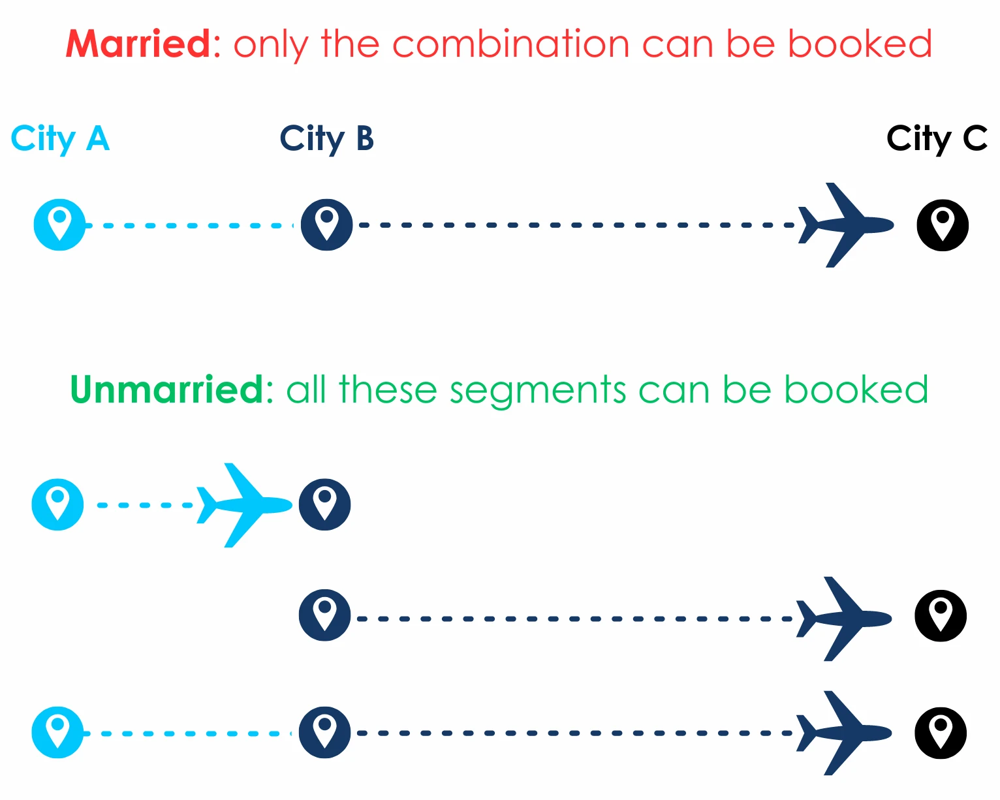

In airline travel, married segments are two or more flights between city pairs that airlines sell together as a single bundled unit, rather than as two or more individual segments. This means that the flights must be booked together and cannot be changed or canceled independently.

These segments can sometimes create a mess for frequent travelers trying to maximize the value of your miles.

## Married Segments 101

### What are Married Segments?

Married segments are used by airlines to control their inventory or offer more aggresive deals and discounts while filling up flights. For example, an airline may only release a certain number of married segments for sale, even if there are more individual seats available. This can help the airline to ensure that it fills all of the seats on a flight, even if some passengers only want to book a one-way ticket.

Married segments can also be used by airlines to offer different pricing options for different types of travel. For example, an airline may offer a lower price for a married segment that includes a connecting flight, than for two separate flights that would also connect. This can help the airline to attract passengers who are willing to make a connection in order to save money.

### Why married segments can be a pain for award travel

There are a number of reasons why these segments can be a pain and cause issues for frequent flyers when booking award travel:

1. **Limited availability**: As a frequent flyer, you often try to maximize the value of their miles by booking award tickets on routes that would otherwise be expensive when paid with cash. However, airlines use married segments to manage the availability of award seats. This means that while there might be award seats available on individual segments, they might not be bookable as part of a longer itinerary. For example, you might find award availability from City A to City B and from City B to City C when searched separately, but not when searching directly from City A to City C.
2. **Flexibility**: Married segments often need to be booked as a single unit, which limites the flexibility to book complex itineraries, like open jaws (flying into one city and out of another) or stopovers (spending more than 24 hours in a city before continuing to the final destination). 
3. **Unintuitive pricing**: The way airlines price married segments can sometimes lead to counter-intuitive pricing situations. For example, it might be cheaper to book an award ticket from City A to City C (with a stop in City B) than to book an award ticket from City A to City B, even though the former includes the latter. This can be very frustrating!
4. **Difficulty in finding routes**: Married segments can make it harder to find and book award travel. Since airlines don't always make it clear which segments are married, you might have to spend a lot of time searching for different combinations of flights to find an itinerary that works for them.

## Example

Let's try to find an award flight from Amsterdam (AMS) to Tokyo (NRT or HND). Our first attempt searching AMS-HND/NRT unfortunately doesn't yield any results.

The next thing to do would be to try some alternative origin airports in Europe. For example, let's see what we find if we search VIE to HND/NRT instead.

There are lots of business availability on this route. From this, it looks like there **should** be plenty of award availability on the Lufthansa flight from FRA to HND (LH716) and one seat on the SWISS flight from ZRH to NRT (LX160).

So, let's see what happens if we try to find these direct flights.

**NO** direct flights found. The direct flights didn't show up because these are **married segments**: the award seats on the Tokyo bound flights are only available **if** they are booked together with another segment. They cannot be booked individually.

In this case it looks like the awards are only available together with Austrian segments, i.e. originating from VIE on an Austrian airlines flight.

## How to deal with married segments with AwardFares

So how can we deal with this? Well, we can't split the married segments, so let's try to work it into our route instead by trying to find a suitable connecting flight to one of these married segments.

Let's go with the VIE-ZRH-NRT option, since it only requires 1 extra stop. First we click the "plus" icon to the right of this flight to add it to our journey.

Next we click "Add Flight" above the VIE-NRT flight to start searching for a suitable connecting flight that can take us from AMS to VIE.

Note that the VIE-ZRH flight leaves very early in the morning (06:15), so we will definitely need to add an overnight layover in VIE. Let's try to find a flight from AMS to VIE the day before (Jan 25th).

Lucky for us, there is a direct flight from AMS-VIE in the evening of Jan 25. So let's go ahead and add that to our journey. 

*(Make sure your layovers are max 24 hours, otherwise the routing will be invalid.)*

There we go. Now we have successfully built an award flight from AMS to NRT, via VIE and ZRH, with an overnight stop in VIE. Perhaps not ideal, but if you're really looking to use your miles then this might be an option worth considering.

So how do we book it? Well, since this routing didn't show up when searching AMS to NRT, that means that the SAS EuroBonus award search engine did not find this route automatically (likely because of the required overnight layover in VIE). We can confirm this by searching on the SAS website, where the business class route does not show up.

Therefore, you won't be able to book it online. Instead you'll have to call to the SAS EuroBonus award booking service and explain that you'd like to book this particular routing.

You could for example start by asking for a flight from VIE to NRT on Jan 26th, and confirm that they were able to find the married segment via ZRH. Then ask if it would be possible to add an extra segment before this flight, from AMS to VIE on Jan 25th.

Assuming the customer support agent is willing to do this, and there are no other restrictions for this particular routing, it should be possible to book. If the agent isn't willing to do this, then HUACA (hang up and call again)!

I hope that helps clarify some of the details around married segments, and how to work with them. Good luck!

### Extra tip

**Agents can help!**. In some cases, customer support agents are able to *divorce* segments. Another option is to first book the married segment, and then ask to change one of the segments, which might be possible due to the ticket's rules.

## Get started, and stay tuned.

You can [try AwardFares for free](https://awardfares.com/). We are rolling out new features and improvements regularly, so sign up for our newsletter to stay on top of the latest news, announcements, and pro tips!

## Read more

Make sure to also check these posts out

- [How To Install AwardFares On Your Phone](https://blog.awardfares.com/awardfares-mobile-app/)
- [Essential Guide To Book Lufthansa Flights With SAS EuroBonus Points](https://blog.awardfares.com/lufthansa-with-eurobonus-guide/)
- [AwardFares vs. ExpertFlyer](https://blog.awardfares.com/awardfares-vs-expertflyer/)

