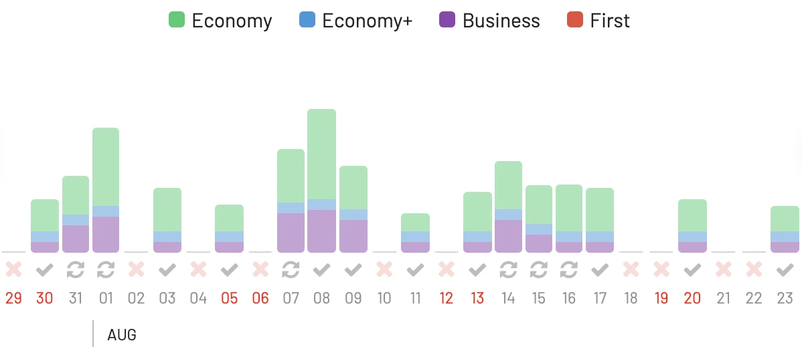
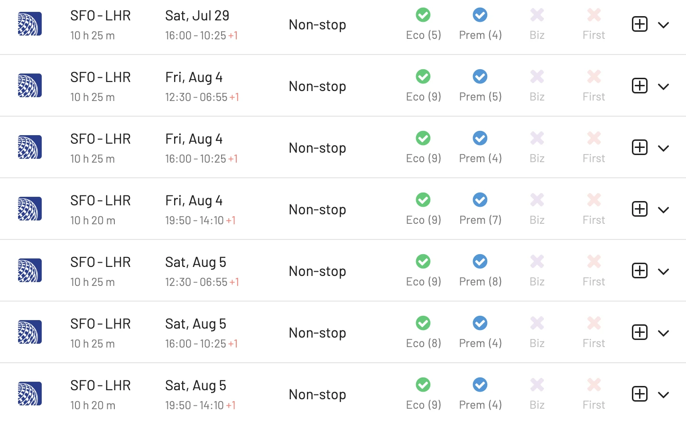

United MileagePlus is one of the most popular airline loyalty programs in the world, and for good reason. The program offers a variety of ways to earn and redeem miles, and there are some great sweet spots that can save you a lot of money on flights.

Here are just a few reasons why we love MileagePlus. With a little planning, you can use your miles to book some amazing travel experiences.

* **The Excursionist Perk**: This perk allows you to add a free stopover on any award ticket that includes two or more flights. This is a great way to see more of a destination or to connect with a connecting flight on a partner airlines.
* **Transcontinental flights**: United offers some great deals on transcontinental flights, with economy class awards starting at just 15,000 miles and business class awards starting at 30,000 miles.
* **Flights to Northern South America**: United charges just 20,000 miles for economy class awards and 35,000 miles for business class awards from the U.S. to Northern South America, including destinations like Lima, Peru, Quito, Ecuador, and Bogotá, Colombia.
* **Flights to Oceania**: United charges just 35,000 miles for economy class awards and 70,000 miles for business class awards to Oceania, including destinations like Sydney, Australia, Auckland, New Zealand, and Honolulu, Hawaii.
* **Intra-Asia and Intra-Japan flights**: United charges just 5,500 miles for economy class awards and 11,000 miles for business class awards on intra-Japan flights, which is a great way to explore the country.

## United MileagePlus Sweet Spots (Our Top Picks) {#sweet-spots}

Here are our top United MileagePus redemptions, and how to find them using AwardFares (click to search).

### 1. [Chicago (ORD) to Barcelona (BCN)](https://awardfares.com/search?ORD.BCN.;z:united)

On United Airlines, Economy class awards start at 35,000 miles, and business class awards start at 70,000 miles. A one-way Business Class ticket from the United States to Europe on a Star Alliance partner costs 77,000 MileagePlus miles. This offers access to top-tier airlines like Lufthansa, Swiss, and Austrian, all of which offer excellent Business Class products.

### 2. [Los Angeles (LAX) to Sydney (SYD)](https://awardfares.com/search?LAX.SYD.;z:united)

This is a long-haul route that offers a great opportunity to see two amazing cities. Economy class awards start at 50,000 miles, and business class awards start at 100,000 miles.

### 3. [Chicago (ORD) to Honolulu (HNL)](https://awardfares.com/search?ORD.HNL.;z:united)

This is a great way to escape the cold winter weather and enjoy the beaches of Hawaii. Economy class awards start at 25,000 miles, and business class awards start at 50,000 miles.

### 4. [Frankfurt (FRA) to Buenos Aires (EZE)](https://awardfares.com/search?FRA.EZE.;z:united)

There are options with Lufthansa on their non-stop flight, but also with United via Houston (IAH).

### 5. [San Francisco (SFO) to London (LHR)](https://awardfares.com/search?SFO.LON.;z:united)

This is a popular route for business travelers and leisure travelers alike. Economy class awards start at 35,000 miles, and business class awards start at 70,000 miles.

### 5. [Tokyo (NRT) to Singapore (SIN)](https://awardfares.com/search?NRT.SIN.;z:united)

This is a great way to experience two of the most vibrant cities in Asia. Economy class awards start at 35,000 miles, and business class awards start at 70,000 miles.

### 6. [Seoul (ICN) to Taipei (TPE)](https://awardfares.com/search?ICN.TPE.;z:united)

This is a short-haul route that is perfect for a weekend getaway. Economy class awards start at 10,000 miles, and business class awards start at 20,000 miles.

### 7. [London (LHR) to Frankfurt (FRA)](https://awardfares.com/search?LHR.FRA.;z:united)

This is a popular route for connecting flights to other parts of Europe. Economy class awards start at 25,000 miles, and business class awards start at 50,000 miles (roud-trip). There's plenty of options with a number of airlines such as Lufthansa, Austrian, and SAS.

## How to find United MileagePlus Awards using AwardFares (Step-by-step) {#how-to}

### 1. Log in to [AwardFares](https://awardfares.com).

### 2. Select Frequent Flyer Program.

In the **Frequent Flyer Program** picker, select **United MileagePlus**.

<figure>

</figure>

### 3. Choose the route.

In the **From** and **To** fields, enter your departure and arrival airports.

Optional: you can also perform broad searches from an entire area, region, or metropolitan area (like a city, New York NYC)

<figure>

</figure>

### 4. Add travel dates (optional).

If you know your travel dates, try adding them to the search field. Once selected, AwardFares will start searching for available flights for that date, and will display them in a list below. If you don't have a set travel date, you can enable the **Timeline View** to explore the availability for multiple days simultaneously. The bars show different classes (Economy, Premium Economy, Business, First) in different colors.

<figure>

</figure>

### 5. Add more filters (optional).

Try filtering out by cabin class (e.g. Business Class, First Class) or number of stops (e.g. nonstop). In this example, we filter results to only show Economy Class seats.

<figure>

</figure>

There are many more filters you can explore adding, such as number of passengers, aircraft type, number of stops and even flight number.

### 6. Done.

Pretty easy, right? In just a few clicks, you can see MileagePlus inventory on both United Airlines as well as partners airlines.

<figure>

</figure>
 

## Upgrade for more features

With our [premium features on Gold and Diamond](https://awardfares.com/pricing), you can also set up alerts to get notified when a certain route or flight gets opened, as well as check seat maps, flight schedules, and more.

You can [try AwardFares for free](https://awardfares.com/). We are rolling out new features and improvements regularly, so sign up for our newsletter to stay on top of the latest news, announcements, and pro tips!

## Read more

Make sure to also check out these posts

- [10 Tips For Booking An Award Trip In 2023](https://blog.awardfares.com/award-trip-tips/)
- [Married Segments: Working Out Your Perfect Award Trip (Guide)](https://blog.awardfares.com/married-segments/)