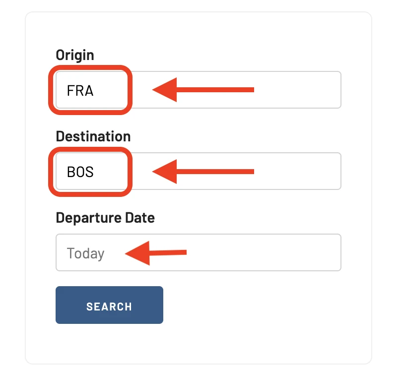
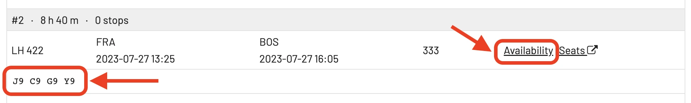

AwardFares Flight Schedules is part of our advanced toolkit. It allows you quickly to search flight timetables and see availability by booking class code.

## What are Booking Class Codes?

Booking class codes are alpha-numeric codes used by airlines to categorize and sell their seats. These codes are a way to differentiate between the types of seats available on a flight and the fare conditions associated with each.

Each airline has its own specific booking codes, and they might not mean the same thing between airlines. However, there are some general trends and commonly used codes across most airlines. Here are a few of the most common ones:

* **F or P**: These are typically the codes used for First Class seats. These seats are the most expensive and offer the most amenities.

* **J, C, or D**: These codes usually represent Business Class seats. They are less expensive than First Class but offer more amenities than Economy.

* **Y**: This is typically the code for full-fare Economy Class seats. Full-fare seats are more expensive but may come with added benefits like the ability to change flights without paying a fee.

* **B, H, M, Q, V, W**: These are usually the codes for discounted or promotional Economy Class seats. They are less expensive but may come with restrictions like no flight changes or refunds.

* **E or T**: These are typically the codes for the cheapest Economy Class seats. They often have the most restrictions and the fewest benefits.

* **S, N, or X**: These codes often indicate special fare classes, such as group bookings, award tickets, or standby seats.

Remember, these are generalized and the specific meaning of a code can vary between airlines. It's always best to check directly with the airline if you have questions about what a specific booking code means.

Booking codes are useful for airlines because they allow them to manage their inventory and yield - they can charge different prices for essentially the same product (a seat on a plane) based on various conditions and restrictions attached to that fare. They are also useful for passengers, as they allow for different pricing and service options depending on individual needs and preferences.

### Booking Class Codes in Star Alliance

Star Alliance does have standardized codes for earning and redeeming miles and for determining fare classes as they relate to frequent flyer status.

When it comes to earning miles, each airline within the alliance determines how many miles a passenger will earn based on the booking class. For example, a full fare Economy class ticket (often coded as Y) may earn 100% of the miles flown, while a deep discount Economy class ticket (such as T or E) may only earn 25% or even 0% of the miles flown.

The alliance also determines which booking classes are eligible for upgrades using miles or upgrade certificates. This varies significantly by airline and by specific fare class within each booking code.

A great resource to double check where to credit your miles is [WhereToCredit](https://www.wheretocredit.com/). Give it a shot *before* flying. It's particularly useful to determine in which program you'll earn the most miles, in case you use multiple of them.

Regarding frequent flyer status, Star Alliance recognizes different levels (Star Alliance Silver and Star Alliance Gold), but each individual airline in the alliance determines which booking classes will earn which level of status. This is often based on the amount of miles flown and the fare class of the ticket.

## Using the Flight Schedules tool

### 1. Log-in to your AwardFares account (or sign-up).

### 2. Under **Tools**, select **[Flight Schedules](https://awardfares.com/schedule)**.

<figure>

</figure>

### 3. Enter **Origin**, **Destination** and **Date**, and hit **Search**.

For this advanced tool, it's important to be specific and use the three-letter airport code for both origin and destination (e.g. FRA for Frankfurt, BOS for Boston, etc.)

<figure>

</figure>

### 4. Check the results on the right

On the right side of the screen (Desktop) or below (mobile) you'll see a list with all the flights for that date, with and without stops.

<figure>

</figure>

### 5. Tap on **Availability**.

For more details, click on the Availability link. A new pane will expand below and show you all the availability for each booking class code.

<figure>

</figure>

### 6. Tap on **Seats** to view the seat map (optional).

You will be redirected to our **Seat Map Tool**, and the flight you selected will be pre-populated for you.

<figure>

</figure>

You can hit Search to see the actual seat map for that specific flight.

<figure>

</figure>

## Get started, and stay tuned.

You can [try AwardFares for free](https://awardfares.com/). We are rolling out new features and improvements regularly, so sign up for our newsletter to stay on top of the latest news, announcements, and pro tips!

## Read more

Make sure to also check these posts out

- [10 Tips For Booking An Award Trip In 2023](https://blog.awardfares.com/award-trip-tips/)
- [Demystifying Award Charts: All You Need To Know (2023)](https://blog.awardfares.com/demystifying-award-charts/)
- [AwardFares vs. ExpertFlyer](https://blog.awardfares.com/awardfares-vs-expertflyer/)