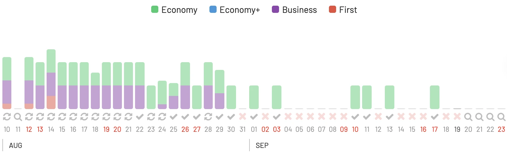
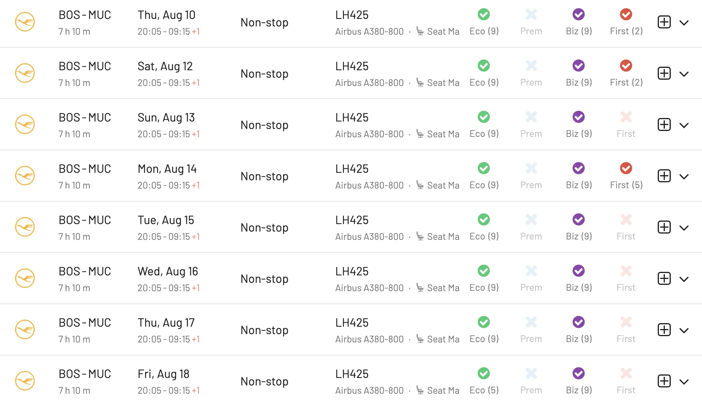
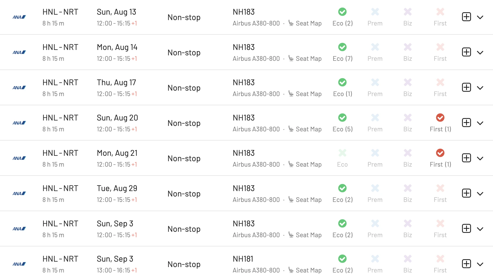
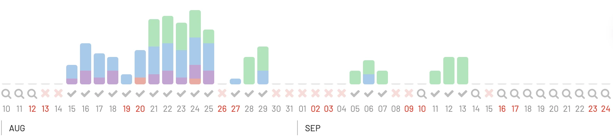
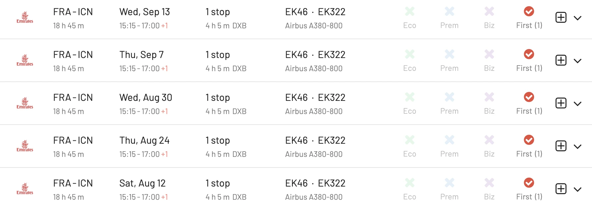
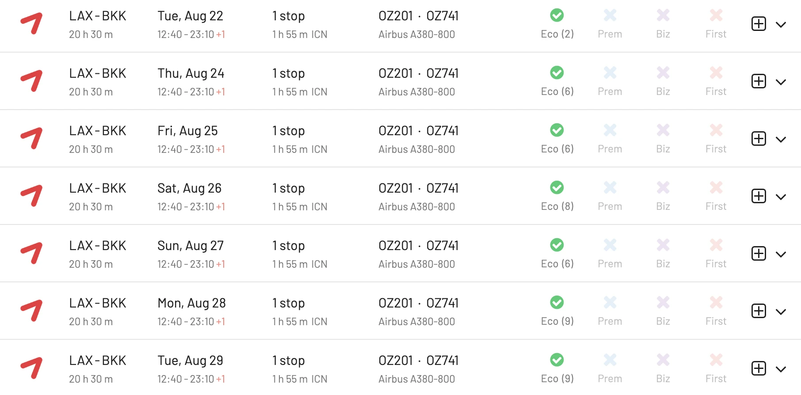
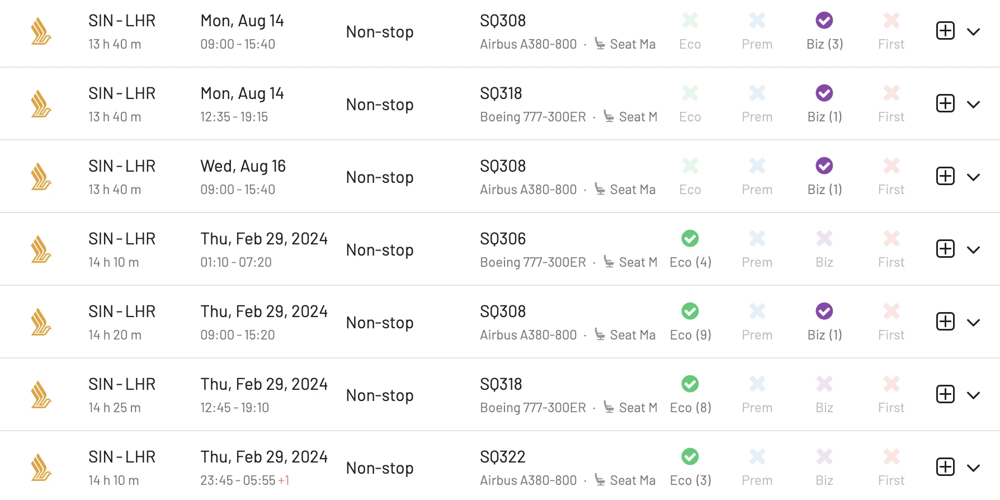
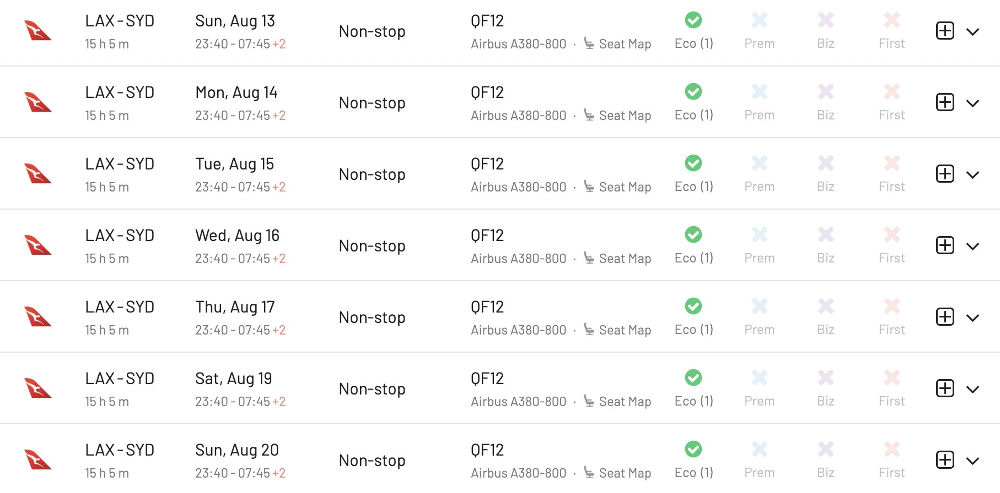
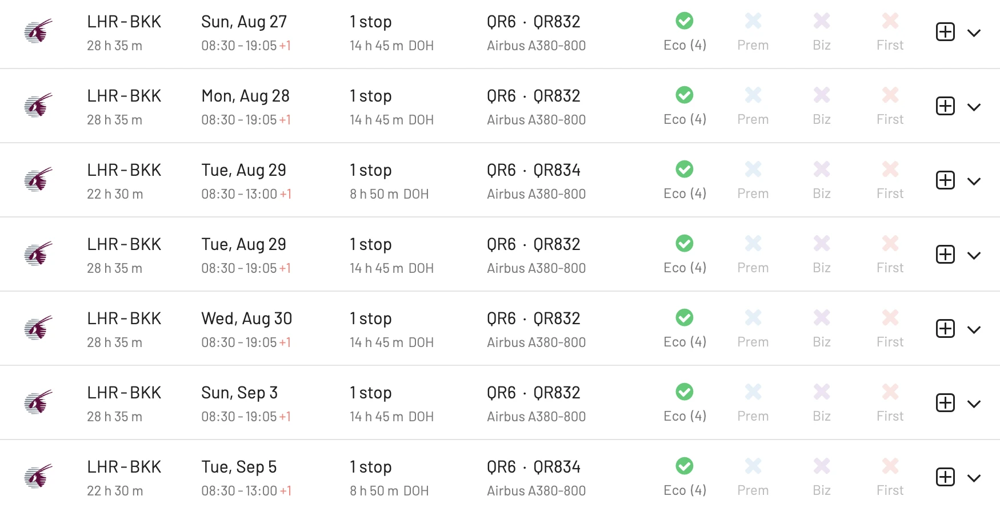

As a frequent flyer, scoring a flight on the A380 might be one of the most rewarding achievements.

The Airbus A380 is just massive, and offers a unique (and sometimes luxurious) flying experience. It is the only commercial aircraft that offers a full double-deck, with a number of amenities that are not usually available on other aircraft: suites, showers, onboard bars, private bedrooms, dedicated lounges, and duty-free shops are just some of the extravagant additions that exquisite flyers look after. 

However, in recent years, a number of airlines have announced plans to phase out their A380 fleets. The aircraft is simply too big for some airports, and it can be difficult to fill all of the seats on a long-haul flight. The COVID-19 pandemic has accelerated this process, as airlines have been forced to cut costs and focus on more fuel-efficient aircraft.

As of 2023, only a few airlines still operate the A380, with just a subset of them offering available award seats in our favorite frequent flyer programs.

In the list below, we show you which airlines are still flying the superjumbo, our favorite routes, and how to find award flights on the A380 using AwardFares. Let's dive in!

## Award Flights In The A380: Airlines And Routes 

### 1. Lufthansa

In 2023, Lufthansa started bringing back some of its A380s. As of August 2023, the airline has 4 A380s in its fleet, all of which are based in Munich. They are used on flights to Boston, New York, Los Angeles, and Bangkok.

Lufthansa started flying the Airbus A380 on October 28, 2010, with a flight from Frankfurt to New York. The airline had a total of 14 A380s in its fleet, but it grounded them all in March 2020 due to the COVID-19 pandemic.

Lufthansa plans to bring back more A380s in the future, but the exact number is still unknown. The airline has said that it will use the A380 on high-demand routes, such as those to the United States and Asia.

#### Top Pick: [Boston (BOS) to Munich (MUC) with Lufthansa](https://awardfares.com/search?BOS.MUC.;a:LH;e:388;z:aeroplan,sas)

Book using SAS EuroBonus, Aeroplan Miles or United MileagePlus.

### 2. ANA (All Nippon Airways)

ANA started flying the A380 on May 24, 2019. It currently has three A380s in its fleet, all of which are configured with four classes: First class (8 seats), Business (56 seats), Premium economy (73 seats), and Economy (383 seats)

The A380s are used exclusively on the Tokyo Narita - Honolulu route. The aircraft are painted in a special livery called "Flying Honu", which features a sea turtle design.

#### Top Pick: [Honolulu (HNL) to Tokyo Narita (NRT)](https://awardfares.com/search?HNL.NRT.;a:NH;e:388)

Book using Aeroplan miles, SAS EuroBonus points

### 3. British Airways

British Airways started flying the A380 on August 2, 2013. It currently has 12 A380s in its fleet, all of which are configured with First class (14 seats, old), Club World (business class, 97 seats), World Traveller Plus (premium economy, 55 seats), and World Traveller (economy, 303 seats).

BA still keeps the A380s active on a variety of long-haul routes from London Heathrow, including Boston, Chicago, Dallas/Fort Worth, Dubai, Johannesburg, Miami, San Francisco, and Washington Dulles.

#### Top Pick: [London Heathrow (LHR) to Johannesburg (JNB)](https://awardfares.com/search?LHR.JNB.;a:BA;e:388#)

Book using AAdvantage miles.

### 4. Emirates

Emirates is still the largest operator of A380s since their first delivery in 2008. It accounts for 68.6% of the seats available in August, with over 2.4 million seats across 4,649 flights. 

#### Top Pick: [Frankfurt (FRA) to Seoul (ICN) via Dubai (DXB)](https://awardfares.com/search?FRA.ICN.;a:EK;e:388#)

Book using Aeroplan miles. Great availability in First Class!

### 5. Asiana Airlines

In March 2022, Asiana Airlines announced that it would be resuming A380 flights on two routes: Seoul-Los Angeles and Seoul-Frankfurt. The first A380 flight on the Seoul-Los Angeles route took place on March 27, 2022.

As of August 2023, Asiana Airlines has 4 A380s in its fleet and currently serves Bangkok, Frankfurt, Hong Kong, Los Angeles and Sydney.

#### Top Pick: [Los Angeles (LAX) to Bangkok (BKK) via Seoul](https://awardfares.com/search?LAX.BKK.;a:OZ;e:388#)

Book using Aeroplan miles. All in A380s!

### 6. Singapore Airlines

Singapore Airlines started flying the Airbus A380 on October 25, 2007, with its first revenue flight from Singapore to Sydney. The airline was the launch customer for the A380, and it currently has 12 A380s in its fleet.

The premium cabins on Singapore's A380s are some of the best in the market, with their Suites product being among the most expensive ones and hardest to get using points.

As of August 2023, Singapore still flies the A380 to Hong Kong, Delhi, London, Melbourne, Shanghai and, Sydney.

#### Top Pick: [Singapore (SIN) to London Heathrow (LHR)](https://awardfares.com/search?SIN.LHR.;a:SQ;e:388)

Book using Aeroplan miles. Great availability both in Business Class and Economy Class.

### 7. Qantas

**Heads up!**. Qantas is planning to retire its A380s by 2025. The airline has said that the A380 is no longer economically viable to operate, as it burns more fuel than smaller, more efficient planes.

Qantas started flying the A380 on October 20, 2008. It was the third airline to operate the A380, after Singapore Airlines and Emirates. The airline's current fleet of A380s consists of 10 aircraft, all of which are configured with four classes.

As of August 2023, they currently serve Los Angeles, Melbourne, Singapore, London, Dallas/Fort Worth, Hong Kong, Auckland, and Rome with the A380.

#### Top pick: [Los Angeles (LAX) to Sydney (SYD)](https://awardfares.com/search?LAX.SYD.;a:QF;e:388#)

Book using Alaska Airlines Mileage Plan or Aeroplan.

### 8. Qatar Airways

Qatar Airways first took delivery of its first Airbus A380 in October 2014. The airline had a total of 10 A380s in its fleet, but retired 2 during the 2020 pandemic.

The A380s that are currently in service are being used to operate long-haul flights from Doha to London, Bangkok, Perth, and Sydney. Qatar Airways has said that it plans to continue using the A380s until at least 2025, but it is possible that the airline could retire them sooner.

#### Top Pick: [London Heathrow (LHR) to Bangkok (BKK) via Doha (DOH)](https://awardfares.com/search?LHR.BKK.;a:QR;e:388#)

All in the A380! Book using AAdvantage.

## How to find A380 award flights with AwardFares

### 1. Log in to [AwardFares](https://awardfares.com).

### 2. Select Frequent Flyer Program.

In the **Frequent Flyer Program** picker, choose your favorite frequent flyer program.

### 3. Under **Equipment**, select **Airbus A380**.

Use the equipment filter to select the Airbus A380. This will allow you to see available award flights on that specific airplane.

### 4. Choose the route.

If you have a route in mind already, you can use the **From** and **To** fields to enter your departure and arrival airports.

Alternatively, you can also perform broad searches from an entire area, region, or metropolitan area 

### 5. Add travel dates.

Try adding specific dates to refine your search results. Once selected, AwardFares will start searching for available flights for that date, and will display them in a list below. 

If you don't have a set travel date, you can enable the **Timeline View** to explore the availability for multiple days simultaneously. The bars show different classes (Economy, Premium Economy, Business, First) in different colors.

To search for different dates using the timeline view, simply click on the arrows icon under the day you are interested. You can trigger multiple searches at once (limits apply for different tiers [Gold](https://awardfares.com/pricing) and [Diamond](https://awardfares.com/pricing))

### 6. Done.

In just a few clicks, you can see available awards filtered by aircraft type, and show results only for the A380. You can use the additional filters to show results on selected cabin types (First, Business, Economy, etc.)

## Upgrade for more.

You can [try AwardFares for free](https://awardfares.com/). We are rolling out new features and improvements regularly, so sign up for our newsletter to stay on top of the latest news, announcements, and pro tips!

## Read more.

Make sure to also check these posts out

- [10 Tips For Booking An Award Trip In 2023](https://blog.awardfares.com/award-trip-tips/)
- [Demystifying Award Charts: All You Need To Know (2023)](https://blog.awardfares.com/demystifying-award-charts/)
- [AwardFares vs. ExpertFlyer](https://blog.awardfares.com/awardfares-vs-expertflyer/)