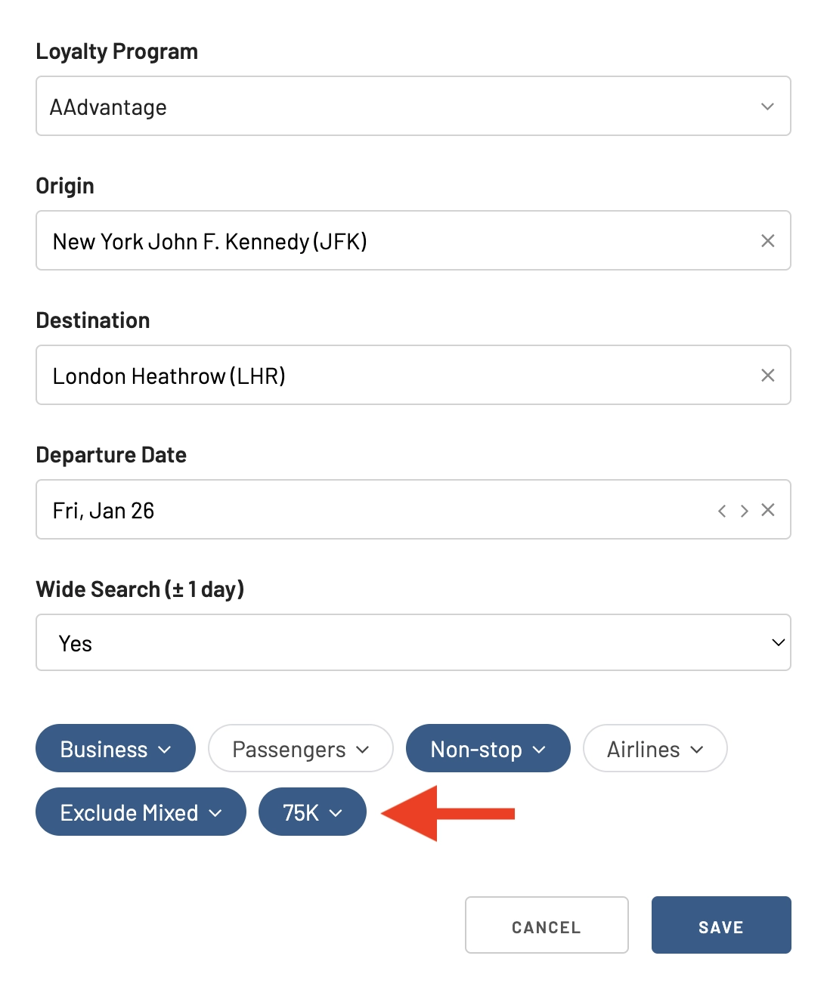

What if you don't have time to check for award availability constantly? With the Alerts feature, you can create alerts for specific routes and dates and let AwardFares do the extra work.

When award availability opens up, you'll receive an email notification. This way, you can never miss out on a great deal.

Here's a step-by-step guide on how to use the Alerts feature in AwardFares.

## How To Set Up Alerts

### From the Alerts Dashboard

#### 1. Go to the AwardFares website and sign in to your account

The alerts feature is available for [** Gold **] (https://awardfares.com/pricing) and [** Diamond **] (https://awardfares.com/pricing) accounts. The Gold package includes up to 5 simultaneous alerts, while the Diamond package includes unlimited alerts. [Go here to upgrade](https://awardfares.com/pricing).

#### 2. Tap on the "Alerts" tab

<figure>

</figure>

#### 3. Tap on "Add Alert" and configure it

<figure>

</figure>

Once you tap *Add Alert*, you will see a screen with multiple fields you can configure.

##### Loyalty Program

The frequent flyer program (or programs) you want to search for award seats on

<figure>

</figure>

##### Origin and Destination

<figure>

</figure>

##### Departure date

<figure>

</figure>

##### Wide search

The *Wide Search* option lets you enable searches on the day before and after your chosen departure date.

<figure>

</figure>

##### Cabin class

This field lets you filter down results on specific cabin classes, including First Class, Business Class, Premium Economy, and Economy.

<figure>

</figure>

##### Airlines (optional)

Search for availability only on a given airline or airlines.

<figure>

</figure>

##### Number of passengers (optional)

If you are traveling in a group, you can use the **Passengers** field to get notified when all seats are available.

<figure>

</figure>

##### Number of stops (optional)

Limit the maximum number of stops on that route.

<figure>

</figure>

##### Max Price (optional)

You will only get alerts for seats that open up **below** a given price threshold. This is useful if you are looking for a specific deal or if you only have a certain number of miles available on your account.

#### 4. Click on the "Save" button

<figure>

</figure>

#### 5. Wait for the notification

That's it! You've created an alert for award availability on your desired route and dates.

Once seats become available, you will get an email notifying you.

<figure>

</figure>

## From an existing search

Another simple way to set up an alert is from the search view. While performing a search, once you have set up a route, date, and filters, you will see a **Track** button in the interface.

When you tap on it, you will see a toggle that adds an alert while preserving your existing configuration and filters.

Simple, huh?

<figure>

</figure>

Once you tap on that toggle, you will see the Alert in your dashboard, where you can edit it, copy it, or even remove it.

<figure>

</figure>

## See Alerts in Timeline View (New)

The Timeline View now features a handy **alert indicator**! Look for a bell icon next to dates on your searched route. This means an alert you've created is set for that date.

<figure>

</figure>

## Edit an alert

You can easily adjust your alerts at any time by clicking on the **Edit** (pencil) icon on your **Alerts** dashboard.

<figure>

</figure>

## Duplicate an alert

You can use the **Copy** icon next to the **Edit** icon to duplicate the Alert. A new popup window will appear with the same configuration, where you can change and adjust each field. Once you are done, you can use the **Save** button to add the new Alert.

Duplicating alerts is useful when you are interested in tracking similar flights without having to enter all the fields from scratch. For example, you could set up the same route but for different dates, number of passengers, stops, or cabins.

<figure>

</figure>

## Trigger a search

Each Alert in the dashboard also has a **Search** icon. Tapping on this option will trigger a new search window in AwardFares and start a new search with the filters and configuration set up in the Alert.

This is a quick way to trigger searches for your interested flights.

<figure>

</figure>

## Delete an alert

You can also delete your alerts if you're no longer interested in them. By clicking on the trash icon, you can delete alerts individually. Alternatively, you can tap on **Remove all alerts** to delete all of them at once.

<figure>

</figure>

## More Tips

* You can create multiple alerts for different routes and dates. This is a great way to monitor award availability for all of your dream trips.
* You can set up a "wide alert" to check availability for three days with a single alert. This is a good option if you're flexible on your travel dates.
* You can filter your alerts by cabin class, airlines, number of passengers, and number of stops. This way, you can only be notified about award availability that meets your specific criteria.
* You can also set up alerts for specific award programs. This is a great way to track award availability for your favorite programs.

## Alerts FAQ

### How many alerts can I configure?

The number of alerts you can have simultaneously depends on your AwardFares tier. The Gold tier lets you have 5 alerts at a time, while the Diamond tier lets you have unlimited alerts. The Free tier does not currently support alerts.

### How soon can I expect a notification after I set up an alert?

As soon as the airline or frequent flyer program opens award seats on the route and configuration you have set up in the alert, AwardFares will email you. Searches for alerts run daily, so keep in mind that it can take up to 24h from the moment the airline releases the award seats until AwardFares detects them and notifies you.

### How often does AwardFares search for my alerts?

Alert searches are performed once a day.

### I set up an alert but never received an email from AwardFares

This means the airline or frequent flyer program didn't release award seats for the route and configuration you are looking for.

### Does AwardFares automatically remove my existing alerts if the flight date has passed?

No. We don't automatically remove any alert, as you might want to keep the configuration to edit or duplicate.

### Can I configure a metro area in my alert?

The current implementation only supports specific airports when setting departure and destination cities. However, we are working on supporting metro areas in the same alert, and this feature will be released in the upcoming weeks.

### Can I add multiple frequent flyer programs in the same alert?

Yes. Tick to select the programs you are interested in when configuring the Alert.

### I deleted an alert accidentally. Can I undo it?

No. You will need to set up the Alert again. Note that deleting an alert is a two-step process, and you should always get a confirmation screen or popup to confirm the deletion.

## Become a Pro Travel Hacker

You can [try AwardFares for free](https://awardfares.com/). We regularly roll out new features and improvements, so [sign up for our monthly newsletter](https://awardfares.com/newsletter) to stay on top of the latest news, announcements, and pro tips.

With our [Gold and Diamond tiers](https://awardfares.com/pricing), you can access premium features such as unlimited daily searches, alerts, seat maps, flight schedules, and more!

Our guides have all the information you need to be a pro travel hacker and explore the world on points. Here are some related posts you might enjoy:

* [How To Find Cheap Award Flights And Identify Good Redemptions (Step-by-step)](https://blog.awardfares.com/how-to-find-cheap-award-flights/)
* [Demystifying Award Charts: All You Need To Know](https://blog.awardfares.com/demystifying-award-charts/)
* [AwardFares vs. Point.me](https://blog.awardfares.com/awardfares-vs-point-me/)
* [AwardFares & AwardHacker: A Dynamic Duo for Maximizing Your Miles and Points](https://blog.awardfares.com/awardhacker/)