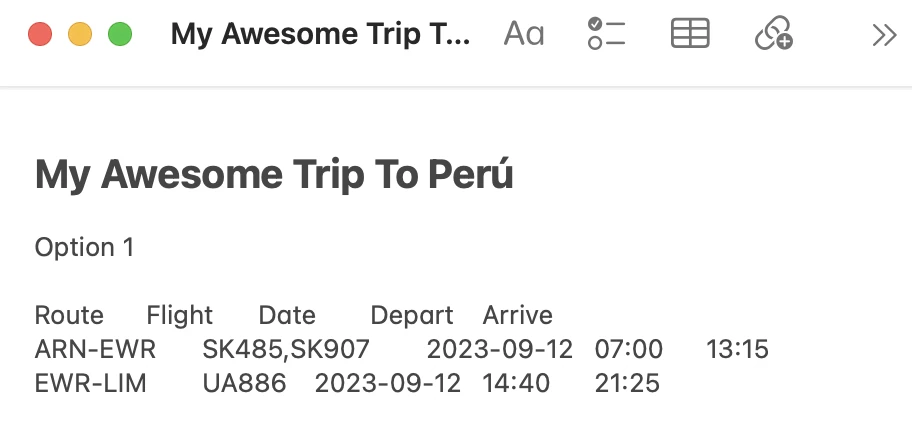

Booking flights with points or miles is fun, but finding the perfect trip to your desired destination can be tricky, especially when the journey involves multiple segments, or across different airlines.

Each airline has its own unique set of rules, blackout dates, and seat availability constraints. Furthermore, partner airlines, despite being part of the same alliance, might not synchronize their award seat inventories, leading to gaps in available routes. Additionally, some segments might have restrictions on the types of fares that can be redeemed further complicating the process (for example, [married segments we described here](https://blog.awardfares.com/married-segments/)).

That's why we've built the **Journey Planner**. This powerful feature lets you **unlock itineraries to your dream destination**, by planning multiple segments in a quick and convenient way. In just a few clicks, users can select add or remove legs, find connections within 24 hours, duplicate journeys, and see the itinerary on a map.

## How To Use The Journey Planner: Build An Award Trip With A Complex Itinerary

Let's look at one concrete example to understand the power behind the Journey Planner.

Dreaming of exploring Macchu Picchu and the ancient Cuzco? Perú is a land of fantastic culture, cuisine, history, and landscape. It’s a trendy destination that receives millions of tourists every year.

Let's say we are interested in flying from Stockholm (Sweden) to Lima (Perú) using SAS EuroBonus points.

We know upfront that availability from Europe to Deep South America is minimal, usually with long layovers and wait times. It gets even tricker when you try to find availability in premium cabins such as Business and First Class.

Nevertheless, we go to AwardFares and perform a search with the following configuration:

- **Loyalty Program**: SAS EuroBonus
- **Origin**: Stockholm Arlanda (ARN)
- **Destination**: Lima (LIM)
- **Departure Date**: Around September 13 (your desired date)

And we get these results:

<figure>

</figure>

As we can see, there's no availability on the surrounding dates in any cabin class!

However, flying through the United States is one way of going to Perú. There are many flights from Sweden to the US daily, and tons of options to find available seats.

> _Pro tip: If you lack inspiration on which routes you can explore or use, try searching with other Frequent Flyer Programs (like United or Aeroplan), since different programs might be more flexible at finding complicated routes. In addition, you can get help from tools such as [Google Flights](https://www.google.com/travel/flights) or [FlightConnections](https://www.flightconnections.com/) to find out more routes and options._

Let's try splitting the trip and connect in a major US city, for example, **New York**. So, we change our search first from Stockholm to New York (NYC, metro area).

<figure>

</figure>

We see that there are plenty of seats! Let's filter further and try to select a Business Class seat with the shortest connection. We go to **Cabins** and add **Business Class Only**; see the list below.

<figure>

</figure>

The first flight in the list doesn't look too bad, it has a quick stopover in Oslo, and a lie-flat seat on SAS A330. We can use the **"+"** icon and add the flight to our Journey Planner.

AwardFares will display a **Journey** section with the segments you have selected.

<figure>

</figure>

Now it's time to find our next leg. You can tap on **Add Flight** either before or after the segment in the planner. Each time a segment is added to the Journey Planner, AwardFares will automatically adjust your origin or departure airport correspondingly.

Let's add another segment _after_ our first leg and input **LIM** (Lima) as the destination. Note how also the business class filter is preserved.

<figure>

</figure>

In the results list, you'll notice how AwardFares displays _"Flights from EWR to LIM departing after (your flight)"_, which makes it much easier to find and select connecting flights.

<figure>

</figure>

The list is now sorted by schedule. On the left, you'll see a time indicator with how long the layover is. Typically, frequent flyer programs let you connect flights with a stopover up to 24 hs in the same ticket. Some of them, even up to 72 hrs. Worst case scenario, you'll have to make two separate bookings for those flights.

We choose the first result from the list and add it to our journey planner. The connection is 1h 30min at EWR, which should be doable considering there are even _Express Connection_ lanes at Newark.

In our Journey Planner now we see the full itinerary

<figure>

</figure>

### Map View

If we go to the top, we can tap the **Map** button to view the full itinerary.

<figure>

</figure>

### Copy and Paste Journey

You can leverage the **Copy to Clipboard** button to copy the itinerary information.

<figure>

</figure>

If you **Clear** your journey, you can simply **Paste** this information in AwardFares back again to recover your journey!

To keep this information safe, make sure to paste it on a note or document on the side. You can also have this note at hand to compare different alternatives when building your dream trip, and when booking your flight.

<figure>

</figure>

### All set. Now, how do I book?

These complex itineraries are often not available to book online, so you will likely need to call your frequent flyer program service center.

As a tip, before calling, use the **copy journey** function to build a note or document with all the options you have considered. Have it at hand, and give this information to the agent to make the process smoother.

### Impossible itineraries

If, by any chance, you add the wrong leg to your journey, AwardFares will detect and show those connections that are impossible to make.

<figure>

</figure>

### Share Journeys

This new feature becomes extremely handy when organizing a trip with a group. It helps evaluate different options while seeing exact information, such as flight numbers, dates, and cities involved.

Once you are ready to work on an itinerary, tap on **Share** to get a unique link you can send to friends and family.

They will see a summary of your itinerary and a map when opening the link.

Use the **Copy URL** button to recover the unique link URL anytime.

### Unshare a Journey

If you ever want to stop sharing your itinerary, tap on **Unshare**.

## Journey Planner FAQ

### Can I build multiple journeys at once?

Yes! It's now possible to work on multiple journeys at once. Tap on the first button (Journey List) to see your active/saved journeys and switch between them.

Tap on **New** to start working on a new Journey:

Immediately after, you will see a new *empty journey* under your list of journeys:

### Can I mix cabin classes?

Absolutely. Just keep in mind that when airlines price those awards, they often charge the segment as all in premium cabin.

### My next leg is several days after my first leg. Is that allowed?

As long as you see available seats in AwardFares, you can book those flights and build whatever itinerary you want. However, not all combinations will be considered as a _single_ ticket, and it will require you to pay more points to book them individually.

The conditions depend on your frequent flyer program. As a rule of thumb, connecting flights within 24 hrs are most often considered part of the same journey. Some airlines offer up to 72 hrs stopovers.

## Become a Pro

The Journey Planner is included in all our packages, including Basic (Free), [**Gold**](https://awardfares.com/pricing) and [**Diamond**](https://awardfares.com/pricing) members.

You can [try AwardFares for free](https://awardfares.com/). We regularly roll out new features and improvements, so [sign up for our monthly newsletter](https://awardfares.com/newsletter) to stay on top of the latest news, announcements, and pro tips.

Our guides have all the information you need to be a pro travel hacker and explore the world on points. Here are some related posts you might enjoy:

- [How to Book Round-Trip Award Flights Like a Pro](https://blog.awardfares.com/round-trip-award-flights/)
- [Seat Maps: Getting The Perfect Seat Even Before Booking](https://blog.awardfares.com/seatmaps-guide/)
- [Alerts](https://blog.awardfares.com/alerts/)
- [Demystifying Award Charts: All You Need To Know](https://blog.awardfares.com/demystifying-award-charts/)
