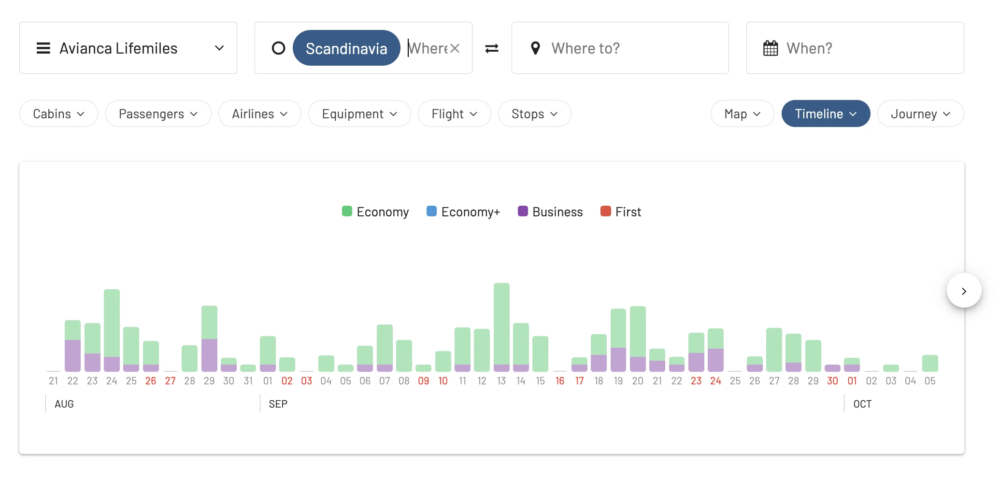
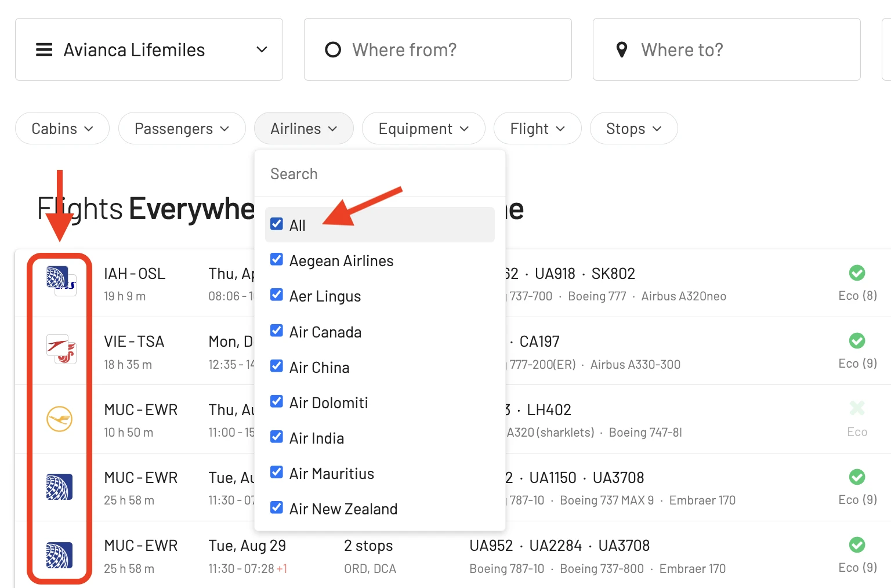
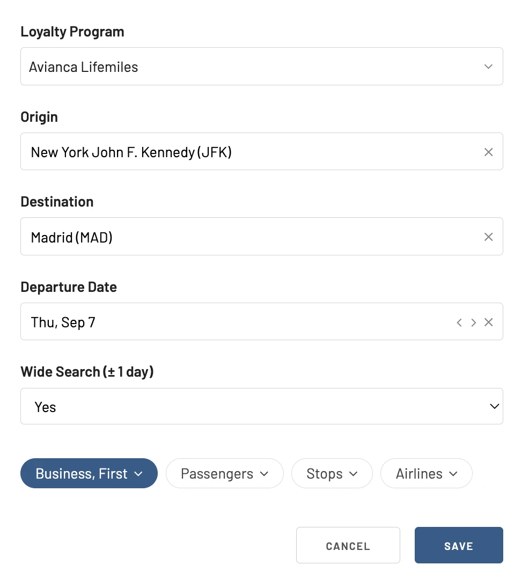
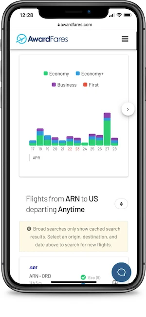
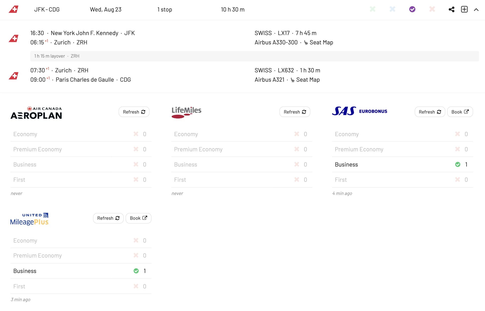

While Avianca's LifeMiles is a treasure chest for travelers, effectively getting the most out of them requires know-how and the right tools. Many adventurers make typical mistakes when searching on Avianca's site, but there's a secret sauce to streamline the process: AwardFares.

In this post, we dive into five common errors LifeMiles enthusiasts encounter and discover how AwardFares emerges as the game-changer you've been looking for.

### In this post

- [5 Mistakes When Searching LifeMiles Awards {#mistakes}](#5-mistakes-when-searching-lifemiles-awards-mistakes)
- [How To Search LifeMiles Award Availability (The Easy Way) {#how-to}](#how-to-search-lifemiles-award-availability-the-easy-way-how-to)
- [Best Uses Of LifeMiles {#examples}](#best-uses-of-lifemiles-examples)
- [Upgrade for more.](#upgrade-for-more)
- [Read more.](#read-more)

## 5 Mistakes When Searching LifeMiles Awards {#mistakes}

### 1. Being Restricted to a Day-by-Day Search

**Mistake**: Relying on Avianca's site often means examining availability day-by-day. This meticulous approach, while detailed, is tedious and may not present the full picture for flexible travelers.

**Fix**: AwardFares has a comprehensive calendar view (Timeline View), showcasing award availability across a spectrum of dates. I simplifies hours of manual searching into a single-glance graphic.

<figure>

</figure>

### 2. Missing Out on Star Alliance and other Partners

**Mistake**: LifeMiles' real strength lies in its partner airlines, including Star Alliance members. However, many members, when using Avianca's site, forget to explore award flights on partner airlines, limiting their options.

**Fix**: AwardFares integrates award availability across Star Alliance partners, broadening your horizon. It's easy to see all available seats across different airlines, discovering award flights that might be perfect for your journey.

<figure>

</figure>

### 3. Forgetting to Set Availability Alerts

**Mistake**: As LifeMiles moved to a dynamic award chart, what's not available today might be open tomorrow. Continually checking Avianca's website isn't just time-consuming; it's also inefficient.

**Fix**: Our [Alerts feature](https://blog.awardfares.com/alerts/) is a must-have for proactive travelers. Specify your criteria and get real-time notifications as soon as a matching award seat emerges.

Here's an example of setting an alert for LifeMiles availability.

<figure>

</figure>

### 4. Dealing With Cumbersome User Interfaces

**Mistake**: Avianca's website can be tricky. Whether it's slow loading times, confusing navigation, or sudden errors, the search can get cumbersome.

**Fix**: AwardFares prides itself on its sleek, intuitive interface. Simple to navigate and power-packed with features, it ensures your award searching is hassle-free and efficient. Hey, it's also mobile-friendly, ready for searching for that perfect award trip while on-the-go.

<figure>

</figure>

### 5. Ignoring Mixed Cabin Opportunities

**Mistake**: While searching for business or first-class awards, many travelers miss out on opportunities where part of the journey could be in a premium cabin, and another segment in economy.

**Fix**: AwardFares' robust search algorithm highlights these mixed cabin options, ensuring you get maximum luxury and value from your LifeMiles.

### BONUS. Not Comparing with Other Loyalty Programs

**Mistake**: Avianca's website naturally focuses on LifeMiles redemptions. However, often travelers fail to compare these with other loyalty programs to ensure they're getting the best bang for their buck.

**Fix**: AwardFares is not just limited to LifeMiles. It's extremely simple to compare availability with other programs such as SAS EuroBonus, Alaska Mileage Plan, United MileagePlus, Air Canada Aeroplan, etc. Just tap on the arrow icon to see details for different programs.

This is particularly useful when you have points that can be transferred to different programs, or when you are after multiple seats (i.e. group of passengers). Different programs have different inventories.

<figure>

</figure>

## How To Search LifeMiles Award Availability (The Easy Way) {#how-to}

### 1. Log in to [AwardFares](https://awardfares.com).

### 2. Select Frequent Flyer Program.

In the **Frequent Flyer Program** picker, select **Avianca LifeMiles**.

<figure>

</figure>

### 3. Choose the route.

In the **From** and **To** fields, enter your departure and arrival airports.

> Optional: you can also perform broad searches from an entire area, region, or metropolitan area (like a city, Tokyo TYO)

<figure>

</figure>

### 4. Add travel dates (optional).

If you know your travel dates, try adding them to the search field. Once selected, AwardFares will start searching for available flights for that date, and will display them in a list below.

<figure>

</figure>

Alternatively, if you don't have a set travel date, you can select the **Timeline View** to explore the availability for multiple days simultaneously. The bars show different classes in different colors.

### 5. Add more filters (optional).

Try filtering out by cabin class (e.g. Business Class, First Class) or number of stops (e.g. nonstop). In this example, we filter results to only show Economy Class seats.

<figure>

</figure>

And here's another example of filtering results by airline, to only show flights on EVA Air.

<figure>

</figure>

There are many more filters you can explore adding, such as number of passengers, aircraft type, number of stops and even flight number!

### 6. Done.

That’s it! Pretty easy, huh? With only a few clicks, you can see LifeMiles inventory on both Avianca Airlines as well as partners.

## Best Uses Of LifeMiles {#examples}

LifeMiles presents a myriad of opportunities for any kind of traveler, from begginers to advanced.r. Beyond the standard redemptions, LifeMiles has some exceptional sweet spots that can offer unparalleled value. We've [covered some of them in this post](https://blog.awardfares.com/lifemiles-sweet-spots/).

Some examples are:

* **Transcontinental Business Class in the U.S.**: While many domestic U.S. routes offer standard recliner seats, several airlines provide lie-flat seats on transcontinental flights. LifeMiles can be a great way to secure a business class seat on these flights with maximum comfort for coast-to-coast journeys.
* **Europe to North Asia in First/Business Class**: Traveling from Europe to destinations in North Asia, like [Tokyo](https://awardfares.com/search?FRA.area:TYO.;z:lifemiles), [Beijing](https://awardfares.com/search?FRA.PEK.;z:lifemiles), or [Seoul](https://awardfares.com/search?FRA.ICN.;z:lifemiles)? LifeMiles offers competitive redemption rates for premium cabins on Star Alliance carriers. This means lie-flat seats, gourmet meals, and top-notch service for a fraction of the cash price.
* **South America Explorer**: Many travelers aren't aware that LifeMiles offers excellent value for intra-South America flights, especially in premium cabins. Whether you're hopping between [Buenos Aires and Lima](https://awardfares.com/search?area:BUE.LIM.;z:lifemiles) or exploring the Amazon in Brazil, LifeMiles can be your ticket to comfort and savings.
* **Island Hopping in the Pacific**: The vast expanse of the Pacific Ocean houses numerous beautiful islands, and getting between them can often be expensive. LifeMiles can be a game-changer here, allowing you to hop between destinations like Tahiti, Fiji, and Hawaii with ease.
* **Avoiding Fuel Surcharges**: One of the most significant advantages of using LifeMiles is the program's policy of not adding fuel surcharges to award tickets. This can result in substantial savings, especially on long-haul flights with carriers that typically levy high surcharges.
* **Mixed-Cabin Redemptions**: While this may sound like a compromise, it can be a strategic move. On routes where the long segment has premium cabin availability but the shorter connecting flight doesn't, you can mix and match cabin classes. This ensures you enjoy luxury where it matters most while saving miles in the process. Have a look at how to do this [with our **Journey Planner** feature](https://blog.awardfares.com/journey-planner/).

## Upgrade for more.

You can [try AwardFares for free](https://awardfares.com/). We are rolling out new features and improvements regularly, so sign up for our newsletter to stay on top of the latest news, announcements, and pro tips!

## Read more.

Make sure to also check these posts out

- [Avianca LifeMiles Sweet Spots And How To Find Them](https://blog.awardfares.com/lifemiles-sweet-spots/)
- [Demystifying Award Charts: All You Need To Know (2023)](https://blog.awardfares.com/demystifying-award-charts/)