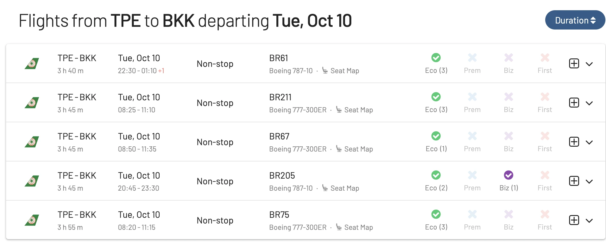
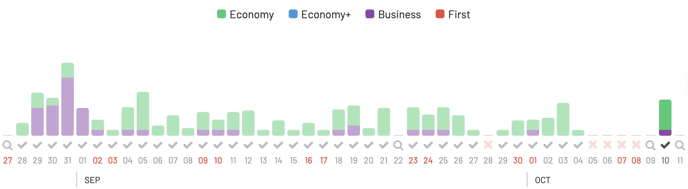
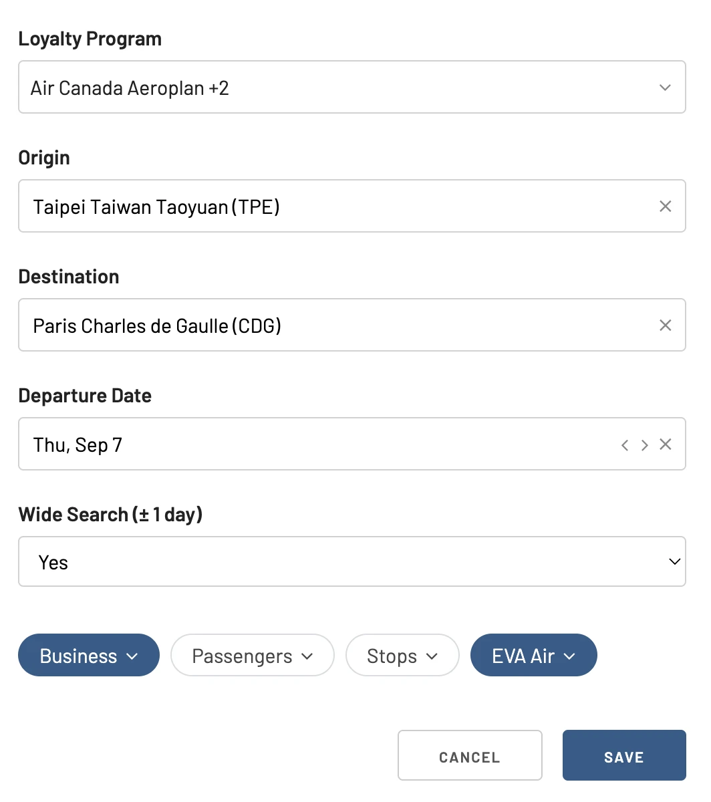
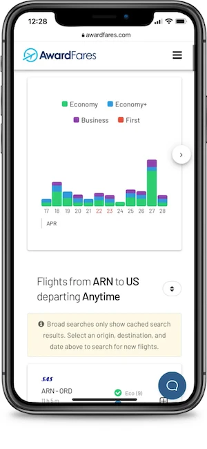
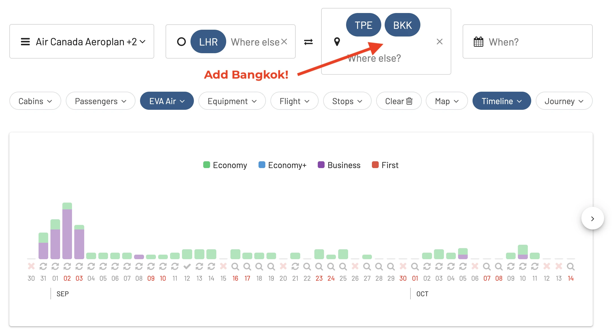
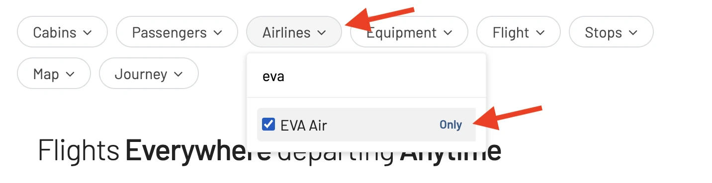
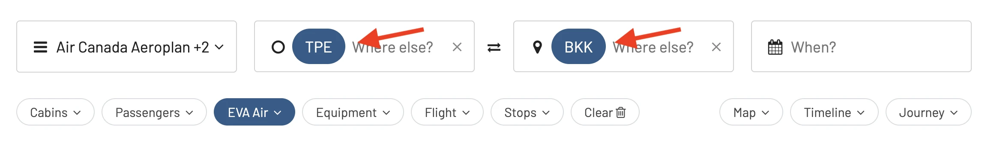
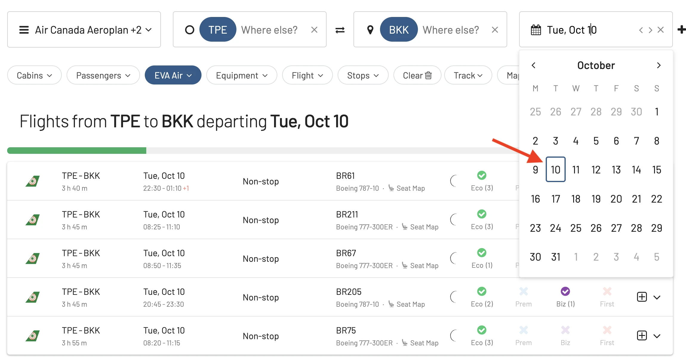
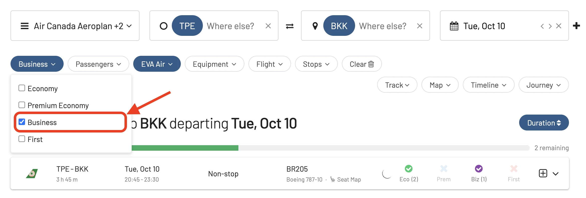

EVA Air is renowned for its world-class service, exceptional cabin amenities, and fantastic award flight opportunities. However, like most airlines, searching for award availability can be a maze that even the most seasoned travelers get lost in. More often than not, travelers make mistakes that can cost them both time and valuable points.

But don't worry, we're here to guide you. In this post, we dive into the top five mistakes travelers make when searching for EVA Air award flights and how AwardFares can be the solution you never knew you needed.

### In this post

- [5 Mistakes When Searching EVA Air Award Flights](#5-mistakes-when-searching-eva-air-award-flights)
- [How To Search EVA Air Award Availability](#how-to-search-eva-air-award-availability)
- [Become a Pro](#become-a-pro)
- [Read More](#read-more)

## 5 Mistakes When Searching EVA Air Award Flights

### 1. Relying Solely on [EVA Air Website](https://www.evaair.com/) for Availability

**Mistake**: Many travelers begin and end their award flight search on EVA Air's official website, thinking it provides the most accurate and comprehensive availability.

**Fix**: While the airline's website provides some availability, [AwardFares](https://awardfares.com/search?..;a:BR#) offers a more user-friendly interface and comprehensive search tools that scan multiple dates and routes. By using AwardFares, travelers can get a clearer picture of available flights, ensuring they make the most out of their points.

<figure>

</figure>

### 2. Not Checking Partner Airlines

**Mistake**: Travelers often forget that award flight availability is not only influenced by EVA Air but also by its partner airlines in the Star Alliance network.

**Fix**: AwardFares aggregates information from multiple airlines, including Star Alliance members. This means you can view availability across various partners, giving you more flexibility and options for your travels.

### 3. Overlooking Peak Travel Dates

**Mistake**: Travelers frequently set their sights on popular travel dates without considering the high demand during those times.

**Fix**: With AwardFares, users can utilize its intuitive calendar feature which highlights peak travel times. This allows travelers to adjust their plans accordingly, ensuring they maximize the value of their miles.

<figure>

</figure>

### 4. Not Setting Up Alerts

**Mistake**: EVA Air award chart is complicated, plus the availability is sporadic: what's not available today might be open tomorrow. Continually checking EVA Air's website isn't just time-consuming; it's also inefficient.

**Fix**: Our [Alerts feature](https://blog.awardfares.com/alerts/) is a must-have for proactive travelers. Specify your criteria and get real-time notifications as soon as a matching award seat emerges.

Here's an example of setting an alert for availability on EVA Air flights.

<figure>

</figure>

### 5. Dealing With Cumbersome User Interfaces

**Mistake**: EVA Air's website can be tricky. Whether it's slow loading times, confusing navigation, or sudden errors, the search can get cumbersome.

**Fix**: AwardFares prides itself on its sleek, intuitive interface. Simple to navigate and power-packed with features, it ensures your award searching is hassle-free and efficient. Hey, it's also mobile-friendly, ready for searching for that perfect award trip while on-the-go.

<figure>

</figure>

### BONUS. Not Searching Via Bangkok (BKK)

**Mistake**: EVA Air operates a lot of their flights TPE-BKK-Europe. Sometimes, there are seats available on Europe-BKK, or vice versa, while that same flight doesn’t have availability to/from TPE.

**Fix** Include both TPE and BKK in searches when finding availabilty in AwardFares

<figure>

</figure>

## How To Search EVA Air Award Availability

### 1. Log in to [AwardFares](https://awardfares.com)

### 3. Choose your favorite(s) frequent flyer program

### 2. Select **EVA Air** as the airline

<figure>

</figure>

### 3. Choose the route

In the **From** and **To** fields, enter your departure and arrival airports.

> Optional: you can also perform broad searches from an entire area, region, or metropolitan area (like a city, Tokyo TYO)

<figure>

</figure>

### 4. Add travel dates (optional)

If you know your travel dates, try adding them to the search field. Once selected, AwardFares will start searching for available flights for that date, and will display them in a list below.

<figure>

</figure>

Alternatively, if you don't have a set travel date, you can select the **Timeline View** to explore the availability for multiple days simultaneously. The bars show different classes in different colors.

### 5. Add more filters (optional)

Try filtering out by cabin class (e.g. Business Class, First Class) or number of stops (e.g. nonstop). In this example, we filter results to only show Business Class seats.

<figure>

</figure>

There are many more filters you can explore adding, such as number of passengers, aircraft type, number of stops and even flight number!

### 6. Done

That’s it! Pretty easy, huh? With only a few clicks, you can see EVA Air inventory across different frequent flyer programs.

## Become a Pro

You can [try AwardFares for free](https://awardfares.com/). We are rolling out new features and improvements regularly, so [sign up for our monthly newsletter](https://awardfares.com/newsletter) to stay on top of the latest news, announcements, and pro tips.

With our [Gold and Diamond tiers](https://awardfares.com/pricing), you can access premium features such as unlimited daily searches, alerts, seat maps, flight schedules, and more!

## Read More

Make sure to also check these posts out

- [How To Find EVA Air Sweets Spots](https://blog.awardfares.com/eva-air-sweet-spots/)
- [EVA Air Award Redemption Guide](https://blog.awardfares.com/eva-air-award-redemption/)
- [EVA Business 787-9 Dreamliner Business Class (TPE-ICN)](https://blog.awardfares.com/eva-business-tpe-icn/)
