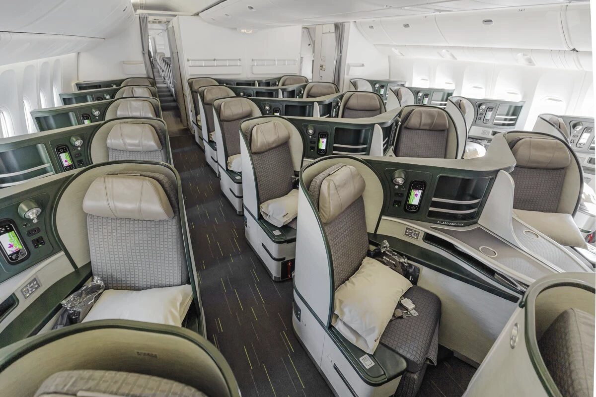
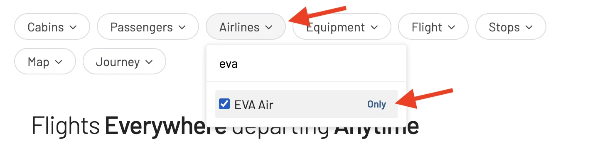
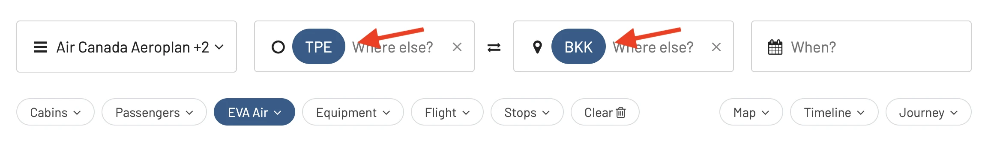
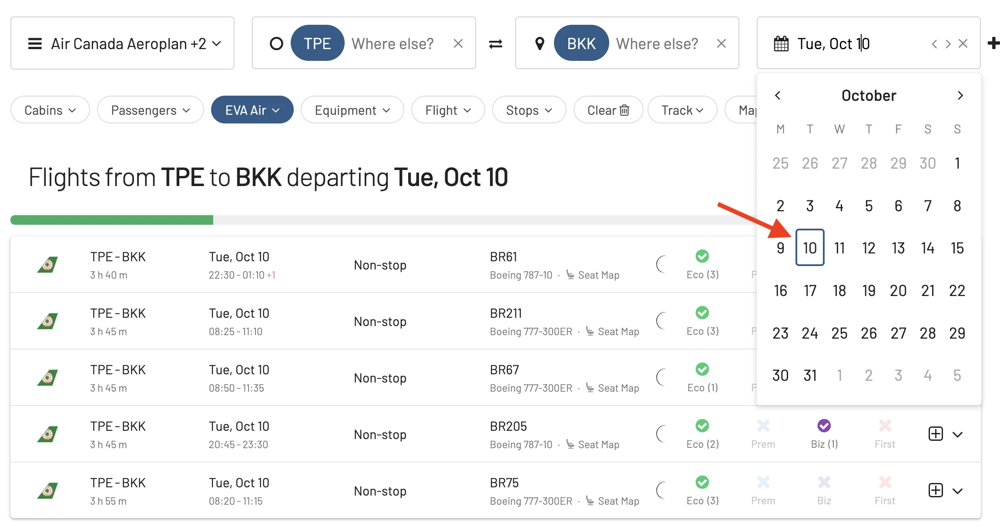
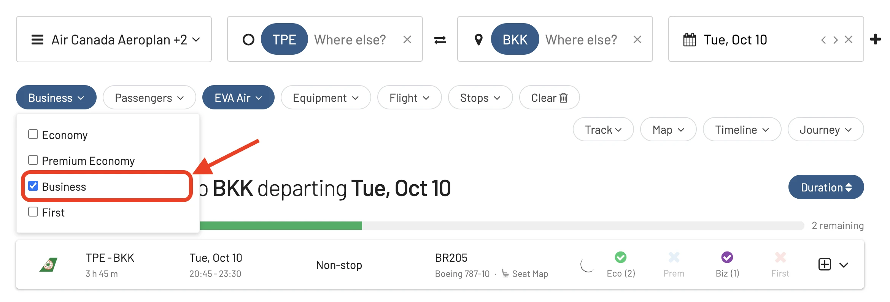

[EVA Air](https://www.evaair.com/), a member of the Star Alliance, offers world-renowned service and has a stellar reputation in the aviation industry. Whether you're traveling for leisure or business, there are some routes that stand out for the exceptional in-flight experience they offer.

In this post, we dive into the top EVA Air routes you should consider trying, how to search them using AwardFares, and how to book those award flights.

### In This Post

- [Business Class Differences on EVA Air](#biz)
- [Best Award Flights Redemptions On EVA Air](#list)
- [How To Search EVA Air Award Flights Availability (Across Programs)](#how-to)

## EVA Air Business Class Differences By Aircraft {#biz}

EVA Air offers two types of business class cabins: *Royal Laurel Class* and *Premium Laurel Class/Business Class*. Depending on the aircraft type, the cabin, seat, and configurations are different. For example, The Royal Laurel Class on the 787s are much newer and more private than on the 777-300. Here's a quick recap.

### Boeing 777-300ER

Royal Laurel Class: EVA's primary long-haul Business Class product is found on the majority of its 777-300ERs.

* Seat Configuration: Reverse herringbone, 1-2-1, ensuring direct aisle access for all seats.
* Seats recline to a fully-flat bed.
* Each seat features a large entertainment screen, ample storage, and USB/power outlets.

<figure>

</figure>

### Boeing 787 Dreamliner (787-9 and 787-10)

A newer addition to EVA's fleet, the Dreamliners feature updated Royal Laurel Class seats.

* Seat Configuration: Reverse herringbone, 1-2-1 layout similar to the 777-300ER.
* The design, however, is slightly more modern and has enhancements based on the newer aircraft’s features. 
* Features a fully-flat bed, large entertainment screens, and ample storage.

<figure>

</figure>

### Airbus A330-200/300

Premium Laurel Class: Before the introduction of Royal Laurel on the 777-300ER, Premium Laurel was EVA's top business class product.

* Seat Configuration: 2-2-2, meaning not all seats have direct aisle access.
* These seats are angle-flat, not fully flat, making them less ideal for long-haul travel.
* The entertainment system and other amenities might seem slightly dated compared to the newer Royal Laurel seats on the 777 and 787.

<figure>

</figure>

## Best Award Flights On EVA Air (2023) {#list}

### 1. [Taipei (TPE) to New York (JFK)](https://awardfares.com/search?TPE.JFK.;a:BR)

This long-haul flight showcases the best of EVA Air's Royal Laurel Class, their top-tier business class offering. It provides excellent service, lie-flat seats, and a top-notch in-flight entertainment system. This route is operated mainly by their 777.

**How to redeem**: Most availability using Aeroplan miles or SAS EuroBonus points.

<figure>

</figure>

### 2. [Taipei (TPE) to London (LHR)](https://awardfares.com/search?TPE.LHR.;a:BR)

A significant transcontinental route, passengers are treated to EVA's exceptional service, delectable meals inspired by both Western and Eastern cuisine, and a comfortable seating arrangement.

**How to redeem**: Most availability using Aeroplan miles or SAS EuroBonus points.

<figure>

</figure>

### 3. [Taipei (TPE) to Bangkok (BKK)](https://awardfares.com/search?TPE.BKK.;a:BR)

While this is a shorter flight, it's a popular route that showcases the airline's efficiency and consistency in service. Operated with a range of planes, including 777-300 and 787-10.

**How to redeem**: Use EVA Air's Infinity MileageLands program to search and book. Alternatively use United MileagePlus

<figure>

</figure>

<figure>

</figure>

### 4. [Taipei (TPE) to Los Angeles (LAX)](https://awardfares.com/search?TPE.LAX.;a:BR)

Another prized long-haul route, this flight boasts the charm of the Royal Laurel Class with its spacious cabins, impeccable service, and a wide variety of in-flight entertainment.

**How to redeem**: Use Aeroplan, United MileagePlus, or SAS EuroBonus points.

<figure>

</figure>

### 5. [Taipei (TPE) to Tokyo (NRT/HND)](https://awardfares.com/search?TPE.TYO.;a:BR)

An essential Asian route, the service is swift, efficient, and epitomizes the luxurious experience associated with EVA Air. This route is operated by 787s and A330s.

**How to redeem**: Redemption rates can be quite competitive. Check EVA Air's website or use United MileagePlus, or SAS EuroBonus points.

<figure>

</figure>

## How To Monitor EVA Air Award Flights

EVA Air occasionally has promotions where award tickets require fewer miles than usual. Keep an eye on their offers, to snag a deal. 

> Pro tip: Use [AwardFares' Alerts feature](https://blog.awardfares.com/alerts/) to set up an alert on the route(s) you are interested in, and get notified via email when award seats open.

## How Early Should I Book?

As with many airlines, the best availability, especially for popular routes, often appears 330-355 days before departure.

> Pro tip: Check our [**Ultimate Guide To Award Release Dates** here](https://blog.awardfares.com/ultimate-guide-to-award-release-dates).

## How To Search EVA Air Award Flights Availability (Across Programs) {#how-to}

### 1. Log in to [AwardFares](https://awardfares.com).

### 3. Choose your favorite(s) frequent flyer program.

### 2. Select **EVA Air** as the airline.

<figure>

</figure>

### 3. Choose the route.

In the **From** and **To** fields, enter your departure and arrival airports.

> Optional: you can also perform broad searches from an entire area, region, or metropolitan area (like a city, Tokyo TYO)

<figure>

</figure>

### 4. Add travel dates (optional).

If you know your travel dates, try adding them to the search field. Once selected, AwardFares will start searching for available flights for that date, and will display them in a list below.

<figure>

</figure>

Alternatively, if you don't have a set travel date, you can select the **Timeline View** to explore the availability for multiple days simultaneously. The bars show different classes in different colors.

### 5. Add more filters (optional).

Try filtering out by cabin class (e.g. Business Class, First Class) or number of stops (e.g. nonstop). In this example, we filter results to only show Business Class seats.

<figure>

</figure>

There are many more filters you can explore adding, such as number of passengers, aircraft type, number of stops and even flight number!

### 6. Done.

That’s it! Pretty easy, huh? With only a few clicks, you can see EVA Air inventory across different frequent flyer programs.

## Upgrade for more.

You can [try AwardFares for free](https://awardfares.com/). We are rolling out new features and improvements regularly, so sign up for our newsletter to stay on top of the latest news, announcements, and pro tips!

## Read more.

Make sure to also check these posts out

- [EVA Air Award Redemption Guide](https://blog.awardfares.com/eva-air-award-redemption/)
- [Demystifying Award Charts: All You Need To Know (2023)](https://blog.awardfares.com/demystifying-award-charts/)
- [5 Mistakes When Searching EVA Air Award Flights (And How To Fix Them)](https://blog.awardfares.com/eva-air-mistakes/)