All Nippon Airways (ANA) is taking the skies by storm with its latest collaboration with the Pokémon Company. After the successful launch of their "Pikachu Jet NH" on June 4, 2023, the airline is introducing the "Eevee Jet NH," inspired by the Pokémon Eevee, known for its multiple evolution forms.

This brand-new aircraft officially begins its services on international routes starting **TODAY** (August 31, 2023). You can [track the first flight on Flightradar24](https://www.flightradar24.com/data/flights/nh211#).

<figure>
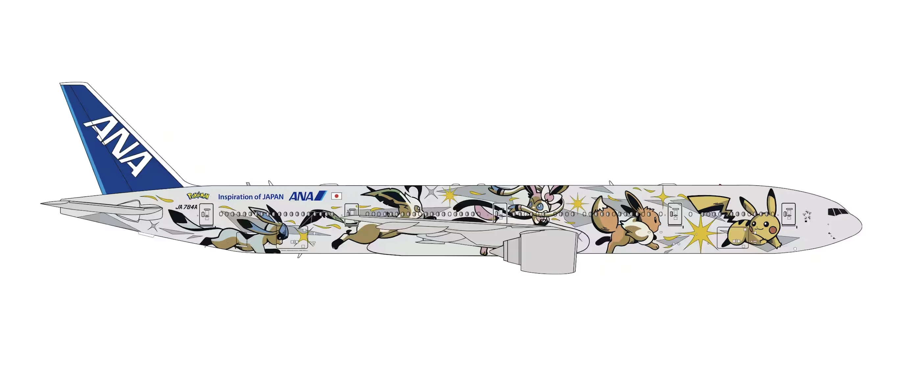
</figure>

### In this post

- [ANA Pokémon Jets](#jets)
- [How To Search For Award Trips On The Pokémon Jets](#how-to)
- [List of ANA's 777 Special Liveries](#liveries)

## ANA Eevee Jet NH and Pikachu Jet NH {#jets}

The "Eevee Jet NH" is designed with illustrations of Eevee and its evolutions like Vaporeon, Jolteon, and Flareon, all of which are seen journeying into the future alongside Pikachu.

ANA emphasizes that this design represents its dedication to motivate both its staff and travelers to explore a world full of diverse possibilities starting from the sky.

The plane in the spotlight is a Boeing 777-300ER (JA784A). It's planned to operate for around five years, covering popular international routes like Haneda to London, New York, and San Francisco. However, the specific routes are subject to operational changes.

Inside the "Eevee Jet NH," passengers will find a unique Pokémon-themed experience, much like its predecessor, the "Pikachu Jet NH,". This includes exclusive patterns on cabin attendants' aprons, paper cups, napkins, and headrest covers (only available in Premium Economy and Economy Classes). Travelers will also be treated to Pokémon-themed boarding music and will get a special "Eevee Jet NH" boarding certificate as a keepsake.

The "Pokémon Air Adventures" project comes at a time when travel restrictions are gradually lifting, making it a timely initiative to uplift the spirits of travelers. With the launch of the "Eevee Jet NH," ANA continues to express its dedication to reenergizing the love for travel among its patrons.

### Eevee Jet NH Schedules

| Route                                                                                   | Flight Number           |
| --------------------------------------------------------------------------------------- | ----------------------- |
| [Haneda ⇔ London](https://awardfares.com/search?HND,LHR.LHR,HND.;a:NH;f:nh211,%20nh212) | NH211/NH212             |
| [Haneda ⇔ New York](https://awardfares.com/search?HND,area:NYC.area:NYC,HND.;a:NH)      | NH110/NH109/NH160/NH159 |
| [Haneda ⇔ San Francisco](https://awardfares.com/search?HND,SFO.SFO,HND.;a:NH)           | NH108/NH107             |

### Pikachu Jet NH Schedules

| Route                                                                             | Flight Number           |
| --------------------------------------------------------------------------------- | ----------------------- |
| [Haneda ⇔ Bangkok](https://awardfares.com/search?HND,BKK.HND,BKK.;a:NH)           | NH847/NH850/NH849/NH848 |
| [Haneda ⇔ Singapore](https://awardfares.com/search?HND,SIN.HND,SIN.;a:NH)         | NH841/NH844/NH843/NH842 |
| [Haneda ⇔ Jakarta](https://awardfares.com/search?HND,area:JKT.HND,area:JKT.;a:NH) | NH855/NH856             |
| [Haneda ⇔ Manila](https://awardfares.com/search?HND,MNL.HND,MNL.;a:NH)            | NH869/NH870             |
| [Haneda ⇔ Ho Chi Minh](https://awardfares.com/search?HND,SGN.HND,SGN.;a:NH)       | NH891/NH892             |
| [Haneda ⇔ Delhi](https://awardfares.com/search?HND,DEL.HND,DEL.;a:NH)             | NH837/NH838             |
| [Haneda ⇔ Sydney](https://awardfares.com/search?HND,SYD.HND,SYD.;a:NH)            | NH879/NH880/NH889/NH890 |
| [Haneda ⇔ Vancouver](https://awardfares.com/search?HND,YVR.HND,YVR.;a:NH)         | NH116/NH115             |
| [Haneda ⇔ Honolulu](https://awardfares.com/search?HND,HNL.HND,HNL.;a:NH)          | NH186/NH185             |

> Keep in mind that the flight schedule is subject to change depending on the situation on a daily basis, and the flight schedule will not be confirmed **until the day of the flight**.

## How To Search For Award Trips On The Pokémon Jets {#how-to}

### 1. Log in to [AwardFares](https://awardfares.com).

### 2. Select your favorite **Frequent Flyer Program**.

<figure>
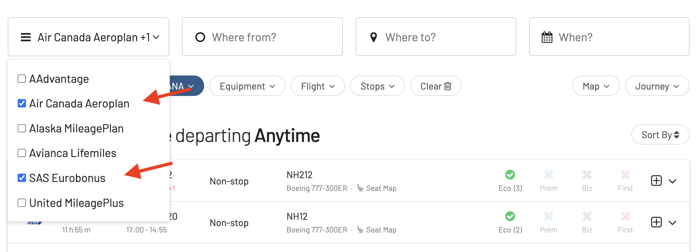
</figure>

### 3. Under **Airline**, select **ANA**.

<figure>
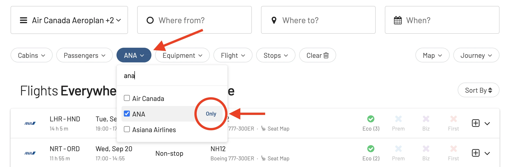
</figure>

### 4. Choose the route.

In the **From** and **To** fields, enter your departure and arrival airports. Make sure to enter one of the routes operated by either the Eevee or Pikachu Jets.

For this example, we will try to find an award flight from Tokyo Haneda (HND) to London (LHR).

<figure>
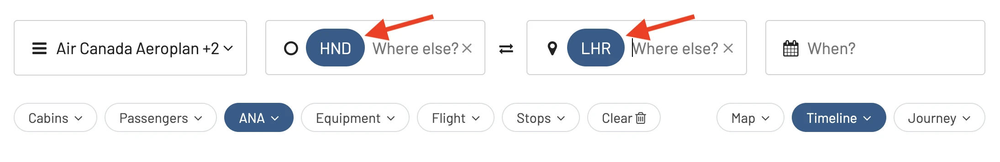
</figure>

### 5. Under **Flight**, add the flight number.

In this case, we will filter by flight NH211 from Haneda to Tokyo.

<figure>
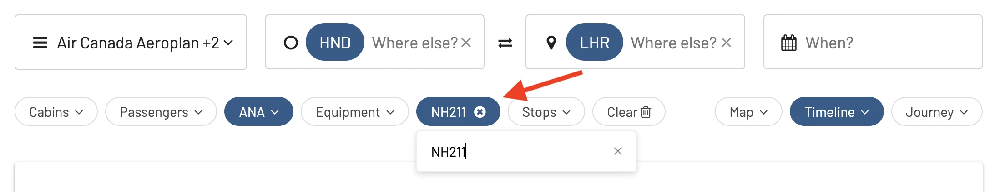
</figure>

### 6. Add travel dates (optional).

If you know your travel dates, try adding them to the search field. Once selected, AwardFares will start searching for available flights for that date, and will display them in a list below.

Alternatively, if you don't have a set travel date, you can select the **Timeline View** to explore the availability for multiple days simultaneously. The bars show different classes in different colors.

<figure>
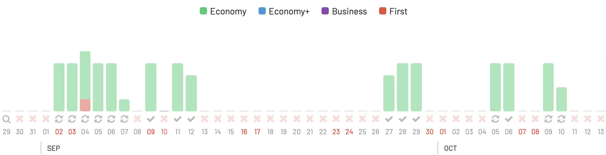
</figure>

### 7. Add more filters (optional).

You can also add more filters to trim down results even more, for example, by cabin class, to only show Business or First Class availability.

<figure>
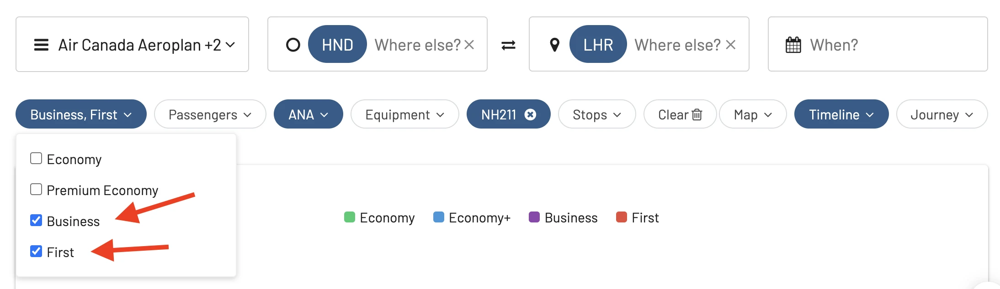
</figure>

### 8. Done.

That’s it! Pretty straightforward, right? Keep in mind that, while it's very likely that the route is operated by that plane, there's no guarantee that you will actually fly on those jets. The equipment can changed or be swapped last-minute by the airline.

## ANA's Boeing 777: A Canvas of Spectacular Liveries {#liveries}

All Nippon Airways (ANA) has always held a reputation not just for its outstanding service, but also for its ability to turn its aircraft into flying pieces of art. The Boeing 777, one of the most popular and largest aircraft in ANA’s fleet, has worn several intriguing liveries over the years. Let's take a journey through the skies and witness the most captivating liveries that have adorned the ANA 777.

Each of these liveries tells a story, represents a value, or simply exhibits a creative flair that goes beyond traditional airline branding. In an industry where companies often stick to standard designs for ease of recognition, ANA's willingness to experiment is a breath of fresh air.

### 1. Star Wars Livery

One of ANA’s most well-known specialty liveries, the Star Wars theme, includes several designs inspired by the legendary movie series. They've showcased R2-D2, BB-8, and even a combination of characters.

The R2-D2 design, predominantly in blue and white, aligns perfectly with ANA’s standard colors, making it not just a pop culture nod but also a seamless brand integration.

<figure>
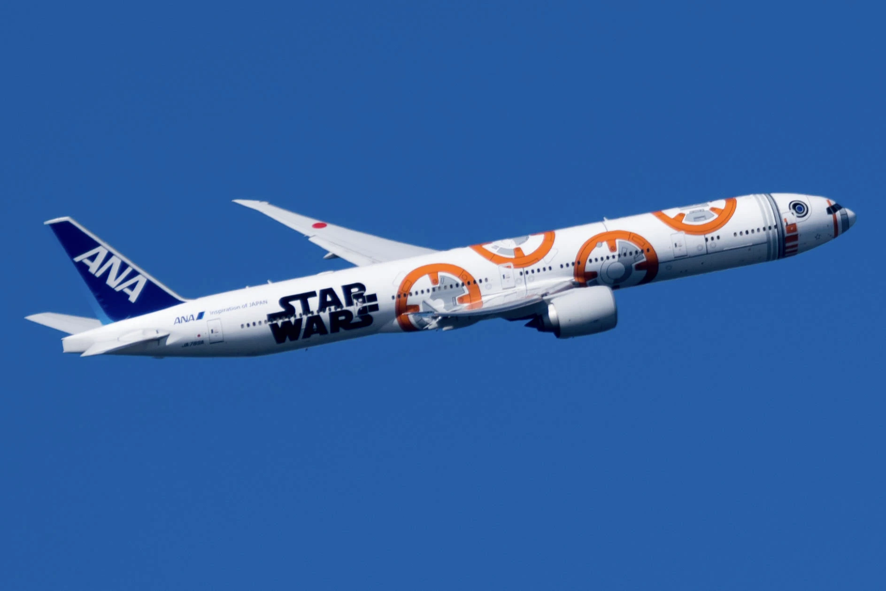
</figure>

### 2. Demon Slayer

ANA 777 Demon Slayer livery is a special paint job for a Boeing 777-200ER aircraft operated by All Nippon Airways (ANA). The livery features characters from the popular Japanese anime series "Demon Slayer: Kimetsu no Yaiba" on the fuselage. The characters featured are Tanjiro Kamado, Nezuko Kamado, Zenitsu Agatsuma, and Inosuke Hashibira.

The livery was unveiled in July 2023 and is the third Demon Slayer-themed aircraft in ANA's fleet. The other two aircraft are Boeing 767-300ERs.

<figure>
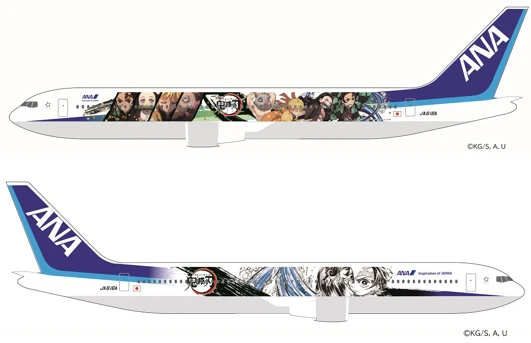
</figure>

### 3. Inspiration of Japan Livery

A livery that encompasses the elegance of Japanese culture. It boasts a modified tail design and "Inspiration of Japan" written toward the front of the plane. This design brings forward the ethos of ANA’s services, emphasizing luxury, comfort, and the spirit of Japanese hospitality.

### 4. Tokyo 2020 Livery

As Japan prepared to host the 2020 Olympics, ANA showcased its support with a special livery. The aircraft featured the Olympic rings, with the logo for the Tokyo 2020 Olympics. Even though the games were postponed due to the COVID-19 pandemic, this livery stood as a symbol of hope and resilience.

<figure>
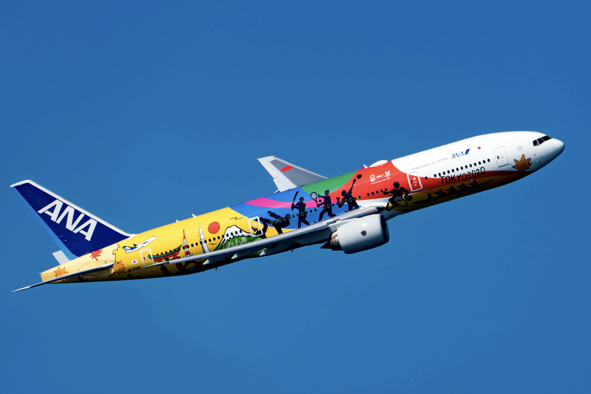
</figure>

### 5. NH 60th Anniversary Livery

To commemorate its 60th anniversary, ANA rolled out a special livery with “60” prominently showcased and other artistic elements, signifying its journey over the decades. A timeline style depiction on the aircraft body, showcasing ANA’s glorious history.

<figure>
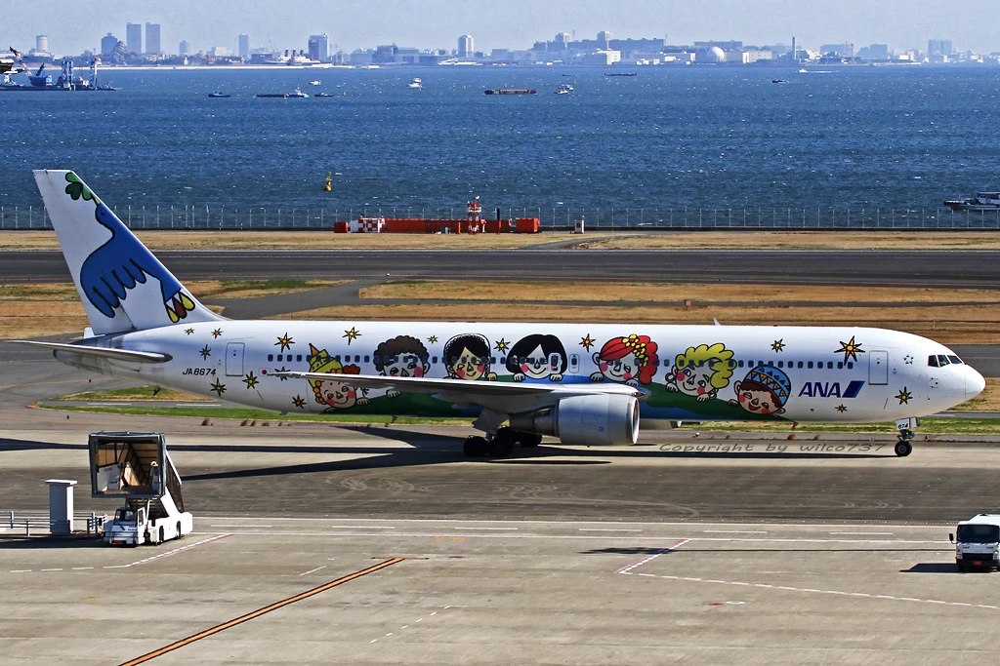
</figure>

### 6. Standard ANA Livery

The typical ANA livery is an elegant combination of blue and white. A dark blue tail, progressing into a lighter shade, and finally merging with the white body of the aircraft. The simplicity is striking, and it's instantly recognizable in airports around the world.

<figure>
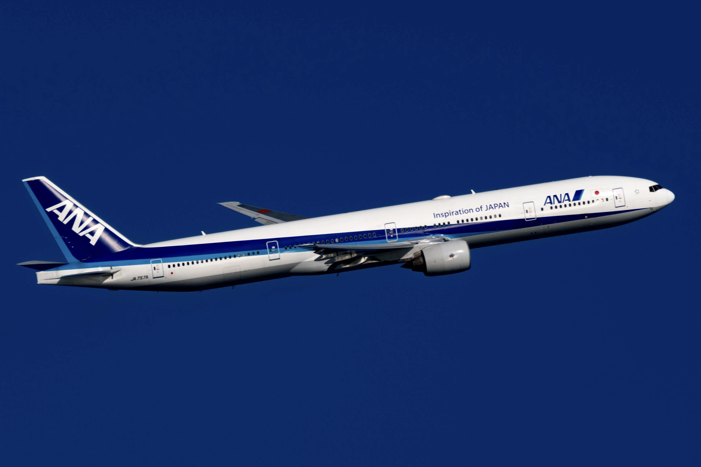
</figure>

## Get started, and stay tuned.

You can [try AwardFares for free](https://awardfares.com/). We are rolling out new features and improvements regularly, so sign up for our newsletter to stay on top of the latest news, announcements, and pro tips!

## Read more

Make sure to also check these posts out

- [10 Tips For Booking An Award Trip In 2023](https://blog.awardfares.com/award-trip-tips/)
- [Demystifying Award Charts: All You Need To Know (2023)](https://blog.awardfares.com/demystifying-award-charts/)
- [Award Flights On The A380: Airlines and Routes](https://blog.awardfares.com/a380-award-flights/)
- [ANA Resumes Route Tokyo To Perth](https://blog.awardfares.com/ana-resumes-tokyo-perth/)
