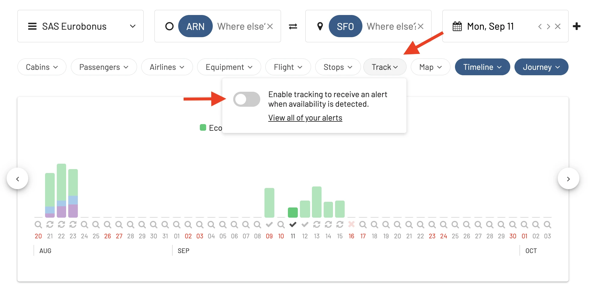

AwardFares is the easiest way to search and find your next free flight using points or miles. In just a few clicks and with a modern user interface, you can search award availability across multiple frequent flyer programs, setup alerts, lookup seat maps and flight schedules.

In a similar way, [Point.me](https://www.point.me/) is a travel hacking tool that helps you find the best ways to use your points and miles, and has been growing in popularity. While both platforms have their merits, there are specific differences that are worth mentioning. 

In this guide, we delve into the 5 key differences between AwardFares and Point.me.

### In this post

- [What is Point.me?](#point-me)
- [AwardFares vs. Point.me: Key Differences](#differences)
	- [Simplified User Interface](#one)
	- [Top-Notch Alert System](#two)
	- [Simple Pricing](#three)
	- [Free Trials And Better Insights](#four)
	- [Journey Planner](#five)
- [Conclusion](#conclusion)

## What is Point.me? {#point-me}

[Point.me](https://www.point.me/) is an online search tool designed to assist users in finding the best use for their travel reward points or miles. It aims to simplify the process of award travel booking by showing users how they can leverage their points across various frequent flyer programs. Point.me also offers a forum and a concierge service that can help book award flights and hotels.

The New York-based startup was founded in 2019 by their CEO Adam Morvitz and president Tiffany Funk. In September 2023, [Point.me has raised $10 million in Series A funding](https://techcrunch.com/2023/09/05/real-time-flight-rewards-search-engine-point-me-raises-10m/) led by Thayer Ventures.

## AwardFares vs. Point.me: Key Differences {#differences}

### 1. Simplified User Interface {#one}

AwardFares is all about simplicity. The platform has been designed with a user-first approach, prioritizing a clean and intuitive interface. For users who want quick answers without wading through unnecessary details, AwardFares provides a straightforward experience. Color-coded charts and clear graphics ensure that even beginners in the miles game can understand at a glance.

In addition, AwardFares has been meant for mobile from day one. It doesn’t compromise the intuitive searches nor the beautiful user interface when going mobile, and you can even [install on your phone](https://blog.awardfares.com/awardfares-mobile-app/).

<figure>

</figure>

### 2. Top-Notch Alert System {#two}

When you're planning for that dream trip and need to catch the best award seat once it becomes available, AwardFares doesn’t disappoint. Their alert system is robust, allowing users to set up specific notifications for routes, ensuring they never miss an opportunity. The immediacy and accuracy of these alerts give AwardFares users a definite advantage.

> Read our [complete Alerts tutorial here](https://blog.awardfares.com/alerts/).

### 3. Simple Pricing {#three}

AwardFares’ subscription-based model means users know exactly what they’re getting into. The free version offers a taste of the platform’s capabilities, while the premium versions unlock more features. This clear, tiered system allows travelers to choose exactly what they need without surprises.

AwardFares Pricing Tiers:

1. **Basic** (free): award calendar, award map, journey planner, hourly availability on award seats, and award release dates tool.
2. **Gold** (USD 9.99): award search, award calendar, award map, journey planner, hourly availability on award seats, 5 seat alerts, 100 custom searches per day, max 7 searches at once, award availability count, search with stops, per-program availability, cabin annotations, seat maps, award release dates, and flight schedules tool.
3. **Diamond** (USD 19.99): award search, award calendar, award map, journey planner, **real-time availability** on award seats, **unlimited seat alerts**, **unlimited custom searches per day**, max 30 searches at once, award availability count, search with stops, per-program availability, cabin annotations, seat maps, award release dates, and flight schedules tool.

### 4. Free Trials And Better Insights {#four}

Yes! You can try any AwardFares package for 24 hours before commiting, to get a taste of the extra features.

In additionm, beyond just notifying about available seats, AwardFares goes the extra mile (pun intended) by offering users insights and trends in the world of award travel. Whether it's peak seasons to avoid or sweet spots in miles redemption, AwardFares ensures its users are equipped with knowledge to make strategic decisions. This focus on not just providing data, but actionable insights, sets the platform apart.

### 5. Journey Planner {#five}

One of the most amazing features is the Journey Planner. This powerful feature lets you unlock itineraries to your dream destination, by planning multiple segments in a quick and convenient way. In just a few clicks, users can select add or remove legs, find connections within 24 hours, duplicate journeys, and see the itinerary on a map.k

> Read our [complete Journey Planner tutorial here](https://blog.awardfares.com/journey-planner/).

### 6. Blog and Free Resources {#six}

At AwardFares, we spent significant time crafting state-of-the-art guides and updated resources with what our users are looking for. The best flight redemptions, per-program sweet spots, tips to build perfect award trips, and feature deep-dives are available on our amazing blog and monthly newsletter.

## Conclusion

Both AwardFares and Point.me offer travelers the tools to unlock the best of award travel. However, for those who prioritize a direct user interface, consistent alliance data, a top-notch alert system, clear pricing, and valuable travel insights, AwardFares is a cut above the rest. Whether you're a seasoned miles collector or just starting out, it's always good to have AwardFares in your toolkit. Happy journeying!

## Get started

You can try searching for award flights on Singapore Airlines [using AwardFares for free](https://awardfares.com/). We are rolling out new features and improvements regularly, so sign up for our newsletter to stay on top of the latest news, announcements, and pro tips!

## Read more

Make sure to also check these posts out

- [AwardFares vs. ExpertFlyer](https://blog.awardfares.com/awardfares-vs-expertflyer/)
- [AwardFares vs. Cowtool](https://blog.awardfares.com/awardfares-vs-cowtool/)
- [Demystifying Award Charts: All You Need To Know (2023)](https://blog.awardfares.com/demystifying-award-charts/)
