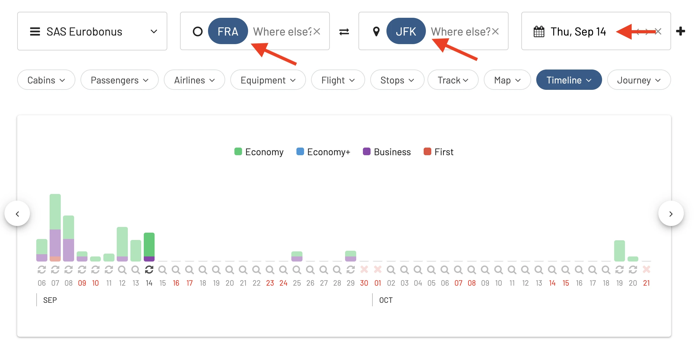
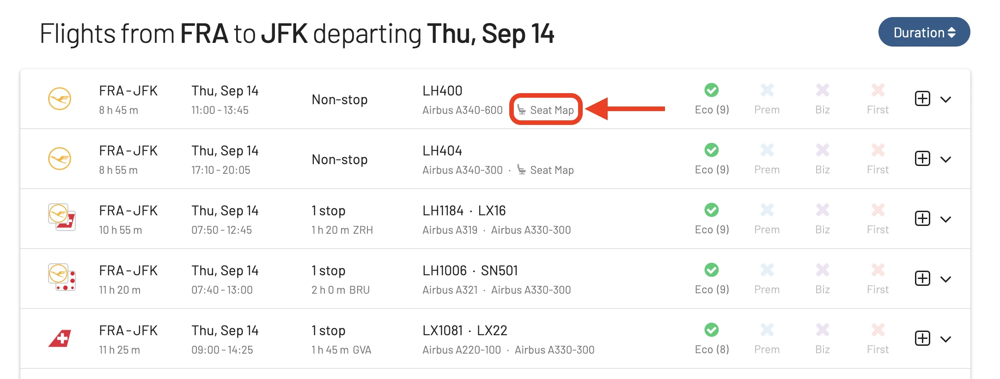
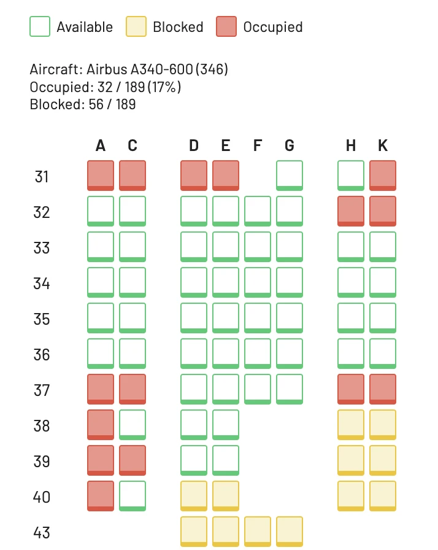
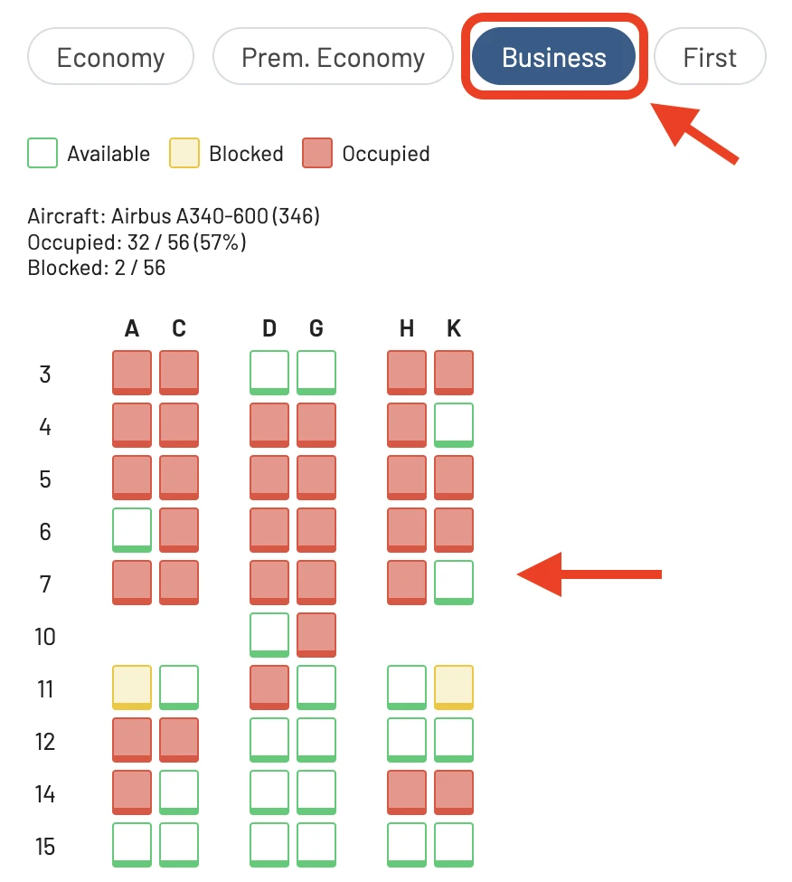
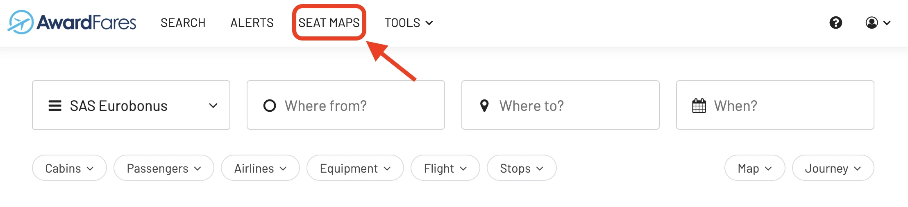
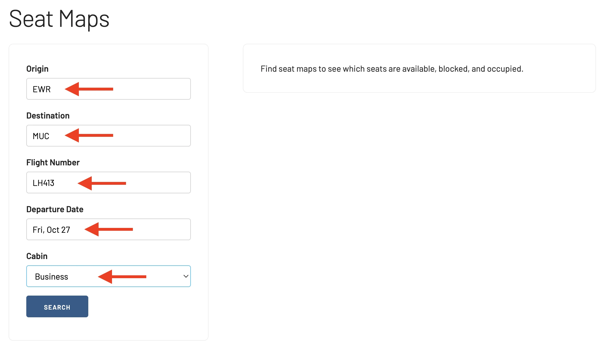
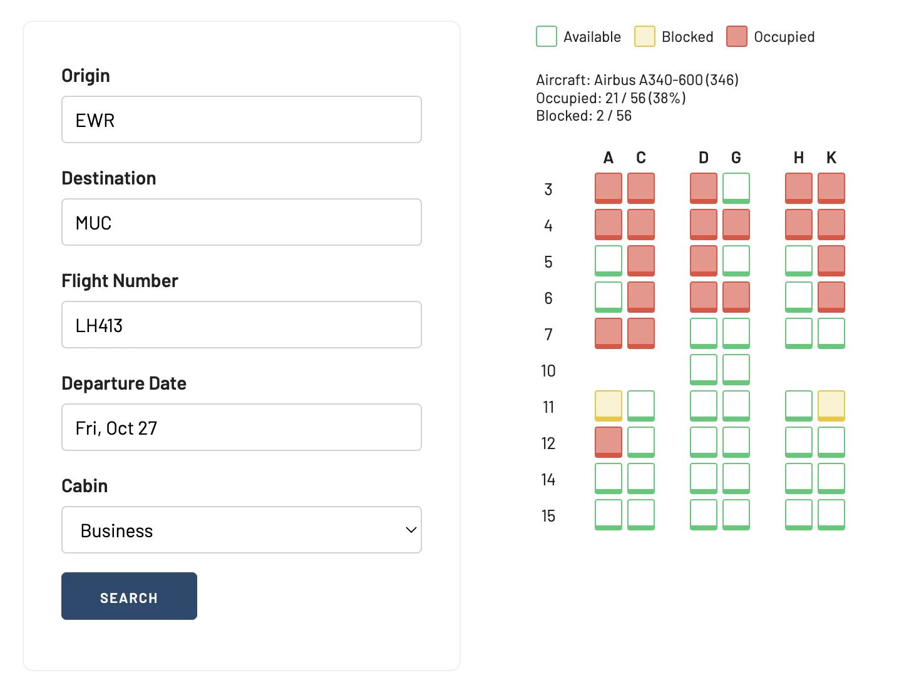
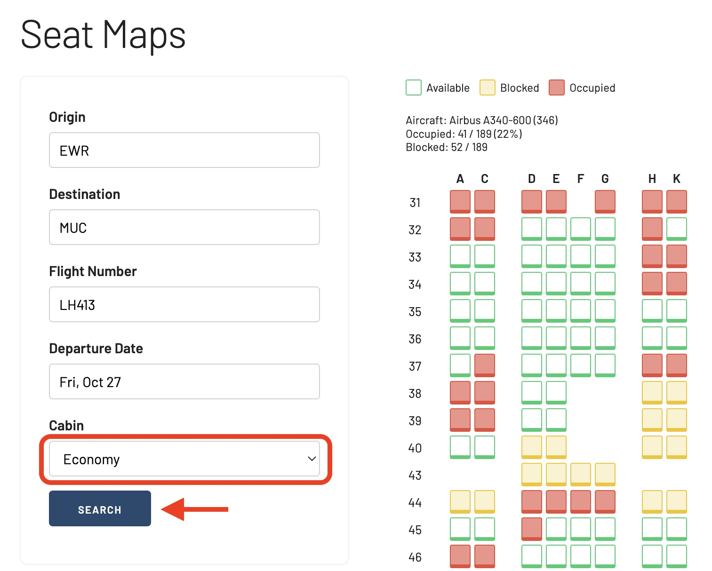

For frequent travelers and point maximizers, AwardFares has consolidated as one of the most reliable and feature-rich tools to search for award availability. However, our **Seat Maps** feature is an often-overlooked gem. 

Checking the available seats before you actually book any flight can be a night and day difference, from a pleasant journey to a never-ending hell. In this tutorial, we show you how to get the most out of this feature so you can score the perfect seat on your next award trip. Let's get started!

## What is the Seat Maps feature?

Seat Maps is essentially an interactive representation of the seating configuration of the flight you're considering. It not only displays the available seats but also gives a vivid picture of seat types (e.g. Economy, Business, First Class), their layout, and, in many cases, amenities associated with specific seats (like power outlets, entertainment systems, and more).

By getting a glimpse of the seating arrangement beforehand, you can make informed decisions about where they'd like to sit. This is particularly crucial for long-haul flights where seat comfort and location can make or break the journey.

## Check the seats BEFORE booking a flight

The seat you choose can be the difference between heaven and hell. Smell from the lavatories? Poor storage? Too noisy? Compromised recline? Those are just some of the things that can go wrong when overlooking the seat map before booking.

Here are some of the main reasons why you might want to check the seat map before finalizing their flight booking:

**Personal Comfort**: Not all seats on a plane are created equal. Some seats might offer more legroom, while others may be narrower or located near high-traffic areas like restrooms. By looking at the seat map, you can choose a seat that might be more comfortable for you.

**Avoiding Undesirable Seats**: Some seats might not recline if they're located in front of an exit row or behind a bulkhead. Seats adjacent to galleys or lavatories might be noisier or have more passenger traffic. Especially on long flights, many people find middle seats less desirable. Checking the seat map can help you avoid being stuck between two other passengers.

**Seat Configuration**: Depending on the aircraft type, the configuration of seats can differ. For example, in Business or First Class, certain configurations might offer more privacy than others. The seat map can give you a sense of the layout.

**Traveling with Companions**: Traveling with family or friends? Seat Maps lets you choose seats together or strategically place yourselves across the cabin based on preferences.

**Window vs. Aisle Preference**: Some people have a strong preference for window or aisle seats. A seat map allows travelers to pick their preferred spot.

**Accessibility Needs, Health and Mobility Concerns**: For passengers with special needs, pre-viewing the seating arrangement helps in picking a suitable spot, be it near the restroom or with extra legroom.

**Storage Overhead**: If you're carrying hand luggage, seats towards the front might have more overhead storage space available, especially on full flights where the bins fill up quickly.

**Equipment Changes**: Sometimes airlines change the type of aircraft for a specific route. If you've pre-selected a seat, an equipment change can affect your seat assignment. Regularly checking the seat map can help you stay ahead of such changes.

## Why is the airline not showing the seats?

Sometimes, depending on the airline, website, region or booking portal, the seat map might not be available through the official channels. That's why AwardFares gives you a competitive edge by always showing the realtime availability of the entire aircraft, regardless of what happens on the Airline's website.

There are several reasons why some airlines might not show the seat map before you purchase a flight:

* **Revenue Strategy**: Some airlines use a strategy where they charge passengers for seat selection. By not showing the seat map upfront, passengers might feel compelled to pay extra to choose a specific seat after booking, especially if they're concerned about getting a less-desirable seat.
* **Dynamic Seating**: Airlines sometimes adjust seating configurations based on the specific demands of a flight or to accommodate special needs. By not showing a seat map upfront, the airline retains flexibility in making these adjustments without passenger expectations being set by a specific seat map.
* **Simplifying the Booking Process**: To streamline the booking process and make it faster, some airlines might opt to display only the essential information to the passenger during the initial stages. Seat selection can then be handled in a subsequent step or after the booking is complete.
* **Avoid Overwhelming Customers**: Especially for large planes, seat maps can look complex and might confuse or overwhelm some passengers. To avoid decision paralysis, airlines might push the seat selection to a later stage in the booking process.
* **Encourage Upgrades**: By not showing the seat map, airlines might hope that passengers will opt to purchase upgrades (like business class or premium economy) without being influenced by the perceived availability or quality of economy seats.
* **Technical or Integration Issues**: Some airlines, especially when dealing with older booking systems or third-party platforms, might face technical challenges in displaying real-time seat maps during the booking process.

## How to access the Seat Map in AwardFares

There are two ways to trigger the Seat Map view while you are using AwardFares.

### From the Search View

#### 1. Perform a search.

Log-in to your AwardFares account, and [perform an award flight](https://awardfares.com/search) search by entering your favorite **Frequent Flyer Program(s)**, **Origin** and **Destination** airports, **Date**, and optional filters.

<figure>

</figure>

#### 2. Select a flight and tap on **Seap Map**.

From the results list below, choose a flight and right below the flight number (center of the list), you will see a **Seat Map** icon. By tapping on it, it will open a new popup window and display the seat map for that exact flight and date, with realtime results. 

<figure>

</figure>

#### 3. Explore the Seat Map

In the popup window, you will see the aircraft seat map with different icons and color coding. The options are:

* Available (Green/Empty)
* Occupied (Red/Filled)
* Blocked (Yellow/Filled): these are seats that the airline might have blocked for operational reasons. Might be released close to the departure date.

On the top, you will also see summarized data such as the aircraft type and some statistics.

<figure>

</figure>

Remember that the seat availability changes regularly, so make sure to redo the search regularly.

**Change cabin**. You can use the buttons on the top of the popup window to switch between cabin classes (Economy, Business, First) and display

<figure>

</figure>

### From the Tool Menu

Another way to access the Seat Map tool is using the standalone tool page. This landing page is useful when you already know your flight information (for example, you are trying to book on the airline's website).
 
#### 1. On the top bar, tap on **Seat Maps**

<figure>

</figure>

#### 2. Fill in your flight information.

Enter the following information:

* **Origin** and **Destination**. These neeed to be airport codes (three letters), not cities or metro areas. For example, JFK, EWR, SFO, ARN, etc.
* **Flight Number**
* **Departure Date**
* **Cabin Type**

Once you are ready, hit *Search*.

<figure>

</figure>

#### 3. Explore the Seat Map (on the right)

On the right hand side of the screen, the seat map will show up, for the cabin class you selected earlier.

<figure>

</figure>

You can also easily change the cabin class you selected earlier by using the **Cabin** field and hitting *Search* again.

<figure>

</figure>

## Upgrade for more

The Seat Map feature is included in our [**Gold**](https://awardfares.com/pricing) and [**Diamond**](https://awardfares.com/pricing) packages. You can [try them for free for 24 hours](https://awardfares.com/). 

## Read more

We are rolling out new features and improvements regularly, so sign up for our newsletter to stay on top of the latest news, announcements, and pro tips. Also make sure to also check out these posts:

- [Journey Planner: Building Perfect Award Trips To Difficult Destinations](https://blog.awardfares.com/journey-planner/)
- [Alerts: How To Score Amazing Award Flights](https://blog.awardfares.com/alerts/)
- [Flight Schedules Tool: Timetables and Availability by Booking Class Code](https://blog.awardfares.com/flight-schedules/)
- [10 Tips For Booking An Award Trip In 2023](https://blog.awardfares.com/award-trip-tips/)