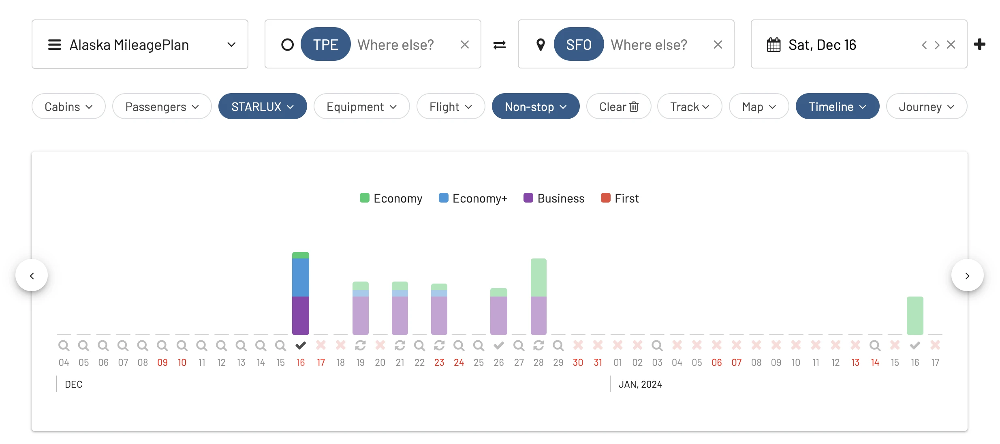
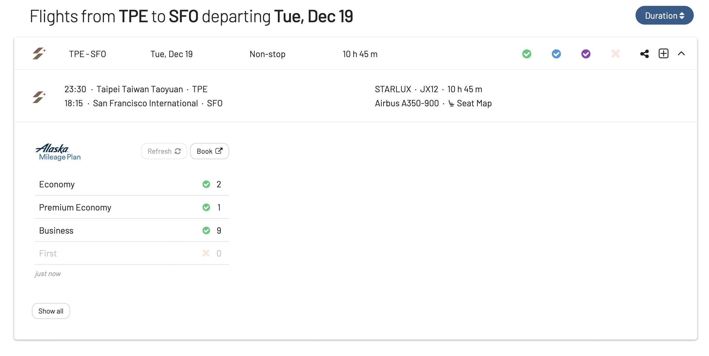

STARLUX Airlinesis, the rising Taiwanese career, is moving full-speed-ahed with their ambitious plans to strengthen its foothold in the U.S. market. After launching extremly successfus flights from [Taipei to Los Angele](https://awardfares.com/search?TPE.LAX.;a:JX;x:0;z:alaska)s earlier this year, today the airline announced they are expanding to San Francisco. 

Starting from December 16th, STARLUX will operate flights from [Taiwan Taoyuan International Airport to San Francisco International Airport (TPE-SFO)](https://awardfares.com/search?TPE.SFO.;a:JX;x:0;z:alaska). While these flights will initially operate three times a week using their state-of-the-art Airbus A350-900 aircraft, the frequency is set to increase, with daily flights expected by March 2024.

The airline's CEO, Glenn Chai, highlighted the strategic significance of this move. San Francisco, with its proximity to Silicon Valley and its role as a major hub in politics, economy, and tourism, presents an attractive destination for travelers. Moreover, given that a significant portion of San Francisco's population is of Asian descent, Starlux sees a golden opportunity to cater to a diverse range of travel needs, from family visits to business trips.

But STARLUX plans to the United States don't stop there. The airline has already hinted at further expansion plans, with Seattle being touted as its next American destination for 2024. This upcoming route aligns well with the [partnership with Alaska Airlines that we've covered before](https://blog.awardfares.com/alaska-mileageplan-updates-june-2023).

It's clear that Starlux Airlines is keen on establishing a strong presence in the United States, and with its top-notch service, the future looks exciting for frequent travelers that are keen on trying these routes and cabins.

Alaska Mileage Plan miles are one of the best ways to book STARLUX award flights, being also one of the most lucrative redemptions.

## TPE-SFO: Seats Already Available

AwardFares is one of the easiest ways to search for Alaska Mileage Plan award flights on STARLUX.

As you can see below, the new route to San Francisco is already bookable through Alaska Airlines' website. As of today, there's availability during December in all classes.

<figure>

</figure>

<figure>

</figure>

## How To Search STARLUX Award Flights Using Alaska Mileage Plan

If you are curious on how to make the most out of your Alaska Mileage Plan miles, and how to find available seats on STARLUX flights, make sure to check out our [full step-by-step guide here](https://blog.awardfares.com/alaska-mileageplan-starlux).

<figure>

</figure>

## Upgrade for more features

With our [premium features on Gold and Diamond](https://awardfares.com/pricing), you can also set up alerts to get notified when a certain route or flight gets opened, as well as check seat maps, flight schedules, and more.

You can [try AwardFares for free](https://awardfares.com/). We are rolling out new features and improvements regularly, so sign up for our newsletter to stay on top of the latest news, announcements, and pro tips!

## Read more

Make sure to also check these posts out

- [Demystifying Award Charts: All You Need To Know](https://blog.awardfares.com/demystifying-award-charts/)
- [10 Tips For Booking An Award Trip In 2023](https://blog.awardfares.com/award-trip-tips/)
- [AwardFares vs. ExpertFlyer](https://blog.awardfares.com/awardfares-vs-expertflyer/)