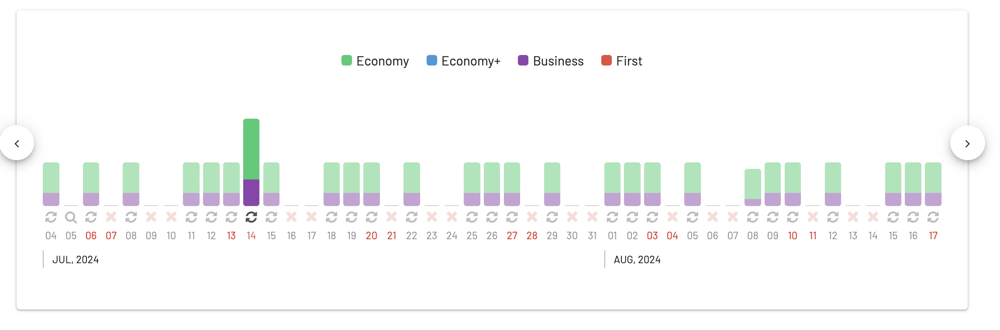
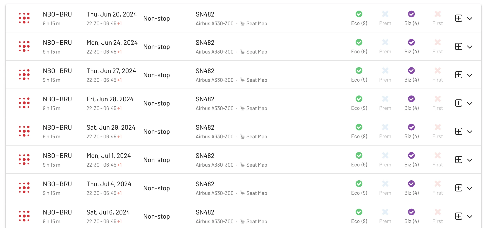

From June 2024, Brussels Airlines has scheduled a new service between Brussels and Nairobi, pushing their destinations in sub-Saharan Africa to a total of 18. This isn't their first venture into the Kenyan capital; they previously operated there from 2002 to 2015. The service will feature a technical stopover in Kigali, thus bumping up the airline's Rwanda service to daily flights.

This announcement from Brussels Airlines comes along their plans to expand its long-haul fleet, adding an additional Airbus A330. As part of their 2024 summer season preparations, the airline is extending its operations in sub-Saharan Africa, its most significant market. Brussels (BRU) stands out as the primary hub for the Lufthansa Group's African ventures. 

For the warmer months, the Brussels-Nairobi route is set to operate six times weekly, scaling back to four times weekly during the winter. 

The great news is that these flights are already bookable! There are available seats using SAS EuroBonus, Aeroplan and United MileagePlus.

## Brussels Airlines New Route To Nairobi, Kenya in 2024

### Summer schedule BRU-NBO

| Route                            | Flight No. | Departure Time | Arrival Time | Days of Operation                             |
|----------------------------------|------------|----------------|--------------|-----------------------------------------------|
| Brussels – Nairobi (via Kigali)   | [SN 491](https://awardfares.com/search?..;f:sn491)     | BRU 10:20      | NBO 22:30    | Wednesday and Sunday                          |
| Nairobi – Brussels               | [SN 491](https://awardfares.com/search?..;f:sn491)     | NBO 23:40      | BRU 07:56    | Wednesday and Sunday                          |
| Brussels – Nairobi               | [SN 481](https://awardfares.com/search?..;f:sn481)     | BRU 10:20      | NBO 19:35    | Monday, Tuesday, Friday and Saturday          |
| Nairobi – Brussels               | [SN 482](https://awardfares.com/search?..;f:sn482)     | NBO 22:30      | BRU 06:45+1  | Monday, Tuesday, Friday and Saturday          |

### Winter schedule BRU-NBO

| Route                        | Flight No. | Departure Time | Arrival Time | Days of Operation       |
|------------------------------|------------|----------------|--------------|-------------------------|
| Brussels – Nairobi (via Kigali) | [SN 491](https://awardfares.com/search?..;f:sn491)     | BRU 09:45      | NBO 22:50    | Wednesday and Sunday    |
| Nairobi – Brussels             | [SN 491](https://awardfares.com/search?..;f:sn491)     | NBO 23:40      | BRU 07:56    | Wednesday and Sunday    |
| Brussels – Nairobi             | [SN 481](https://awardfares.com/search?..;f:sn481)     | BRU 10:20      | NBO 19:35    | Monday and Friday       |
| Nairobi – Brussels             | [SN 482](https://awardfares.com/search?..;f:sn482)     | NBO 22:30      | BRU 06:45+1  | Monday and Friday       |

## Book It Right Now: Find Seats Using AwardFares

AwardFares can show you available seats on Brussels Airlines across multiple frequent flyer programs in a matter of seconds.

As of today, there are plenty of seats available starting June 20th, 2024, using either SAS EuroBonus points, Aeroplan miles or United MileagePlus miles.

## 5 Reasons To Book An Award Trip With Brussels Airlines

Redeeming points or miles on Brussels Airlines can be a quite unique experience when compared to other carriers. Here are our favorite reasons:

### 1. Competitive Redemption Rates

Historically, Brussels Airlines has offered competitive redemption rates for their award flights, especially when factored against the actual cash prices of their tickets. This often means that travelers get more value per mile or point when choosing Brussels over other airlines.

### 2. Excellent Availability

One common gripe among frequent flyers is the limited seat availability for award travel on some airlines. Brussels Airlines tends to have better availability, especially in Business Class, making it easier for travelers to redeem their points on desired dates.

### 3. Quality Service and Experience

While many travelers focus solely on the monetary value of their points, the quality of the travel experience is just as important. Brussels Airlines is known for its exceptional service, especially in its Business and Premium Economy classes. Redeeming points for a higher class on Brussels Airlines can offer an enhanced travel experience that might be cost-prohibitive on other carriers.

### 4. Special Routes

Brussels Airlines offers specific routes, especially to destinations within Africa, that are not as well-served by other major carriers. For travelers looking to reach these destinations using points, Brussels Airlines might be one of the few viable options.

### 5. Strategic Geographical Position

Brussels Airlines operates out of Brussels, the capital of Belgium, which serves as a crucial European hub. The city's central location means it's a strategic transit point for those traveling between North America, Europe, and Africa. When redeeming miles for flights that connect across these continents, Brussels Airlines can often provide the most efficient routes, minimizing layovers and reducing overall travel time.

## Brussels Airlines New Long-haul Cabins

Brussels Airlines was one of the first ones to introduce new long-haul cabins, back in April 2012. They still stand as a very solid option. The new cabin features a completely redesigned Business Class, Premium Economy Class, and Economy Class.

**Business Class** is the most luxurious cabin class and offers the highest level of comfort and service. Passengers in Business Class have a seat pitch of 48 inches and a width of 21 inches. They also receive two pieces of carry-on luggage and three pieces of checked luggage, as well as a private lounge, priority boarding, and a dedicated check-in counter.

**Premium Economy** offers more comfort and space than Economy Class. Passengers in Premium Economy Class have a seat pitch of 38 inches and a width of 19 inches. They also receive two pieces of carry-on luggage and two pieces of checked luggage, as well as an upgraded meal service and access to the Belgian bar.

**Economy Class** is the most basic cabin class and offers the lowest fares. Passengers in Economy Class typically have a seat pitch of 31-32 inches and a width of 17-18 inches. They also receive one piece of carry-on luggage and two pieces of checked luggage.

## Upgrade for more features

With our [premium features on Gold and Diamond](https://awardfares.com/pricing), you can also set up alerts to get notified when seats become available, as well as check seat maps, flight schedules, and more.

You can [try AwardFares for free](https://awardfares.com/). We are rolling out new features and improvements regularly, so sign up for our newsletter to stay on top of the latest news, announcements, and pro tips!

## Read more

Make sure to also check these posts out

- [Demystifying Award Charts: All You Need To Know](https://blog.awardfares.com/demystifying-award-charts/)
- [10 Tips For Booking An Award Trip In 2023](https://blog.awardfares.com/award-trip-tips/)
