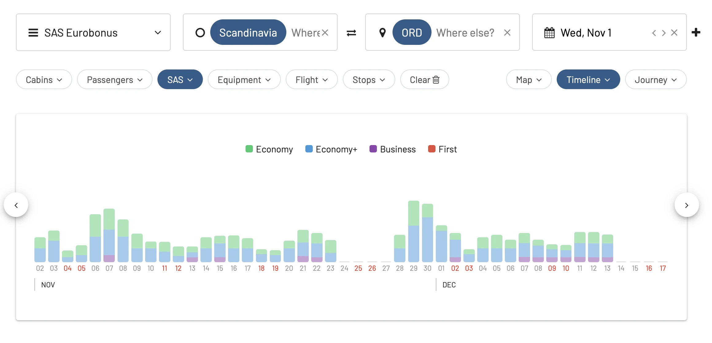

Great news for EuroBonus lovers! The program just launched a new campaign with a 30% points discount on SAS Go Bonus trips (Economy class) from Scandinavia to destinations across North America and Asia.

The offer applies to both one-way and return journeys in SAS Go Bonus. Children 2-11 years old get 50% of the point price, even on the already discounted price.

There are many seats available, as we show below using AwardFares.

**Promotion details:**

* Discount: 30% in SAS Go Bonus
* Book by 25 September 2023
* Travel period: 1 November – 15 December 2023
* From/to: Scandinavia
* To/from: Chicago, Washington, Boston, Shanghai, Tokyo

## SAS EuroBonus Award Flights With 30% Discount 

## 1. [Chicago](https://awardfares.com/search?zone:Scandinavia.ORD.2023-11-01;a:SK;o:duration;so:asc;z:sas#)

## 2. [Washington](https://awardfares.com/search?zone:Scandinavia.IAD.2023-11-01;a:SK;o:duration;so:asc;z:sas#)

## 3. [Boston](https://awardfares.com/search?zone:Scandinavia.BOS.2023-11-01;a:SK;o:duration;so:asc;z:sas#)

## 4. [Shanghai](https://awardfares.com/search?zone:Scandinavia.PVG.2023-11-01;a:SK;o:duration;so:asc;z:sas#)

## 5. [Tokyo](https://awardfares.com/search?zone:Scandinavia.TYO.2023-11-01;a:SK;o:duration;so:asc;z:sas#)

## How to search for SAS EuroBonus Awards with AwardFares?

1. Go to [AwardFares](https://awardfares.com/signup).
2. Under Frequent Flyer Program, choose **SAS EuroBonus only**.
3. Tap on Airline and select **SAS only**.
4. Enter your departure area or city (e.g. **Scandinavia**).
5. Enter your destination airport (e.g. **Tokyo**).
6. Choose a date, or use the Timeline view to explore flights for different dates.

That's it! You will see the full result list on the list below

## Upgrade for more features

With our [premium features on Gold and Diamond](https://awardfares.com/pricing), you can also set up alerts to get notified when seats become available, as well as check seat maps, flight schedules, and more.

You can [try AwardFares for free](https://awardfares.com/). We are rolling out new features and improvements regularly, so sign up for our newsletter to stay on top of the latest news, announcements, and pro tips!

## Terms and Conditions

> * The price is set according to place of departure and destination, regardless of the chosen route (direct or with a stopover).
> * The offer applies one-way or return.
> * You must be logged in to see the points discount.
> * Taxes and service charges are added per person and may vary depending on destination and route. The exact amount will be shown when you book. Taxes and fees cannot be paid with points.
> * The points discount is only available for SAS Bonus tickets. It is not available when you mix points and cash, and for regular tickets for points.
> * When mixing a SAS Bonus ticket with a regular ticket for points in a single booking, only the Bonus ticket receives the discount.
> * Both the outbound and inbound journeys must begin during the stated travel period.
> * Children receive a 50% discount on the offer unless otherwise stated.
> * Infants travel free if you book a seat for your infant - 50% discount.
> * Offer start and end times are always midnight to midnight CET, unless otherwise stated.
> * The number of seats for bonus journeys is always limited.
> * Bookings cannot be changed once the booking period for the campaign has ended, but then normal bonus prices apply.
> * The traveler must pay all applicable fees, e.g. airport tax.
> * Cannot be combined with other discounts/offers for bonus travel.
> * The general membership conditions for EuroBonus apply.

## Read more

Make sure to also check these posts out

- [SAS EuroBonus Analysis and Forecast (Free Tool)](https://blog.awardfares.com/eurobonus-analysis-and-forecast/)
- [Essential Guide To Book Lufthansa Flights With SAS EuroBonus Points](https://blog.awardfares.com/lufthansa-with-eurobonus-guide/)
- [5 New SAS Routes You Can Book Using EuroBonus Points](https://blog.awardfares.com/eurobonus-july-2023/)
