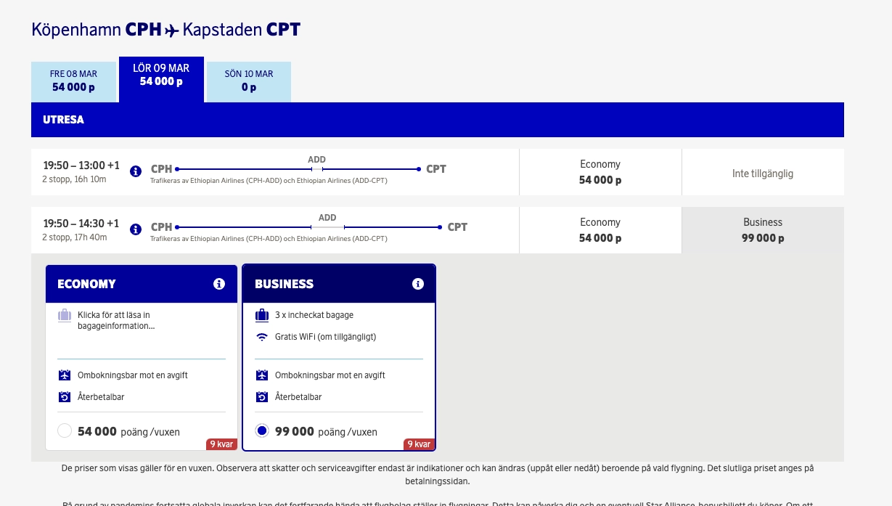

As a Star Alliance member and partner airline, it is possibe to book flights on Ethiopina Airlines using SAS EuroBonus points.

However, occasionally, SAS will show what we call *ghost availability*, which means that those seats aren't actually available for booking!

<figure>

</figure>

## The Problem

1. You search for a given route on SAS' Website using the Star Alliance Award Search
2. Results come back and they show show 9 seats available in Business Class. Great!
3. You go ahead, select the flight and continue all the steps to book them. Almost there.
4. Once your passenger details are filled in, you hit *Next* to proceed to the payment screen, and the website fails.
5. **Oh no!** You start again later, refreshing the search, but all the available seats disappeared.

After our thorough investigation, it seems that any Ethiopian Airlines results that show more than 2 business seats are ghost!

## Our Solution

To make results more accurate, our implemented solution will detect and filter out those *ghost seats*. When you use AwardFares, you can make sure that all the available flights you see in the result list are actually bookable :)

**Also, just note that** if you use other tools or award flight search engines, you'll see a missmatch between what AwardFares and those tools report. That's mainly because most other solutions are not filtering out ghost availability.

## Get started, and stay tuned.

You can [try AwardFares for free](https://awardfares.com/) to search for your next SAS EuroBonus award.

We are rolling out new features and improvements regularly, so sign up for our newsletter to stay on top of the latest news, announcements, and pro tips!

## Read more

Make sure to also check these posts out

- [10 Tips To Get The Most Out Of Your SAS EuroBonus Points](https://blog.awardfares.com/eurobonus-tips-2023/)
- [SAS EuroBonus Analysis and Forecast (Free Tool)](https://blog.awardfares.com/eurobonus-analysis-and-forecast/)
- [Essential Guide To Book Lufthansa Flights With SAS EuroBonus Points](https://blog.awardfares.com/lufthansa-with-eurobonus-guide/)