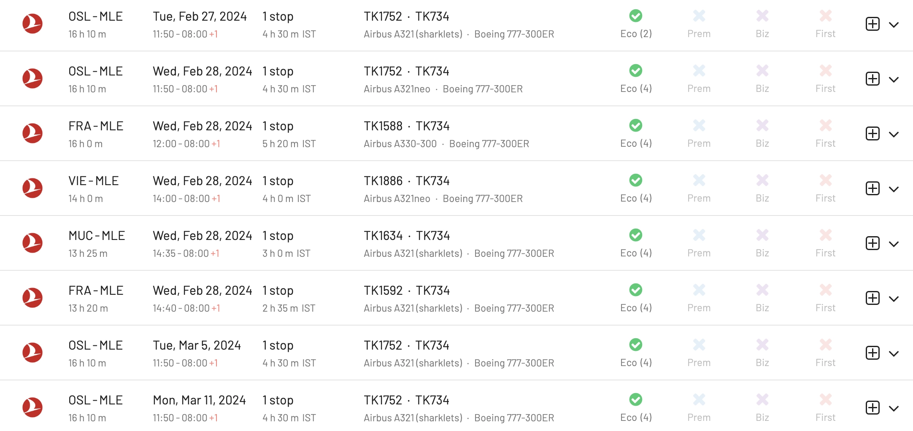
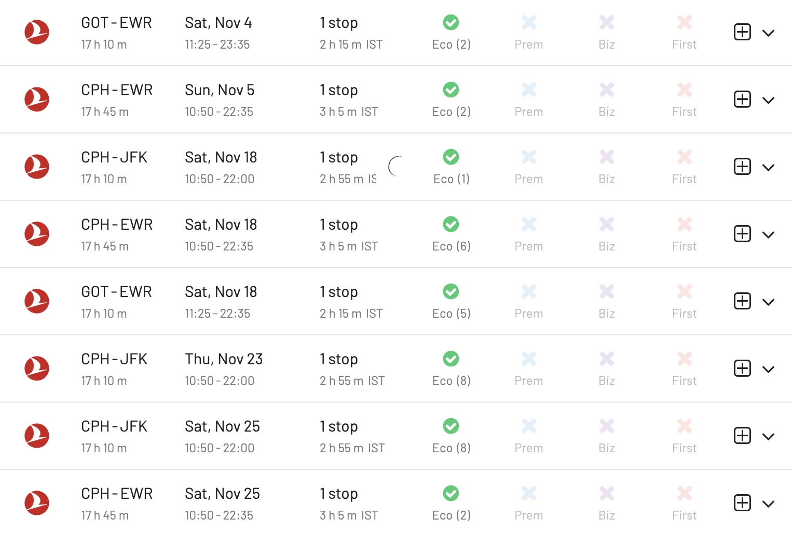
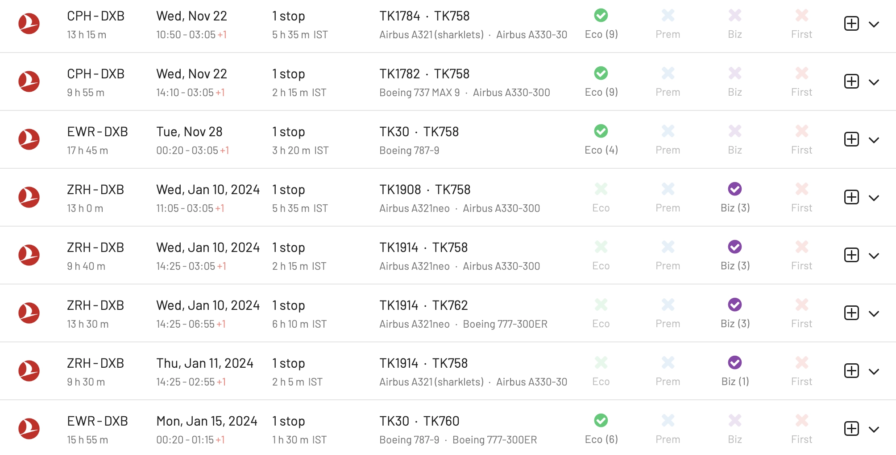
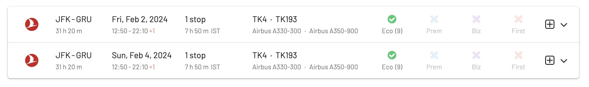
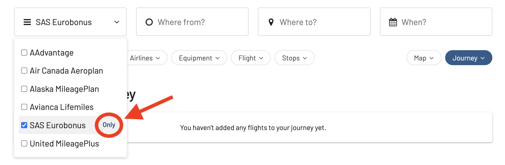
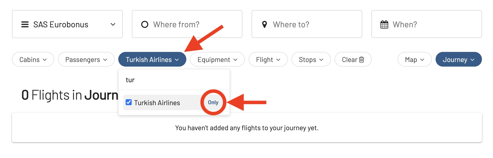
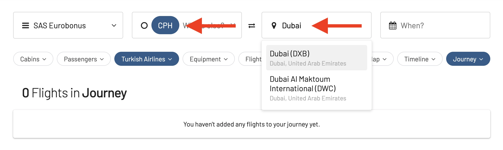
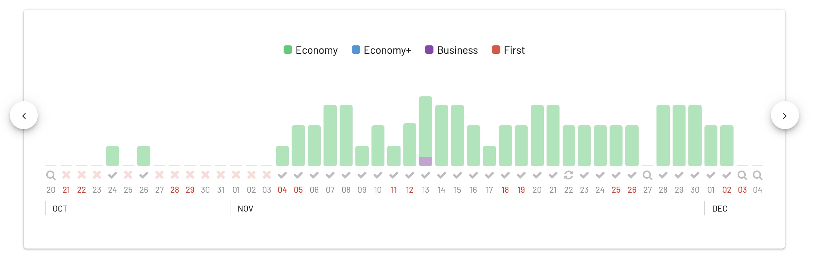
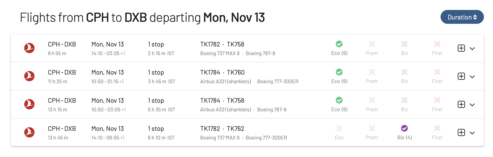

Turkish Airlines, the flag carrier of Turkey and a member of the Star Alliance network, has steadily risen in the ranks to become one of the world's leading airlines, renowned for its expansive route network and impeccable service. With its main hub in Istanbul, this airline bridges the gap between the East and the West, making it a favored choice for travelers from around the globe. 

For those holding SAS EuroBonus points, the good news is that these can be golden tickets to book award flights on Turkish Airlines at great rates, offering a fantastic opportunity to experience the airline's premium service while journeying to a multitude of destinations. 

In this blog post, we'll guide you through the process of maximizing your EuroBonus points and securing your next trip with Turkish Airlines.

### In this post

- [Why Use SAS EuroBonus Points on Turkish Airlines?](#why)
- [Turkish Airlines Award Flights - Right Now!](#realtime-awards)
- [Top Destinations](#destinations)
- [How To Search Turkish Airlines Award Flights With EuroBonus Points](#how-to)
- [Fleet and Cabins](#fleet)

## Why Use SAS EuroBonus Points on Turkish Airlines? {#why}

1. **Extensive Route Network**: Turkish Airlines' extensive reach ensures that EuroBonus members have numerous exciting destinations to choose from.
2. **Quality Service**: Known for its hospitality and quality, Turkish Airlines offers a comfortable journey, regardless of the class you’re flying in.
3. **Istanbul Airport (IST)**: As Turkish Airlines' hub, IST is state-of-the-art and serves as a great connecting point for travelers. Plus, if you have a long layover, you can explore the historic and beautiful city of Istanbul.
4. **Star Alliance Membership**: Being part of Star Alliance, Turkish Airlines flights can be easily booked using EuroBonus points, which is the loyalty program for other Star Alliance members such as SAS.

## Turkish Airlines Award Flights - Right Now! {#realtime-awards}

The lists below are updated in real time and show you the available award seats for the next 30 days on Turkish Airlines, using SAS EuroBonus points.

### Turkish Airlines Business Class Seats (Top Long-haul Routes)

<table id="tk-business"></table>

### Turkish Airlines Economy Class Seats (Top Long-haul Routes)

<table id="tk-economy"></table>

## Top Turkish Airlines Destinations We Love {#destinations}

### 1. [Maldives (MLE)](https://awardfares.com/search?zone:Europe.area:MLE.;a:TK;z:sas#)

White sandy beaches, crystal clear waters, and an underwater world waiting to be explored – the Maldives is a paradise on earth. Flying Turkish Airlines from Istanbul to Maldives gives you the opportunity to experience world-class in-flight service while en route to a dream destination.

### 2. [New York (JFK/EWR)](https://awardfares.com/search?zone:Europe.area:NYC.;a:TK;z:sas#)

The iconic skyline, the arts, the food - NYC has it all. For those in Europe, this transatlantic route is a great way to make the most of your points, especially considering the long haul and the premium services offered on board.

### 3. [Dubai (DXB)](https://awardfares.com/search?zone:Europe.area:DXB.;a:TK;z:sas#)

A dazzling metropolis known for its futuristic architecture, luxury shopping, and world-class entertainment venues. Nestled along the Persian Gulf's coastline, this city boasts iconic landmarks like the Burj Khalifa, palm-shaped islands, and vast desert landscapes. Marrying tradition with innovation, Dubai offers visitors a unique blend of cultural richness and visionary modernity.

### 4. [São Paulo (GRU)](https://awardfares.com/search?zone:Europe.area:GRU.;a:TK;z:sas#)

The sprawling financial hub and largest city in South America, pulsating with cultural diversity, towering skyscrapers, and vibrant urban energy. Renowned for its rich arts scene, delectable cuisine, and dynamic nightlife, the city offers a unique blend of modern sophistication and rich historical heritage. Often dubbed the "New York of South America," São Paulo is a melting pot of cultures, making it a captivating destination for travelers from around the world.

### 5. [Tokyo (HND/NRT)](https://awardfares.com/search?zone:Europe.area:TYO.;a:TK;z:sas#)

Japan, a blend of ancient tradition and cutting-edge modernity, is always worth a visit. Turkish Airlines offers a direct route, making it convenient for EuroBonus members to spend their points on a trip to the Land of the Rising Sun.

### 6. [Cape Town (CPT)](https://awardfares.com/search?zone:Europe.area:CPT.;a:TK;z:sas#)

Experience the beauty of South Africa, from Table Mountain to the vibrant streets of Cape Town. This route offers EuroBonus members a direct link to one of the most breathtaking destinations in Africa.

## How To Search Turkish Airlines Award Flights With EuroBonus Points {#how-to}

### 1. Go to [AwardFares](https://awardfares.com/signup)

You can use it for free without an account (limits apply). You can also create an account to save your searches and get access to more features and resources.

### 2. Select SAS EuroBonus as your Frequent Flyer Program

On AwardFares homepage, you will see a Frequent Flyer Program Picker (FFP). Tap on it and select **EuroBonus**. This will only perform searches and show you award seats available using EuroBonus points.

### 3. Under *Airline*, select *Turkish Airlines*

### 4. Set the route

If you already have your departure and destination city, you can add those under the **Where From** and **Where To** fields. Once you do so, you will be able to see a Timeline.

If you have flexibility on the routes, AwardFares is powerful as Google Flights. It lets you explore options available by performing what we call **broad searches**. You can see available flights by selecting only departure, arrival city, or regions. For example, you can explore all flights from **Europe** to the **Tokyo** by simply typing those regions.

### 5. Filter out by cabin (optional)

Using the **Cabin** filter you can select **Business Class only**. This will remove all other cabins.

### 6. Done!

Easy-peasy! AwardFares, will show you all available flights on Turkish Airlines ready to be booked with SAS EuroBonus points. Keep in mind that to book certain cabins such as Premium economy, you need to call the service center.

### Confirm availability on SAS website

You can double-check the availability on SAS website with your own account, searching for the exact same flights and dates you found using AwardFares.

## Setting Up Alerts

If you don’t see available seats on a given flight and date you are interested, don’t worry. Seat availability changes daily, as airlines release those seats on short notice. AwardFares has an alert feature that monitors the flights you want and notifies you via email once/if they become available.

* [**Check this guide on how to set up alerts.**](https://blog.awardfares.com/alerts)

## Turkish Airlines Fleet and Cabins: Watch Out! {#fleet}

Turkish Airlines has one of the largest passenger fleets in the world, with over 300 aircraft. Its fleet consists of a variety of Airbus and Boeing aircraft, including the Airbus A319, A320, A321, A330, A350, and the Boeing 737, 777, and 787.

The specific cabins and amenities offered on Turkish Airlines flights vary depending on the aircraft type, especially if you book the most premium cabins. Their best experience these days is on their A350-900.

Here is a summary of the cabins and amenities offered on some of Turkish Airlines' most popular aircraft types. Rememeber that you can use AwardFares' *Equipment* filter to only show results for a given aircraft type.

### Airbus A350-900

The Turkish Airlines A350 business class cabin is their most luxurious and spacious cabin so far, with a total of 32 seats arranged in a staggered 1-2-1 configuration. This means that every passenger has direct aisle access and plenty of personal space.

The seats themselves are extremely comfortable, with a wide range of recline positions and a fully lie-flat bed. 

* Each seat has a 17-inch personal entertainment system with a wide selection of movies, TV shows, music, and games.
* The seats are also equipped with a universal power outlet, a USB port, and a reading light.
* The privacy screens between the seats can be raised or lowered to create a more private space.
* The cabin has two lavatories, which are both equipped with shower facilities.
Passengers are provided with a welcome drink, amenity kit, and hot meal service.

### Boeing 777-300ER

* Business Class: This cabin features lie-flat seats in a 2-3-2 configuration. The seats come with individual IFE screens, ample storage space, and enhanced privacy.
* Economy Class: These seats are typically in a 3-3-3 configuration, with individual IFE screens, adjustable headrests, and standard amenities for long-haul flights.

### Boeing 787-9 Dreamliner

* Business Class: The Dreamliner features a more modern 1-2-1 configuration for its Business Class, ensuring direct aisle access for every passenger. The seats can be converted into lie-flat beds and come with large IFE screens.
* Economy Class: In a 3-3-3 configuration, the Economy Class offers individual IFE screens, USB ports, and standard long-haul amenities.

### Airbus A330 (-200 and -300)

* Business Class: Lie-flat or angled-flat seats in a 2-2-2 layout.
* Economy Class: These are in a 2-4-2 configuration and come equipped with personal IFE screens and standard amenities.

## Get started, and stay tuned.

You can [try AwardFares for free](https://awardfares.com/) to search for your next SAS EuroBonus award.

We are rolling out new features and improvements regularly, so sign up for our newsletter to stay on top of the latest news, announcements, and pro tips!

## Read more

Make sure to also check these posts out

- [10 Tips To Get The Most Out Of Your SAS EuroBonus Points](https://blog.awardfares.com/eurobonus-tips-2023/)
- [SAS EuroBonus Analysis and Forecast (Free Tool)](https://blog.awardfares.com/eurobonus-analysis-and-forecast/)
- [Essential Guide To Book Lufthansa Flights With SAS EuroBonus Points](https://blog.awardfares.com/lufthansa-with-eurobonus-guide/)

