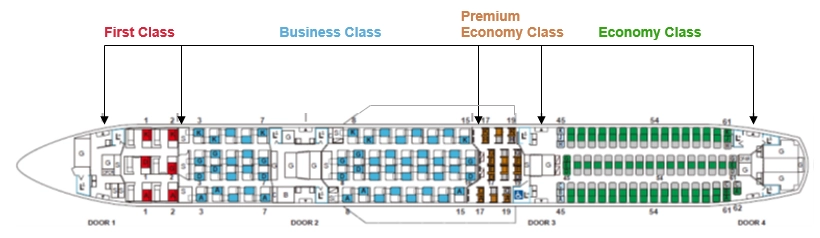

Japan Airlines (JAL) has unveiled the specifics of its latest Airbus A350-1000 aircraft and cabin design. This plane is set to be JAL's premier international service, after two decades. Passengers can look forward to unparalleled comfort inside the plane and a journey tailored to each individual. While the aircraft's initial launch on the Tokyo (Haneda) to New York (JFK) route was slated for late November 2023, supply chain setbacks have prompted a rescheduled debut expected by the end of 2023.

The good news is that time flies (pun intended), and you can already anticipate to getting a seat on these new cabins using AwardFares.

In this post, we guide you step-by-step on how to use AwardFares to search availability and redeem the best award seats on Japan Airlines, across multiple programs.

### In this post

- [How to Find Award Seats on JAL's Flagship A350-1000](#how-to)
- [Setting up alerts](#alerts)
- [The New International Flagship Airbus A350-1000](#whats-new)
- [Best Frequent Flyer Programs to Redeem Flights on JAL](#programs)
- [Read More](#read-more)

## How To Find Award Seats On JAL's Flagship A350-1000 (Step-by-step) {#how-to}

### 1. Log-in to [AwardFares](https://awardfares.com/search).

### 2. Choose your Frequent Flyer Program.

In the **Frequent Flyer Program** picker, select your favorite loyalty program. Check out [this section](#programs) for some of the best options to redeem JAL award flights.

### 3. Add JAL to the *Airlines* filter.

Tap on the Airline pill and select **Japan Airlines (JAL) only**. This will allow you to see results only for JAL.

### 4. Add the A350-1000 to the *Equipment* filter.

Tap on the Equipment pill and select **A350-1000 only**. Once applied, this filter will help you see results only on JAL's new Flagship A350-1000.

### 5. Enter the desired route

If you know the route, you can enter it using the **Origin** and **Destination** fields. For example, you could try [Tokyo Haneda (HND) to New York (JFK)](https://awardfares.com/search?HND.JFK.;a:JL;e:351;z:aadvantage,alaska#), which is the inaugural route.

### 6. Explore dates

Use the **Date** field to enter a precise day you want to fly. 

Alternatively, you can use the Timeline View to explore availability across multiple dates.

### 7. Done

That's it! The results list below will show you all the available seats that you can book right away. Remember that seat availability changes every minute, so make sure to book ASAP if you happen to be interested in a certain flight.

## Setting Up Alerts {#alerts}

Japan Airlines will start operating the Flaghip A350-1000 towards the end of 2023. Most likely, once the first schedules are confirmed, award seats will become available across multiple programs.

If you don't see available seats just yet, you can sit back and relax by letting AwardFares monitor the route for you. AwardFares has an Alert feature that, once set up, will notify you via email once seats become available.

[**Check out our guide on how to set up alerts.**](https://blog.awardfares.com/alerts)

## Japan Airlines Flagship A350-1000: What's New? {#whats-new}

The get more information and see more pictures, you can visit [JAL's special website on the Airbus A350-1000](https://www.jal.co.jp/ar/en/offers/A350-1000/).

### Entirely New Cabins

Seats across all classes have undergone a makeover, ensuring JAL's most quiet and pleasant seating experience yet. Both First and Business Classes boast roomy private settings, while Premium Economy offers a heightened sense of comfort and privacy. Meanwhile, Economy Class focuses on relaxation, offering generous seating space and legroom.

The interior of the plane seamlessly integrates Japanese artistic elegance, creating a peaceful setting that captures the essence of Japan's beauty. Moreover, this design not only offers a top-tier experience for passengers but also mirrors the consistency of JAL's acclaimed service seen in their domestic fleet, including A350-900 and 787-8 planes.

#### First Class

The new seating arrangement features just six (6) suites to create a unique and exclusive cabin environment. Seats are designed to provide even greater comfort and the addition of individual doors, for the first time by JAL, increases privacy while also creating a more open individual atmosphere with the elimination of overhead storage compartments.

Key Features:

- A choice of three seating modes: Sofa, Seat & Single Bed or Double Bed.
-  Introduction of the world's first headphone-free stereo with built-in headrest speakers, allowing customers to enjoy the inflight entertainment system without using headphones. The headrest also has a reclining function, allowing comfortable viewing of the inflight entertainment even in bed mode.
-  Stress-free environment with wardrobe and storage space for personal belongings inside the suite.

#### Business Class

Despite the increase in seat capacity to 54 from the current international flagship configuration, ample spacing has been prioritized to ensure a comfortable and individual inflight experience. Notably, in Business Class, doors have been introduced for the first time to ensure privacy, and overhead storage compartments are exclusively positioned on the window side to create an open atmosphere.

Key Features:

- Bed mode with a length of approximately 198cm
offers ample space at the foot area and comfortable sleeping experience with cushioning structures that evenly distribute body pressure. The headrest also has a reclining function, allowing comfortable viewing of the inflight entertainment while lying down.
- Electric privacy partition provides easy communication with travel companions.
- Introduction of the world's first headphone-free stereo with built-in headrest speakers, allowing customers to enjoy the inflight entertainment system without using headphones.
- Stress-free environment with wardrobe and
storage space for personal belongings inside the suite.

#### Premium Economy

In pursuit of the utmost comfort in its class, the cabin features large partitions to significantly improve privacy. It is also the first Premium Economy Class in the world to introduce electrically operated reclining functionality.

Key Features:

- Larger privacy partitions have been installed to greatly enhance each individual space.
- The electric leg rest can be adjusted horizontally, allowing you to relax in your preferred position.
- The 16-inch 4K widescreen monitor is approximately 1.3 times larger than the current model.

#### Economy Class

Having won the “Best Economy Class Airline Seat” by SKYTRAX for six consecutive terms, JAL has further enhanced the spacious legroom and improved the seating for enhanced comfort.

Key Features:

- A spacious and comfortable seating space with a wide seat pitch, inheriting the concept of the current model.
- Featuring the largest 13-inch 4K monitor in its class.

### In-flight Dining 

The airline will roll out new offerings to cater to the varying tastes and priorities of its customers. In a bid to mitigate environmental harm and tackle societal concerns, JAL is transitioning to tableware and utensils made from non-oil-based plastics. Additionally, JAL is eager to pave the way for a greener tomorrow, in concert with its patrons.

### Onboard Entertainment

The plane will showcase Panasonic Avionics Corporation (USA)'s most recent entertainment system, along with onboard Wi-Fi. Every class will be equipped with 4K screens for premium viewing, paired with Bluetooth features. Furthermore, passengers can customize a list of favorites using the JAL Mobile App, elevating their entertainment experience during the flight.

## Best Frequent Flyer Programs to Redeem Flights on JAL {#programs}

Japan Airlines (JAL) is a member of the oneworld alliance, and as such, you can redeem award flights on JAL using miles from any of the oneworld partner airlines. Additionally, JAL has partnerships with several other airlines outside of the oneworld alliance.

Here are some of what we believe are the best programs to redeem award flights on JAL:

* [**American Airlines AAdvantage**](https://blog.awardfares.com/categories/#American%20AAdvantage): As a oneworld partner, American Airlines' AAdvantage program allows you to book award flights on JAL. Since 2023, they have a dynamic award chart, and sometimes availability can be better when booking through AA compared to other partners.
* [**Alaska Airlines Mileage Plan**](https://blog.awardfares.com/categories/#Alaska%20Mileage%20Plan): Alaska Airlines has individual partnerships with several airlines, including JAL. Alaska often has generous routing rules and competitive redemption rates, making their Mileage Plan an attractive option for booking JAL flights, particularly for premium cabins.
* **British Airways Executive Club**: Using Avios, British Airways' frequent flyer currency, can be advantageous for booking short- to medium-haul flights on JAL.
* **Cathay Pacific Asia Miles**: Another oneworld partner, Cathay Pacific's Asia Miles program can be used to book award flights on JAL. The program has its own award chart for oneworld partner flights.
* **JAL Mileage Bank (JMB)**: JAL's own frequent flyer program is often the most straightforward way to book award flights on the airline. They have a region-based award chart and often offer good availability to their members. The program also occasionally offers discounts on award bookings.

## Getting Started

You can [try AwardFares for free](https://awardfares.com/) to search for your next award flight on Japan Airlines.

We are rolling out new features and improvements regularly, so sign up for our newsletter to stay on top of the latest news, announcements, and pro tips!

## Read More {#read-more}

Make sure to also check these posts out

- [Alaska Airlines Mileage Plan Partner Redemptions Made Easy](https://blog.awardfares.com/alaska-partners-2023/)
- [Journey Planner: Building Perfect Award Trips To Difficult Destinations](https://blog.awardfares.com/journey-planner/)
- [Demystifying Award Charts: All You Need To Know](https://blog.awardfares.com/demystifying-award-charts/)
- [ANA 777 Liveries: How To Fly The Pokémon Jets And Other Spectacular Planes](https://blog.awardfares.com/ana-777-fleet/)
