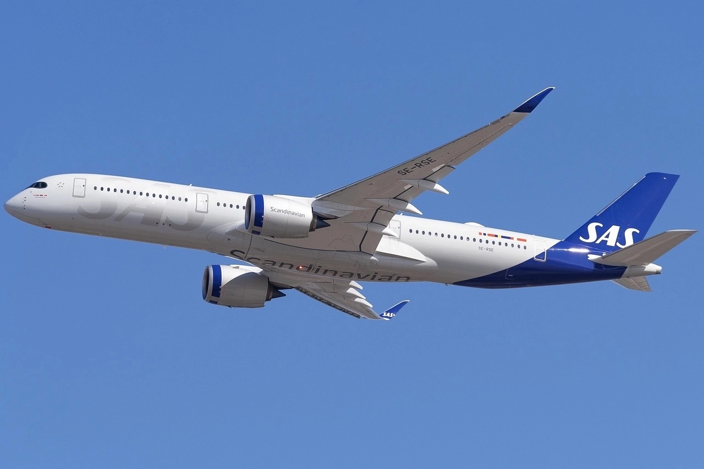
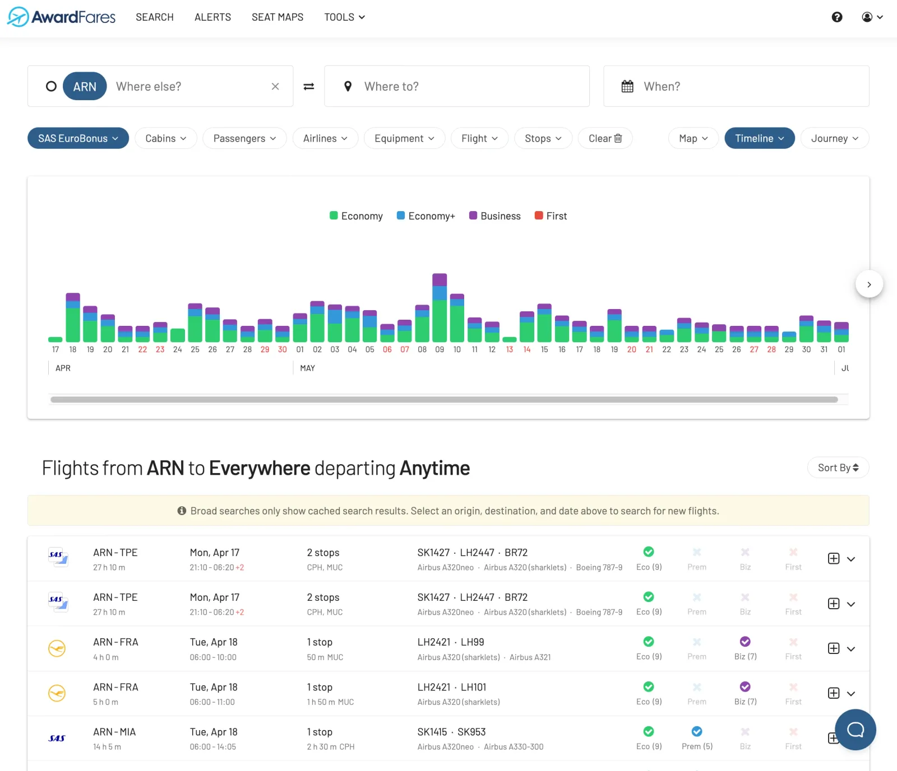
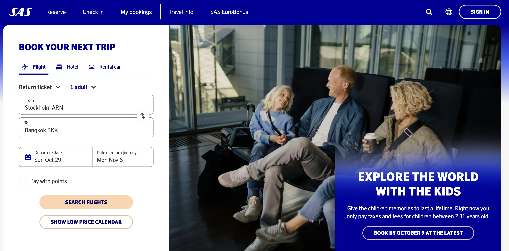

SAS announced **major** news today during a press conference. The airline has been under restructuring since it filed for bankruptcy under the U.S. Chapter 11 process. After several months, they reached a significant milestone: it will be acquired by a new consortium that includes Air France-KLM, leaving behind Star Alliance and joining SkyTeam.

But what does this mean for us, flyers, EuroBonus members, and SAS travelers? If you are worried about your pile of SAS EuroBonus points and what will happen to them, we are here to shed some light on the process and help you.

Even though it’s too early to judge the details, speculation is usually an enemy that can hold you back and trigger bad decisions. This post covers everything we know about the transition and next steps.

**UPDATE (MARCH 2024):** *According to recent statements from SAS and Air France, SAS will leave Star Alliance during Q2, 2024, joining SkyTeam immediately. There are still very little information regarding the implementation of the transition.*

**Also Read Our Megapost**: [Book These EuroBonus Award Flights Before SAS Leaves Star Alliance](https://blog.awardfares.com/eurobonus-star-alliance-awards/)

### In This Post

- [SAS Acquisition by Air France-KLM: What You Need To Know](#sas-acquisition-by-air-france-klm-what-you-need-to-know)
- [SAS Leaves Star Alliance: Tips For EuroBonus Members](#sas-leaves-star-alliance-tips-for-eurobonus-members)
- [Impact on EuroBonus (SAS FAQ)](#impact-on-eurobonus-sas-faq)
- [See The Bright Side](#see-the-bright-side)
- [Get started, and stay tuned](#get-started-and-stay-tuned)
- [Read more](#read-more)

## SAS Acquisition by Air France-KLM: What You Need To Know

The airline has chosen a consortium led by Castlelake, L.P., Air France-KLM, Lind Invest, and the Danish state as the primary financiers. This decision is pivotal for the airline, and here's a comprehensive breakdown of what it entails.

You can [read the full announcement here](https://www.sasgroup.net/newsroom/press-releases/2023/sas-reaches-major-milestone-in-sas-forward--announces-the-winning-consortium-including-details-of-the-transaction-structure/).

### Major investments in SAS

The consortium will invest a whopping USD 1,175 million into SAS. Out of this, USD 475 million will be directed towards equity, while USD 700 million will be convertible debt. Not stopping at this, Castlelake is also stepping in to refinance SAS’s current loan, offering a new USD 500 million loan.

### Alliance Shakeup

In a strategic move, SAS has decided to join the SkyTeam Alliance, which will result in its exit from the Star Alliance. This transition, however, is subject to approvals.

### Commercial Cooperation

Beyond financial reshuffling, SAS has its eyes set on fortifying its commercial ties with Air France-KLM. This partnership aims to augment connectivity and service offerings for Scandinavian travelers.

### Are you a shareholder?

Once the reorganization is complete, Castlelake will emerge as the holder of the majority of equity and debt. They will be followed by the Danish State, Air France-KLM, and Lind Invest in the stakeholder hierarchy. A portion of the equity will also be allocated to specific creditors.

There are substantial changes on the horizon for 
SAS AB’s stakeholders. By 2024, the company anticipates that all of its common shares and listed commercial hybrid bonds will be canceled and delisted. Current shareholders might not receive any value from this transition, whereas commercial hybrid bond holders could receive a nominal return.

### Leadership Insights

Carsten Dilling, the Chairman of SAS, is optimistic about this transformation. Anko van der Werff, CEO of SAS, believes that this partnership with SkyTeam reaffirms SAS's robust position in the airline industry. Stakeholders, including representatives from Castlelake, Air France-KLM, and Lind Invest, have all voiced their positive outlook on this collaboration and what lies ahead for SAS.

### Moving Ahead

Despite these changes, SAS assures that its operations will remain unaffected, promising uninterrupted service to its loyal customers.

## SAS Leaves Star Alliance: Tips For EuroBonus Members

We don't know exactly when yet, but it's safe to assume that the SAS EuroBonus program is about to go through significant changes soon, particularly after the airline's exit from Star Alliance.

In these transitions, it's normal for members have concerns. Here are some of our tips to navigate the upcoming transition smoothly.

**UPDATE**: [Jump to this section](#impact) for the latest statement from SAS.

### 1. Stay Informed

Subscribe to SAS newsletters, monitor their official website, and regularly check your EuroBonus account. Knowledge is your first line of defense against unexpected changes.

You can also subscribe to our newsletter to stay updated with the best SAS EuroBonus

### 2. Consider Spending Your Points

There’s uncertainty about how EuroBonus points will be affected. If you already have trips in mind, it might be a good idea to redeem them sooner rather than later, especially on Star Alliance partner flights.

[Sign-up to AwardFares (it's free)](https://awardfares.com/signup) to see available award flights using SAS EuroBonus points in just seconds. Plan dream trips on Star Alliance partners before it's no longer possible.

### 3. Re-evaluate Your Earning Strategy

If you've been amassing points through Star Alliance flights, hotel stays, or co-branded credit cards, reconsider your strategy in light of the imminent changes.

You can use our **free** [EuroBonus Point Analysis and Forecast tool](https://blog.awardfares.com/eurobonus-analysis-and-forecast/) to predict your earnings based on your monthly historical data, and try to come up with a plan for your points.

### 4. Plan Your Star Alliance Redemptions

If you've been eyeing a particular award trip with a Star Alliance partner, it may be a good idea to book it before SAS's exit. Once the departure is official, using EuroBonus points for Star Alliance flights might be limited or no longer possible.

For example, if you are looking into flying [**Lufthansa First Class using EuroBonus points**](https://blog.awardfares.com/lufthansa-with-eurobonus-guide/), this might be a good time to hit that milestone before the transition starts.

We put together [a megapost with the best Star Alliance cabins you can book today](https://blog.awardfares.com/eurobonus-star-alliance-awards/) with SAS EuroBonus points, and how to find awards using AwardFares.

### 5. Get Familiar With Air France, KLM, and SkyTeam

As SAS confirmed their plans to join SkyTeam, this is the best time to familiarize yourself with the new alliance, its airlines, benefits, and routes.

SkyTeam is one of the three major airline alliances in the world. It has 19 member airlines, which fly to over 1,150 destinations in 175 countries.

In addition to general benefits, SkyTeam also offers a number of specific benefits to its passengers, such as:

- SkyPriority: SkyPriority is a premium service that offers passengers a number of benefits, including priority check-in, boarding, baggage handling, and security clearance.
- Global Meetings: SkyTeam offers a number of services to help business travelers, such as meeting planning, airport assistance, and ground transportation.
- Sustainability initiatives: SkyTeam is committed to sustainability and is working with its member airlines to reduce their environmental impact.

### 6. Join Online Communities

Engage with other members on platforms like FlyerTalk or airline-specific forums. These communities can be a wealth of information, providing real-time updates, strategies, and shared experiences.

### 7. Monitor External Partnerships

Keep an eye on external partners like hotels, car rentals, or credit card companies aligned with EuroBonus. Changes with the airline might lead to shifts in these partnerships, which could impact your points earning or redemption capabilities.

### 8. Feedback Matters

Should you have concerns, questions, or feedback about the changes, reach out to SAS. Your perspective as a loyal customer is valuable, and airlines often take such feedback into account when shaping their programs.
 
### 9. Explore Status Match Opportunities

Many airline loyalty programs offer status matches to attract elite members from competing airlines. If SAS's changes affect your loyalty benefits, look into shifting your allegiance to another program that will match your current status.

### 10. Be Flexible and Patient

Transitions of this scale are massive undertakings, and there might be hiccups along the way. It's crucial to be patient, flexible, and understanding during this period. Customer service lines might be busier than usual, and some processes might take longer. **Patience is key**.

## Impact on EuroBonus (SAS FAQ)

On October 4th, SAS held a FAQ session covering questions regarding how the SAS EuroBonus program will be affected by SAS joining SkyTeam and leaving Star Alliance behind.

So far, the conclusion is that for now the EuroBonus program remains unchanged. These are the questions covered.

- **What will happen to EuroBonus?** No changes are being made to the program and EuroBonus will remain SAS's loyalty program. As a member, you will continue to earn and use points on SAS as today. Your status and benefits as a EuroBonus member when you fly with SAS will not be impacted. SAS intends to eventually leave Star Alliance and join SkyTeam, and adjustments to the program will be made accordingly. As long as SAS is a member of Star Alliance, EuroBonus members can continue to enjoy the same benefits as they do today when flying on a Star Alliance partner airline.
- **What will happen to my EuroBonus points?** No changes are made to your EuroBonus points. You will keep all points earned until now and will continue to earn and use points just like today.
- **What will happen to my EuroBonus tier status?** No changes are made to your EuroBonus tier status. You will retain your status and your progress made during your qualification period. Requirements to reach each tier level and benefits included in each tier remain the same.
- **What will happen to my EuroBonus Lifetime Gold status?** No changes are made to the EuroBonus Lifetime Gold program. EuroBonus Lifetime Gold memberships will be honored even after SAS joins SkyTeam, and all progress made towards Lifetime Gold will be kept.
- **Do I keep my status benefits when I travel on another Star Alliance partner airline?** While SAS remains part of Star Alliance, you will enjoy the same status benefits as you do today when you fly with a Star Alliance partner. When SAS eventually joins SkyTeam, you will also be able to enjoy similar status benefits across the extensive SkyTeam network.
- **Can I still earn points when I fly on another Star Alliance carrier?** While SAS remains part of Star Alliance, you will be able to earn EuroBonus Basic points when flying on a Star Alliance airline partner flights.
- **What will happen to my existing Star Alliance award bookings?** Existing bookings remain unchanged and will be honored even if you fly after SAS eventually leaves Star Alliance.
- **Can I still use my points to redeem on other Star Alliance carriers?** While SAS remains part of Star Alliance, we will allow you to use EuroBonus points to book Star Alliance award trips.
- **Can I still earn points on credits cards and other non-airline partners?** Yes.
- **Can I still use my EuroBonus points on non-airline partners such as rental cars or hotels?** Yes.
- **What about other Star Alliance partner members flying on SAS?** While SAS remains part of Star Alliance, members of other Star Alliance member programs will keep their status benefits while flying on SAS, and will be able to spend their miles/points on SAS flights.

## See The Bright Side

If you take a look online to what the community is discussing on Instagram, Facebook, Reddit and other platforms, it's clear that the news haven't been well received among EuroBonus members and loyal SAS customers. There are several concerns, for example, about what the Lifetime Gold benefits will mean going forward, if SAS will ditch EuroBonus for [FlyingBlue](https://www.flyingblue.com), and complaints that SkyTeam is not as good as other alliances.

While these changes might initially upset people, our advice is to stay positive and embrace change. There are usually many new opportunities and good news during these transitions too, including chances to visit new places, new earning opportunities, and unlocking new award flights.

### About Air France/KLM

Air France/KLM is one of the largest airline groups in the world, with a global network of over 200 destinations. This gives passengers a wide range of flight options to choose from, including direct flights to many popular destinations.

Here are some of the advantages of flying with Air France/KLM:

- **Global network**: Air France/KLM flies to over 200 destinations worldwide, including major cities in Europe, North America, Asia, Africa, and the Middle East. This gives passengers a wide range of flight options to choose from.
- **Frequent flyer program**: Air France/KLM has a joint frequent flyer program called Flying Blue. Members can earn miles on flights with Air France, KLM, and their partner airlines, and redeem these miles for free flights, upgrades, and other rewards.
- **Loyalty program benefits**: Flying Blue members enjoy a number of benefits, including priority boarding, lounge access, and extra baggage allowance.
- **Customer service**: Air France/KLM is known for its excellent customer service. Passengers can expect to be treated with courtesy and respect from all staff members.
- **Aircraft fleet**: Air France/KLM has a modern and comfortable fleet of aircraft. Passengers can expect to enjoy a pleasant flying experience.

In addition Air France/KLM also offers a number of specific benefits to its passengers, such as:

- A la carte dining: Air France and KLM both offer a la carte dining on long-haul flights. This means that passengers can choose from a variety of dishes to create their own meal.
- Premium Economy class: Air France and KLM both offer Premium Economy class on long-haul flights. This class offers more space and comfort than Economy class, but at a lower price than Business class.
- Business class: Air France and KLM both offer Business class on long-haul flights. This class offers the highest level of comfort and service, with spacious seats, lie-flat beds, and gourmet dining.

## Get started, and stay tuned

You can [try AwardFares for free](https://awardfares.com/). We are rolling out new features and improvements regularly, so sign up for our newsletter to stay on top of the latest news, announcements, and pro tips!

With our [premium features on Gold and Diamond](https://awardfares.com/pricing), you can also set up alerts to get notified when a certain route or flight gets opened, as well as check seat maps, flight schedules, and more.

## Read more

Make sure to also check these posts out

- [7 Benefits Of SAS Joining SkyTeam (The Bright Side)](https://blog.awardfares.com/sas-and-skyteam/)
- [Book These EuroBonus Award Flights Before SAS Leaves Star Alliance](https://blog.awardfares.com/eurobonus-star-alliance-awards/)
- [Essential Guide To Book Lufthansa Flights With SAS EuroBonus Points](https://blog.awardfares.com/lufthansa-with-eurobonus-guide/)
- [How To Install AwardFares On Your Phone](https://blog.awardfares.com/awardfares-mobile-app/)
- [SAS Opens New Route To Morocco (And You Can Book It With Points)](https://blog.awardfares.com/sas-opens-route-to-morocco/)
- [Ultimate Guide to Award Release Dates](https://blog.awardfares.com/ultimate-guide-to-award-release-dates)
