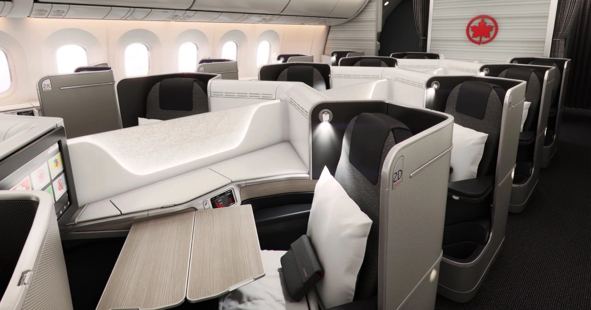
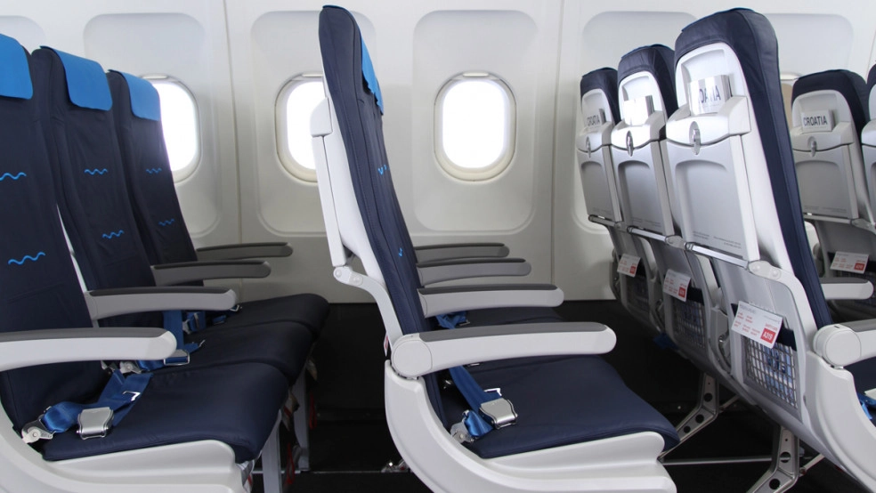
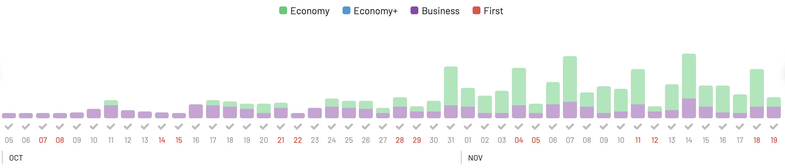
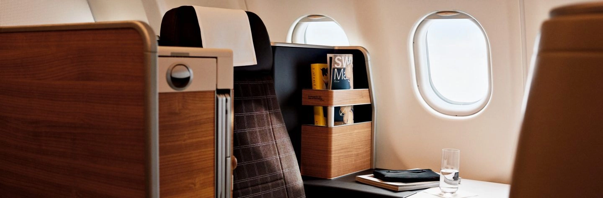

In light of the recent [announcent of SAS leaving Star Alliance](https://blog.awardfares.com/sas-acquisition/), we noticed an increase in traffic and EuroBonus searches at AwardFares. We are happy that our tool is helping you find your next dream award flight!

In this **megapost**, we are compiling every single airline part of Star Alliance, together with its best airplanes, cabins, and routes you can book **right now** using SAS EuroBonus points. Note that we exclude some of the cabins that are bookable with this program (such as Singapore Suites, Swiss First, etc.).

In addition, we share all our tips, tricks, and comments from our experience as travelers. Make sure to check out the links to our detailed guides and resources under each section. Let's start!

**UPDATE (MARCH 2024):** *According to recent statements, SAS is scheduled to leave Star Alliance during Q2, 2024, joining SkyTeam immediately. There are still very little information regarding the implementation of the transition, but we recommend redeeming EuroBonus awards on Star Alliance Partner Airlines soon.*

### Quick Navigation

- [Aegean Airlines](#aegean-airlines)
- [Air Canada](air-canada)
- [Air China](air-china)
- [Air India](#air-india)
- [Air New Zealand](air-new-zealand)
- [All Nippon Airways (ANA)](#all-nippon-airways)
- [Asiana Airlines](#asiana-arlines)
- [Austrian Airlines](#austrian-airlines)
- [Avianca](#avianca)
- [Brussels Airlines](#brussels-airlines)
- [Copa Airlines](#copa-airlines)
- [Croatia Airlines](#croatia-airlines)
- [EgyptAir](#egyptair)
- [Ethiopian Airlines](#ethiopian-airlines)
- [EVA Air](#eva-air)
- [LOT Polish Airlines](#lot-polish-airlines)
- [Lufthansa](#lufthansa)
- [Singapore Airlines](#singapore-airlines)
- [South African Airways](#south-african-airways)
- [Swiss International Air Lines (SWISS)](#swiss-international-air-lines-swiss)
- [TAP Air Portugal](#tap-air-portugal)
- [Thai Airways](#thai-airways)
- [Turkish Airlines](#turkish-airlines)

## Best Star Alliance Cabins To Book With SAS EuroBonus Points

### Aegean Airlines

Aegean Airlines, founded in 1987, is Greece's largest airline and flag carrier. It primarily operates out of Athens International Airport and serves both domestic destinations within Greece and international routes across Europe and other parts of the world. Known for its consistent quality service, Aegean has received several awards over the years for its excellence in the European regional aviation sector.

The airline became a member of Star Alliance, the world's largest global airline alliance, in June 2010.

**Best Cabin**: Economy or Business on the A320neo.

*Image from Aegean's official website.*

**Suggested Routes**:

* [Athens (ATH) to London (LHR)](https://awardfares.com/search?ATH.LHR.;a:A3;z:sas#): A major European route connecting the Greek capital to London.
* [Thessaloniki (SKG) to Frankfurt (FRA)](https://awardfares.com/search?SKG.FRA.;a:A3;z:sas#): Connecting Greece's second-largest city to a major European hub.
* [Athens (ATH) to Tel Aviv (TLV)](https://awardfares.com/search?ATH.TLV.;a:A3;z:sas#): A popular route connecting Greece to Israel, offering a unique cultural exchange.
* [Athens (ATH) to Rome (FCO)](https://awardfares.com/search?ATH.FCO.;a:A3;z:sas#): A journey between two ancient and historically rich capitals.
* [Heraklion (HER) or Rhodes (RHO) to Athens (ATH)](https://awardfares.com/search?HER,RHO.ATH.;a:A3;z:sas): While these are domestic routes, they connect some of Greece's most iconic islands to the mainland, allowing you to experience the beautiful Aegean sea landscapes and onboard service.

---

### Air Canada

Air Canada, established in 1937, is the flag carrier and largest airline of Canada. Headquartered in Montreal, it provides scheduled and charter transportation for passengers and cargo to more than 200 destinations globally.

As one of the founding members of Star Alliance, Air Canada has been a part of this collaborative network since its inception in May 1997. Over the years, the airline has been recognized for its commitment to safety, innovation, and customer service, solidifying its position as a leading player in the global aviation industry.

**Best Cabins**: Boeing 787-9 Business Class, Boeing 777-300ER Business Class

*Image from Air Canada's official website.*

**Suggested Routes**:

* [Toronto (YYZ) to Tokyo (HND/NRT)](https://awardfares.com/search?YYZ.area:TYO.;a:AC;z:sas): Experience the airline's long-haul service on this trans-Pacific route.
* [Vancouver (YVR) to Sydney (SYD)](https://awardfares.com/search?YVR.area:SYD.;a:AC;z:sas): Another long-haul offering, connecting the West Coast of Canada with Australia.
* [Toronto (YYZ) to Frankfurt (FRA)](https://awardfares.com/search?YYZ.area:FRA.;a:AC;z:sas): A key European route offering the chance to fly on Air Canada's flagship Boeing 787 Dreamliners.
* [Montreal (YUL) to Paris (CDG)](https://awardfares.com/search?YUL.area:CDG.;a:AC;z:sas): A classic transatlantic route, which might provide good award availability and also features the Dreamliner on certain flights.
* [Calgary (YYC) to London (LHR)](https://awardfares.com/search?YYC.area:LHR.;a:AC;z:sas): This route allows passengers to experience long-haul service from Canada's mountainous West to the UK.

**More Posts**:

* [Air Canada Business 737 MAX 8 YVR-SFO Trip Report](https://blog.awardfares.com/air-canada-business-yvr-sfo/)
* [Air Canada Announces Route From Vancouver To Singapore](https://blog.awardfares.com/aircanada-singapore-route/)

---

### Air China

Air China, founded in 1988, is the flag carrier and one of the major airlines of the People's Republic of China. With its hub at Beijing Capital International Airport, Air China operates a vast network of domestic and international routes, playing a pivotal role in connecting China with the rest of the world. The airline is known for its expanding fleet, commitment to service, and its role in supporting China's rapid growth in global aviation.

Air China became a member of Star Alliance in December 2007.

**Best Cabins**: Boeing 747-8, Airbus A350

*Image from Air China's official website.*

**Suggested Routes**:

* [Shanghai (PVG) to Frankfurt (FRA)](https://awardfares.com/search?PVG.FRA.;a:CA;z:sas): A significant connection between two major financial hubs in Asia and Europe.
* [Beijing (PEK) to London (LHR)](https://awardfares.com/search?PEK.LHR.;a:CA;z:sas): Linking two global capital cities, this route offers a chance to experience Air China's premium cabins.
* [Beijing (PEK) to Sydney (SYD)](https://awardfares.com/search?PEK.SYD.;a:CA;z:sas): This route offers a direct connection between China and Australia, making it valuable for those looking to travel between the two continents.
* [Chengdu (CTU) to San Francisco (SFO)](https://awardfares.com/search?CTU.SFO.;a:CA;z:sas): Serving as an important link between the tech and innovation hubs of Chengdu and Silicon Valley, this route is gaining popularity.
* [Beijing (PEK) to New York (JFK)](https://awardfares.com/search?PEK.JFK.;a:CA;z:sas): This is one of Air China's flagship long-haul routes, connecting China's capital to the bustling metropolis of New York.

### Air India

Air India, founded in 1932, is the flag carrier of India and has played an instrumental role in connecting the vast subcontinent to the rest of the world. Headquartered in New Delhi, the airline stands as a symbol of India's rich history and its modern aspirations, providing services across domestic and international routes. Over the decades, Air India has become synonymous with the famed Indian hospitality, encapsulated by its iconic Maharajah mascot.

Air India became a member of Star Alliance in July 2014.

**Best Cabins**: New First and Business Class cabins on their Boeings 777

*Image from Air India website*

**Suggested Routes**:

* [Delhi (DEL) to New York (JFK/EWR)](https://awardfares.com/search?DEL.NYC.;a:AI;z:sas): This long-haul route provides an opportunity to experience Air India's service over a long duration, crossing the Atlantic.
* [Mumbai (BOM) to London (LHR)](https://awardfares.com/search?BOM.LHR.;a:AI;z:sas): A key connection between India's financial capital and Europe, often operated with their flagship aircraft.
* [Delhi (DEL) to San Francisco (SFO)](https://awardfares.com/search?DEL.SFO.;a:AI;z:sas): One of the longest flights operated by Air India, connecting the Indian capital with the US West Coast.
* [Bengaluru (BLR) to Paris (CDG)](https://awardfares.com/search?BLR.CDG.;a:AI;z:sas): A strategic route linking the tech hub of India with one of Europe's main gateways.
* [Delhi (DEL) to Sydney (SYD)](https://awardfares.com/search?DEL.SYD.;a:AI;z:sas): Connecting the subcontinent with Australia, this is a popular route for both business and leisure travelers.

---

### Air New Zealand

Air New Zealand, established in 1940, is the flag carrier of New Zealand and plays a pivotal role in connecting the island nation to the rest of the world. Known for its distinctive Kiwi hospitality, the airline offers a comprehensive range of domestic and international flights, ensuring travelers experience the breathtaking landscapes and vibrant cities of New Zealand. Its commitment to innovative in-flight services, environmental initiatives, and safety standards has garnered it numerous accolades in the aviation industry.

Air New Zealand proudly became a member of Star Alliance in March 1999, further enhancing its global reach and network.

**Best Cabins**: Long-haul Business Premier. Routes operated by the Boeing 787 Dreamliner or the refurbished Boeing 777-200/300ER.

*Image from Air New Zealand official website.*

**Suggested Routes**:

* [Auckland (AKL) to Los Angeles (LAX)](https://awardfares.com/search?AKL.area:LAX.;a:NZ;z:sas): A popular long-haul route connecting New Zealand to the US West Coast. This flight gives you a chance to experience the airline's acclaimed service across the Pacific.
* [Auckland (AKL) to London (LHR) via Los Angeles](https://awardfares.com/search?AKL.area:LHR.;a:NZ;z:sas): Prior to its discontinuation, this was one of the airline's longest routes and provided a comprehensive onboard experience. Note: This route was suspended, so check its current status before planning.
* [Auckland (AKL) to Tokyo (NRT/HND)](https://awardfares.com/search?AKL.area:TYO.;a:NZ;z:sas): A key connection between New Zealand and Japan, offering travelers the beauty of both island nations.
* [Auckland (AKL) to San Francisco (SFO)]([https://awardfares.com/search?AKL.area:SFO.;a:NZ;z:sas](https://awardfares.com/search?AKL.LAX.;a:NZ;z:sas)): Another important link to the US, this route often has the latest in-seat entertainment and onboard offerings.
* [Christchurch (CHC) to Singapore (SIN)](https://awardfares.com/search?CHC.SIN.;a:NZ;z:sas): A strategic route connecting New Zealand's South Island to the major Asian hub of Singapore.

---

### All Nippon Airways (ANA)

All Nippon Airways (ANA), established in 1952, is Japan's largest airline and a leading figure in the nation's aviation industry. With a commitment to safety, technological innovation, and impeccable customer service, ANA has built a stellar reputation for itself both domestically and on international routes. Offering a wide network that connects key global cities to various destinations within Japan, ANA consistently garners praise for its in-flight experiences and operational excellence. 

The airline cemented its global connectivity and outreach by joining Star Alliance consortium in October 1999.

**Best Cabins**: ANA's new Business Class cabin on their 777-300ER ("The Room").

*Image from ANA's official website.*

**Suggested Routes**:

* [Tokyo (HND or NRT) to New York (JFK)](https://awardfares.com/search?area:TYO.JFK.;a:NH;z:sas): A premier long-haul route where you can experience ANA's acclaimed First Class and Business Class products on their Boeing 777s or 787 Dreamliners.
* [Tokyo (HND or NRT) to London (LHR)](https://awardfares.com/search?area:TYO.LHR.;a:NH;z:sas): Another major long-haul route that showcases ANA's premium offerings, especially on their latest aircraft.
* [Tokyo (NRT) to Frankfurt (FRA)](https://awardfares.com/search?area:TYO.FRA.;a:NH;z:sas): A key connection between Asia and Europe, allowing passengers to experience ANA's award-winning service.
* [Tokyo (HND or NRT) to Los Angeles (LAX)](https://awardfares.com/search?area:TYO.LAX.;a:NH;z:sas): A popular transpacific route that links Japan with the US West Coast. Ideal for experiencing ANA's top cabins.
* [Tokyo (HND) to Sydney (SYD)](https://awardfares.com/search?area:TYO.SYD.;a:NH;z:sas): One of ANA's significant routes to Oceania, offering a chance to experience their long-haul product on a diverse route.

**More Posts**:

* [ANA 777 Liveries: How To Fly The Pokémon Jets And Other Spectacular Planes](https://blog.awardfares.com/ana-777-fleet/)
* [ANA Resumes Route Tokyo To Perth](https://blog.awardfares.com/ana-resumes-tokyo-perth/)

----

### Asiana Airlines

Asiana Airlines, established in 1988, is one of South Korea's two major airlines, with its headquarters situated in Seoul. Recognized for its commitment to top-tier service and safety, Asiana has consistently been lauded for its premium in-flight experiences and customer care, particularly on long-haul flights. Operating both domestic flights within South Korea and international routes spanning the globe, the airline plays a significant role in connecting the Korean Peninsula to the world. 

Asiana Airlines further expanded its global footprint when it joined Star Alliance in July 2003.

**Best Cabins**: Business Class on their 777-200. First Class on their A380s.

*Image from [Flickr](https://www.flickr.com/photos/mattweibo/25109436108) (creative commons).*

**Suggested Routes**:

* [Seoul (ICN) to New York (JFK)](https://awardfares.com/search?ICN.JFK.;a:OZ;z:sas#): A flagship route for Asiana, it gives passengers the chance to experience the airline's long-haul service at its best.
* [Seoul (ICN) to Frankfurt (FRA)](https://awardfares.com/search?ICN.FRA.;a:OZ;z:sas#): A key route connecting Asia with Europe, often operated with their latest aircraft and product offerings.
* [Seoul (ICN) to Los Angeles (LAX)](https://awardfares.com/search?ICN.LAX.;a:OZ;z:sas#): Another major transpacific route, linking Korea with the US West Coast.
* [Seoul (ICN) to Sydney (SYD)](https://awardfares.com/search?ICN.SYD.;a:OZ;z:sas#): This connection bridges Korea and Australia, and can offer a comfortable long-haul experience.
* [Seoul (ICN) to London (LHR)](https://awardfares.com/search?ICN.LHR.;a:OZ;z:sas#): A significant route to one of Europe's primary hubs, showcasing Asiana's premium cabins and services.

----

### Austrian Airlines

Austrian Airlines, the flag carrier of Austria, was founded in 1957 and has since been a beacon of Austrian hospitality in the skies. Operating from its primary hub in Vienna, the airline is renowned for its commitment to service excellence, punctuality, and a deep-rooted sense of Austrian tradition, especially evident in its onboard catering and services. 

Austrian Airlines joined Star Alliance in March 2000.

**Best Cabins**: Long-haul Business Class on the Boeing 767-300ER, and 777-200.

*Image from [KN Aviation](https://knaviation.net/austrian-767-business-class-review/).*

**Suggested Routes**:

* [Vienna (VIE) to New York (JFK)](https://awardfares.com/search?VIE.JFK.;a:OS;z:sas): A prominent transatlantic route allowing passengers to experience Austrian Airlines' long-haul product, especially their well-regarded Business Class.
* [Vienna (VIE) to Bangkok (BKK)](https://awardfares.com/search?VIE.BKK.;a:OS;z:sas): Connecting Europe to Southeast Asia, this route can be a great way to enjoy Austrian's in-flight service, especially the onboard chef in Business Class.
* [Vienna (VIE) to Tokyo (NRT)](https://awardfares.com/search?VIE.NRT.;a:OS;z:sas): A significant East-West connection providing an opportunity to experience Austrian's long-haul offerings.
* [Vienna (VIE) to Beijing (PEK)](https://awardfares.com/search?VIE.PEK.;a:OS;z:sas): Another key route in Austrian's Asian network, offering a chance to try out their premium cabins.
* [Vienna (VIE) to Chicago (ORD)](https://awardfares.com/search?VIE.ORD.;a:OS;z:sas): A major North American route, this can be an excellent option for EuroBonus redemption, especially if you're eyeing a premium cabin experience.

**More Posts**:

* [Review of Austrian Business Class Vienna to Montreal](https://blog.awardfares.com/austrian-business-review/)
* [Austrian's Impressive Intra-Europe Business Class (VIE-FRA)](https://blog.awardfares.com/austrian-short-haul-business/)

---

### Avianca

Avianca, the national airline of Colombia, stands as one of the oldest continuously operating airlines in the world, having been founded in 1919. Throughout its extensive history, Avianca has played a pivotal role in Latin American aviation, connecting the continent's vast regions and serving as a bridge to the rest of the globe. With a rich legacy of service and innovation, the airline has continuously adapted to the evolving demands of the modern traveler. 

Avianca joined Star Alliance in June 2012.

**Best Cabins**: Business Class on the Boeing 787-8.

*Image from Avianca's official website.*

**Suggested Routes**:

* [Bogotá (BOG) to Madrid (MAD)](https://awardfares.com/search?BOG.MAD.;a:AV,OS;z:sas): A key transatlantic route connecting South America with Europe.
* [Bogotá (BOG) to Miami (MIA)](https://awardfares.com/search?BOG.MIA.;a:AV,OS;z:sas): A popular route for travelers seeking to connect to the US from South America.
* [Medellín (MDE) to New York (JFK)](https://awardfares.com/search?MDE.JFK.;a:AV,OS;z:sas): Serving as a direct link between Colombia's second-largest city and the US East Coast.
* [Bogotá (BOG) to São Paulo (GRU)](https://awardfares.com/search?BOG.GRU.;a:AV,OS;z:sas): A major connection between two of South America's largest cities.
* [San Salvador (SAL) to Los Angeles (LAX)](https://awardfares.com/search?SAL.LAX.;a:AV,OS;z:sas): An essential route linking Central America to the US West Coast.

---

### Brussels Airlines

Brussels Airlines, established in 2006 following the merger of SN Brussels Airlines and Virgin Express, serves as the flag carrier of Belgium. With its hub based at Brussels Airport, the airline offers an extensive network of flights, connecting Belgium to numerous European destinations, as well as providing vital links to Africa, North America, and Asia. Renowned for its punctuality and commitment to quality service, Brussels Airlines showcases Belgian hospitality, culture, and culinary excellence aboard its flights. 

Brussels Airlines became a member of Star Alliance in December 2009.

**Best Cabins**: Long-haul Business Class on the Airbus A330-200.

*Image from Brussels Airlines official website.*

**Suggested Routes**:

* [Brussels (BRU) to New York (JFK)](https://awardfares.com/search?BRU.JFK.;a:SN;z:sas): This transatlantic route provides a direct link from Belgium to the US East Coast.
* [Brussels (BRU) to Kigali (KGL)](https://awardfares.com/search?BRU.KGL.;a:SN;z:sas): A key connection to Rwanda, a starting point for many gorilla trekking adventures in East Africa.
* [Brussels (BRU) to Kinshasa (FIH)](https://awardfares.com/search?BRU.FIH.;a:SN;z:sas): Another valuable route for EuroBonus members, connecting Belgium to the Democratic Republic of the Congo.
* [Brussels (BRU) to Washington D.C. (IAD)](https://awardfares.com/search?BRU.IAD.;a:SN;z:sas): A strategic route between the administrative capitals of both the European Union and the United States.
* [Brussels (BRU) to Monrovia (ROB)](https://awardfares.com/search?BRU.ROB;a:SN;z:sas): An interesting connection to Liberia in West Africa.

**More Posts**:

* [Book Brussels Airlines New Route To Kenya With Points](https://blog.awardfares.com/brussels-airlines-new-route/)

---

### Copa Airlines

Copa Airlines, founded in 1947, is the flag carrier of Panama and operates from its strategic hub at Tocumen International Airport in Panama City. Renowned for its impressive on-time performance and network connectivity throughout the Americas, Copa serves as a major link between North and South America. The airline is widely respected for its efficient operations and commitment to delivering a consistent and quality passenger experience. 

Copa Airlines joined Star Alliance in June 2012.

**Best Cabins**: Dream Business Class on the Boeing 737 MAX 9.

*Image from Copa Airlines website.*

**Suggested Routes**:

* [Panama City (PTY) to San Francisco (SFO)](https://awardfares.com/search?PTY.SFO.;a:CM;z:sas): A popular route linking Central America with the US West Coast.
* [Panama City (PTY) to Buenos Aires (EZE)](https://awardfares.com/search?PTY.EZE.;a:CM;z:sas): A major connection bridging Central and South America. Daily flight on their 737 MAX 9.
* [Panama City (PTY) to Los Angeles (LAX)](https://awardfares.com/search?PTY.LAX.;a:CM;z:sas): Another key route connecting Panama to the West Coast of the United States.
* [Panama City (PTY) to Montevideo (MVD)](https://awardfares.com/search?PTY.MVD.;a:CM;z:sas): An attractive route for those looking to explore Uruguay.
* [Panama City (PTY) to Sao Paulo (GRU)](https://awardfares.com/search?PTY.GR.;a:CM;z:sas): Linking Panama with Brazil's largest city and business hub.

**More Posts**:

* [Review of Copa Airlines Business Class Miami to Panama](https://blog.awardfares.com/copa-business-review/)

---

### Croatia Airlines

Croatia Airlines, established in 1989, is the flag carrier of Croatia and has its headquarters in Zagreb. Serving as a gateway to the Adriatic nation, the airline plays a pivotal role in connecting Croatia's main cities with key destinations in Europe and beyond. With its commitment to safety, punctuality, and showcasing Croatian hospitality, the airline has been instrumental in boosting tourism and business ties for the country.

Croatia Airlines became a member of Star Alliance in November 2004, further strengthening its international connectivity and service offerings.

**Best Cabins**: Airbus A319 Business Class

*Image from Croatia Airlines official website.*

**Suggested Routes**:

* [Zagreb (ZAG) to Dubrovnik (DBV)](https://awardfares.com/search?ZAG.DBV.;a:OU;z:sas): This route offers an excellent way to see both the capital and the iconic Adriatic coastal city, which is famed for its historical importance and as a filming location for "Game of Thrones."
* [Zagreb (ZAG) to London (LHR)](https://awardfares.com/search?ZAG.LHR.;a:OU;z:sas): This connects Croatia's capital with one of Europe's major hubs.
* [Dubrovnik (DBV) to Frankfurt (FRA)](https://awardfares.com/search?DBV.FRA.;a:OU;z:sas): A direct route from the picturesque coastal city to one of Europe's primary transit points.
* [Split (SPU) to Paris (CDG)](https://awardfares.com/search?SPU.CDG.;a:OU;z:sas): Split is another beautiful Croatian coastal city, and this route provides a direct link to the French capital.
* [Zagreb (ZAG) to Munich (MUC)](https://awardfares.com/search?ZAG.MUC.;a:OU;z:sas): This route offers efficient access between Croatia and southern Germany.

---

### EgyptAir

EgyptAir, founded in 1932, stands as Africa's oldest active airline and proudly operates as the flag carrier of Egypt. With its main base at Cairo International Airport, the airline has been instrumental in linking the African continent to the rest of the world while playing a pivotal role in promoting Egypt as a prime tourist and business destination. Renowned for its rich history and commitment to providing reliable air service, EgyptAir has consistently adapted to the dynamic aviation landscape. 

EgyptAir joined Star Alliance in July 2008, marking a significant step in its journey of global integration and cooperative growth.

**Best Cabins**: Business Class on the Boeing 787-9.

*Image from [One Mile At A Time](https://onemileatatime.com/reviews/egyptair-business-class-787/).*

**Suggested Routes**:

* [Cairo (CAI) to New York (JFK)](https://awardfares.com/search?CAI.JFK.;a:MS;z:sas): This transcontinental route bridges Egypt with the US East Coast, providing an opportunity to explore two of the world's most iconic cities.
* [Cairo (CAI) to London (LHR)](https://awardfares.com/search?CAI.LHR.;a:MS;z:sas): Connecting the historical magnificence of Cairo with the vibrant metropolis of London.
* [Cairo (CAI) to Bangkok (BKK)](https://awardfares.com/search?CAI.BKK.;a:MS;z:sas): A significant route for those looking to transition from the wonders of ancient Egypt to the allure of Southeast Asia.
* [Cairo (CAI) to Tokyo (NRT/HND)](https://awardfares.com/search?CAI.TYO.;a:MS;z:sas): This route connects the Middle East with the Far East, offering a blend of cultures and experiences.
* [Cairo (CAI) to Toronto (YYZ)](https://awardfares.com/search?CAI.YYZ.;a:MS;z:sas): A vital link between Egypt and Canada's largest city.

---

### Ethiopian Airlines

Ethiopian Airlines, founded in 1945, is the flag carrier of Ethiopia and has grown to become one of Africa's leading airlines, celebrated for its operational efficiency and expansive network. Operating from its hub in Addis Ababa, it serves as a vital connector for the African continent, linking it to destinations across the globe. As a testament to its commitment to excellence, Ethiopian Airlines has achieved a notable presence in global aviation, backed by its modern fleet and innovative services. 

Ethiopian Airlines became a member of Star Alliance in December 2011, further enhancing its international connectivity and reinforcing its position as a key player in the global aviation landscape.

**Best Cabins**: Ethiopian Airlines has a notable business class product on their 787 fleet, which can be a fantastic way to spend your points for an elevated travel experience.

*Image from Ethiopian Airlines official website.*

**Suggested Routes**:

* [Addis Ababa (ADD) to Washington D.C. (IAD)](https://awardfares.com/search?ADD.IAD.;a:ET;z:sas): This direct route links Africa to the US East Coast, providing a gateway to North America.
* [Addis Ababa (ADD) to London (LHR)](https://awardfares.com/search?ADD.LHR.;a:ET;z:sas): A key European connection, ideal for EuroBonus members based in or transiting through the UK.
* [Addis Ababa (ADD) to Beijing (PEK)](https://awardfares.com/search?ADD.PEK.;a:ET;z:sas): This route offers a direct connection between Africa and China's capital, serving as a bridge between the two continents.
* [Addis Ababa (ADD) to Cape Town (CPT)](https://awardfares.com/search?ADD.CPT.;a:ET;z:sas): For those wanting to experience the wonders of South Africa, this route is an excellent choice.
* [Addis Ababa (ADD) to Tokyo (NRT)](https://awardfares.com/search?ADD.TYO.;a:ET;z:sas): An important link between Africa and Japan, this route caters to business and leisure travelers alike. You can also use this route to connect Europe or Asia with Deep South America, for example [Buenos Aires to Tokyo](https://awardfares.com/search?EZE.TYO.;a:ET;z:sas), [Stockholm to Buenos Aires](https://awardfares.com/search?ARN.EZE.;a:ET;z:sas), etc.

**More Posts**:

* [SAS EuroBonus And Ethiopian Airlines Ghost Availability](https://blog.awardfares.com/ethiopian-ghost-availability/)

---

### EVA Air

EVA Air, established in 1989, is a premier Taiwanese international airline with its headquarters in Taoyuan City. Renowned for its commitment to safety, innovation, and superior in-flight service, EVA Air has emerged as a significant player in the Asian aviation sector, connecting Taiwan to major destinations worldwide. The airline is particularly acclaimed for its luxurious premium cabins and innovative amenities that have garnered numerous accolades. 

EVA Air joined Star Alliance in June 2013.

**Best Cabins**: EVA Air's award-winning business class, known as Royal Laurel.

*Image from EVA Air official website.*

**Suggested Routes**:

* [Taipei (TPE) to Los Angeles (LAX)](https://awardfares.com/search?TPE.LAX.;a:BR;z:sas): A popular transpacific route connecting Taiwan with the US West Coast.
* [Taipei (TPE) to Bangkok (BKK)](https://awardfares.com/search?TPE.BKK.;a:BR;z:sas): Offering an efficient connection between Taiwan and one of Southeast Asia's major hubs.
* [Taipei (TPE) to San Francisco (SFO)](https://awardfares.com/search?TPE.SFO.;a:BR;z:sas): Another key route for travelers looking to journey between Taiwan and the US West Coast.
* [Taipei (TPE) to London (LHR)](https://awardfares.com/search?TPE.LHR.;a:BR;z:sas): A long-haul route linking Taiwan with Europe's major transit and travel hub.
* [Taipei (TPE) to Vancouver (YVR)](https://awardfares.com/search?TPE.YVR.;a:BR;z:sas): This route provides a direct connection between Taiwan and Canada's Pacific coast.

**More Posts**:

* [Best EVA Air Award Flights In 2023](https://blog.awardfares.com/eva-air-best-redemptions-2023/)
* [EVA Air Award Redemption Guide](https://blog.awardfares.com/eva-air-award-redemption/)
* [5 Mistakes When Searching EVA Air Award Flights (And How To Fix Them)](https://blog.awardfares.com/eva-air-mistakes/)
* [EVA Business 787-9 Dreamliner TPE-ICN Trip Report](https://blog.awardfares.com/eva-business-tpe-icn/)

---

### LOT Polish Airlines

LOT Polish Airlines, established in 1929, is the flag carrier of Poland and stands as one of the world's oldest airlines still in operation. With its headquarters in Warsaw, LOT has been a symbol of Polish pride and resilience in the aviation sector, navigating through various challenges while consistently expanding its network. Linking Poland to key destinations across Europe, North America, and Asia, the airline has played an instrumental role in promoting Polish culture, business, and tourism on the global stage. 

LOT Polish Airlines joined Star Alliance in October 2003.

**Best Cabins**: Business Class on the Boeign 787.

*Image from LOT official website.*

**Suggested Routes**:

* [Warsaw (WAW) to Chicago (ORD)](https://awardfares.com/search?WAW.ORD.;a:BR,LO;z:sas): This route connects Poland directly with the US Midwest, a popular choice for both business and leisure travelers.
* [Warsaw (WAW) to New York (JFK)](https://awardfares.com/search?WAW.JFK.;a:BR,LO;z:sas): Another crucial transatlantic connection, linking Poland with the US East Coast.
* [Warsaw (WAW) to Beijing (PEK)](https://awardfares.com/search?WAW.PEK.;a:BR,LO;z:sas): A significant route connecting Europe with China, great for those wanting to journey between the two continents.
* [Warsaw (WAW) to Tokyo (NRT)](https://awardfares.com/search?WAW.NRT.;a:BR,LO;z:sas): This is one of LOT's long-haul flagship routes, bridging Poland with Japan.
* [Warsaw (WAW) to Krakow (KRK)](https://awardfares.com/search?WAW.KRK.;a:BR,LO;z:sas): A shorter domestic route, but a great way to explore two of Poland's most iconic cities in one trip.

---

### Lufthansa

Lufthansa, officially known as Deutsche Lufthansa AG, was founded in 1953 and is the largest airline in Germany, playing a central role in European and global aviation. Headquartered in Cologne, Lufthansa is celebrated for its commitment to precision, innovation, and stellar in-flight services, solidifying its reputation as a leader in the aviation industry. Operating primarily from its hubs in Frankfurt and Munich, Lufthansa connects Germany to a multitude of international destinations, championing both the country's business interests and its rich cultural heritage. 

As a testament to its vision of global collaboration and network expansion, Lufthansa became one of the five founding members of Star Alliance in May 1997, underscoring its dedication to enhancing the global travel experience for its passengers.

**Best Cabins**: Lufthansa's First Class and Business Class are renowned for their service and comfort, especially on their flagship A380 and Boeing 747-8 aircraft.

Lufthansa is set to introduce entirely new cabins in 2024, including Allegris First Class Suite, and Business Class. However, it's not clear if it will still be possible to book these new cabins with SAS EuroBonus points, given the transition to SkyTeam.

*Image from Lufthansa Group website.*

**Suggested Routes**:

* [Frankfurt (FRA) to New York (JFK)](https://awardfares.com/search?FRA.JFK.;a:LH;z:sas): A major transatlantic route connecting one of Europe's primary hubs with the US East Coast.
* [Munich (MUC) to San Francisco (SFO)](https://awardfares.com/search?MUC.SFO.;a:LH;z:sas): This route offers a connection from southern Germany to the US West Coast, a favorite among tech and business travelers.
* [Frankfurt (FRA) to Tokyo (HND/NRT)](https://awardfares.com/search?FRA.area:TYO.;a:LH;z:sas): A key intercontinental link between Europe and Japan, popular for both leisure and business.
* [Frankfurt (FRA) to Cape Town (CPT)](https://awardfares.com/search?FRA.CPT.;a:LH;z:sas): This route links Europe with one of South Africa's most iconic destinations.
* [Munich (MUC) to Bangkok (BKK)](https://awardfares.com/search?MUC.BKK.;a:LH;z:sas): A gateway to Southeast Asia, this route connects travelers from Europe to the vibrant Thai capital.

**Known Issues With EuroBonus**: Keep an eye on potential surcharges, which can sometimes be high. First-class availability is released just a few days before the flights.

**More Posts**:

* [Essential Guide To Book Lufthansa Flights With SAS EuroBonus Points](https://blog.awardfares.com/lufthansa-with-eurobonus-guide/)
* [Lufthansa New Routes In 2023](https://blog.awardfares.com/lh-routes-2023/)
* [Lufthansa's A350 Long-Haul Business Class (Avoid)](https://blog.awardfares.com/lufthansa-long-haul-business-a350/)

---

### Singapore Airlines

**Known Issues with EuroBonus**: To our latest knowledge, these awards are not bookable at the moment (online nor via contact center), given that SAS and Singapore Airlines haven't been able to reach an agreement on the redemption terms.

Singapore Airlines, founded in 1972, is the flag carrier of Singapore and stands as one of the most esteemed airlines in the global aviation industry. Revered for its unparalleled service, innovative in-flight amenities, and commitment to excellence, the airline has consistently set benchmarks in luxury air travel. Operating from its hub at Singapore Changi Airport, Singapore Airlines has cultivated a vast network, connecting the island-nation to key destinations worldwide and showcasing the best of Singaporean hospitality.

Singapore Airlines became one of the founding members of Star Alliance when the alliance was formed in May 1997.

**Best Cabins**:  Singapore Airlines' Suites and Business Class, especially on their A380s and B787s, are among the industry's best. If possible, aim to redeem for these premium cabins to maximize the value of your points and enjoy a world-class in-flight experience.

*Image from Singapore Airlines website.*

**Suggested Routes**:

* [Singapore (SIN) to Zurich (ZRH)](https://awardfares.com/search?SIN.ZRH.;a:SQ;z:sas): A direct connection between Singapore and Switzerland, showcasing Singapore Airlines' high-standard long-haul experience.
* [Singapore (SIN) to New York (JFK)](https://awardfares.com/search?SIN.JFK.;a:SQ;z:sas): This ultra-long-haul route, one of the world's longest commercial flights, connects Southeast Asia directly with the US East Coast.
* [Singapore (SIN) to Sydney (SYD)](https://awardfares.com/search?SIN.SYD.;a:SQ;z:sas): This popular route links Singapore with Australia's iconic city, ideal for both business and leisure travelers.
* [Singapore (SIN) to Tokyo (NRT/HND)](https://awardfares.com/search?SIN.area:TYO.;a:SQ;z:sas): A major connection between Southeast Asia and Japan, offering a taste of two vibrant Asian cultures.
* [Singapore (SIN) to London (LHR)](https://awardfares.com/search?SIN.LHR.;a:SQ;z:sas): Another flagship long-haul route, this flight bridges Singapore with one of Europe's primary hubs.

**More Posts**:

* [Singapore Airlines Partner Award Redemption Guide 2022](https://blog.awardfares.com/singapore-partner-redemptions/)
* [Singapore Airlines Is Skytrax World's Best Airline In 2023. Here Are Our Favorite Routes.](https://blog.awardfares.com/singapore-skytrax-2023/)

---

### South African Airways

South African Airways (SAA), established in 1934, serves as the national flag carrier of South Africa and has been a prominent symbol of the nation's presence in the global aviation landscape. Operating from its main hub in Johannesburg's O.R. Tambo International Airport, SAA has been instrumental in connecting the African continent with the world, underpinning its role with a commitment to excellence, safety, and world-renowned hospitality. The airline plays a pivotal role in fostering economic and tourism ties for the country, bridging South Africa with major global destinations. 

South African Airways joined Star Alliance in April 2006, enhancing its global connectivity and reaffirming its status as a leading airline in the African continent.

**Best Cabins**: Business Class cabin on the A330-300. It features a new design of flat-bed that's almost 2 meters long when fully extended, with increased privacy, individual aisle access, and even more personal stowage.

*Image by [Business Traveller](https://www.businesstraveller.com/tried-and-tested/flight-review-south-african-airways-a330-300-business-class/)*

**Suggested Routes**:

* [Johannesburg (JNB) to New York (JFK)](https://awardfares.com/search?JNB.JFK.;a:SA;z:sas): This long-haul flight offers a direct connection between South Africa and the US East Coast.
* [Johannesburg (JNB) to London (LHR)](https://awardfares.com/search?JNB.LHR.;a:SA;z:sas): A crucial route linking South Africa with one of Europe's primary hubs.
* [Johannesburg (JNB) to Perth (PER)](https://awardfares.com/search?JNB.PER.;a:SA;z:sas): This direct connection to Western Australia can be appealing for those venturing to the southern hemisphere.
* [Johannesburg (JNB) to São Paulo (GRU)](https://awardfares.com/search?JNB.GRU.;a:SA;z:sas): Serving as a bridge between South Africa and South America, this is one of the unique routes offered by the airline.
* [Cape Town (CPT) to Johannesburg (JNB)](https://awardfares.com/search?CPT.JNB.;a:SA;z:sas): A high-frequency domestic route, perfect for exploring two of South Africa's major cities.

---

### Swiss International Air Lines (SWISS)

SWISS Air, officially known as Swiss International Air Lines, was founded in 2002 following the bankruptcy of Swissair and quickly became Switzerland's flag carrier. Headquartered in Basel, with its main hub at Zurich Airport, SWISS maintains a reputation for precision, quality service, and exemplifying Swiss hospitality. The airline is a significant connector between Switzerland and the rest of the world, upholding the nation's traditions of excellence and punctuality in air travel.

SWISS became a member of Star Alliance in April 2006.

**Best Cabins**: Aim for Business Class on their Boeing 777-300ER or Airbus A330 long-haul routes. Both cabins are known for their comfort, privacy, and exceptional in-flight service.

*Image from SWISS website.*

**Suggested Routes**:

* [Zurich (ZRH) to Los Angeles (LAX)](https://awardfares.com/search?ZRH.LAX.;a:LX;z:sas): A direct long-haul flight that connects Switzerland's main hub with the US West Coast, and it's especially pleasant in SWISS' renowned Business or First Class.
* [Zurich (ZRH) to Bangkok (BKK)](https://awardfares.com/search?ZRH.BKK.;a:LX;z:sas): An important route for those keen on exploring Southeast Asia, while enjoying SWISS's stellar in-flight service.
* [Zurich (ZRH) to New York (JFK)](https://awardfares.com/search?ZRH.JFK.;a:LX;z:sas): This transatlantic connection between Switzerland and the US East Coast is frequently sought after by both leisure and business travelers.
* [Geneva (GVA) to London (LCY)](https://awardfares.com/search?GVA.LCY.;a:LX;z:sas): A popular European route, especially among business travelers due to the convenience of London City Airport.
* [Zurich (ZRH) to Tokyo (HND/NRT)](https://awardfares.com/search?ZRH.area:TYO.;a:LX;z:sas): Bridging Switzerland with Japan, this is one of SWISS's flagship routes in Asia.

**Known Issues with EuroBonus**: Swiss First Class is not bookable using SAS EuroBonus points. Swiss recently teased new Business and First Class cabins, but it's not clear if it will be possible to book them before SAS leaves Star Alliance.

---

### TAP Air Portugal

TAP Air Portugal, founded in 1945, is the national airline of Portugal and operates as a key gateway between Europe and various international destinations. Headquartered in Lisbon, the airline is celebrated for its dedication to exceptional service, fostering Portuguese hospitality, and acting as an ambassador for the country's rich cultural heritage. With a strong network that spans continents, TAP plays a significant role in connecting Europe, especially to Africa and the Americas. 

TAP Air Portugal joined Star Alliance in March 2005, cementing its commitment to collaborative growth in the aviation sector.

**Best Cabins**: Consider their A330neo or A321LR aircraft, especially for long-haul routes in Business Class.

*Image from Wikimedia archive.*

**Suggested Routes**:

* [Lisbon (LIS) to Rio de Janeiro (GIG)](https://awardfares.com/search?LIS.GIG.;a:TP;z:sas): A major route that connects Portugal with one of Brazil's most vibrant cities, offering a gateway to South America.
* [Lisbon (LIS) to New York (JFK/EWR)](https://awardfares.com/search?LIS.area:NYC.;a:TP;z:sas): Linking Portugal with the US East Coast, this route is popular among both leisure and business travelers.
* [Porto (OPO) to São Paulo (GRU)](https://awardfares.com/search?OPO.GRU.;a:TP;z:sas): This provides a unique connection from Portugal's second-largest city to Brazil's economic heartland.
* [Lisbon (LIS) to Luanda (LAD)](https://awardfares.com/search?LIS.LAD.;a:TP;z:sas): Serving as a crucial link between Portugal and Angola, this route has historical and economic significance.
* [Lisbon (LIS) to Toronto (YYZ)](https://awardfares.com/search?LIS.YYZ.;a:TP;z:sas): Connecting Portugal with Canada, this route is popular among the large Portuguese diaspora in Toronto and those connecting onwards.

---

### Thai Airways

Thai Airways, established in 1960, stands as the flag carrier of Thailand, symbolizing the nation's warm hospitality and rich cultural heritage in the skies. Operating from its primary hub in Bangkok's Suvarnabhumi Airport, the airline is globally recognized for its exemplary service, refined in-flight experience, and the distinct Thai touch it brings to air travel. Over the years, Thai Airways has connected the Land of Smiles to numerous destinations worldwide, playing a crucial role in promoting tourism and trade.

Thai Airways became one of the founding members of Star Alliance when the alliance was inaugurated in May 1997, marking its commitment to international cooperation and enhanced passenger experiences.

**Best Cabins**:  Thai Airways' Royal First Class and Royal Silk Business Class offer a luxurious experience, particularly on their Boeing 747 and A380 aircraft. Aim for these cabins on long-haul routes to maximize the value of your points and relish the world-renowned Thai service.

*Image from Thai website.*

**Suggested Routes**:

* [Bangkok (BKK) to London (LHR)](https://awardfares.com/search?BKK.LHR.;a:TG;z:sas): One of Thai Airways' flagship routes, this offers a direct connection between Thailand's capital and one of Europe's primary hubs.
* [Bangkok (BKK) to Sydney (SYD)](https://awardfares.com/search?BKK.SYD.;a:TG;z:sas): A popular route for those wanting to venture to Australia while enjoying Thai hospitality.
* [Bangkok (BKK) to Tokyo (HND/NRT)](https://awardfares.com/search?BKK.area:TYO.;a:TG;z:sas): Connecting two of Asia's major cities, this route is popular among both tourists and business travelers.
* [Bangkok (BKK) to Zurich (ZRH)](https://awardfares.com/search?BKK.ZRH.;a:TG;z:sas): Another popular European destination, this route connects Thailand directly with Switzerland.
* [Bangkok (BKK) to Frankfurt (FRA)](https://awardfares.com/search?BKK.FRA.;a:TG;z:sas): This key European link is frequented by business travelers and tourists alike.

**More Posts**:

* [THAI First Class Award Redemption Guide 2022](https://blog.awardfares.com/thai-first-class-redemptions/)

---

### Turkish Airlines

Turkish Airlines, established in 1933, is the national flag carrier of Turkey and operates from its hub at Istanbul Airport. Recognized for its vast network that spans continents, the airline seamlessly connects East and West, making it a central player in the global aviation landscape. Renowned for its exceptional in-flight service, diverse culinary offerings, and commitment to passenger comfort, Turkish Airlines has received numerous accolades over the years.

Turkish Airlines became a member of Star Alliance in April 2008.

**Best Cabins**: Target the Business Class on their Airbus A350 or their Boeing 777. Turkish's Business Class is known for its spacious layout, delectable onboard cuisine, and remarkable in-flight service, making it an exceptional experience for long-haul journeys

*Image from Turkish Airlines website.*

**Suggested Routes**:

* [Istanbul (IST) to New York (JFK)](https://awardfares.com/search?IST.JFK.;a:TK;z:sas): A prominent transatlantic connection, this route serves as a bridge between Turkey and the East Coast of the USA.
* [Istanbul (IST) to Bangkok (BKK](https://awardfares.com/search?IST.BKK.;a:TK;z:sas)): Connecting Europe and Asia, this route is popular among both tourists and business travelers looking to explore Southeast Asia.
* [Istanbul (IST) to São Paulo (GRU)](https://awardfares.com/search?IST.GRU.;a:TK;z:sas): Bridging the gap between Europe and South America, this is a unique route providing access to Brazil's major metropolis.
* [Istanbul (IST) to Tokyo (HND/NRT)](https://awardfares.com/search?IST.area:TYO.;a:TK;z:sas): Serving as a key link between Turkey and Japan, this route is frequented by many looking to traverse between Europe and the Far East.
* [Istanbul (IST) to Cape Town (CPT)](https://awardfares.com/search?IST.CPTs.;a:TK;z:sas): A valuable connection for those keen on exploring the beauty of South Africa, leveraging Istanbul's position to connect Europe with the African continent.

**More Posts**

* [Booking Turkish Airlines Flights With SAS EuroBonus Points (Guide)](https://blog.awardfares.com/turkish-with-eurobonus/)

---

### United Airlines

United Airlines, founded in 1926, is one of the major flag carriers of the United States with its headquarters in Chicago, Illinois. As one of the world's largest airlines, United plays a crucial role in connecting key domestic and international destinations, driven by its expansive fleet and comprehensive network. Over the decades, United has been at the forefront of numerous innovations in the aviation industry, consistently evolving to meet the changing needs of global travelers.

United Airlines was one of the founding members of Star Alliance when it was established in May 1997, signifying a commitment to enhanced connectivity and cooperative growth in the aviation sector.

**Best Cabins**: It's worthwhile to target the airline's Polaris Business Class on their long-haul routes, particularly on their B777-300ER or B787 Dreamliner aircraft. The Polaris cabin provides a heightened level of comfort, privacy, and service, ensuring a premium experience across the skies.

*Image from United Airlines website.*

**Suggested Routes**:

* [San Francisco (SFO) to Sydney (SYD)](https://awardfares.com/search?SFO.SYD.;a:UA;z:sas): This direct route connects the U.S. West Coast with Australia, offering travelers the opportunity to experience United's long-haul service over the Pacific.
* [Newark (EWR) to Tokyo (NRT)](https://awardfares.com/search?EWR.area:TYO.;a:UA;z:sas): A key route linking the New York area with Japan, it's especially valuable for business travelers and those wanting to explore Asia.
* [Chicago (ORD) to London (LHR)](https://awardfares.com/search?ORD.LHR.;a:UA;z:sas): Connecting two of the world's major cities, this route is always in demand and showcases United's transatlantic offering.
* [Houston (IAH) to Rio de Janeiro (GIG)](https://awardfares.com/search?IAH.GIG.;a:UA;z:sas): This direct flight bridges North and South America, making it an intriguing option for those venturing to Brazil.
* [Washington D.C. (IAD) to Frankfurt (FRA)](https://awardfares.com/search?IAD.FRA.;a:UA;z:sas): A critical connection between the U.S. capital and Germany's financial hub.

**Known Issues with EuroBonus**: It's not possible to book mixed-cabin awards online.

## Get started, and stay tuned

You can [try AwardFares for free](https://awardfares.com/). We are rolling out new features and improvements regularly, so sign up for our newsletter to stay on top of the latest news, announcements, and pro tips!

With our [premium features on Gold and Diamond](https://awardfares.com/pricing), you can also set up alerts to get notified when a certain route or flight gets opened, as well as check seat maps, flight schedules, and more.

## Read More

Make sure to also check these posts out

- [7 Benefits Of SAS Joining SkyTeam (The Bright Side)](https://blog.awardfares.com/sas-and-skyteam/)
- [SAS Will Leave Star Alliance: Acquisition By Air France-KLM and others](https://blog.awardfares.com/sas-acquisition/)
- [Essential Guide To Book Lufthansa Flights With SAS EuroBonus Points](https://blog.awardfares.com/lufthansa-with-eurobonus-guide/)
- [How To Install AwardFares On Your Phone](https://blog.awardfares.com/awardfares-mobile-app/)
- [Ultimate Guide to Award Release Dates](https://blog.awardfares.com/ultimate-guide-to-award-release-dates)