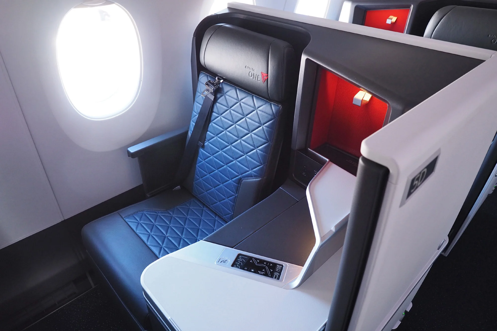
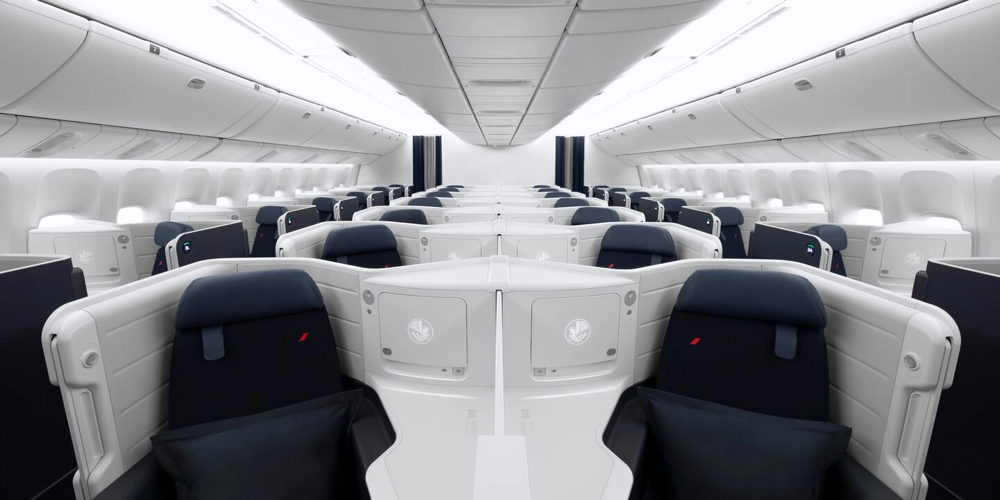
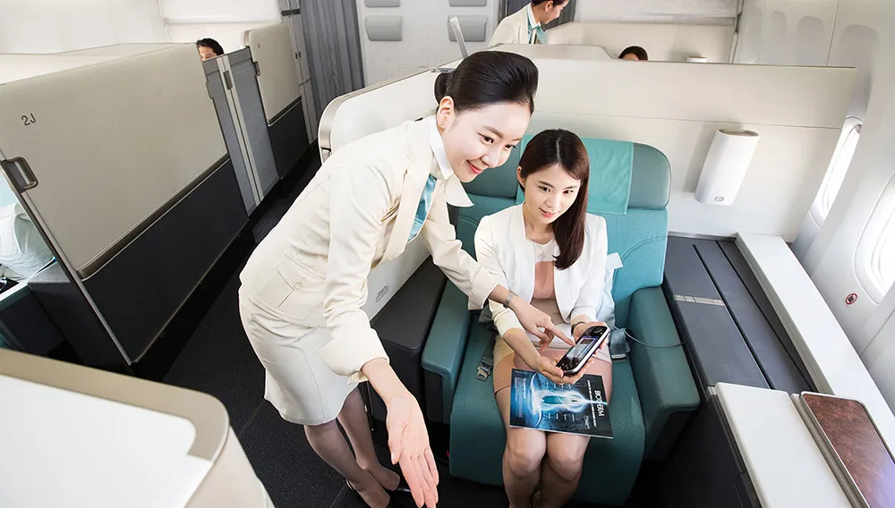
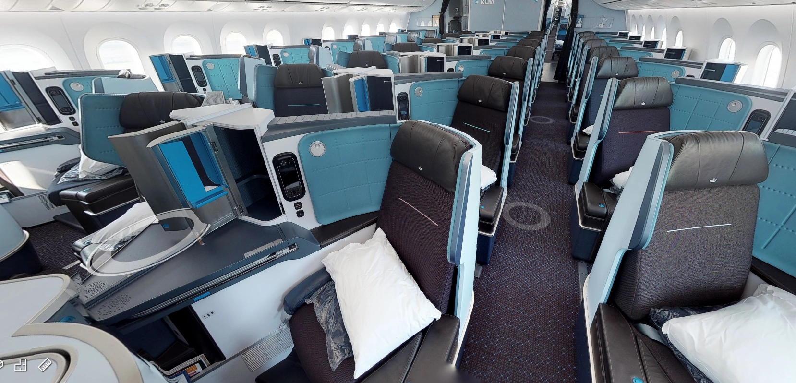
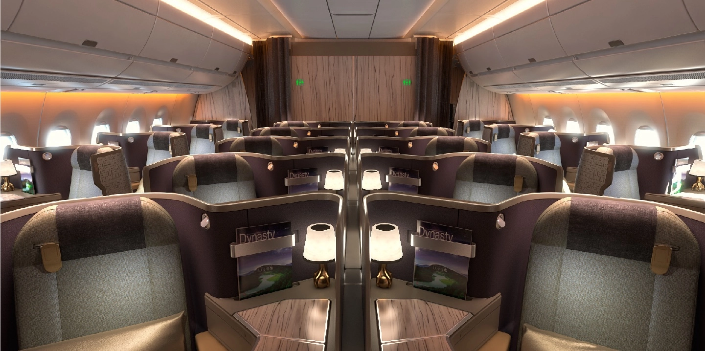
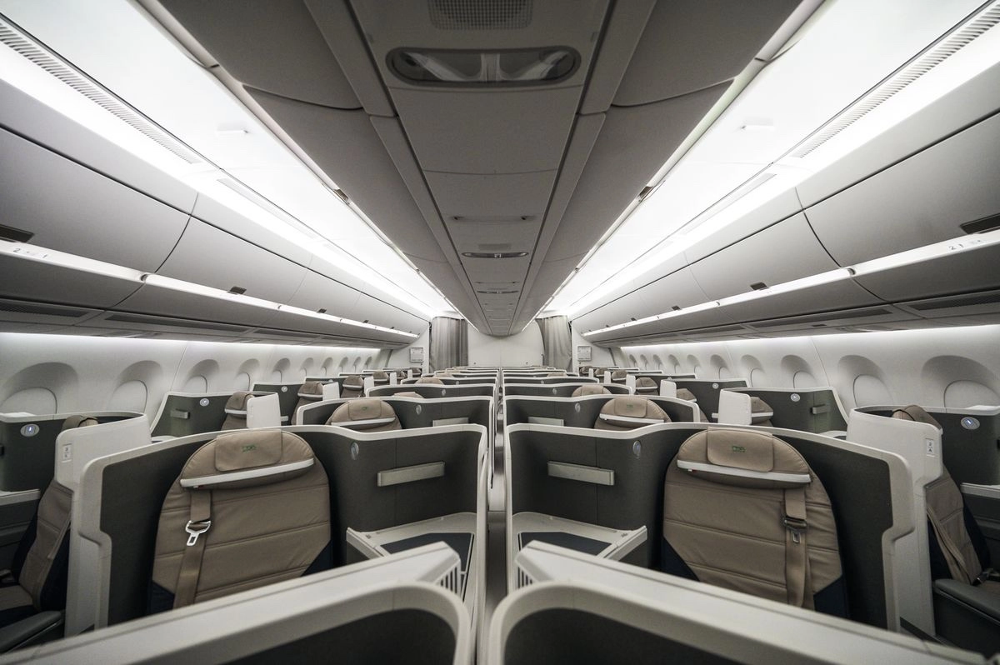

With all the buzz around SAS joining SkyTeam [after being acquired by Air France-KLM](https://blog.awardfares.com/sas-acquisition/) and others, we read many negative comments about this transition. At AwardFares, we are focused on helping EuroBonus members navigate this new phase by bringing the latest tools and information we have at hand.

We also strive for a positive, more resilient mindset during unsettling times like this one. Sure, there are aspects we will miss from Star Alliance, but we are taking our first step towards embracing change. In this post, we look at the bright side and cover some opportunities that will come once SAS is a member of SkyTeam.

### In This Post

- [Star Alliance vs. SkyTeam](#versus)
- [SAS In SkyTeam: The Bright Side](#sas-in-skyteam)
- [Best SkyTeam Cabins And Redemptions](#best)
- [Things We'll Miss About SAS in Star Alliance](#sas-star-alliance)

## Star Alliance vs. SkyTeam (In A Nutshell) {#versus}

| Criterion             | Star Alliance       | SkyTeam             |
|-----------------------|---------------------|---------------------|
| **Founded**           | 1997                | 2000                |
| **Number of Members** | 26 (as of 2023)     | 19 (as of 2023)     |
| **Key Members**       | Lufthansa, United Airlines, Singapore Airlines, ANA | Delta Air Lines, Air France, KLM, Aeroméxico |
| **Total Destinations**| Over 1,300+         | Over 1,000+         |
| **Combined Fleet**    | Over 5,000 aircraft | Over 4,000 aircraft |
| **Headquarters**      | Frankfurt, Germany  | Amsterdam, Netherlands |
| **Global Coverage**   | Strong presence in North America, Europe, and Asia with growing presence in Africa and South America | Strong in North America and Europe with notable presence in Asia and Latin America |
| **Lounges**           | Access to over 1,000 lounges worldwide | Access to over 750 lounges worldwide |
| **Major Hubs**        | Chicago, Frankfurt, Singapore, Tokyo-Narita | Amsterdam, Atlanta, Paris-CDG, Seoul-Incheon |

## SAS in SkyTeam: The Bright Side {#sas-in-skyteam}

### 1. Heavy investment from Air France-KLM

As Air France-KLM is getting a stake in SAS, their investment has the potential to provide several benefits to the Scandinavian airline, including increased financial stability, expanded network and connectivity, shared expertise and resources, and increased competitiveness. On top of that, Air France-KLM is known for its high-quality customer service and excellent staff training.

### 2. North America Still Strong With Delta Air Lines And Aeroméxico

SkyTeam's founding members, Delta Air Lines and Aeroméxico are both major airlines in these regions that boasts an extensive global network, connecting travelers to over 300 destinations across 50 countries. Delta's modern fleet, featuring state-of-the-art aircraft like the Airbus A350 and Boeing 787 Dreamliner, ensures a comfortable and enjoyable flying experience.

With SkyPriority, frequent flyers get complimentary upgrades, priority boarding, and access to exclusive lounges. Recognized for its excellent customer service, Delta consistently ranks among the top airlines in customer satisfaction surveys.

### 3. An Open Door To Brazil

GOL Airlines is not a SkyTeam partner but a valuable partner for SkyTeam travelers seeking to explore South America's largest country. Both Air France-KLM and Delta have a significant stake in the company. With its extensive domestic network spanning over 60 destinations, GOL provides convenient connections to Brazil's iconic landmarks, from the bustling metropolis of São Paulo to the sun-kissed beaches of Rio de Janeiro and the lush rainforests of the Amazon.

SkyTeam passengers can seamlessly integrate GOL flights into their itineraries, enjoying seamless connections and reciprocal benefits through the SkyTeam partnership (earning and redeeming miles on GOL flights too). GOL's modern fleet and commitment to on-time performance ensure a comfortable and reliable travel experience. Explore Brazil's diverse regions, from the vibrant cultural hub of Salvador to the breathtaking Iguazu Falls, all made accessible through GOL's extensive domestic connections.

### 4. Discover Argentina

Aerolíneas Argentinas, the flag carrier of Argentina, is a key partner for SkyTeam members seeking to discover the wonders of this South American gem. With its extensive domestic network and seamless connections to SkyTeam's global network, Aerolíneas Argentinas opens up a world of possibilities for travelers to explore Argentina's diverse landscapes, vibrant cities, and rich cultural heritage.

From the bustling urban center of Buenos Aires to the stunning landscapes of Patagonia, the Iguazu Falls in the northeast, or the wine regions of Mendoza, the airline ensures that the beauty and diversity of Argentina are accessible to everyone. 

The airline also assures SkyTeam travelers of quality service, consistent with the standards they expect from the alliance. By flying with Aerolíneas Argentinas, SkyTeam travelers not only unlock the wonders of Argentina but also experience the warm hospitality and rich culture that the nation is renowned for.

### 5. A Gateway To China

SkyTeam has not one, but **two** Chinese member airlines. This duo makes it a perfect choice if you are flying long-haul but also connecting domestically within Mainland China. 

The two airlines are:

- **China Eastern Airlines** is one of the three major airlines in Mainland China and is headquartered in Shanghai. It has a fleet of over 750 aircraft and flies to over 250 destinations worldwide.
- **Xiamen Airlines** is a subsidiary of China Southern Airlines and is headquartered in Xiamen, Fujian Province. It has a fleet of over 200 aircraft and flies to over 60 destinations worldwide. In 2019, [China Southern left SkyTeam](https://simpleflying.com/china-southern-skyteam/), but interestingly Xiamen Airlines still remains a member.

In addition, there's **China Southern**. While this airline also left SkyTeam recently, there are still many valid codeshare agreements with SkyTeam airlines, which might make it possible to redeem award flights on them (just like with GOL).

Together, these airlines provide travelers with a wide range of options for reaching their desired destinations, both within China and around the globe.

### 6. China Airlines: Taiwan's National Carrier

China Airlines is the largest airline in Taiwan and is headquartered in Taoyuan International Airport and also serves Songshan Airport located in central Taipei. It has a fleet of over 90 aircraft and flies to over 150 destinations worldwide, connecting Asia to Europe, North America and the Pacific.

### 7. Virgin Atlantic: A Hidden British Gem

Virgin Atlantic is a unique and prominent British airline known for its innovative approach and customer-centric service. It joined SkyTeam in March 2023, being SkyTeam's first and only UK member airline.

Operating primarily out of London's Heathrow and Gatwick airports, as well as Manchester Airport, Virgin Atlantic offers a diverse range of routes to destinations around the world, with a strong presence in North America and the Caribbean. The airline is known for its stylish and comfortable cabins, friendly service, and commitment to sustainability, making it a popular choice for both leisure and business travelers seeking a distinctive and enjoyable flying experience.

Virgin Atlantic is on a mission to be carbon neutral by 2050, and has recently introduced new Business Class cabins on their A330neo aircraft.

## Best SkyTeam Cabins and Redemptions (We Look Forward To) {#best}

### 1. Delta One Suites

Delta Air Lines' flagship business class product, Delta One Suites, provides a private and luxurious experience with fully enclosed suites, lie-flat beds, and direct aisle access.

These meticulously designed suites are found on select Airbus A350 and A330-900neo aircraft.

### 2. Air France New Business Class and La Première

Launched in 2023, this revamped cabin takes your in-flight experience to the next level, mixing high-tech features with that signature French flair. A fully enclosed suite, where a sliding door gives you total privacy and peace, with a lie-flat seat, which turns into a cozy cocoon for restful sleep, complete with a plush duvet and a comfy pillow. 

There's a massive 17.3-inch 4K high-definition touchscreen, while staying connected with super-fast Wi-Fi. Treat your taste buds to a symphony of delicious dishes created by top chefs, paired with a selection of fine wines handpicked by Air France's wine experts. Every detail is carefully designed to make your journey one to remember.

On top of that, Air France's La Première offers an exclusive first-class experience with spacious suites, personalized service, and Michelin-starred dining. Air France is set to introduce new La Première cabins in the upcoming months.

### 3. Korean Air Kosmo Suites 2.0

Korean Air's Kosmo Suites 2.0 provides a sophisticated business class experience with fully flat beds, premium amenities, and attentive service. Kosmo Suites 2.0 features a spacious and well-designed seating arrangement in a 1-2-1 reverse herringbone configuration. This layout ensures direct aisle access for every passenger, providing a sense of exclusivity and privacy. Each suite is meticulously crafted to provide a comfortable and personal space for travelers to relax and unwind during their journey.

### 4. KLM World Business Class

KLM's World Business Class offers a comfortable and stylish business class experience with lie-flat seats, in-flight entertainment, and Dutch hospitality. Service is top-notch, and we also love the Dutch Houses you get every time you hop on Business Class.

### 5. China Airlines Premium Business Class

China Airlines' Premium Business Class provides a refined business class experience with lie-flat seats, spacious cabins, and Taiwanese-inspired cuisine.

### 6. ITA Airways A350

**IMPORTANT NOTE**: *ITA Airways, is set to leave SkyTeam and join Star Alliance in the near future. While there's still no ETA and it's not clear if it is going to happen before or after SAS joins SkyTeam, take this example as a 'grab while they last' case.*

ITA Airways' A350 business class provides a comfortable and stylish experience for discerning travelers, offering a blend of modern amenities, Italian hospitality, and culinary delights. Their A350 business class cabin features Collins Aerospace Super Diamond reverse herringbone seats arranged in a 1-2-1 configuration.

## Things We'll Miss About SAS In Star Alliance {#sas-star-alliance}

We are all going to miss certain perks from SAS being a Star Alliance member. Here's our top list. What's on your list? Feel free to send us your suggestions!

*Note: links are clickable. It'll open a new tab and perform a search in AwardFares.*

1. [Lufthansa First Class Redemption](https://awardfares.com/search?..;c:first;a:LH;z:sas#).
2. [High availability of business class in Lufthansa and Swiss](https://awardfares.com/search?..;c:business;a:LH,LX;z:sas).
3. [EVA Air connections to/from Europe](https://awardfares.com/search?..;c:business;a:BR;z:sas).
4. [ANA redemptions on the 777-300ER (The Room)](https://awardfares.com/search?..;c:business;a:NH;z:sas#).
5. [United Polaris Business Class](https://awardfares.com/search?..;c:business;a:UA;z:sas#).
6. [Cheap Business Class awards on Copa Airlines (737 MAX)](https://awardfares.com/search?..;c:business;a:CM;e:7M8,7M9;z:sas).
7. [Redemptions on Air Canada's 787](https://awardfares.com/search?..;c:business;a:AC;e:781,787,788,789;z:sas).

## Get started, and stay tuned.

You can [try AwardFares for free](https://awardfares.com/). We are rolling out new features and improvements regularly, so sign up for our newsletter to stay on top of the latest news, announcements, and pro tips!

With our [premium features on Gold and Diamond](https://awardfares.com/pricing), you can also set up alerts to get notified when a certain route or flight gets opened, as well as check seat maps, flight schedules, and more.

## Read more {#read-more}

Make sure to also check these posts out

- [SAS Will Leave Star Alliance: Acquisition By Air France-KLM and others](https://blog.awardfares.com/sas-acquisition/)
- [Book These EuroBonus Award Flights Before SAS Leaves Star Alliance](https://blog.awardfares.com/eurobonus-star-alliance-awards/)
- [Essential Guide To Book Lufthansa Flights With SAS EuroBonus Points](https://blog.awardfares.com/lufthansa-with-eurobonus-guide/)
- [SAS Opens New Route To Morocco (And You Can Book It With Points)](https://blog.awardfares.com/sas-opens-route-to-morocco/)
