We are thrilled to unveil a set of game-changing features that will redefine the way you explore and book award flights. In this occasion, we are introducing award prices and mixed-cabin award searches.

Whether you're a seasoned points-enthusiast or a casual traveler, these additions to our state-of-the-art platform is designed to empower you and make your award travel dreams more accessible and exciting than ever.

We are committed to enhancing your travel experience and take your journey planning to new heights. Let's have a look at the new search!

### What's new?

- [Award Prices](#prices)
- [Mixed Cabin Awards](#mixed-cabin)
- [Improved Alerts Filters](#alerts)
- [New Search Results Header](#header)

## Award Prices {#prices}

Once you log in to AwardFares, select a frequent flyer program and perform a search, you will notice new colored *pills* in the result list below.

Inside, each pill shows the number of points or miles required to redeem the award flight. Below the pill, you will also see how many seats are available in that cabin.

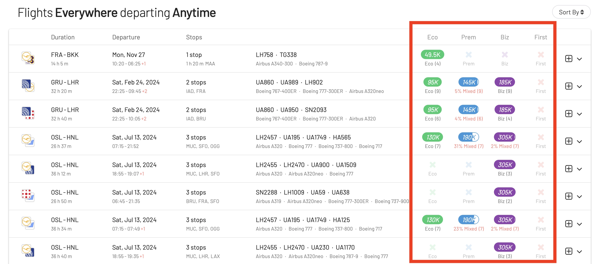

Note that these pills with prices are **not** shown if no loyalty program, or multiple programs are selected (as different programs might have very different pricing schemes).

Here's an example of how the search results look like when there's no loyalty program chosen (same screen as before):

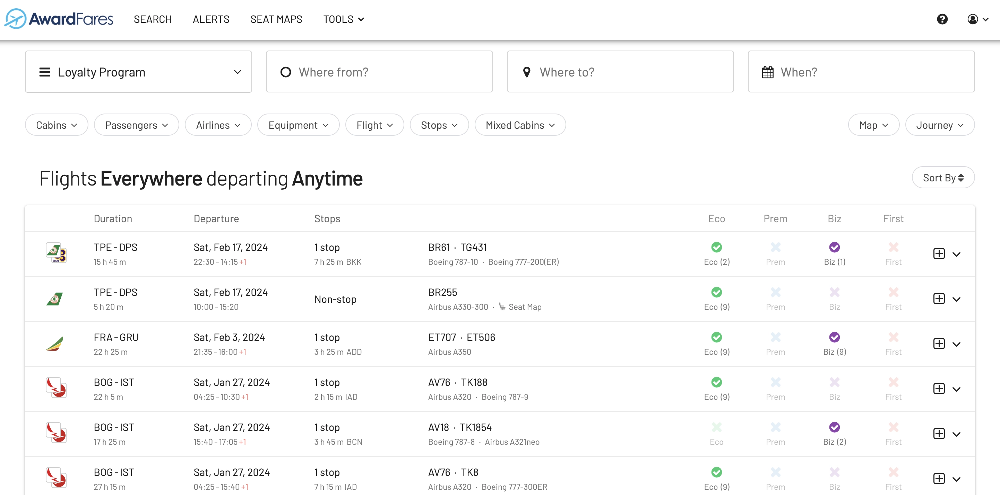

### Prices (Expanded View)

The new expanded view now also reflects the award prices in more detail. For most providers, the round-trip price is based on the one-way segments, thus AwardFares only shows the one-way price.

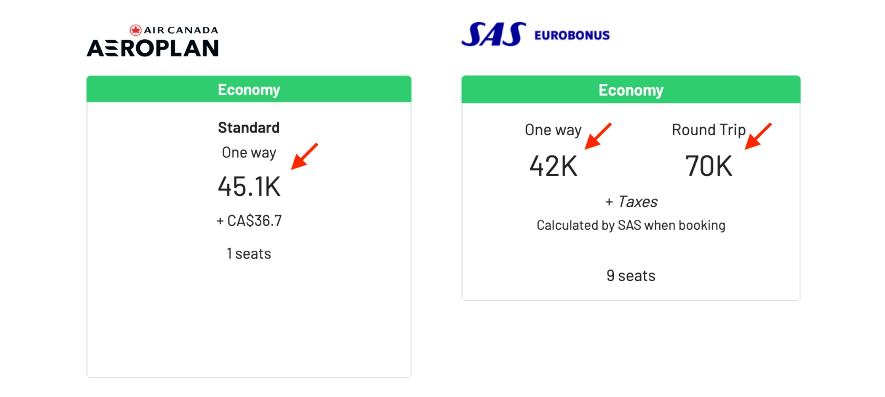

For SAS EuroBonus, the one-way price changes depending if it is a redemption on SAS (50% of round-trip price) or on a Star Alliance partner (60% of round-trip price, i.e. more expensive). Thus, in this case, AwardFares displays both prices.

We'll continue to add support for more programs in the upcoming weeks, and adjust the pricing information depending on their award chart.

### Taxes

Along with prices, AwardFares also shows taxes and fees for redeeming the award flights. This information is not accessible for SAS EuroBonus, so you'll see a message accordingly.

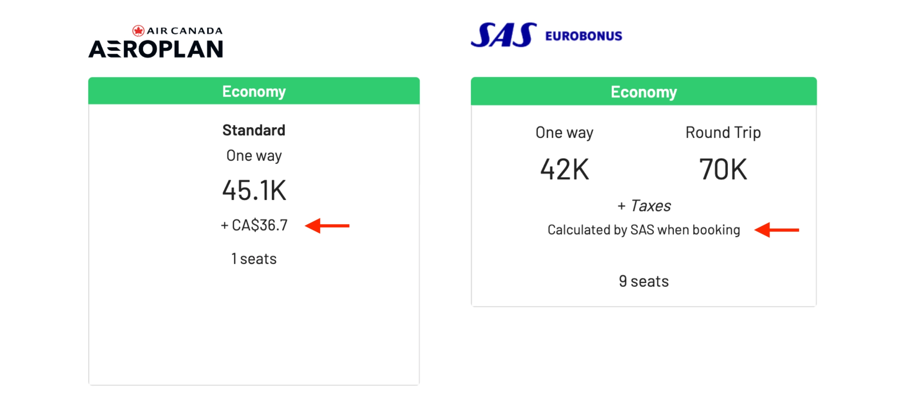

### Saver vs. Non-saver Prices

Some programs offer cheaper “Saver” fares (e.g. United and Air Canada). In the result list non-saver prices are indicated by italic font (and if you hover over it will say non-saver).

It’s easier to see this when you expand the flight. We will clearly state if it is a non-saver or saver fare.

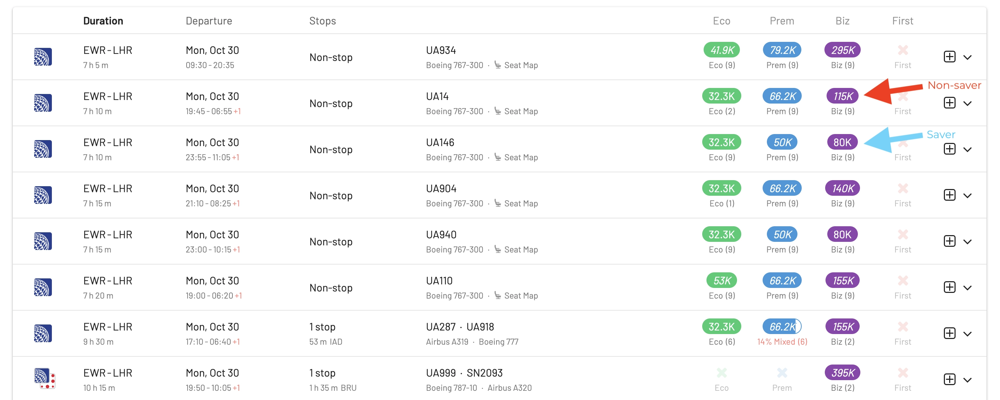

What's the difference between Saver and Non-saver?

#### Saver Award Flights

- **Lower Miles Cost**: These tickets typically require fewer frequent flyer miles or points to redeem compared to non-saver (or standard) award flights.
- **Limited Availability**: Saver awards are limited in number. They might not be available on all flights or on all dates, especially during peak travel times or high-demand routes.
- **Fewer Perks**: Saver awards may come with more restrictions, such as being non-refundable or having change fees.
- **Popular with Savvy Travelers**: Because they offer a better “value” in terms of miles or points, frequent travelers often seek out saver award availability first.

#### Non-Saver (Standard or Flexible) Award Flights

- **Higher Miles Cost**: These tickets typically require a significantly higher number of frequent flyer miles or points to redeem when compared to saver awards.
- **Greater Availability**: Non-saver awards are generally more readily available than saver awards. This means that if you're looking to travel on a specific date or time, especially during peak seasons, you might find it easier to book a non-saver award.
- **More Flexibility**: These awards might come with fewer restrictions. For instance, they might be easier to change or cancel without incurring hefty fees.
- **Good for Last-Minute or Peak Time Travel**: Travelers who are booking last-minute or are less flexible with their dates might find that only non-saver awards are available.

#### United MileagePlus

Here's how AwardFares displays Saver vs. Non-saver availability for MileagePlus award searches.

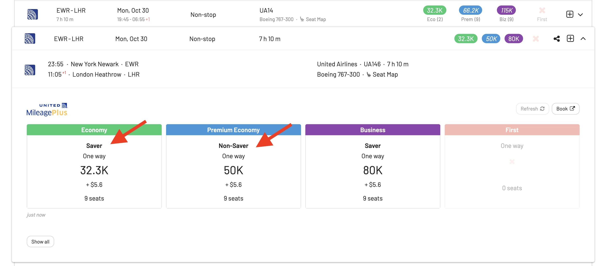

#### Air Canada Aeroplan 

Here's how AwardFares displays Saver vs. Non-saver availability for Aeroplan award searches.

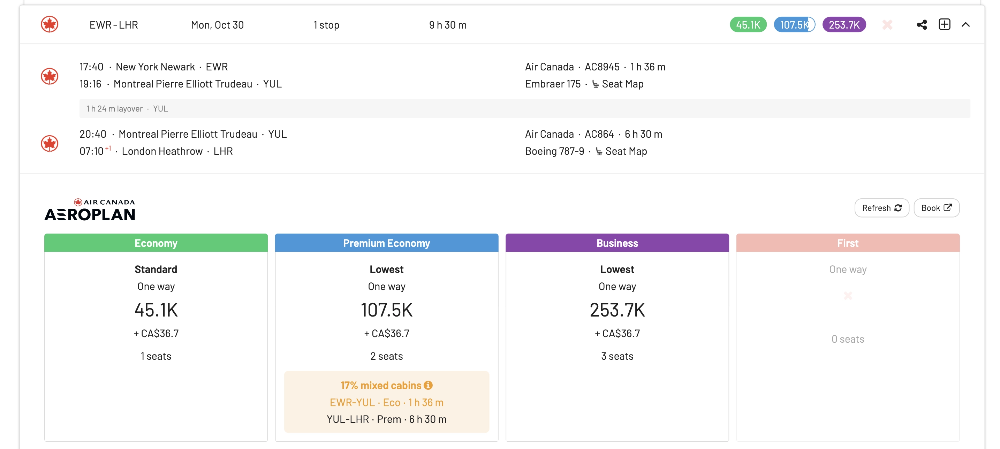

## Mixed Cabin Awards {#mixed-cabin}

Another key feature in this update is the support for mixed-cabin award searches Mixed-cabin awards are also known as blended or combination-cabin awards, and are a type of pricing structure offered by some airlines and frequent flyer programs when you book an award ticket that involves segments in different travel classes or cabins of service.

With mixed-cabin awards, you have the flexibility to combine segments of your journey in different travel classes. For example, you could book a business class ticket for the long-haul portion of your flight and an economy class ticket for the shorter connecting flight.

Ultimately, the pricing structure depends on the airline and program, but there are several reasons why booking a mixed-class award flights make sense. Sometimes it might be cheaper (and you save points/miles on short-haul segments where premium cabins are not worth it), and other times it's linked to availability.

In this new AwardFares release, we represent Mixed Cabin by the fill inside each pill (based on flight time). For example, if the trip is 50% mixed, then the pill will be half filled, and it means that half of the travel time will be in one cabin, and the rest in a different one.

In the expanded view you can see the mixed cabin per leg. AwardFares also helps you identify good combinations with some color-coding heuristics: **Yellow** or **Red**. These heuristics are meant to help users distinguish between 'good' and 'bad' combinations.

You will see **Yellow** if the mixed cabin is under 30% or a downgraded leg is under 3 hours (e.g., short flights flight time).

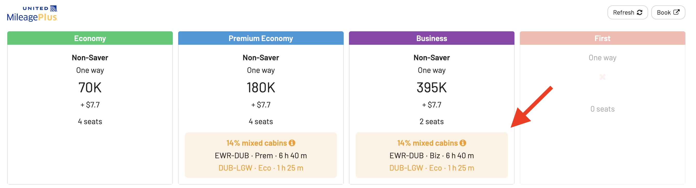

Similarly, you will see **Red** if the mixed cabin is 30% or more OR if a downgraded leg is 3 hours or longer.

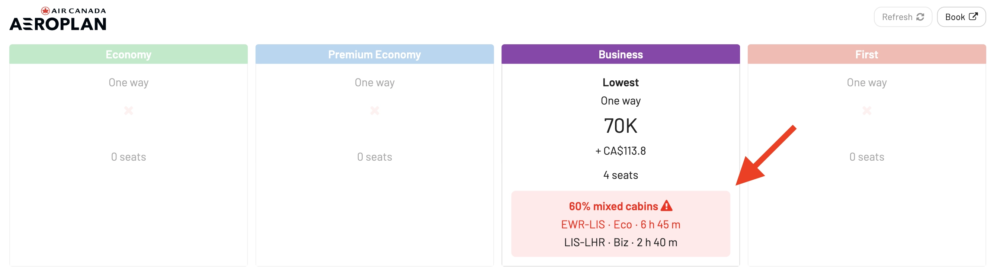

### Mixed Cabin Filter

We’ve also added a brand new **Mixed Cabin filter**. Once clicked, the pop-up also shows a warning to clarify that EuroBonus searches do not support mixed cabins. Check our [Journey Planner tutorial](https://blog.awardfares.com/journey-planner) for our guide to book mixed-cabin awards with EuroBonus.

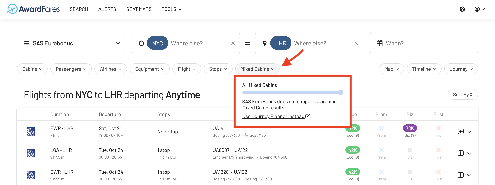

#### Without Filter

If you set the mixed cabin filter (for example to 15%), AwardFares will show all fares that have at least one cabin, with max 15% mixed cabins. In this case, we didn't use the Cabin Filter, so the results will include **all fares**, but any cabins over this limit will be greyed out. 

Note that you will also see tickets in just Economy, given that is considered a *0% mixed-cabin* award.

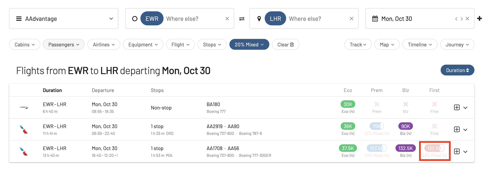

#### With Filter

This filter becomes much more useful when adding a Cabin filter. In that case, AwardFares only shows those fares where at least one of the selected cabins fulfill the limit.

For example, if you set the Cabin filter to First or Business class, the itinerary must contain at least one segment in Business or First (excluding Economy flights).

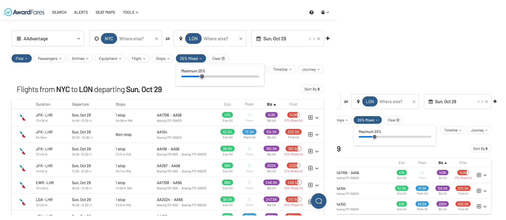

#### Improved Alerts Filters {#alerts}

Alerts are also upgraded with our mixed cabin filter! This means you can get notified also when mixed-cabin award flights become available. Keep in mind that, by default, the Alerts will exclude mixed cabins. Hence, you'll need to set up a value to be notified on mixed-cabin awards.

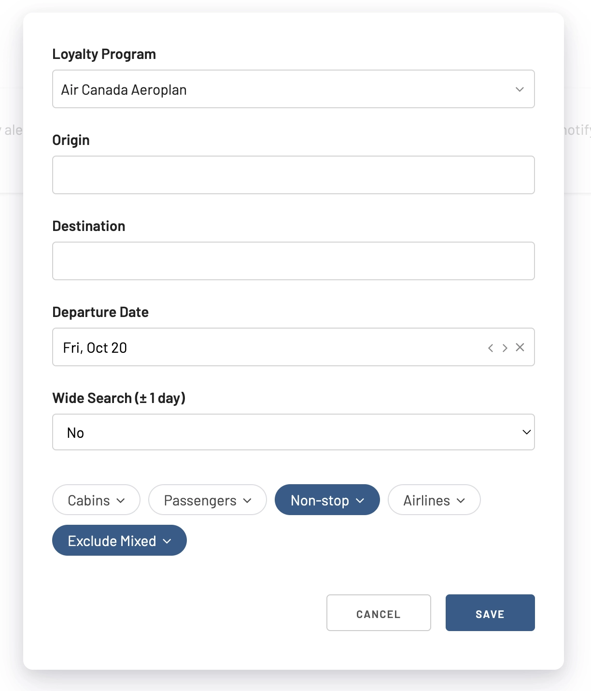

## New Search Results Header {#header}

Another cool upgrade is a redesign of the header row in the search results table. This header is now interactive, and you use it to sort the results.

Now, it is much easier to sort and explore results by price and cabin.

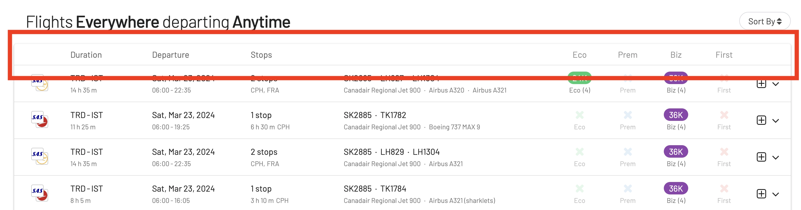

### Sort by Cabin

In this example you will see how the result list changes after clicking in the **Biz** (Business Class) header to find the cheapest Business class redemptions.

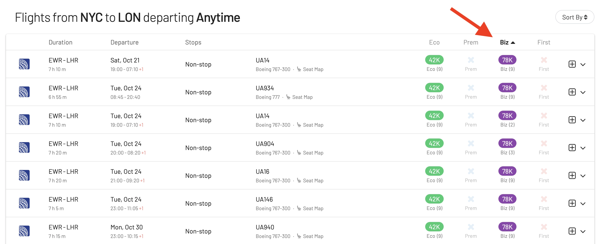

## Get started, and stay tuned

With our [premium features on Gold and Diamond](https://awardfares.com/pricing), you can get access to premium features such unlimited daily searches, alerts, seat maps, flight schedules, and more!

You can [try AwardFares for free](https://awardfares.com/). We are rolling out new features and improvements regularly, so [sign up to our monthly newsletter](https://awardfares.com/newsletter) to stay on top of the latest news, announcements, and pro-tips.

## Read more

Make sure to also check these posts out

- [Seat Maps: Getting The Perfect Seat Even Before Booking](https://blog.awardfares.com/seatmaps-guide/)
- [10 Tips For Booking An Award Trip In 2023](https://blog.awardfares.com/award-trip-tips/)
- [Demystifying Award Charts: All You Need To Know (2023)](https://blog.awardfares.com/demystifying-award-charts/)
- [Ultimate Guide to Award Release Dates](https://blog.awardfares.com/ultimate-guide-to-award-release-dates)