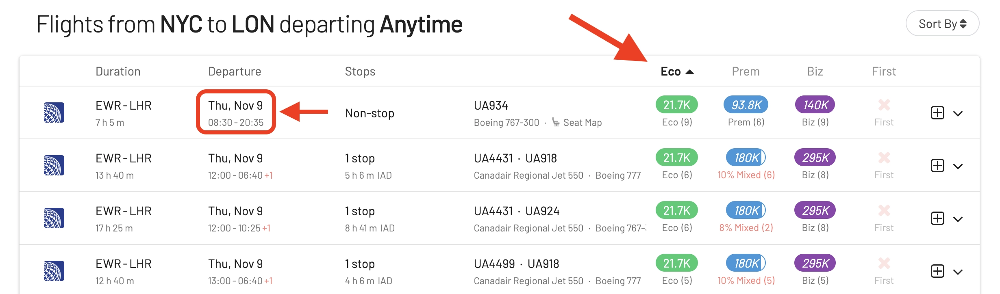
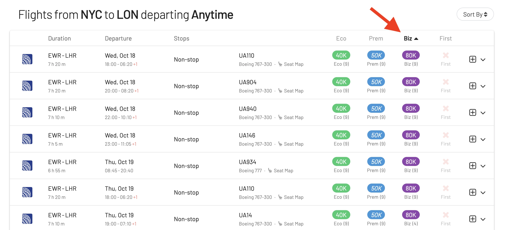

We hear you; the world of award flights sometimes feels like trying to crack a secret code. Our team members at AwardFares have over 15 years of experience redeeming "free" flights across different frequent flyer programs and airlines, and it still is a challenging game. That's why we crafted our tool AwardFares with love and strive to help fellow travelers like us with some of the issues we struggle with.

However, with the fluctuating value of miles and points, the shift to dynamic award charts, new blackout dates, and the heavy changes in airline alliances, booking an award flight and determining good versus bad redemptions is more challenging than ever.

**But there's good news**. Our [recent major update](https://blog.awardfares.com/prices-and-mixed-cabins/) brings a powerful feature to help you get the most out of your points and miles. You can see and sort by award prices, identifying the cheapest redemptions, dates, airlines, and itineraries. You can also compare prices of the same award seat on different loyalty programs. Plus, AwardFares now shows you mixed-cabin itineraries and saver availability to save a few miles here and there on short-haul connections.

This guide tells you exactly how to leverage AwardFares to search and find cheap award flights across multiple frequent flyer programs and airlines. In addition, we also guide you through all you need to know to determine if you are getting a good redemption, helping you make more informed decisions when booking award flights.

### In This Post

- [Useful Reads](#preread)
- [How To Find Cheap Award Flights (Step-by-step)](#how-to)
- [How To Determine If You Are Getting A Good Redemption?](#eval)

## Useful Reads {#preread}

If you want to get familiar with how frequent flyer programs work and how they determine the prices of award flights, check these posts we wrote.

- [Demystifying Award Charts: All You Need To Know (2023)](https://blog.awardfares.com/demystifying-award-charts/)
- [Ultimate Guide to Award Release Dates](https://blog.awardfares.com/ultimate-guide-to-award-release-dates/)
- [10 Tips For Booking An Award Trip In 2023](https://blog.awardfares.com/award-trip-tips/)

## How To Find Cheap Award Flights (In Economy, Business, and First Class) {#how-to}

### 1. Go to [AwardFares](https://awardfares.com/signup)

Creating an account is optional, but it's also free, and it gives you access to more features. Make sure to [sign up for one here](https://awardfares.com/signup).

### 2. Select your favorite **Frequent Flyer Program**

### 3. Add a Route

In the **Origin** and **Destination** fields, add one or more airports to search for flights between those locations. AwardFares will search for award flights regardless of the number of stops. You can use the **Stops** filter to only search for direct/non-stop flights.

In the example below, we search for flights between New York City and London. Note that we use the metropolitan area codes **NYC** and **LHR** to get results to and from any airport in New York (JFK, EWR, LGA) and London (LHR, LGW).

Although this step is optional because you can explore available routes within our cached results, adding one or a few origin/destination airports is recommended to get fresh results and the latest availability.

### 4. Explore dates

If you have a particular date in mind, add it by tapping on the **Calendar** field.

Alternatively, you can use AwardFares **Timeline View** to explore the seat availability on different dates. The Timeline View displays how many seats are available for each day of the week/month. The bars are color-coded, so it's easy to distinguish between cabin classes (Economy, Business, First). You can also trigger new searches by tapping the refresh icon underneath each day.

In addition, you can also use the **+** button on AwardFares to get more details about those flights, such as aircraft type, and even [get the current seat maps](https://blog.awardfares.com/seatmaps-guide/) to see which seats are free versus occupied!

### 5. Sort by Price

#### Find The Cheapest Economy Class Awards

#### Find The Cheapest Premium Economy Awards

#### Find The Cheapest Business Class Awards

#### Find The Cheapest First Class Awards

### 6. Book with the Airline

## How To Determine If You Are Getting A Good Redemption? {#eval}

Traveling on award flights is a rewarding experience, but not all redemptions are the same, particularly with most programs switching to dynamic award charts. Some offer significantly better value than others. 

So, how can you be certain you're getting a good deal with your hard-earned miles or points? Here’s a few things to keep in mind that will help you determine the worthiness of an award flight redemption.

### The Cent-Per-Mile (CPM) Calculation

To determine if you're getting good value, you can use the CPM calculation:

CPM = (Cash Price of Ticket - Taxes and Fees) / Number of Miles Used

The same applies if your program uses points instead of miles (1 mile/point). For example, if a flight costs $500 or 25,000 miles plus $50 in taxes and fees, the calculation would be:

CPM = ($500 - $50) / 25,000 = 1.8 cents per mile

Generally, a CPM above 1.5 cents (USD/EUR) in economy and higher in premium cabins is considered good, but this can vary by airline and route. It also varies depending on your currency.

But beyond the absolute value, you can use this metric to compare different redemptions within the same program. If you are getting a 0.3 cent per point value on a fight between Stockholm and Frankfurt, but a 1.1 cent per point on a flight from Stockholm to Miami, it might be better to aim for the latter one, even if you need to rack up more points. Unless they expire soon, of course.

### Quick CPM Calculator

Use the minitool below to calculate the CPM of your award flight. You can enter the price in any currency ($/€/£/SEK/NOK/DKK).

    <label for="cashPrice">Cash Price of Ticket ($/€...): </label>
    <input type="number" id="cashPrice" placeholder="e.g., 500">
      
    <label for="taxesFees">Taxes and Fees: </label>
    <input type="number" id="taxesFees" placeholder="e.g., 50">
      
    <label for="milesUsed">Number of Miles/Points Used: </label>
    <input type="number" id="milesUsed" placeholder="e.g., 25000">
      
    <button class="btn" onclick="calculateCPM()">Calculate CPM</button>
      
    <label for="result">CPM (cents-per-mile/point): </label>
    <input type="text" id="result" readonly>

### Consider the Cash Price

Before redeeming miles, always check the cash price of the same ticket. If it's low, it might be more economical to pay cash and earn miles on that flight, saving your accumulated miles for a pricier ticket in the future. This can also be a good option to help you earn point faster and also qualify for elite status, getting better benefits in the long run.

### Recognize the Value of Premium Redemptions

Typically, using miles for premium cabins such as First and Business Class can often provide higher value, especially for long-haul flights. While the miles required might be significantly more, the experience, comfort, and amenities can make it worth it.

Airlines tend to have very aggressive deals and discounted fares for Economy Class tickets, and not so much for premium cabins. This means that you will likely get a higher CPM value on premium cabin flights and hence a better return.

Of course, it ultimately depends on what kind of travel you want to do (short haul or long haul), which destinations, and your travel group (solo, couple, family, etc.).

### Beware of High Taxes and Surcharges

Some airlines have hefty fuel surcharges on award tickets, which can diminish the value of your redemption. Always calculate the total cost, including fees, to determine the true value.

**Always check** and compare the same route served by different airlines. Onboard service and the experience you get is one thing to evaluate (some airlines have better planes, cabins and service than others), but can also charge heavy fees and surcharges.

For example, the route Frankfurt to Los Angeles is served by Lufthansa, American and United, but United charges $12 in fees to book the award, while Lufthansa charges $136. That's a 10x difference!

### Compare Across Loyalty Programs

The same flight can be available in more than one program! For example, you could book the same seat using Aeroplan Miles or SAS EuroBonus points, while having different price. Before booking, check which program has the same price and evaluate if you can book.

This trick doesn't work if your points are not transferrable, but it is very handy if your points are convertible or your loyalty program has multiple transfer partners. For example, there are a ton of credit cards (like American Express) that allow you to send your points to a specific program.

With AwardFares, it's extremely simply to compare the price in different programs. Simple click on the **Expand** icon (+) and you'll see if the seat is available in other programs, and for how much.

### Understand Seasonality and Demand

Awards during peak travel times might require more miles. If possible, travel during off-peak seasons for better availability and value.

Some programs offer different rates for high and low seasons, and they call it **saver** and **non-saver**. AwardFares shows this information clearly in the detailed view.

### Set Up Alerts

AwardFares can help you monitor and find the best award flight opportunities. Setting up alerts ensures you're informed as soon as a good redemption pops up, via email. We have [a full tutorial here](https://blog.awardfares.com/alerts/).

We are already working on some feature requests, such as price-based alerts, so that you get a notification only for when a given seat becomes available at a certain price point. Stay tuned to our updates and make sure to [subscribe to our newsletter](https://awardfares.com/newsletter) to get all the latest information!

### Remember the Intangible Value

While the CPM calculation is handy, sometimes the value of an award booking is more personal. Maybe it's the ability to attend a special family event or a once-in-a-lifetime trip. Not all good redemptions can be measured in cents per mile.

Determining the value of an award flight isn't solely about mathematics; it's also about personal value and the experiences that travel brings. Always weight the quantitative and qualitative aspects to ensure you're making the best choice for your travel needs and wishes.

## Get started, and stay tuned

With our [premium features on Gold and Diamond](https://awardfares.com/pricing), you can get access to premium features such unlimited daily searches, alerts, seat maps, flight schedules, and more!

You can [try AwardFares for free](https://awardfares.com/). We are rolling out new features and improvements regularly, so [sign up to our monthly newsletter](https://awardfares.com/newsletter) to stay on top of the latest news, announcements, and pro-tips.

## Read more

Make sure to also check these posts out

- [Introducing Award Prices And Mixed Cabin Flights](https://blog.awardfares.com/prices-and-mixed-cabins/)
- [Seat Maps: Getting The Perfect Seat Even Before Booking](https://blog.awardfares.com/seatmaps-guide/)

