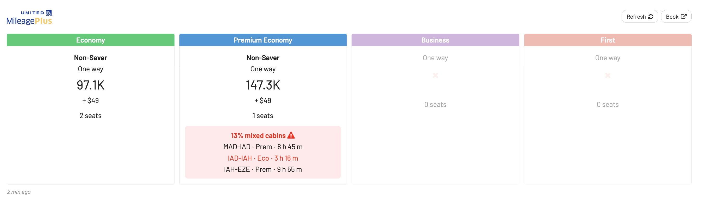

The world of airline miles and credit card points offers a myriad of opportunities. Whether it's jet-setting to a luxury destination on first-class tickets or scoring a free short-haul trip, redeeming miles effectively can save travelers thousands of dollars.

[AwardHacker](https://www.awardhacker.com/), a great online tool, helps thousands of travelers every year find out how many miles are needed for specific award flights between two cities, across various frequent flyer program.

In this post, we show how **AwardFares** is an excellent complement to AwardHacker. When used together, these platforms provide a comprehensive view of available award flights, enabling users to get the most bang for their buck, or mile, in this case.

Let's get started!

_Note: As the name of both tools are quite similar, we will denote **AwardFares** in bold, to make it more clear._

## The Basics

### What is AwardHacker?

[AwardHacker](https://www.awardhacker.com/) is a free online tool that helps users determine how many miles are required to fly from Point A to Point B with various frequent flyer programs. Instead of manually checking each airline's redemption chart, users can quickly get an overview of which programs offer the best value for a particular route.

### Key Features of AwardHacker

- Comprehensive database of major frequent flyer programs.
- Ability to filter results based on one-way, round trip, or multi-city trips.
- Shows results for economy, premium economy, business, and first-class.
- Direct links to the relevant frequent flyer program for booking.

_Image: AwardHacker Homepage._

### What is AwardFares?

While AwardHacker tells you the theoretical cost of award flights, **AwardFares** goes a step further by showing actual availability. You can try it for free, and also upgrade to more premium tiers that are packed with features such as advanced filtering capabilities, alerts, seat maps, journey planner, and more. **AwardFares** is key to scoring long-haul business and first class award seats, which are extremely competitive.

### Key Features of AwardFares

- Real-time award seat availability for major airlines.
- Blazing fast performance.
- Ability to set up alerts for specific routes and classes, notifying users when seats become available.
- Displays availability for a range of dates, ideal for flexible travelers.
- User-friendly interface with beautiful and clear visualizations of available seats.
- Great experience on mobile.

## Combining AwardHacker with AwardFares: 5 Reasons

At first glance, it may seem redundant to use both AwardHacker and **AwardFares**, but each platform serves a unique purpose in the award booking process.

While there's no shortage of tools and blogs dedicated to the art of maximizing miles and points, AwardHacker and **AwardFares** stand out as a dynamic duo that complements each other perfectly. Together, they provide both the theoretical and practical insights travelers need to turn their hard-earned miles into memorable journeys.

### 1. Comprehensive Mileage Overview Meets Real-time Availability

AwardHacker provides a broad overview of how many miles are needed across various frequent flyer programs for specific routes. It illuminates which program may offer the best bang for your buck.

**How AwardFares Helps**: While AwardHacker gives a theoretical perspective, **AwardFares** shows real-time seat availability. Together, they ensure you don’t just know the cost in miles, but also the probability of securing a seat.

_Image: AwardHacker Search Results_

### 2. Route Planning and Strategy Formulation

If you’re flexible with your destinations or are planning multi-city trips, AwardHacker can guide your route strategy by showcasing which programs are more favorable for each segment.

**The AwardFares Advantage**: Once you have an idea of potential routes and programs, you can hop onto **AwardFares** to see if award seats for these routes are available. You can also leverage AwardFares' [Journey Planner](https://blog.awardfares.com/journey-planner/), which is a powerful tool to break down a trip and work out award flights to difficult destinations.

_Image: AwardFares Journey Planner and Map View._

**Read more** about [AwardFares' Journey Planner feature here](https://blog.awardfares.com/journey-planner/).

### 3. Points Transfer Decisions

For those with credit card points, AwardHacker’s overview allows users to see which frequent flyer programs might be the most beneficial to transfer their points to.

**How AwardFares Helps**: Before making a transfer, you can double-check on **AwardFares** if the seats are available, ensuring you don’t lock your points in a program without seat availability.

_Image: AwardHacker Filter Searches By Loyalty Programs._

### 4. Flexibility with Class Preferences

AwardHacker displays the mileage requirements for economy, premium economy, business, and first-class. This feature can be useful for travelers who are flexible and want to decide which class offers the best value.

**How AwardFares Helps**: Once you've determined which class might be the best value for your miles, **AwardFares** can be used to check the availability of seats in that class for your chosen route. With the new features, you can also compare award prices and [search for mixed cabin itineraries](https://blog.awardfares.com/prices-and-mixed-cabins/).

_Image: AwardFares Pricing and Mixed Cabin Awards._

### 5. Alerts and Proactivity

While AwardHacker doesn’t offer alerts, its comprehensive data can guide frequent flyers on which routes or programs to monitor, especially if they're aiming for a specific redemption in the future.

**How AwardFares Helps**: With this preemptive knowledge from AwardHacker, you can set up precise alerts on **AwardFares**, ensuring you are notified as soon as seats become available on your desired routes and classes.

_Image: Easily set up alerts in AwardFares._

**Read more** about [AwardFares' Alerts feature here](https://blog.awardfares.com/alerts/).

## Get started, and stay tuned

With our [Gold and Diamond tiers](https://awardfares.com/pricing), you can access premium features such as unlimited daily searches, alerts, seat maps, flight schedules, and more!

You can [try AwardFares for free](https://awardfares.com/). We are rolling out new features and improvements regularly, so [sign up for our monthly newsletter](https://awardfares.com/newsletter) to stay on top of the latest news, announcements, and pro-tips.

## Read more

Make sure to also check these posts out

- [Seat Maps: Getting The Perfect Seat Even Before Booking](https://blog.awardfares.com/seatmaps-guide/)
- [10 Tips For Booking An Award Trip In 2023](https://blog.awardfares.com/award-trip-tips/)
- [Demystifying Award Charts: All You Need To Know (2023)](https://blog.awardfares.com/demystifying-award-charts/)
- [Ultimate Guide to Award Release Dates](https://blog.awardfares.com/ultimate-guide-to-award-release-dates/)
