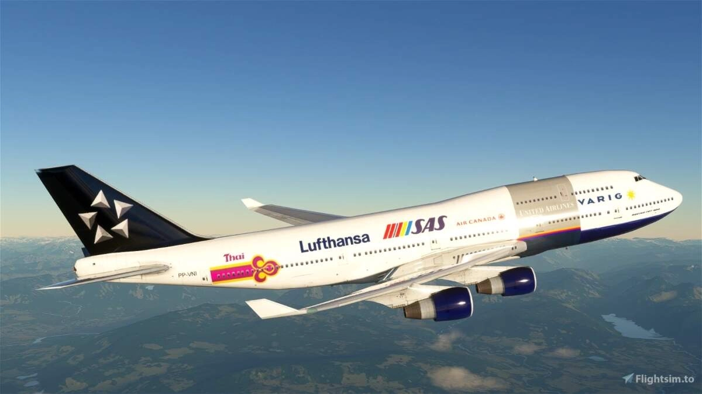
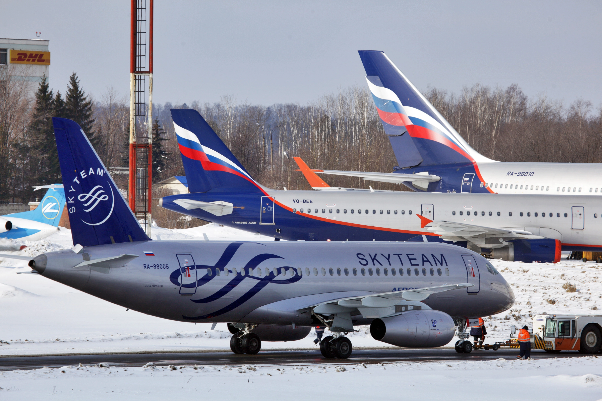
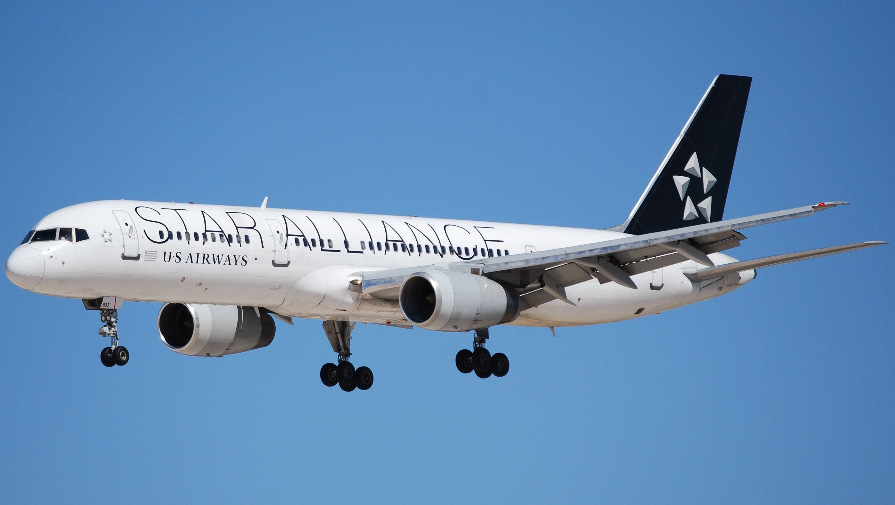

Airline Alliances, which are essentially partnerships between airlines, have been a cornerstone of the industry since the 1990s. They offer mutual benefits for airlines, from marketing to operational cooperation, which translates into more seamless travel experiences for passengers. 

Over the years, however, several airlines have shifted allegiances, changed alliances, or even decided to go it alone. In this article, we look a bit at the history of these moves, looking at notable instances of airlines that have changed or left alliances.

We also show how AwardFares can be your perfect companion tool when these changes happen, helping you make more informed decision as a frequent flyer program member, and protecting the value of your points or miles.

Let's start!

### In This Post

- [What Is An Airline Alliance?](#what-is-an-airline-alliance)
- [What Airlines Have Changed Alliances? {#airlines}](#what-airlines-have-changed-alliances-airlines)
- [Unaligned Airlines](#unaligned-airlines)
- [Quick Comparison: Star Alliance vs. SkyTeam vs. Oneworld](#quick-comparison-star-alliance-vs-skyteam-vs-oneworld)
- [AwardFares: A Perfect Companion To Protect From Change](#awardfares-a-perfect-companion-to-protect-from-change)
- [Get started, and stay tuned](#get-started-and-stay-tuned)
- [Read more](#read-more)

## What Is An Airline Alliance?

Airline alliances are strategic partnerships between airlines that allow them to cooperate on various aspects of their business, such as codesharing, frequent flyer programs, and airport lounge access. These alliances can provide significant benefits to both airlines and passengers, but they are not always permanent. Over the years, there have been a number of airlines that have changed or left alliances for a variety of reasons.

## What Airlines Have Changed Alliances? {#airlines}

There are a number of reasons why airlines might change or leave alliances. Some of the most common reasons include changes in business strategy, financial considerations, geopolitical factors (e.g., Aeroflot and S7 Airlines were suspended from their respective alliances due to the Russian invasion of Ukraine), and even bankruptcy.

### 1. [Star Alliance](https://www.staralliance.com)

Launched in 1997, Star Alliance is the world's first and largest airline alliance. While many airlines have joined and found success within this alliance, a few have also departed:

* **Varig**: Once a leading Brazilian carrier, Varig was a founding member but left in 2007 due to financial difficulties.
* **Adria Airways**: Joined in 2004, left in 2019 due to ceased operations.
* **Ansett Australia**: This Australian airline ceased operations in 2001, leading to its departure from the alliance.
* **Blue1**: Left the alliance on 1 November 2012 after SAS took over mainline operations, was a member affiliate of Scandinavian Airlines, and is now a part of CityJet.
* **Mexicana de Aviación**: Left the alliance in 2004 after deciding not to renew a codeshare alliance with United Airlines, opting instead to codeshare with American Airlines. Ceased operations on 28 August 2010.
* **British Midland International**: Merged into British Airways, an International Airlines Group division and a Oneworld member, in 2012.
* **Shanghai Airlines**: Initially joined Star Alliance in 2007, but left in 2010 after its merger with China Eastern Airlines, which is a member of SkyTeam.
* **Spanair**: Ceased operations in 2012.
* **TACA Airlines**: Merged with Avianca on 27 May 2013; renamed Avianca El Salvador.
* **TAM Airlines**: Merged with LAN Airlines, an ex Oneworld member, on 30 March 2014.
* **US Airways**: Merged with American Airlines on 30 March 2014.
* **Scandinavian Airlines SAS** (**ongoing**): One of the founding members of Star Alliance, the airline [recently announced that it will leave Star Alliance](https://blog.awardfares.com/sas-acquisition/) and join SkyTeam after being acquired by Air France-KLM and others.

*Image: VARIG was a founding member of Star Alliance. Image from Wikipedia.*

### 2. [SkyTeam](https://www.skyteam.com/)

SkyTeam is one of the three major airline alliances, along with Star Alliance and Oneworld. It was founded in 2000 and currently has 19 member airlines. Several airlines have left SkyTeam over the years, including:

* **Aeroflot**: Aeroflot, the flag carrier of Russia, was suspended from SkyTeam in March 2022 due to the Russian invasion of Ukraine.
* **Middle East Airlines**: Middle East Airlines, the flag carrier of Lebanon, was suspended from SkyTeam in March 2023 due to concerns about its safety standards.
* **China Southern Airlines**: One of the major carriers of China, it announced its departure from SkyTeam in 2018, effective by the end of 2019. As of 2023, it hasn't joined another major alliance but has focused on bilateral partnerships and the intention to join Oneworld.
* **Continental Airlines**: Originally a SkyTeam member, it left in 2009 to join Star Alliance, following its merger with United Airlines.
* **Copa Airlines**: Copa Airlines, a Panamanian airline, left SkyTeam in 2009 to join Star Alliance.
* **Northwest Airlines**: Northwest Airlines, a major US airline, merged with Delta Air Lines in 2008. Delta is a member of SkyTeam, so Northwest effectively left the alliance when it merged with Delta.
* **Aerolíneas Argentinas**: Argentina's national airline wasn't part of any alliance and joined SkyTeam in 2012.
* **Alitalia**: Ceased operations in 2021 after decades of financial struggles.
* **ITA Airways** (**ongoing**). The airline that took over Alialia, joined SkyTeam in 2021, but has announced it will switch to Star Alliance. There's no ETA.

*Image: Aeroflot, a suspended member of SkyTeam. Image from Wikipedia.*

### 3. [Oneworld](https://www.oneworld.com/)

Founded in 1999, Oneworld has a reputation for having a tight-knit group of member airlines. Nonetheless, it hasn’t been exempt from changes:

Oneworld is another major airline alliance, with 14 member airlines. Several airlines have left Oneworld over the years, including:

* **Air Berlin**: Air Berlin, a German airline, ceased operations in 2017.
* **Canadian Airlines**: Canadian Airlines, a Canadian airline, was acquired by Air Canada in 2000. Air Canada is a member of Star Alliance, so Canadian Airlines effectively left Oneworld when it was acquired by Air Canada.
* **LATAM Brasil and LATAM Chile**: LATAM Brasil and LATAM Chile, the two largest airlines in South America, left Oneworld in 2020.
* **Malév Hungarian Airlines**: Malév Hungarian Airlines, the flag carrier of Hungary, ceased operations in 2012.
* **Mexicana de Aviación**: Joined Oneworld in 2009 but had to leave in 2010 due to bankruptcy.
* **S7 Airlines**: S7 Airlines, a Russian airline, was suspended from Oneworld in March 2022 due to the Russian invasion of Ukraine.
* **US Airways**: US Airways, a major US airline, merged with American Airlines in 2013. American is a founding member of Oneworld, so US Airways effectively left the alliance when it merged with American.
* **Aer Lingus**: Joined Oneworld in 2000 but decided to leave in 2007. However, following its acquisition by IAG (International Airlines Group), there has been speculation about its rejoining.

*Image: US Airways was part of Star Alliance, before being acquired by American Airlines and joining OneWorld. Image from Wikipedia.*

## Unaligned Airlines

Many airlines have chosen not to join any of the three major alliances but have instead opted for alternative partnership models:

* **Alaska Airlines**: While it was independent for a long time, as of March 2021, it became a member of the Oneworld alliance.
* **Emirates**: Instead of joining a major alliance, Emirates has preferred to form its partnerships and code-share agreements.
* **Etihad Airways**: Instead of joining an alliance, Etihad introduced its ‘Etihad Airways Partners’ model, although this isn't a traditional alliance like the big three.
* **Ryanair**: Ryanair's ultra-low-cost business model, focus on price-sensitive travelers, desire for operational flexibility, and brand image as an industry maverick make joining an airline alliance misaligned with its strategic priorities.

## Quick Comparison: Star Alliance vs. SkyTeam vs. Oneworld

| Feature                     | **Star Alliance**                       | **SkyTeam**                                      | **Oneworld**                                         |
|-----------------------------|-----------------------------------------|--------------------------------------------------|------------------------------------------------------|
| **Founded**                 | 1997                                    | 2000                                             | 1999                                                 |
| **Number of Airlines**      | 26                                      | 19                                               | 14                                                   |
| **Headquarters**            | Frankfurt, Germany                      | Amsterdam, Netherlands & Beijing, China          | New York City, USA                                   |
| **Notable Members**         | United Airlines, Lufthansa, Air Canada, Singapore Airlines, ANA | Delta Air Lines, Air France, KLM, Korean Air, Aeroflot | American Airlines, British Airways, Qantas, Cathay Pacific |
| **Countries Served**        | 195                                     | 175                                              | 170                                                  |
| **Combined Destinations**   | 1,330+                                  | 1,052+                                           | 1,042+                                               |
| **Fleet Size**              | 5004                                    | 3,546                                            | 3,400                                                |
| **Passengers Carried Annually**   | 754 Million                                  | 630 Million                                           | 528 Million                                              |
| **Coverage**                | Strong presence in North America, Europe, and Asia-Pacific. | Good coverage in Europe, North America, and Asia. | Strong presence in North America, Europe, and Asia-Pacific. |
| **Lounges**                 | Access to 1,000+ Star Alliance lounges worldwide for eligible passengers. | 750+ SkyTeam lounges worldwide for eligible passengers. | 650+ Oneworld lounges worldwide for eligible passengers. |
| **Joint Ventures/Cooperation** | Numerous joint ventures like Lufthansa Group-United Airlines-Air Canada for transatlantic routes. | Examples include Air France-KLM-Delta for transatlantic routes. | Several joint ventures such as American Airlines-British Airways-Iberia for transatlantic flights. |
| **Milestones**              | World’s first and largest airline alliance. | First to introduce a standardized alliance-wide (SkyPriority) airport service branding. | Known for its high-quality carriers and close cooperation between members. |

| Elite Status   | **Star Alliance**                              | **SkyTeam**                                      | **Oneworld**                                              |
|----------------|------------------------------------------------|--------------------------------------------------|----------------------------------------------------------|
| Tiers          | Silver, Gold                                   | Elite, Elite Plus                                | Ruby, Sapphire, Emerald                                   |
| Qualification  | 25,000 - 100,000 miles flown                   | 25,000 - 150,000 miles flown                     | 20,000 - 60,000 Tier Points earned                        |
| Benefits       | Priority check-in, boarding, and baggage handling; lounge access; extra baggage allowance; mileage bonuses | Priority check-in, boarding, and baggage handling; lounge access; extra baggage allowance; mileage bonuses | Priority check-in, boarding, and baggage handling; lounge access; extra baggage allowance; mileage bonuses |

## AwardFares: A Perfect Companion To Protect From Change

Airline alliances are constantly evolving, and it is not uncommon for airlines to change or leave alliances. When an airline changes or leaves an alliance, it can have a significant impact on passengers. Passengers may lose access to codesharing benefits, frequent flyer program perks, and airport lounge access. In some cases, passengers may also have to change their travel plans if their preferred airline is no longer part of the alliance they are used to flying with.

The good news is that AwardFares can help you protect from these situations, helping with plans well in advance, reacting fast to changes and securing award trips at good redemption rates.

Here are 5 things AwardFares can help you with

### 1. Options and Availability

In the event that an airline leaves or switches alliances, AwardFares can help you identify alternate airlines within your current alliance that offer award seats, ensuring that your accumulated miles or points remain usable.

### 2. Quick Action

With real-time tracking and [alerts](https://blog.awardfares.com/alerts/), you can be notified of award seat availability and act right away, especially useful if there's a surge in bookings or changes due to the airline's decision.

### 3. Optimizing Your Points Value

By comparing award availability across multiple airlines, these tools allow you to get the best value for your miles, ensuring you aren't shortchanged by your airline's decision to switch alliances.

Make sure you check our latest guide on [**How To Find Cheap Award Flights**](https://blog.awardfares.com/how-to-find-cheap-award-flights/) with AwardFares.

### 4. Avoiding Expiry

If an airline leaves an alliance, there might be limitations or changes in how you can redeem accumulated miles. AwardFares can help you utilize these miles before they potentially expire or decrease in value.

### 5. Strategic Planning

If you know in advance that an airline is considering leaving an alliance, you can use such tools to plan and book award flights more strategically, ensuring that you utilize benefits while they're still in place.

## Get started, and stay tuned

You can [try AwardFares for free](https://awardfares.com/). We are rolling out new features and improvements regularly, so [sign up for our monthly newsletter](https://awardfares.com/newsletter) to stay on top of the latest news, announcements, and pro tips.

With our [Gold and Diamond tiers](https://awardfares.com/pricing), you can access premium features such as unlimited daily searches, alerts, seat maps, flight schedules, and more!

## Read more

Make sure to also check these posts out

- [Seat Maps: Getting The Perfect Seat Even Before Booking](https://blog.awardfares.com/seatmaps-guide/)
- [10 Tips For Booking An Award Trip In 2023](https://blog.awardfares.com/award-trip-tips/)
- [Demystifying Award Charts: All You Need To Know (2023)](https://blog.awardfares.com/demystifying-award-charts/)
- [Ultimate Guide to Award Release Dates](https://blog.awardfares.com/ultimate-guide-to-award-release-dates)