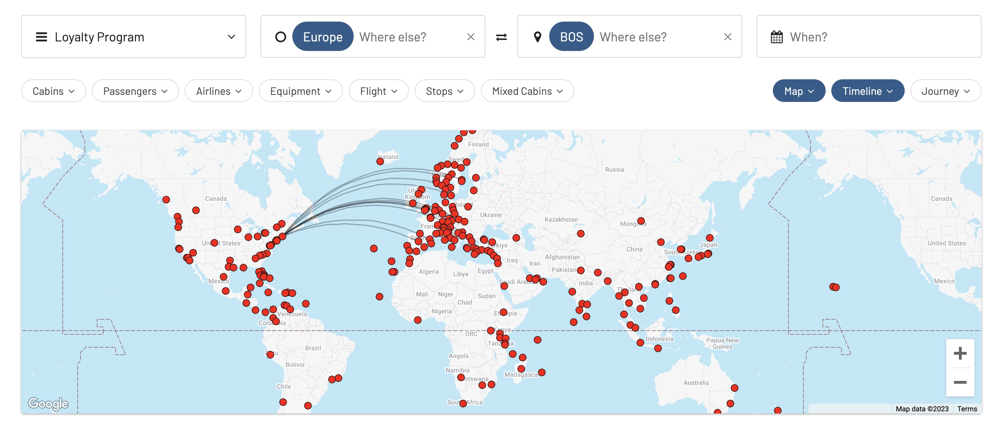
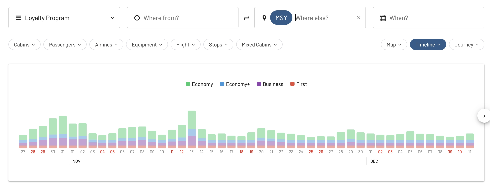
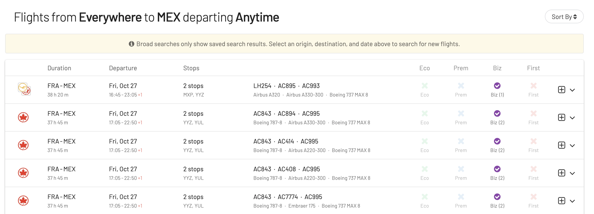
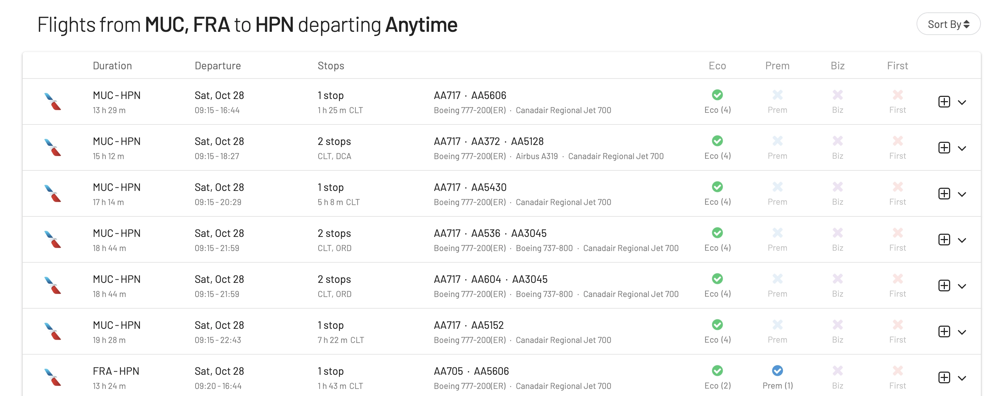
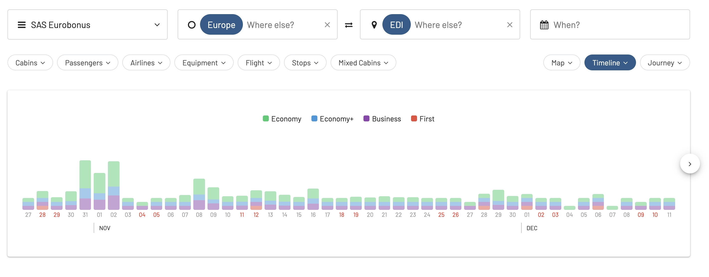
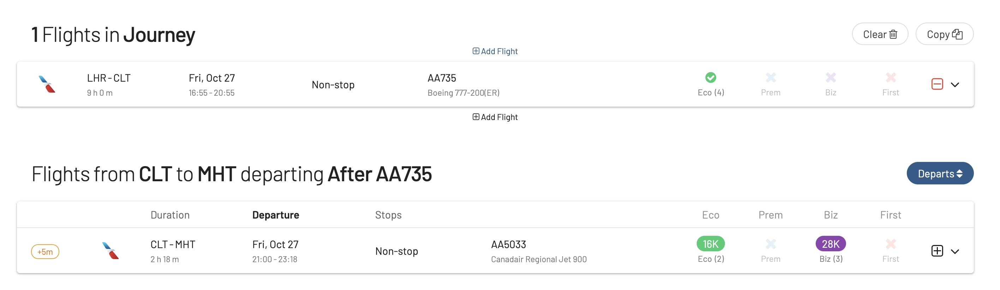
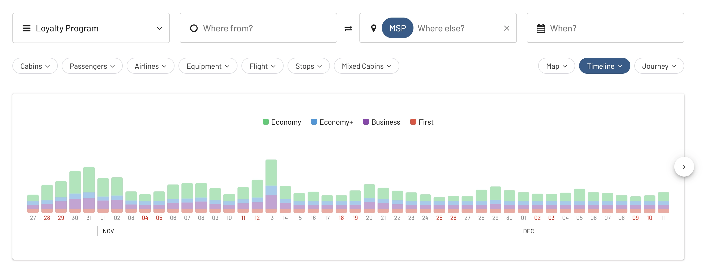
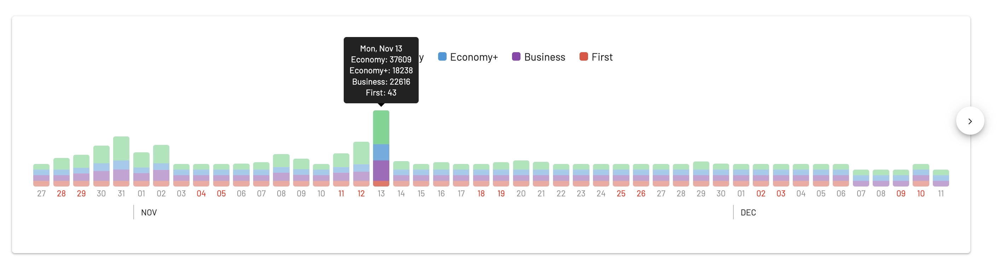
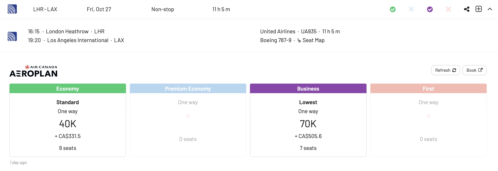
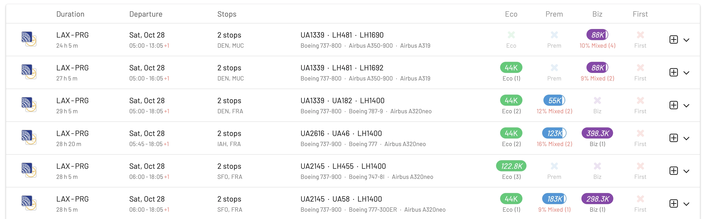

When it comes to Halloween, some cities go above and beyond in their celebrations. If you're looking for a not-so-mainstream experience, or considering using your miles on a spooky getaway, here are ten of the top cities known for their Halloween festivities.

*Remember to check with your frequent flyer program regarding blackout dates, especially around popular holidays like Halloween. Flexibility in travel dates and booking well in advance are the key to secure award seats during on-peak weeks.*

## Halloween Cities To Visit With Miles Or Points (Top 10) 

### 1. Salem, Massachusetts, USA

Salem's witch trial history is palpable in its atmospheric streets. Throughout October, the Salem Witch Museum, the Witch House, and other historical sites provide deeper insights into the tragic events of 1692. There are also numerous haunted happenings like ghost tours, midnight séances, and dramatic reenactments.

* **Nearest Major Airport**: [Boston Logan International Airport (BOS)](https://awardfares.com/search?zone:Europe.BOS.)

### 2. New Orleans, Louisiana, USA

Besides the renowned haunted tours of the French Quarter, the city offers voodoo ceremonies, visits to the eerie above-ground cemeteries, and the Voodoo Music + Arts Experience, a major music festival.

* **Nearest Major Airport**: [Louis Armstrong New Orleans International Airport (MSY)](https://awardfares.com/search?.MSY.)

### 3. Derry, Northern Ireland

Beyond the Halloween Carnival, Derry's historic walls and old buildings provide a spooky backdrop. Ghost tours and haunted walks through the city are particularly popular.

* **Nearest Major Airport**: [City of Derry Airport (LDY) or Belfast International Airport (BFS)](https://awardfares.com/search?.LDY,BFS.)

### 4. Mexico City, Mexico

The Day of the Dead isn't just about parades; families set up colorful altars adorned with marigold flowers, sugar skulls, and photos of the departed. The combination of remembrance and celebration is touching and visually striking.

* **Major Airport**: [Mexico City International Airport (MEX)](https://awardfares.com/search?.MEX.)

### 5. Sleepy Hollow, New York, USA

The Old Dutch Church and its adjacent graveyard (where the Headless Horseman supposedly lurked) are must-visits. Philipsburg Manor also transforms into a haunted landscape.

* **Nearest Major Airport**: Westchester County Airport (HPN) or New York City airports (JFK, LGA, EWR)

### 6. Edinburgh, Scotland

The city’s dark history includes tales of witches burned at the stake, the hauntingly beautiful Greyfriars Kirkyard, and the underground vaults. The Edinburgh Dungeon provides a theatrical experience of the city’s macabre past.

* **Major Airport**: [Edinburgh Airport (EDI)](https://awardfares.com/search?.EDI.)

**Pro Tip**: SAS EuroBonus is a great loyalty program for flights to Edinburgh within Europe, as the award chart (for now) is zone-based.

### 7. Keene, New Hampshire, USA

The Keene Pumpkin Festival boasts tens of thousands of lit jack-o'-lanterns, creating a magical atmosphere. The festival also includes fireworks, music, and pumpkin-themed activities.

* **Nearest Major Airport**: [Manchester-Boston Regional Airport (MHT)](https://awardfares.com/search?.MHT.)

**Pro tip**: Since this is a smaller regional airport, international availability on these routes might be limited. Try [AwardFares' Journey Planner](https://blog.awardfares.com/journey-planner/) to build up your perfect trip and find good connecting flights to MHT.

### 8. Anoka, Minnesota, USA

Claiming to be the first city in the U.S. to host a Halloween parade in the 1920s, Anoka's celebrations include pumpkin carving contests, spooky house decorating, and even a royal ambassador program.

* **Nearest Major Airport**: [Minneapolis-Saint Paul International Airport (MSP)](https://awardfares.com/search?.MSP.)

### 9. Long Beach, California, USA

The Queen Mary ship, rumored to be one of the most haunted places in the U.S., transforms into Dark Harbor, with mazes, monsters, and eerie tales of the ship's history.

* **Nearest Major Airport**: [Long Beach Airport (LGB) or Los Angeles International Airport (LAX)](https://awardfares.com/search?.LAX,LGB.)

### 10. Prague, Czech Republic

Prague's stunning Gothic and Romanesque architecture sets the mood. While Halloween isn’t traditionally celebrated, the ancient Prague Castle, the haunting tales of the Jewish Quarter, and the Astronomical Clock's parade of apostles offer a unique charm.

* **Major Airport**: [Václav Havel Airport Prague (PRG)](https://awardfares.com/search?.PRG.)

## Get started, and stay tuned

You can [try AwardFares for free](https://awardfares.com/). We are rolling out new features and improvements regularly, so [sign up for our monthly newsletter](https://awardfares.com/newsletter) to stay on top of the latest news, announcements, and pro tips.

With our [Gold and Diamond tiers](https://awardfares.com/pricing), you can access premium features such as unlimited daily searches, alerts, seat maps, flight schedules, and more!

## Read more

Make sure to also check these posts out

- [How To Find Cheap Award Flights And Identify Good Redemptions (Step-by-step)](https://blog.awardfares.com/how-to-find-cheap-award-flights/)
- [Seat Maps: Getting The Perfect Seat Even Before Booking](https://blog.awardfares.com/seatmaps-guide/)
- [10 Tips For Booking An Award Trip In 2023](https://blog.awardfares.com/award-trip-tips/)
- [Demystifying Award Charts: All You Need To Know (2023)](https://blog.awardfares.com/demystifying-award-charts/)
- [Ultimate Guide to Award Release Dates](https://blog.awardfares.com/ultimate-guide-to-award-release-dates)