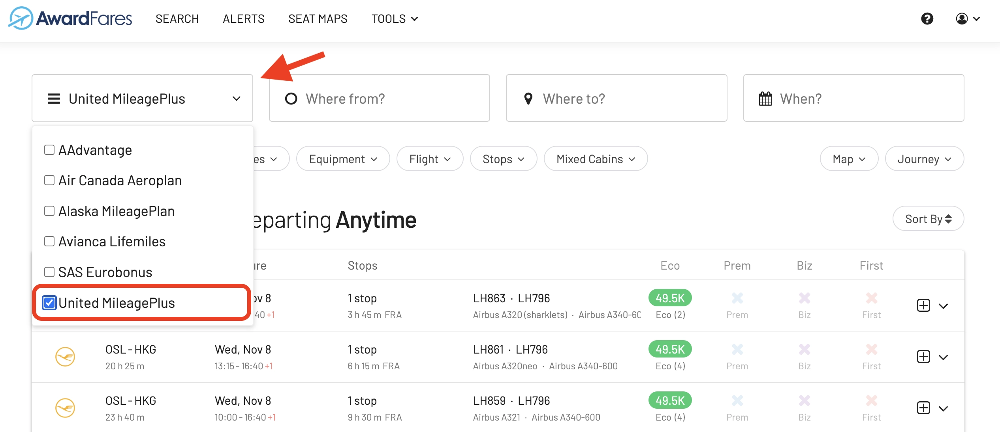
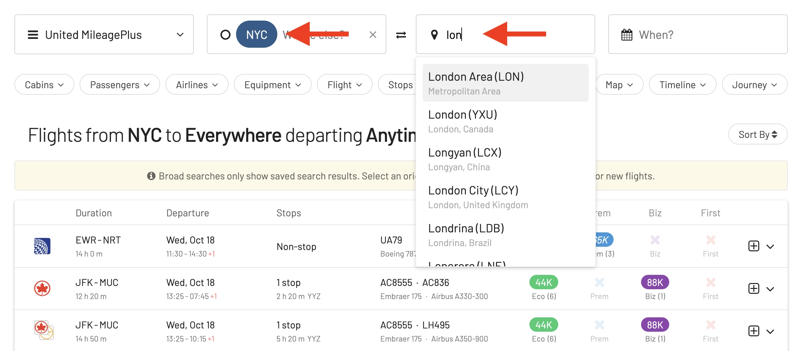
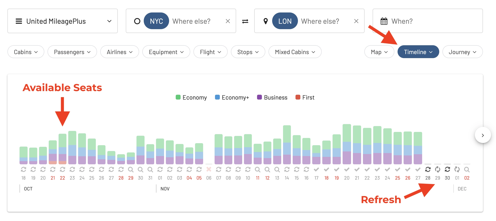

### In This Post:

- Current Status- [Current Status: Flights Between The United States and China](#current-status-flights-between-the-united-states-and-china)
- [What Airlines Fly US-China Nonstop?](#what-airlines-fly-us-china-nonstop)
- [US-China Award Flights: Our Top Picks Available Today {#awards}](#us-china-award-flights-our-top-picks-available-today-awards)
- [Options With Stopovers](#options-with-stopovers)
- [How To Find The Best Award Flights To China (Step-by-step) {#how-to}](#how-to-find-the-best-award-flights-to-china-step-by-step-how-to)
- [Get Started, and Stay Tuned](#get-started-and-stay-tuned)
- [Read More](#read-more)

## Current Status: Flights Between The United States and China

As of November 2023, direct flights between the United States and China are still limited due to a complex geopolitical situation, travel bans, and trails of COVID-19. This makes it **extremely hard** for travelers connecting between both countries to find good alternatives: non-stop flights are almost non-existant, and stopovers aren't ideal because of travel times and visa-related issues.

However, there have been some recent developments that suggest that the number of flights may be increasing soon, some of them starting in early 2024 (January and February).

The US Department of Transportation (DOT) announced that, starting in November, [the number of China-US direct regular passenger flights is expected to increase](https://airlineweekly.skift.com/2023/09/u-s-airlines-expect-further-easing-of-china-flight-limits-this-winter/) from the current 48 (24 round trips) per week to 70 per week, which is a major boost for the exchange between the two countries. The Chinese government has also agreed to reciprocate, meaning that US airlines will also be able to operate 70 direct flights per week to China.

Chinese airlines which could add more flights to the US include Air China, Beijing Capital Airlines, China Eastern Airlines, China Southern Airlines, Hainan Airlines, Sichuan Airlines and Xiamen Airlines, according to the latest notice.

This is a positive development, but it is still far from the pre-pandemic level of service. In 2019, there were **over 300 direct flights per week** between the US and China.

There is a growing demand for direct flights between the US and China, and it is likely that the number of flights will continue to increase.

## What Airlines Fly US-China Nonstop?

According to [FlightConnections](https://www.flightconnections.com/) and [Google Flights](https://www.google.com/travel/flights), there are 20 direct routes between the United States and China, some set to start in January 2024.

### US Airlines

| Airline | Route |
|----|----|
| American | Dallas Forth Worth to Beijing (PEK) |
| United | San Francisco (SFO) to Beijing (PEK) |
| Delta | Seattle (SEA) to Shanghai (PVG), Detroit (DTW) to Shanghai (PVG), Los Angeles (LAX) to Shanghai (PVG)1|

Notes:

1. Starts [March 2024](https://news.delta.com/delta-expand-china-flight-offerings-winter-season)

### Foreign Airlines

| Airline | Route |
|----|----|
| Air China | Los Angeles (LAX) to Beijing (PEK), Chicago (ORD) to Beijing (PEK), New York (JFK) to Beijing (PEK), San Francisco (SFO) to Beijing (PEK)|
| Beijing Capital Airlines | Los Angeles (LAX) to Hangzhou (HGH)|
| China Eastern Airlines | Los Angeles (LAX) to Shanghai (PVG), Detroit (DTW) to Shanghai (PVG), New York (JFK) to Shanghai (PVG), San Francisco (SFO) to Shanghai (PVG) |
| China Southern Airlines | Los Angeles (LAX) to Guangzhou (CAN), Chicago (ORD) to Guangzhou (CAN), Dallas/Fort Worth (DFW) to Guangzhou (CAN), New York (JFK) to Guangzhou (CAN), San Francisco (SFO) to Guangzhou (CAN) |
| Hainan Airlines |Boston (BOS) to Beijing (PEK), Seattle (SEA) to Beijing (PEK) |
| Xiamen Airlines | Los Angeles (LAX) to Xiamen (XMN), New York (JFK) to Xiamen (XMN) |

## US-China Award Flights: Our Top Picks Available Today

### Air China

San Francisco (SFO) to Beijing (PEK)

**How to book**: United Mileage Plan, SAS EuroBonus, Aeroplan 

### American Airlines

Plenty of seats available on the route Dallas Forth Worth to Shanghai (PVG)

### United Airlines

**How to book**:

### Delta Air Lines

**How to book**: Use Delta SkyMiles or FlyingBlue

## Options With Stopovers

### Japan Airlines

### All Nippon Airways (ANA)

### Cathay Pacific

### EVA Air

EVA Air offers great options and service via Taiwan, from New York, Chicago, Houston, Washington, Los Angeles, San Francisco, Las Vegas, and Seattle to both Beijing and Shanghai.

There's great availability too using many frequent flyer programs.

### Asiana

SFO-PEK via ICN

### Turkish Airlines

SEA-PEK via IST

### Lufthansa and SWISS

### Air Canada

### Ethiopian Airways

### Air France/KLM

Fly from the United States to Beijing (PEK) and Shanghai (PVG) via Amsterdam (AMS) or Paris (CDG)

**How to book**: FlyingBlue, Alaska Mileage Plan

### British Airways and Iberia

Fly from the United States to Beijing (PEK) and Shanghai (PVG) via Madrid (MAD) or London (LHR)

**How to book**: Use AAdvantage, Alaska Mileage Plan, Avios

---

## How To Find The Best Award Flights To China (Step-by-step) {#how-to}

### 1. Go to [AwardFares](https://awardfares.com/signup)

Creating an account is optional, but it's also free, and it gives you access to more features. Make sure to [sign up for one here](https://awardfares.com/signup).

### 2. Select your favorite **Frequent Flyer Program**

Tap on the **Loyalty Program** field and select one or more frequent flyer programs. You can choose among Air Canada Aeroplan, American AAdvantage, Alaska Mileage Plan, United MileagePlus, SAS EuroBonus, and Avianca Lifemiles.

### 3. Add a Route

In the **Origin** and **Destination** fields, add one or more airports to search for flights between those locations. AwardFares will search for award flights regardless of the number of stops. You can use the **Stops** filter to only search for direct/non-stop flights.

In the example below, we search for flights [between New York City and Beijing](https://awardfares.com/search?area:NYC.area:PEK.;so:a;z:united). We use the metropolitan area code **NYC** to get results from any airport in New York (JFK, EWR, LGA) at once!

### 4. Explore dates

If you have a particular date in mind, add it by tapping on the **Calendar** field.

Alternatively, you can use AwardFares **Timeline View** to explore the seat availability on different dates. The Timeline View displays how many seats are available for each day of the week/month. The bars are color-coded, so it's easy to distinguish between cabin classes (Economy, Business, First). You can also trigger new searches by tapping the refresh icon underneath each day.

In addition, you can also tap anywhere on the flight to display more details in an expanded view, such as aircraft type, and even [get the current seat maps](https://blog.awardfares.com/seatmaps-guide/) to see which seats are free versus occupied!

### 5. Sort by Price

Whether you are exploring dates using the Timeline View or have selected a specific day, AwardFares will show you the available seats (with real-time data) within seconds in the result list below.

You can tap on the different header columns to sort the results by price. Use the **Eco**, **Prem**, **Biz**, and **First** class tags to find cheap awards across multiple dates, itineraries, and airlines.

### 6. Book with the Airline

Once you have identified the flights you want (or built an itinerary using our Journey Planner), go to the airline's website and make the booking. Remember that some of these itineraries are not bookable online for specific programs (e.g., mixed-cabin awards on SAS EuroBonus). In those situations, you will need to call their service center.

## Get Started, and Stay Tuned

You can [try AwardFares for free](https://awardfares.com/). We are rolling out new features and improvements regularly, so [sign up for our monthly newsletter](https://awardfares.com/newsletter) to stay on top of the latest news, announcements, and pro tips.

With our [Gold and Diamond tiers](https://awardfares.com/pricing), you can access premium features such as unlimited daily searches, alerts, seat maps, flight schedules, and more!

## Read More

Make sure to also check these posts out

- [Seat Maps: Getting The Perfect Seat Even Before Booking](https://blog.awardfares.com/seatmaps-guide/)
- [10 Tips For Booking An Award Trip In 2023](https://blog.awardfares.com/award-trip-tips/)
- [Demystifying Award Charts: All You Need To Know (2023)](https://blog.awardfares.com/demystifying-award-charts/)
- [Ultimate Guide to Award Release Dates](https://blog.awardfares.com/ultimate-guide-to-award-release-dates)