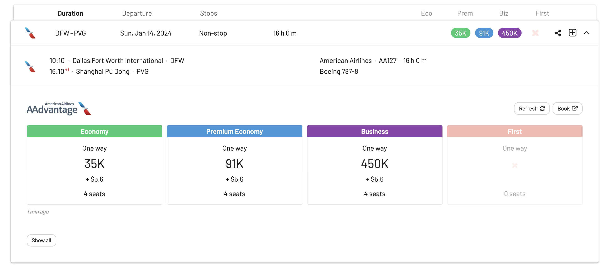
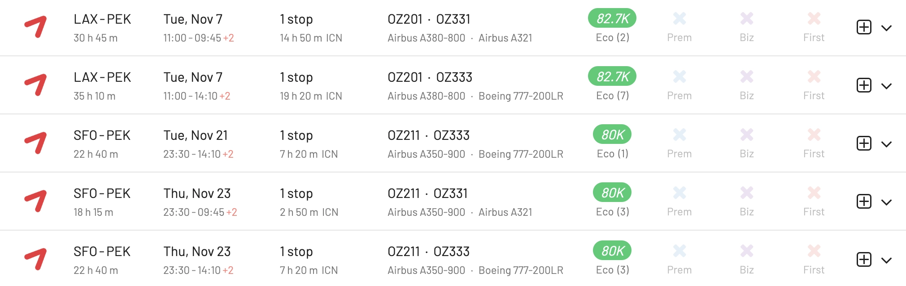
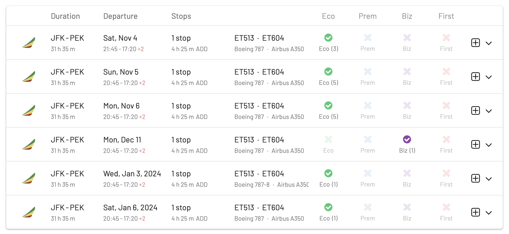
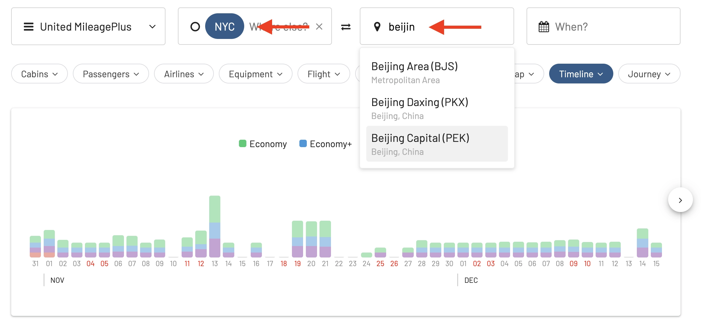
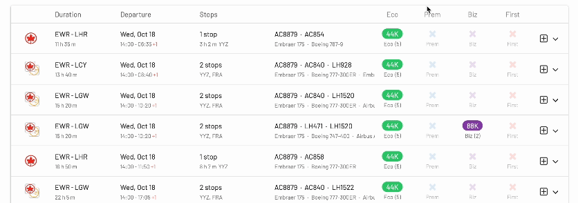

As of November 2023, direct flights between the United States and China are still limited due to a complex geopolitical situation, travel bans, and trails of COVID-19. This makes it **extremely hard** for travelers connecting between both countries to find good alternatives: nonstop flights are expensive and very limited, and stopovers aren't ideal because of travel times and visa-related issues.

However, there have been some recent developments that indicate that the number of flights will be increasing soon, some starting in November 2023 and others in early 2024 (January and February).

In this post, we are collecting the top options you can find today if you were to travel to China from the US with points or miles. Plus, we show you how to find them using AwardFares, and how to compare their price to identify good redemption vs. crazy rates.

### In This Post

- [Current Status: Flights Between The United States and China](#current-status-flights-between-the-united-states-and-china)
- [What Airlines Fly US-China Nonstop?](#what-airlines-fly-us-china-nonstop)
- [Nonstop Awards Available Today](#nonstop-awards-available-today)
- [Options With Stopovers](#options-with-stopovers)
- [How To Find The Best Award Flights To China (Step-by-step)](#how-to-find-the-best-award-flights-to-china-step-by-step)
- [Get Started](#get-started)

## Current Status: Flights Between The United States and China

The US Department of Transportation (DOT) announced that starting in November, [the number of China-US direct regular passenger flights is expected to increase](https://airlineweekly.skift.com/2023/09/u-s-airlines-expect-further-easing-of-china-flight-limits-this-winter/) from the current 48 (24 round trips) per week to 70 per week, which is a significant boost for the exchange between the two countries. The Chinese government has also agreed to reciprocate, meaning that US airlines will also be able to operate 70 direct flights per week to China.

Chinese airlines that could add more flights to the US include Air China, Beijing Capital Airlines, China Eastern Airlines, China Southern Airlines, Hainan Airlines, Sichuan Airlines, and Xiamen Airlines, according to the latest notice.

This is a positive development, but it is still far from the pre-pandemic level of service. In 2019, there were **over 300 direct flights per week** between the US and China.

There is a growing demand for direct flights between the US and China, and the number of flights will likely continue to increase.

## What Airlines Fly US-China Nonstop?

According to [FlightConnections](https://www.flightconnections.com/) and [Google Flights](https://www.google.com/travel/flights), there are 20 direct routes between the United States and China, some set to start in January 2024.

| Airline | Route |
|----|----|
| American | Dallas Forth Worth to Beijing (PEK) |
| United | San Francisco (SFO) to Beijing (PEK) |
| Delta | Seattle (SEA) to Shanghai (PVG), Detroit (DTW) to Shanghai (PVG), Los Angeles (LAX) to Shanghai (PVG)1|
| Air China | Los Angeles (LAX) to Beijing (PEK), Chicago (ORD) to Beijing (PEK), New York (JFK) to Beijing (PEK), San Francisco (SFO) to Beijing (PEK)2|
| Beijing Capital Airlines | Los Angeles (LAX) to Hangzhou (HGH)|
| China Eastern Airlines | Los Angeles (LAX) to Shanghai (PVG), Detroit (DTW) to Shanghai (PVG), New York (JFK) to Shanghai (PVG), San Francisco (SFO) to Shanghai (PVG) |
| China Southern Airlines | Los Angeles (LAX) to Guangzhou (CAN), Chicago (ORD) to Guangzhou (CAN), Dallas/Fort Worth (DFW) to Guangzhou (CAN), New York (JFK) to Guangzhou (CAN), San Francisco (SFO) to Guangzhou (CAN) |
| Hainan Airlines |Boston (BOS) to Beijing (PEK), Seattle (SEA) to Beijing (PEK) |
| Xiamen Airlines | Los Angeles (LAX) to Xiamen (XMN), New York (JFK) to Xiamen (XMN) |

Notes:

1. Starts [March 2024](https://news.delta.com/delta-expand-china-flight-offerings-winter-season).
2. Starts November 1st, 2023.

## Nonstop Awards Available Today

### 1. Air China

Air China has been one of the few carriers keeping its nonstop service alive, from [Los Angeles (LAX) to Beijing (PEK)](https://awardfares.com/search?LAX.PEK.;a:CA;x:0). Since November 1st, they also resume [San Francisco (SFO) to Beijing (PEK)](https://awardfares.com/search?SFO.PEK.;a:CA;x:0).

Air China also offers a service from New York (JFK) with a stopover in LAX, but those legs seem impossible to book with points, as of today, from the data we see at AwardFares. We'll keep monitoring and updating the post.

**How to book**: United Mileage Plan, SAS EuroBonus, Aeroplan 

### 2. American Airlines

American offers a great alternative for travelers in central/south of the United States. They are also one of the most generous programs concerning availability, although premium cabins are costly.

As you can see, there are plenty of seats available on the route [Dallas Forth Worth (DFW) to Shanghai (PVG)](https://awardfares.com/search?DFW.PVG.;x:0;z:aadvantage), which operates daily.

### 3. United Airlines

United has kept flying from San Francisco (SFO) to Beijing (PEK) nonstop since the pandemic started to easy. Availability is relatively good at decent rates, although hard to find saver awards.

United is planning on adding more routes during the winter season 2023-2024. The airline also provides great connections from anywhere in the United States. Hence, if you'd like to fly from the east coast to Beijing (especially in premium cabins [or mixed cabins](https://blog.awardfares.com/prices-and-mixed-cabins/)), you could do it through San Francisco in the same redemption.

**How to book**: United MileagePlus, SAS EuroBonus, Aeroplan.

### Set Up Alerts

As nonstop award flights are hard to score due to limited availability, make sure to [set up alerts](https://blog.awardfares.com/alerts) on AwardFares to let the tool monitor the route for you in the background. As soon as a seat becomes available, you will receive a notification via email.

Check out our full guide (with a video tutorial) on [how to leverage alerts here](https://blog.awardfares.com/alerts). It's possible to add a filter just to display nonstop flights.

## Options With Stopovers

While nonstop options are ideal, the situation still seems constrained, with very few seats available at expensive redemption rates (e.g., some premium cabins can cost more than 400k miles one-way!).

Another option is to do just *one* stopover outside the United States, which can open the door to much better cabins and connections. Adding a stopover will add travel time, but if picked correctly, it can help you get cheaper awards and service onboard.

There are options through Asia, Europe, the Middle East, and even Africa. However, remember to check transit restrictions in place when it comes to visas and health regulations.

Here are some of the options we see with reasonable-to-great availability and good pricing.

### Japan Airlines

JAL is renowned for its punctuality, exceptional customer service, and high-quality in-flight experience, offering comfortable seating and a wide array of entertainment options. You can expect meticulous attention to detail and an incredibly pleasant journey no matter the cabin class.

As a member of Oneworld, it provides more options when it comes to award flights and redemptions across programs. It also reaches cities or destinations that are not mainstream.

JAL operates many daily flights to/from Tokyo's Narita (NRT) or Haneda (HND) airports.

What can sometimes be complicated with Japan is navigating visa requirements or travel restrictions, especially in times of heightened security or health concerns. Japan used to have very strict COVID-19 restrictions in place, even for transfers.

**How to book**: Alaska Mileage Plan, AAdvantage.

### All Nippon Airways (ANA)

ANA flies daily from Haneda (HND) and Narita (NRT) to Los Angeles, San Francisco, Seattle, Washington, New York, and Houston. It's also easy to connect to Beijing, Shanghai, and other destinations in Mainland China.

As with JAL, keep in mind that Japan might be restrictive when it comes to transit visas and transfer requirements. Check this information before booking your flights.

**How to book**: United Mileage Plan, SAS EuroBonus, Aeroplan 

### Cathay Pacific

The airline primarily routes its US to China flights via Hong Kong, a major global aviation hub. There are options from New York (JFK), Los Angeles (LAX), or San Francisco (SFO) to various destinations in China, connecting through Hong Kong (HKG).

While Cathay Pacific offers a streamlined connection via Hong Kong, the geopolitical tensions between Hong Kong and Mainland China could affect flight schedules or operations. Travelers should be aware of any evolving circumstances and check for any related travel advisories or changes in flight patterns.

These award flights are hard to snatch, as inventory is very limited, but it can be pretty rewarding! There are seats for 30k miles one-way using Mileage Plan or AAdvantage miles!

**How to book**: Alaska Mileage Plan.

### EVA Air

EVA Air offers great options and service via Taiwan, from New York, Chicago, Houston, Washington, Los Angeles, San Francisco, Las Vegas, and Seattle to both Beijing and Shanghai.

The airline is also pretty generous with availability across multiple programs. Plus, we love their service. Check [our reviews here](https://blog.awardfares.com/eva-business-tpe-icn/).

**How to book**: United Mileage Plan, SAS EuroBonus, Aeroplan.

### Asiana

Asiana offers daily flights to Seoul (ICN) on some great airplanes and cabins (e.g., LAX-PEK and SEA-PVG). They also have plenty of connections to Mainland China, including Beijing, Shanghai, and others.

One interesting route is the connection between Honolulu (HNL) and Seoul Incheon (ICN), which can help connect travelers from Hawaii to China a smooth connection.

**How to book**: United Mileage Plan, SAS EuroBonus, Aeroplan.

### Turkish Airlines

Turkish Airlines is known for its expansive in-flight meal offerings, generous legroom, and top-notch service standards. Also, their A350 cabin is just amazing. 

A popular route is Seattle (SEA) to Istanbul (IST) which can then connect to Beijing, Shanghai, and other cities in Mainland China. Award availability is good across various Star Alliance programs, and can present to travelers a good alternative even for credit card point transfers.

It's clear that the geographic position of Istanbul means that the total flight path is much longer than other more direct routes or connections through East Asian hubs. However, Turkish has a flexible policy for long layovers, letting you stay overnight at a hotel for free or even stay in Istanbul for up to 72 hours to explore Turkey.

Price-wise, it's also not bad, there are good options at just 54k EuroBonus points one-way in Economy, or similar in other programs.

**How to book**: SAS EuroBonus, United MileagePlus, Aeroplan.

### Lufthansa and SWISS

Lufthansa and SWISS have high service standards, decent seating, and quality in-flight amenities. They are also refreshing their cabins soon. Travelers can expect a consistent experience (check [our reviews here](https://blog.awardfares.com/tags/#Review)). Their hubs in Frankfurt, Munich, and Zurich are also well-equipped to handle international transfers, often making smooth connections.

However, a layover in Europe leads to longer total travel time compared to other flights from the US to China. Depending on the flight schedules, layovers can be exhausting or inconvenient, especially if they require overnight stays. Lastly, keep in mind that transiting through European hubs may expose travelers to additional entry or transit restrictions.

**How to book**: SAS EuroBonus, United MileagePlus, Aeroplan

### Ethiopian Airways

A significant benefit of flying with Ethiopian Airways is often the competitive pricing. As the airline tries to win over others, even on points, they offer a super cost-effective option for long-haul travel (e.g., 90k points round trip). Additionally, Ethiopian Airlines has built a solid reputation for its hospitality and service quality. The Addis Ababa hub, which serves as the airline's main transit point, has increasingly become a strategic and efficient gateway for connecting flights between the Americas, Africa, and Asia.

On the downside, the flight path from the US to China via Ethiopia might be lengthier than direct routes or other more northerly connecting routes, leading, as expected, to longer travel times. Frequency is also less, which reduces flexibility. Additionally, the Addis Ababa airport, while modern, can sometimes face capacity constraints during peak times. Lastly, transit regulations or health screenings in Ethiopia pose additional considerations for some travelers.

### Air France/KLM

Fly from the United States to Beijing (PEK) and Shanghai (PVG) via Amsterdam (AMS) or Paris (CDG)

**How to book**: FlyingBlue, SkyMiles.

---

## How To Find The Best Award Flights To China (Step-by-step)

### 1. Go to [AwardFares](https://awardfares.com/signup)

Creating an account is optional, but it's also free, and it gives you access to more features. Make sure to [sign up for one here](https://awardfares.com/signup).

### 2. Select your favorite **Frequent Flyer Program**

Tap on the **Loyalty Program** field and select one or more frequent flyer programs. You can choose among Air Canada Aeroplan, American AAdvantage, Alaska Mileage Plan, United MileagePlus, SAS EuroBonus, and Avianca Lifemiles.

### 3. Add a Route

In the **Origin** and **Destination** fields, add one or more airports to search for flights between those locations. AwardFares will search for award flights regardless of the number of stops. You can use the **Stops** filter to only search for direct/non-stop flights.

In the example below, we search for flights [between New York City and Beijing](https://awardfares.com/search?area:NYC.area:PEK.;so:a;z:united). We use the metropolitan area code **NYC** to get results from any airport in New York (JFK, EWR, LGA) at once!

### 4. Explore Dates

If you have a particular date in mind, add it by tapping on the **Calendar** field.

Alternatively, you can use AwardFares **Timeline View** to explore the seat availability on different dates. The Timeline View displays how many seats are available for each day of the week/month. The bars are color-coded, so it's easy to distinguish between cabin classes (Economy, Business, First). You can also trigger new searches by tapping the refresh icon underneath each day.

In addition, you can also tap anywhere on the flight to display more details in an expanded view, such as aircraft type, and even [get the current seat maps](https://blog.awardfares.com/seatmaps-guide/) to see which seats are free versus occupied!

### 5. Filter by Stops or Airline

In the filters below, you can add the desired number of stops (optional). You can display nonstop results only or with up to one stop.

In addition, the *Airline* lets you filter results by carrier if you are searching for a specific airline (e.g., Air China, JAL, etc.)

### 6. Sort by Price

Whether you are exploring dates using the Timeline View or have selected a specific day, AwardFares will show you the available seats (with real-time data) within seconds in the result list below.

You can tap on the different header columns to sort the results by price. Use the **Eco**, **Prem**, **Biz**, and **First** class tags to find cheap awards across multiple dates, itineraries, and airlines.

### 7. Book with the Airline

Once you have identified the flights you want (or built an itinerary using our [Journey Planner](https://blog.awardfares.com/journey-planner/)), go to the airline or loyalty program's website and make the booking.

## Get Started

You can [try AwardFares for free](https://awardfares.com/). We are rolling out new features and improvements regularly, so [sign up for our monthly newsletter](https://awardfares.com/newsletter) to stay on top of the latest news, announcements, and pro tips.

With our [Gold and Diamond tiers](https://awardfares.com/pricing), you can access premium features such as unlimited daily searches, alerts, seat maps, flight schedules, and more!

### Read More

Make sure to also check these posts out.

- [Seat Maps: Getting The Perfect Seat Even Before Booking](https://blog.awardfares.com/seatmaps-guide/)
- [10 Tips For Booking An Award Trip In 2023](https://blog.awardfares.com/award-trip-tips/)
- [Demystifying Award Charts: All You Need To Know (2023)](https://blog.awardfares.com/demystifying-award-charts/)
- [Ultimate Guide to Award Release Dates](https://blog.awardfares.com/ultimate-guide-to-award-release-dates)