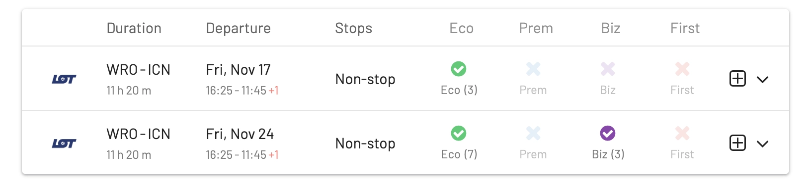
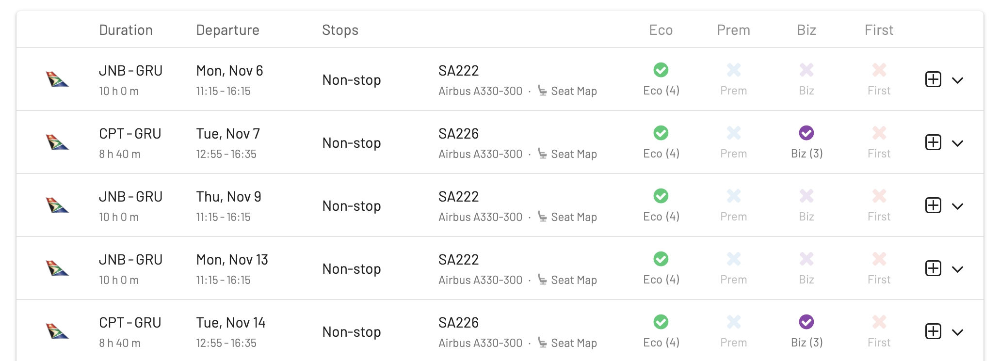
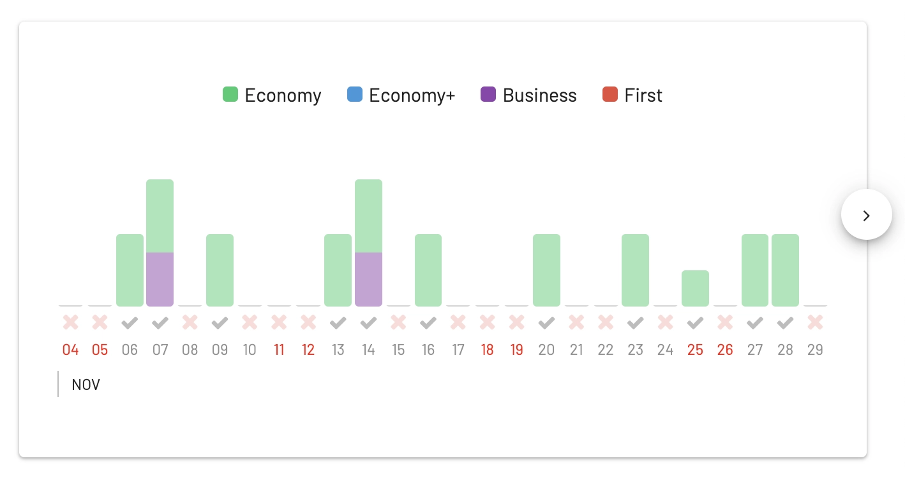
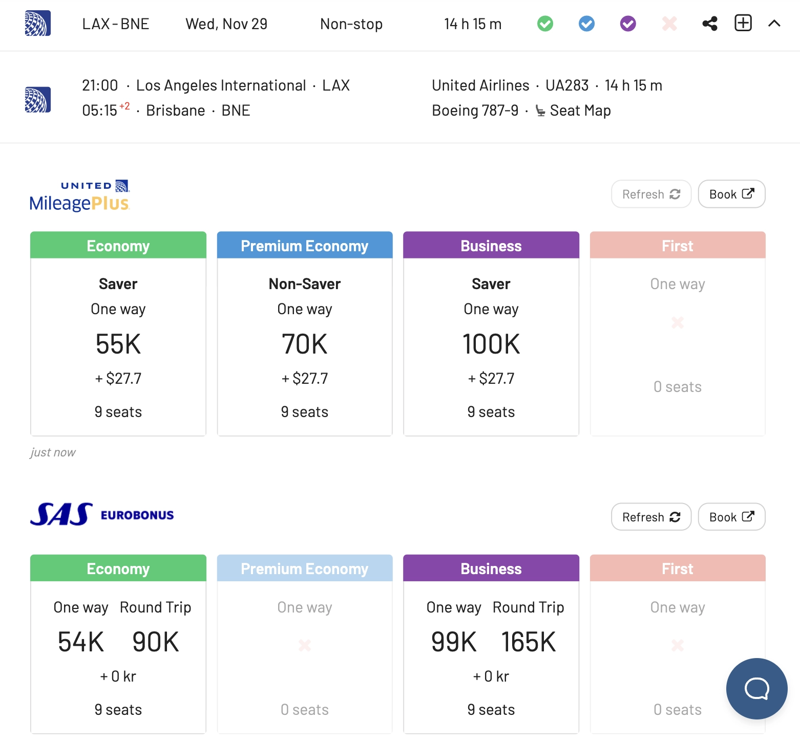
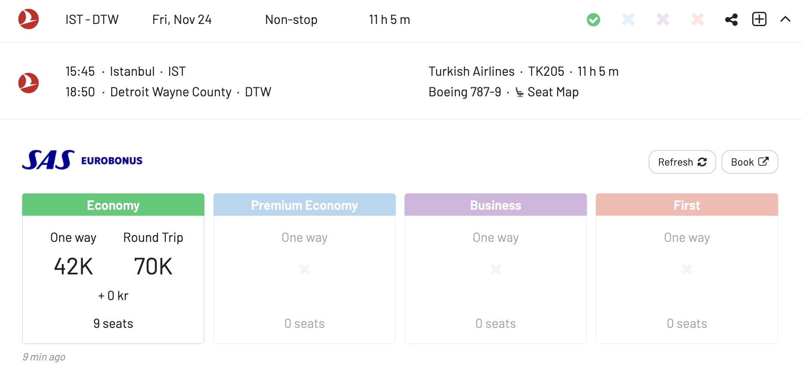
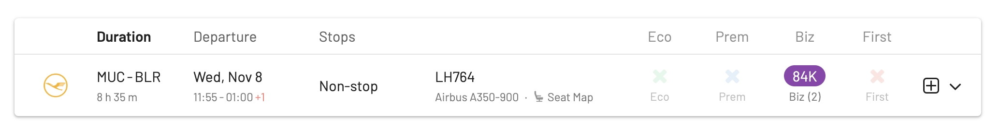
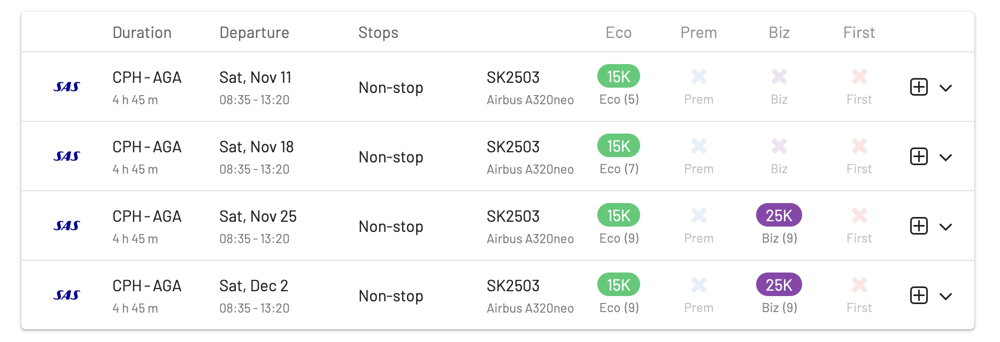
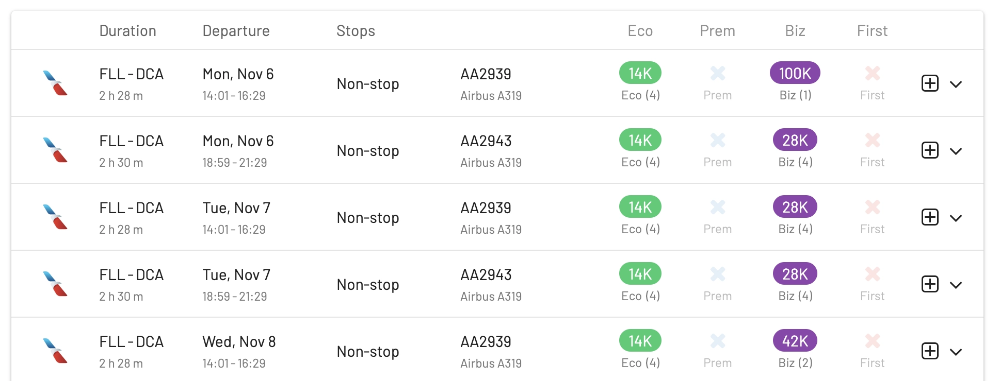

If you are sitting on a pile of miles or points or are about to plan your next dream award trip, you'll like this news. November 2023 looks like a promising month for the aviation industry, with the introduction of several new routes, particularly in the Asian and American markets.

Several Star Alliance members are expanding their reach, so there will be more options, regardless of which frequent flyer program you use.

LOT is launching a new connection from Wroclaw to Seoul, and Lufthansa is also enhancing its Asian network by starting flights from Munich to Bengaluru, further connecting India and Germany.

In the United States, Turkish Airlines is beginning a new service from Istanbul to Detroit, continuing its expansion in the American market. In the Australian market, United Airlines is inaugurating a route from Los Angeles to Brisbane. Additionally, South African Airways is assigning their A330s on two new routes from Capetown and Johannesburg to São Paulo, Brazil's financial capital.

Outside of Star Alliance, there are also various airlines kicking off international services, including new flights to Australia by carriers such as Batik Air and Vietjet, Norse Atlantic Airways establishing a link between Oslo and Bangkok, and more.

**The best part**: awards are already available! In this post, we look at our top picks and show you which routes you can book right away using miles or points.

## November 2023 Routes: Our Top Picks

*You can click on the route to start a new search with AwardFares.*

### 1. LOT Polish Airlines: [Wroclaw (WRO) to Seoul (ICN)](https://awardfares.com/search?WRO.ICN.;a:LO;x:0)

LOT operates this route once a week using their 787-8. Starts November 3rd.

### 2. South African Airways: [Capetown (CPT)/Johannesburg (JNB) to São Paulo (GRU)](https://capture.dropbox.com/q23bfzuOBkYEyPpk)

South African Airways operates these routes twice a week (each) using their A330-300. Starts November 1st.

### 3. United Airlines: [Los Angeles (LAX) to Brisbane (BNE)](https://awardfares.com/search?LAX.BNE.;a:UA;x:0)

United will operate this route three times a week using their 787-9. Starts November 29th.

There's availability across multiple programs, including saver awards with United MileagePlus.

### 4. Turkish Airlines: [Istanbul (IST) to Detroit (DTW)](https://awardfares.com/search?IST.DTW.;a:TK;x:0)

Turkish will operate this route three times a week using their 787-9. Starts November 15th.

### 5. Lufthansa: [Munich (MUC) to Bengaluru (BLR)](https://awardfares.com/search?MUC.BLR.;a:LH;x:0)

Lufthansa will operate this route three times a week using [their A350-900 (review here)](https://blog.awardfares.com/lufthansa-long-haul-business-a350/). Starts November 3rd.

Read more about [all new Lufthansa routes for 2023 here](https://blog.awardfares.com/lh-routes-2023/).

### 6. SAS: [Copenhagen (CPH) to Agadir (AGD)](https://awardfares.com/search?CPH.AGA.;x:0;z:sas)

SAS operates this route once a week using their A320neo. Starts November 4thth. [Read full post here](https://blog.awardfares.com/sas-opens-route-to-morocco/).

### 7. American Airlines: [Fort Lauderdale (FLL) to Washington (DCA)](https://awardfares.com/search?FLL.DCA.;a:AA;x:0;z:aadvantage)

American operates this route **fourteen** times a week using A319s. Starts November 5th.

Great redemptions using AAdvantage on any cabin class.

## All New Routes (50+)

| Airline                | Origin                         | Destination                          | Equipment | Freq. (p/w) | Start date |
|------------------------|-----------------------------------|-----------------------------------|-----------|-------------|------------|
| airBaltic              | Vilnius (VNO)                     | Dubai (DXB)                       | A220-300  | 2           | Nov. 1     |
| Aegean Airlines        | Athens (ATH)                      | Luxor (LXR)                       | A320      | 2           | Nov. 11    |
| Air Serbia             | Belgrade (BEG)                    | Porto (OPO)                       | A319      | 2           | Nov. 10    |
| Airlink                | Victoria Falls (VFA)              | Nelspruit (MQP)                   | ERJ135/140| 3           | Nov. 28    |
| Alaska Airlines        | Everett (PAE)                     | Honolulu (HNL)                    | 737-9/737-900| 7        | Nov. 17    |
| Allegiant Air          | Fort Lauderdale (FLL)             | Nashville (BNA)                   | A320      | 2           | Nov. 16    |
| American Airlines      | Fort Lauderdale (FLL)             | Washington National (DCA)         | A319      | 14          | Nov. 5     |
| Arajet                 | Santo Domingo Las Americas (SDQ)  | Montreal Trudeau (YUL)            | 737-8     | 4           | Nov. 7     |
| Avelo Airlines         | New Haven (HVN)                   | San Juan Luis Munoz Marin (SJU)   | 737-800   | 2           | Nov. 15    |
| Batik Air              | Denpasar-Bali (DPS)               | Adelaide (ADL)                    | 737-800   | 4           | Nov. 8     |
| Batik Air Malaysia     | Kuala Lumpur (KUL)                | Dubai (DXB)                       | 737-800   | 4           | Nov. 10    |
| Bonza                  | Gold Coast (OOL)                  | Launceston (LST)                  | 737-8     | 3           | Nov. 21    |
| Breeze Airways         | Pittsburgh (PIT)                  | Fort Myers (RSW)                  | A220-300  | 2           | Nov. 17    |
| British Airways        | London Gatwick (LGW)              | Sharm El-Sheikh (SSH)             | A320      | 4           | Nov. 3     |
| Delta Air Lines        | Miami (MIA)                       | Nassau (NAS)                      | 737-800   | 7           | Nov. 5     |
| Discover Airlines      | Frankfurt (FRA)                   | Santa Cruz de la Palma (SPC)      | A320      | 1           | Nov. 4     |
| easyJet                | Amsterdam (AMS)                   | Aqaba (AQJ)                       | A320      | 2           | Nov. 1     |
| Egyptair               | Cairo (CAI)                       | Shanghai Pudong (PVG)             | 777-300   | 3           | Nov. 16    |
| Ethiopian Airlines     | Addis Ababa (ADD)                 | London Gatwick (LGW)              | A350-900  | 3           | Nov. 21    |
| FlyArystan             | Almaty (ALA)                      | Mumbai (BOM)                      | A320      | 2           | Nov. 23    |
| Flynas                 | Riyadh (RUH)                      | Bahrain (BAH)                     | A320neo   | 7           | Nov. 15    |
| Frontier Airlines      | Chicago Midway (MDW)              | Cancun (CUN)                      | A320neo   | 7           | Nov. 16    |
| Greater Bay Airlines   | Hong Kong (HKG)                   | Manila (MNL)                      | 737-800   | 5           | Nov. 8     |
| JetBlue Airways        | Los Angeles (LAX)                 | Nassau (NAS)                      | A320-family| 1          | Nov. 4     |
| Jetsmart               | Lima (LIM)                        | Medellin (MDE)                    | A320      | 3           | Nov. 8     |
| Juneyao Airlines       | Shanghai Pudong (PVG)             | Denpasar-Bali (DPS)               | A320neo   | 7           | Nov. 12    |
| LOT Polish Airlines    | Wroclaw (WRO)                     | Seoul Incheon (ICN)               | 787-8     | 1           | Nov. 3     |
| Lufthansa              | Munich (MUC)                      | Bengaluru (BLR)                   | A350-900  | 3           | Nov. 3     |
| Lynx Air               | Vancouver (YVR)                   | Orlando (MCO)                     | 737-8     | 1           | Nov. 18    |
| Malaysia Airlines      | Kuala Lumpur (KUL)                | Thiruvananthapuram (TRV)          | 737-800   | 2           | Nov. 9     |
| Norse Atlantic Airways | Oslo Gardermoen (OSL)             | Bangkok Suvarnabhumi (BKK)        | 787-9     | 2           | Nov. 2     |
| Pegasus Airlines       | Antalya (AYT)                     | Dubai (DXB)                       | A320      | 2           | Nov. 8     |
| Porter Airlines        | Ottawa (YOW)                      | Fort Lauderdale (FLL)             | E195 E2   | 7           | Nov. 30    |
| Qatar Airways          | Doha (DOH)                        | Ras al Khaimah (RKT)              | A320      | 7           | Nov. 1     |
| Ryanair                | Madrid (MAD)                      | Aqaba (AQJ)                       | 737-800   | 1           | Nov. 2     |
| SAS Scandinavian Airlines | Copenhagen Kastrup (CPH)     | Agadir (AGA)                      | A320neo   | 1           | Nov. 4     |
| South African Airways | Cape Town (CPT)     | Sao Paulo (GRU)                      | A330-300   | 2           | Oct. 31     |
| South African Airways | Johanbesburg (JNB)     | Sao Paulo (GRU)                      | A330-300   | 2           | Oct. 31     |
| Spirit Airlines        | New York LaGuardia (LGA)          | Atlanta Hartsfield-Jackson (ATL)  | A320neo   | 7           | Nov. 5     |
| SunExpress             | Antalya (AYT)                     | Abu Dhabi (AUH)                   | 737-800   | 3           | Nov. 13    |
| Thai Lion Air          | Bangkok Don Mueang (DMK)          | Sanya (SYX)                       | 737-900   | 1           | Nov. 2     |
| TianJin Airlines       | Chongqing (CKG)                   | Sydney (SYD)                      | A330-200  | 2           | Nov. 27    |
| TUI fly Belgium        | Brussels (BRU)                    | Algiers (ALG)                     | 737-800   | 2           | Nov. 7     |
| Turkish Airlines       | Istanbul (IST)                    | Detroit Metropolitan Wayne County (DTW)| 787-9| 3        | Nov. 15    |
| United Airlines        | Los Angeles (LAX)                 | Brisbane (BNE)                    | 787-9     | 3           | Nov. 29    |
| Uzbekistan Airways     | Tashkent (TAS)                    | Ankara Esenboga (ESB)             | A320neo   | 1           | Nov. 4     |
| Vietjet                | Ho Chi Minh City (SGN)            | Perth (PER)                       | A321      | 5           | Nov. 21    |
| Volaris El Salvador    | Guatemala City (GUA)              | Chicago O'Hare (ORD)              | A320      | 3           | Nov. 3     |
| Volotea                | Bilbao (BIO)                      | Paris Orly (ORY)                  | A320      | 2           | Nov. 10    |
| Westjet                | Toronto Hamilton (YHM)            | Cancun (CUN)                      | 737-800   | 2           | Nov. 25    |
| Winair                 | Barbados (BGI)                    | St Lucia (SLU)                    | ATR 42    | 1           | Nov. 4     |

## Get started, and stay tuned

You can [try AwardFares for free](https://awardfares.com/). We are rolling out new features and improvements regularly, so [sign up for our monthly newsletter](https://awardfares.com/newsletter) to stay on top of the latest news, announcements, and pro tips.

With our [Gold and Diamond tiers](https://awardfares.com/pricing), you can access premium features such as unlimited daily searches, alerts, seat maps, flight schedules, and more!

## Read more

Make sure to also check these posts out

- [How To Find Cheap Award Flights And Identify Good Redemptions (Step-by-step)](https://blog.awardfares.com/how-to-find-cheap-award-flights/)
- [Demystifying Award Charts: All You Need To Know (2023)](https://blog.awardfares.com/demystifying-award-charts/)
- [US-China Award Flights: What Are The Best Routes?](https://blog.awardfares.com/us-china-award-flights/)
- [Lufthansa New Routes In 2023](https://blog.awardfares.com/lh-routes-2023/)
- [SAS Opens New Route To Morocco (And You Can Book It With Points)](https://blog.awardfares.com/sas-opens-route-to-morocco/)
