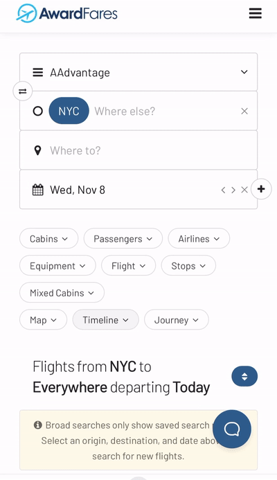

**Roame.travel** is a relatively new award travel search tool that has quickly gained popularity, as it provides a bird’s-eye view of opportunities across various airline alliances. But when it comes to the nitty-gritty of securing a seat, AwardFares emerges as the perfect co-pilot. While Roame.travel can help you identify round trips and guide you through credit card points transfers, **AwardFares** goes a step further by showing real-time availability, and showing exact prices including taxes and fees.

In this post, we show how **AwardFares** can complement Roame.travel to create a well-rounded award travel strategy.

Let's get started!

### In This Post

- [The Basics](#the-basics)
- [7 Ways AwardFares Boosts Your Roame.travel Search Experience](#7-ways-awardfares-boosts-your-roametravel-search-experience)
- [Get started](#get-started)
- [Read more](#read-more)

## The Basics

### What is Roame.travel?

[Roame.travel](https://roame.travel/) is a relatively new award travel search tool that has quickly gained popularity among frequent flyers and points enthusiasts. It stands out for its speed, breadth of coverage, and ability to help you maximize your points and miles guiding you through point transfers. Roame.travel was recognized as the [New Travel Service Of The Year 2023 by The Points Guy Awards](https://thepointsguy.com/news/tpg-award-winners-2023/), kudos to their team!

### Key Features of Roame.travel

- Fast and Efficient Search.
- Widespread Airline Coverage.
- Points Optimization.
- Metro Area Search.
- Roundtrip Award Bookings.
- Freemium Model.

_Image: Roame.travel Homepage._

### What is AwardFares?

While Roame.travel can help you identify round trips and guide you through credit card points transfers, **AwardFares** goes a step further by showing real availability, and showing exact prices including taxes and fees. You can try it for free, and also upgrade to more premium tiers that are packed with features such as advanced filtering capabilities, alerts, seat maps, journey planner, and more. **AwardFares** is vital to finding cheap award flights, particularly long-haul premium cabins such as First and Business Class.

### Key Features of AwardFares

- Real-time award seat availability for major airlines.
- Award prices and mixed-cabins.
- Blazing fast performance.
- Alerts for specific routes and classes, notifying users when seats become available.
- Timeline view, displays availability for a range of dates at once.
- User-friendly interface with beautiful and clear visualizations of available seats.
- Great experience on mobile.

## 7 Ways AwardFares Boosts Your Roame.travel Search Experience

The combination of Roame.travel’s expansive search capabilities and AwardFares’ specialized services creates a powerful duo for award travelers. Roame.travel sets the stage with its wide-ranging scope, while AwardFares delivers the performance with its targeted tools and data-driven insights across frequent flyer programs. Together, they offer a comprehensive award travel planning experience that can take you from dreaming of your next destination to stepping on the plane with your award ticket in hand.

### 1. Calendar View

Roame.travel is akin to a global map, offering a comprehensive overview of the award travel landscape. However, when you need to zoom in on the specifics, AwardFares provides the magnifying glass.

AwardFares is accessible to both beginners and experienced travelers with a visually appealing and easy-to-understand interface.

Search results on AwardFares are presented in stunning Timeline and Map views, with color-coded availability indicators and easy-to-read tables. This simplification makes it easy for users to assess award seat availability and make informed decisions quickly.

### 2. Real-Time Alerts

While exploring award travel options with Roame.travel, AwardFares can be set up to keep a vigilant eye on specific flights or destinations. As soon as Roame inspires your next journey, switch to AwardFares for real-time alerts.

This synergy ensures that you are informed the moment an award seat becomes available, allowing you to leverage the broader research and turn it into an actionable booking.

**Read our** [complete Alerts tutorial here](https://blog.awardfares.com/alerts/).

### 3. Route Planning

If you’re flexible with your destinations or are planning multi-city trips, AwardHacker can guide your route strategy by showcasing which programs are more favorable for each segment.

Once you have an idea of potential routes and programs, you can hop onto **AwardFares** to see if award seats for these routes are available. You can also leverage AwardFares' [Journey Planner](https://blog.awardfares.com/journey-planner/), which is a powerful tool to break down a trip and work out award flights to difficult destinations.

**Read more** about [AwardFares' Journey Planner feature here](https://blog.awardfares.com/journey-planner/).

_Image: AwardFares Journey Planner and Map View._

### 4. Saver vs. Non-saver Awards

Some programs like United MileagePlus or Air Canada Aeroplan offer cheaper “Saver” fares. With AwardFares, it's easy to see this information in the result list, as prices are indicated by italic font. If you hover over it will say saver or non-saver.

### 5. Guides, Tutorials, and Resources

Roame has great guides on how to transfer points from credit cards to loyalty program to be able to redeem flights at the best rates. In addition, we spend significant time at AwardFares crafting state-of-the-art guides and updated resources with what our users want to know.

From finding the cheapest flight redemptions, per-program sweet spots, all the way to building the perfect award to difficult destinations, our amazing blog and monthly newsletter have all the information you'll be looking for.

### 6. Great Mobile Experience

AwardFares and Roame work great on mobile, which means you can find the best award trips while on-the-go. AwardFares doesn’t compromise the intuitive searches nor the beautiful user interface when going mobile, and you can even [install it on your phone](https://blog.awardfares.com/awardfares-mobile-app/).

### 7. Subscription Value Maximization

For travelers concerned about the cost of maintaining multiple subscriptions, using Roame in tandem with AwardFares can be cost-effective. You could use _Roame.travel Community_ (free) to casually research potential award travel and then activate an AwardFares subscription during periods of serious booking. This approach ensures that you’re only paying for what you need when you need it, maximizing the value from both services.

AwardFares Pricing Tiers (Monthly):

1. **Basic** (Free): award calendar, award map, journey planner, hourly availability on award seats, and award release dates tool.
2. **Gold** (USD 9.99): award search, award calendar, award map, journey planner, hourly availability on award seats, 5 seat alerts, 100 custom searches per day, max 7 searches at once, award availability count, search with stops, per-program availability, cabin annotations, seat maps, award release dates, flight schedules tool.
3. **Diamond** (USD 19.99): award search, award calendar, award map, journey planner, **real-time availability** on award seats, **unlimited seat alerts**, **unlimited custom searches per day**, max 30 searches at once, award availability count, search with stops, per-program availability, cabin annotations, seat maps, award release dates, flight schedules tool.

Roame.travel Pricing Tiers (Monthly):

1. **Community** (Free): unlimited real-time search up to 365 days in advance, any fare class, results in 10 seconds, SkyView Lite (7 day search window), SkyView flights departing within 60 days, free premium deals, emails, non-commercial use.
2. **Friends of Roame** (USD 12.99): everything in Community, SkyView (30 day search), SkyView flights all 365 days, multi-region search, 5 Multi-region alerts, non-commercial use, email support
3. **Business** (USD 399.99): up to 20 users, Enterprise SkyView (90 day search), 20 multi-region alerts, organization support, agencies & consultants, commercial licensing, dedicated chat and phone support.

## Get started

You can [try AwardFares for free](https://awardfares.com/). We are rolling out new features and improvements regularly, so [sign up for our monthly newsletter](https://awardfares.com/newsletter) to stay on top of the latest news, announcements, and pro-tips.

With our [Gold and Diamond tiers](https://awardfares.com/pricing), you can access premium features such as unlimited daily searches, alerts, seat maps, flight schedules, and more!

## Read more

Make sure to also check these posts out

- [How To Find Cheap Award Flights And Identify Good Redemptions (Step-by-step)](https://blog.awardfares.com/how-to-find-cheap-award-flights/)
- [Seat Maps: Getting The Perfect Seat Even Before Booking](https://blog.awardfares.com/seatmaps-guide/)
- [AwardFares vs. ExpertFlyer](https://blog.awardfares.com/awardfares-vs-expertflyer/)
- [AwardFares vs. Point.me](https://blog.awardfares.com/awardfares-vs-point-me/)
- [AwardFares & AwardHacker](https://blog.awardfares.com/awardhacker/)
- [Ultimate Guide to Award Release Dates](https://blog.awardfares.com/ultimate-guide-to-award-release-dates/)
