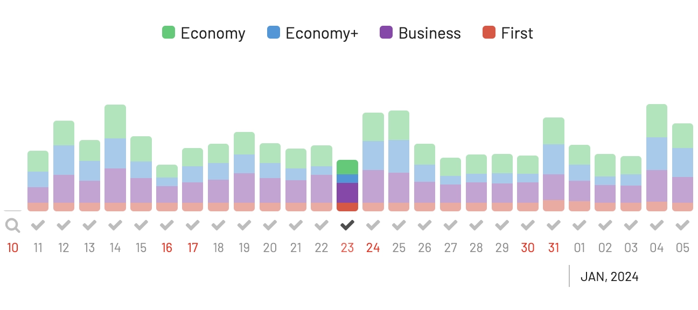

As we approach the busy Christmas and New Year holiday season, with visions of flights to snowy destinations or tropical getaways dancing in our heads, it's also time for the annual battle with award seat availability. But there's a silver lining over the holiday travel horizon: the shift to dynamic award pricing models by airlines and frequent flyer programs.

We covered [the different types of award charts in this post](https://blog.awardfares.com/demystifying-award-charts/). Most programs adopt dynamic pricing models, where the miles needed for a flight fluctuate based on demand, fare class, and other market factors. While some travelers mourn the predictability of the old systems (with fixed prices regardless of the date you wanted to travel), the new models offer unexpected benefits, especially during high-demand periods like Christmas and New Year's. Blackout dates are starting to disappear.

In this post, we cover all you need to know about booking award trips during holidays or peak seasons; plus, we show how to leverage AwardFares to maximize your redemptions.

### In This Post

- [How Dynamic Award Pricing Can Help You Find Award Availability During Peak Travel Seasons](#how-dynamic-award-pricing-can-help-you-find-award-availability-during-peak-travel-seasons)
- [AwardFares: The Secret Tool For Holiday Award Travel](#awardfares-the-secret-tool-for-holiday-award-travel)
- [Where To Go? (Our Top Picks)](#where-to-go-our-top-picks)
- [Get started](#get-started)
- [Read more](#read-more)

## How Dynamic Award Pricing Can Help You Find Award Availability During Peak Travel Seasons

The most significant advantage of dynamic pricing is the increased availability. Fixed-mileage charts often came with blackout dates, those dreaded times of the year when award seats were as mythical as unicorns. Dynamic pricing, however, often eliminates these blackout dates, meaning that as long as there's a seat on the plane, there's a chance you could book it with points.

This flexibility extends to last-minute travel plans as well. In the past, booking a reward flight close to the travel date during peak season was nearly impossible. Now, airlines can adjust the mileage cost instead of simply making seats unavailable.

### What Are Blackout Dates?

Blackout dates in frequent flyer programs are specific dates or periods during which members cannot redeem their miles for award flights. Airlines use blackout dates to restrict award availability during peak travel times, such as holidays and school breaks.

Some airlines have eliminated blackout dates from their frequent flyer programs. Others have reduced the number of blackout dates or limited them to specific routes or travel classes.

### Availability Over The Winter Holidays

Flexibility is vital to make the most out of dynamic award pricing. If you can fly a day or two before the peak holiday rush or return a day later, you might find better availability and lower mileage costs. Being open to connecting flights instead of direct flights can yield better deals.

Let's look at some concrete examples using AwardFares. We'll search for awards from London (LHR) to New York (NYC) across different programs over Christmas and New Year, looking at the overall availability and pricing.

#### American AAdvantage (Dynamic)

American is known to be more generous with their availability (and also on their partners). As of today, there are many options from London to New York over the holiday season.

American [shifted to dynamic pricing](https://simpleflying.com/american-airlines-switches-to-dynamic-pricing-for-reward-tickets/) in early 2023 and made significant changes to its program (also simplifying earnings and status qualification).

As we can see using AwardFares *Timeline View*, availability drops as we get closer to the 23rd and then increases on the 24th and 25th. Similarly, fewer seats are available on December 29th and 30th, right before New Year's Eve.

A bright side about AAdvantage is that their chart is moderate regarding price increases during peak seasons while there's good availability. Remember that these prices will increase closer to the departure date.

Tap on the search result header to sort results by price. In this case, we even see flights on American at 41.5k miles, which is a reasonable rate for the day before Christmas.

#### United MileagePlus (Dynamic)

United also has considerable availability over the holidays, for example, to Newark (EWR). However, they are not as forgiving with their pricing.

As with AAdvantage, we can also notice how available seats start to drop towards December 24th and during the last days of 2023.

On December 23rd, redemptions in Economy start at 62k miles and 146k miles in Business Class.

However, a few days earlier (December 18th), you can find seats for 40k miles in Economy and 80k points in Business Class. Again, flexibility is key.

#### Alaska Mileage Plan (Dynamic)

Mileage Plan also shifted to dynamic pricing, and it can be a great program when you want to fly premium cabins such as Business and First Class, thanks to their flexible policies.

Interestingly, we see fewer available seats around the holidays on this route compared to the previous weeks. On the other hand, Mileage Plan lets you find and book First Class awards well in advance, which can be great for securing a pleasant journey back and forth to your destination.

Prices are also decent but can be inconsistent because of their multiple unaligned partners. In the example below, the same route on British Airways costs 57k miles in Business Class but 80k miles in Economy Class with Air Lingus. Watch out! 

#### SAS EuroBonus (Zone Based)

While SAS EuroBonus doesn't impose blackout dates, using AwardFares Timeline View, it becomes clear that availability is way lower than with other programs around the holidays.

On the other hand, the bright side is that awards always cost the same (fixed-price, zone-based). Scoring a seat on the flight you want is more competitive, but you get the most value for your miles or points, given that cash prices tend to be crazy due to high demand.

### Monitor and Move Quickly

With dynamic pricing, award costs can change frequently, so monitoring flights to your preferred destination is essential. If you see a good deal, don't hesitate. The number of miles/points required will increase if you wait.

Moreover, it pays to book early. While last-minute award availability is possible, airlines typically offer a better value for those who plan ahead. Keep an eye on trends and search for award flights as soon as your travel dates are firm.

### The Points Game Is Like The Stock Market

Another strategy to consider is diversifying your points' portfolio. Since different airlines may offer better deals depending on the route and season, having points with multiple carriers or transferable points through credit card rewards programs can give you more options to find the best deal.

## AwardFares: The Secret Tool For Holiday Award Travel

AwardFares offers a range of pro features that lets you discover sweet spots across different types of award charts and find the best redemptions regardless of the season, including:

- **Ultra-fast search engine**. AwardFares allows you to explore availability across frequent flyer programs, airlines, and alliances in seconds.
- **Advanced filters to narrow down your search**. Filter your search by airline, destination, travel class, and other factors. This can help you quickly find flights that meet your criteria.
- **Compare different award charts**. AwardFares shows different award charts side-by-side, which can help you find the best possible redemption rate for your miles and points.
- **Set up alerts** for specific flights or routes. This way, you will be notified via email if a seat opens up on the flight you want so you can book it at the best possible time.

## Where To Go? (Our Top Picks)

### 1. New York City, USA

The Big Apple is magical during the holidays with its festive decorations, iconic Christmas tree at Rockefeller Center, and numerous holiday markets.

**Our top pick**: Frankfurt (FRA) or London (LHR) to New York (EWR) on British Airways First Class for 85k Alaska Mileage Plan miles.

### 2. Paris, France

Paris is stunning during the festive season, with lights lining the Champs-Elysées and holiday markets sprinkled throughout the city. The weather is chilly, but the charm is abundant.

**Our top pick**: [Singapore (SIN) to Paris (CDG) on Etihad Business Class](https://awardfares.com/search?SIN.CDG.2023-12-22;o:duration;so:a;z:aadvantage) for 75k AAdvantage miles.

### 3. Sydney, Australia

If you prefer summer during December and January, Sydney is in full swing with its summer festivities, including New Year's Eve fireworks over the harbor.

**Our top pick**: [Los Angeles (LAX) to Sydney (SYD) in Qantas Premium Economy](https://awardfares.com/search?LAX.SYD.2023-12-22;o:duration;so:a;z:alaska) for 47.5k Alaska Mileage Plan miles.

### 4. Tokyo, Japan

Tokyo combines the traditional with the modern, offering a unique holiday experience. Enjoy winter illuminations, New Year's festivities, and the chance to experience the first shrine visit of the year (Hatsumode).

**Our top pick**: [Frankfurt (FRA) or Munich (MUC) to Tokyo Narita (NRT) in Swiss Business Class](https://awardfares.com/search?FRA,MUC.area:TYO.;so:a;z:sas,united) for 82.5k United MileagePlus miles or 99k SAS EuroBonus points.

### 5. Maui, Hawaii, USA

For a tropical holiday season, Maui offers a warm escape with beautiful beaches, whale watching, and a relaxed atmosphere for the end of the year.

**Our top pick**: [London (LHR) to Maui (OGG) on British Airways First Class and American Airlines Business Class](https://awardfares.com/search?LHR.OGG.2023-12-30;o:business;so:a;x:0,1;z:aadvantage) (mixed cabin), for 102k AAdvantage miles.

## Get started

You can [try AwardFares for free](https://awardfares.com/). We are rolling out new features and improvements regularly, so [sign up for our monthly newsletter](https://awardfares.com/newsletter) to stay on top of the latest news, announcements, and pro tips.

With our [Gold and Diamond tiers](https://awardfares.com/pricing), you can access premium features such as unlimited daily searches, alerts, seat maps, flight schedules, and more!

## Read more

Make sure to also check these posts out

- [How To Find Cheap Award Flights And Identify Good Redemptions (Step-by-step)](https://blog.awardfares.com/how-to-find-cheap-award-flights/)
- [Seat Maps: Getting The Perfect Seat Even Before Booking](https://blog.awardfares.com/seatmaps-guide/)
- [10 Tips For Booking An Award Trip In 2023](https://blog.awardfares.com/award-trip-tips/)
- [Demystifying Award Charts: All You Need To Know (2023)](https://blog.awardfares.com/demystifying-award-charts/)
- [Ultimate Guide to Award Release Dates](https://blog.awardfares.com/ultimate-guide-to-award-release-dates)