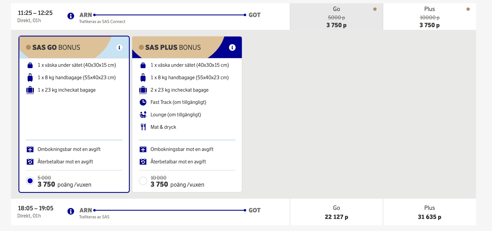
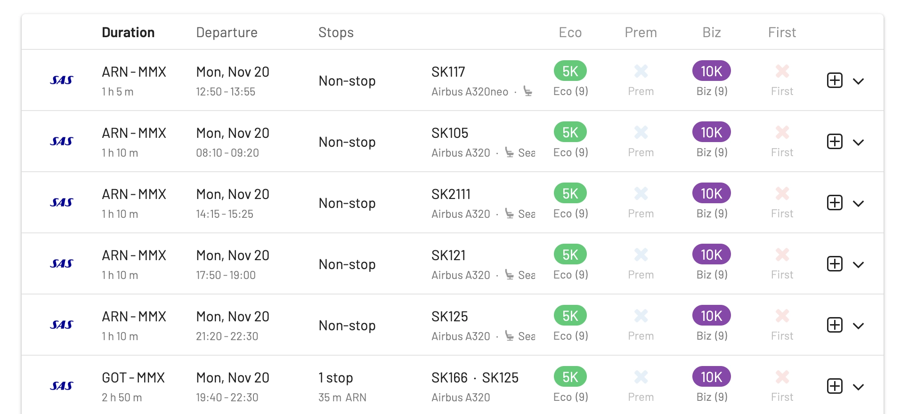
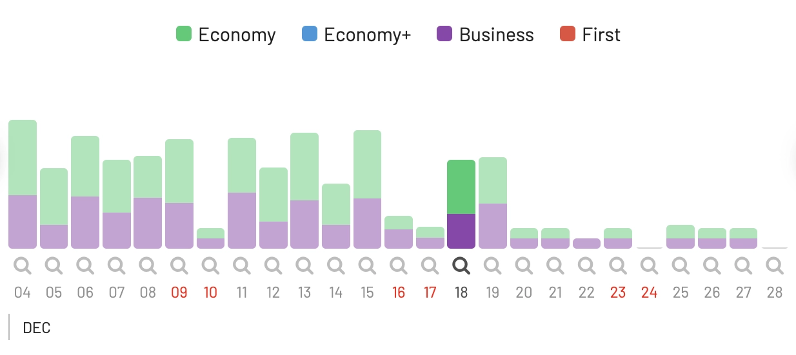
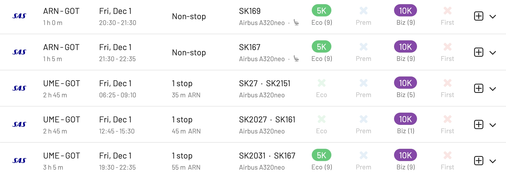
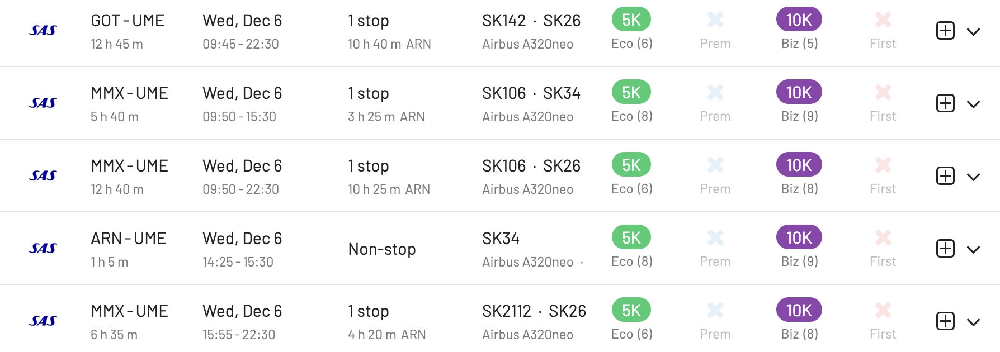
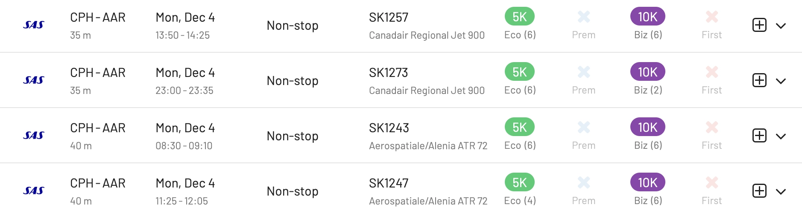
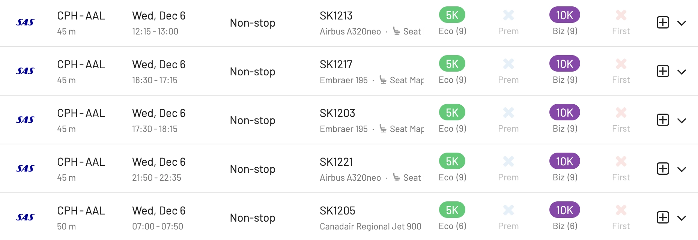
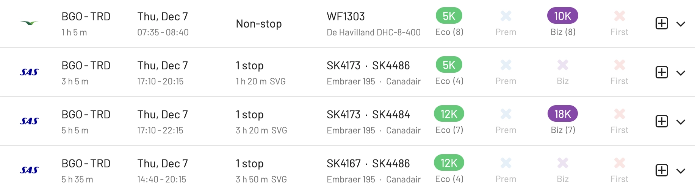
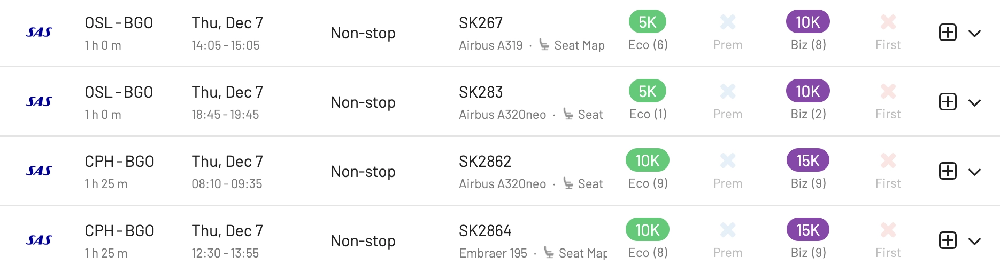

Heja EuroBonus members! If you have *just a few* points on your account and are unsure what to do with them, this is a great time to book a winter escape at great rates. The program is offering a 25% discount on [SAS Go and SAS Plus](https://flysas.com/) award trips to selected destinations in Sweden, Norway, and Denmark.

Hurry up, because there's only a few days left to book! The promotion is valid until November 20th for flights between December and March 2024. The offer applies to one-way and return journeys in SAS Go Bonus and SAS Plus Bonus. And as usual, children 2-11 years old get 50% of the point price, even on the already discounted price.

  TIME LEFT TO BOOK

There are many seats available, as we show below using AwardFares. Typical [prices for these awards](https://www.flysas.com/en/eurobonus/points/fly-with-points/point-chart/) are 5k EuroBonus points in SAS Go and 10k in SAS Plus (one-way). However, with this promotion, you can get them for as low as 3750 points and 7500 points respectively.

In addition, members with the SAS Mastercard Fly Premium benefit can combine it with the discount. This benefit allows members to book SAS Plus at the price of SAS Go, at just 3750 points!

**Promotion details:**

* Discount: 25% in SAS Go Bonus and SAS Plus Bonus
* Book by **November 20th, 2023** (end of day)
* Travel period: 1 December – 31 March 2024
* Destinations within [Sweden](https://www.sas.se/special-offers/poangrabatt/): Malmö, Umeå, Gothenburg and Ängelholm.
* Destinations within [Norway](https://www.sas.no/special-offers/poengrabatt/): Bergen, Stavanger, Trondheim, and Tromsø.
* Destinations within [Denmark](https://www.sas.dk/special-offers/pointrabat/): Aarhus, Aalborg, and from Denmark to Trondheim and Bergen.

## SAS EuroBonus Award Flights With 25% Discount

**Note:** Keep in mind that AwardFares will show you the award prices without the 25% discount applied, since it gets calculated and applied after you log in to your SAS account. AwardFares never asks you for your loyalty program's credentials!

## 1. [Malmö](https://awardfares.com/search?.MMX.;z:sas)

## 2. [Gothenburg](https://awardfares.com/search?.GOT.;z:sas)

For Gothenburg, despite there are no official blackout dates, we see no seats available during December 24th, and in general, fewer seats available over Christmas and New Years' weeks.

## 3. [Umeå](https://awardfares.com/search?.UME.;z:sas)

## 4. [Aarhus](https://awardfares.com/search?.AAR.;z:sas)

## 5. [Aalborg](https://awardfares.com/search?.AAL.;z:sas)

## 6. [Trondheim](https://awardfares.com/search?.MMX.;z:sas)

For Trondheim, we see options on Wideroe available. (E.g., Bergen to Trondheim non-stop).

## 7. [Bergen](https://awardfares.com/search?.BGO.;z:sas)

## How to search for SAS EuroBonus Awards with AwardFares?

1. Go to [AwardFares](https://awardfares.com/signup).
2. Under Frequent Flyer Program, choose **SAS EuroBonus only**.
3. Tap on Airline and select **SAS only**.
4. Enter your departure area or city (e.g. **Stockholm**).
5. Enter your destination airport (e.g. **Gothenburg**).
6. Choose a date, or use the Timeline view to explore flights for different dates.

That's it! You will see the full result list on the list below.

## Upgrade for more features

With our [premium features on Gold and Diamond](https://awardfares.com/pricing), you can also set up alerts to get notified when seats become available, as well as check seat maps, flight schedules, and more.

You can [try AwardFares for free](https://awardfares.com/). We are rolling out new features and improvements regularly, so sign up for our newsletter to stay on top of the latest news, announcements, and pro-tips!

## Terms and Conditions

> * The price is set according to place of departure and destination, regardless of the chosen route (direct or with a stopover).
> * The offer applies one-way or return.
> * You must be logged in to see the points discount.
> * Taxes and service charges are added per person and may vary depending on destination and route. The exact amount will be shown when you book. Taxes and fees cannot be paid with points.
> * The points discount is only available for SAS Bonus tickets. It is not available when you mix points and cash, and for regular tickets for points.
> * When mixing a SAS Bonus ticket with a regular ticket for points in a single booking, only the Bonus ticket receives the discount.
> * Both the outbound and inbound journeys must begin during the stated travel period.
> * Children receive a 50% discount on the offer unless otherwise stated.
> * Infants travel free if you book a seat for your infant — 50% discount.
> * Offer start and end times are always midnight to midnight CET, unless otherwise stated.
> * The number of seats for bonus journeys is always limited.
> * Bookings cannot be changed once the booking period for the campaign has ended, but then normal bonus prices apply.
> * The traveler must pay all applicable fees, e.g., airport tax.
> * Cannot be combined with other discounts/offers for bonus travel except Mastercard FlyPremium (level 2-4).
> * The general membership conditions for EuroBonus apply.

## Read more

Make sure to also check these posts out

* [SAS EuroBonus Analysis and Forecast (Free Tool)](https://blog.awardfares.com/eurobonus-analysis-and-forecast/)
* [Essential Guide To Book Lufthansa Flights With SAS EuroBonus Points](https://blog.awardfares.com/lufthansa-with-eurobonus-guide/)
* [SAS Will Leave Star Alliance! Here’s What To Do Next (2023)](https://blog.awardfares.com/sas-acquisition/)
* [7 Benefits Of SAS Joining SkyTeam (The Bright Side)](https://blog.awardfares.com/sas-and-skyteam/)

