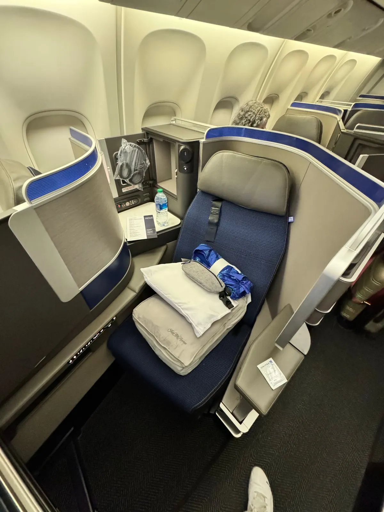
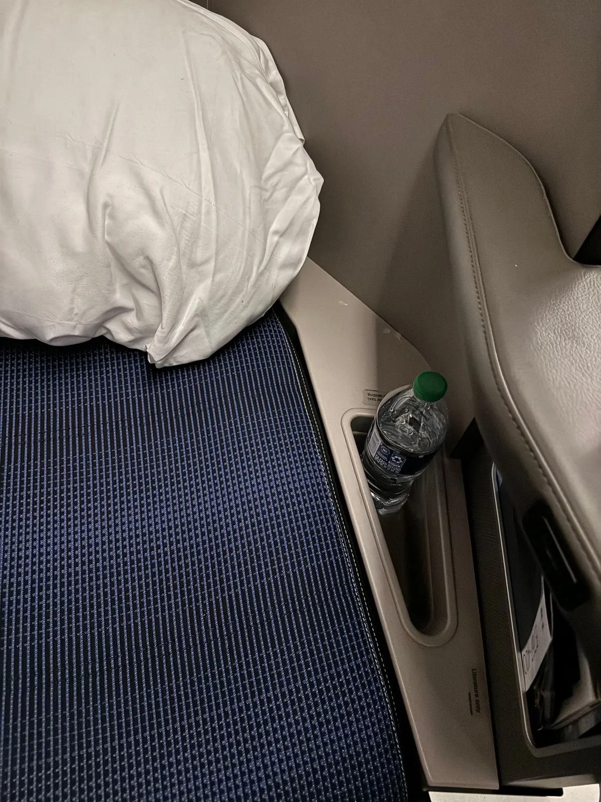
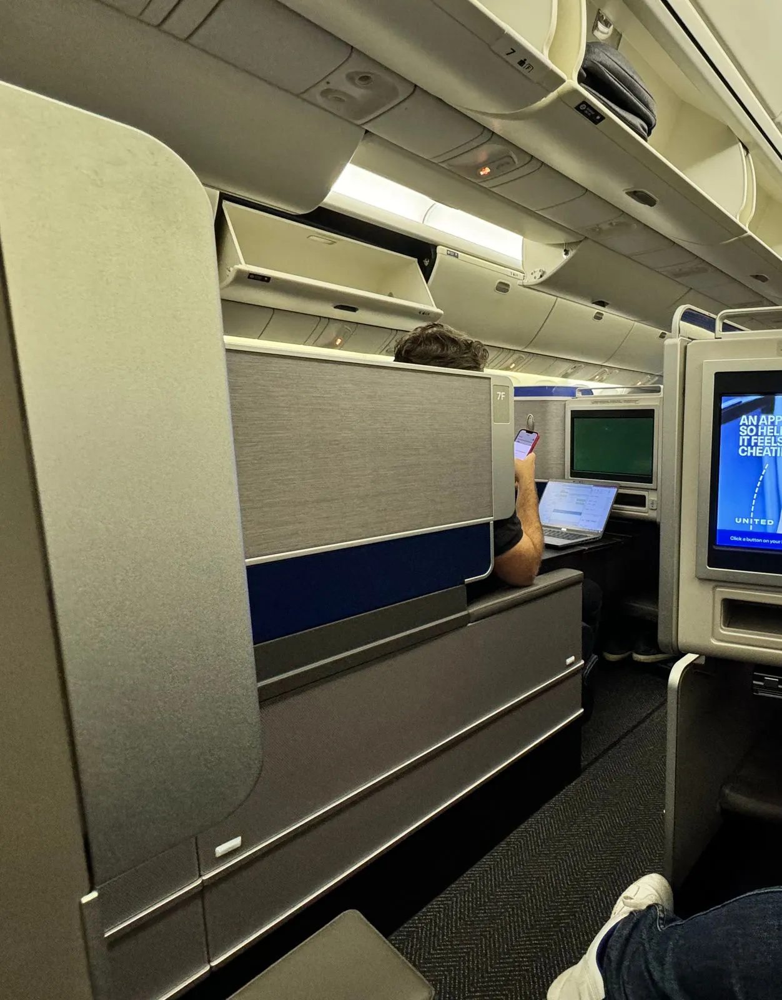
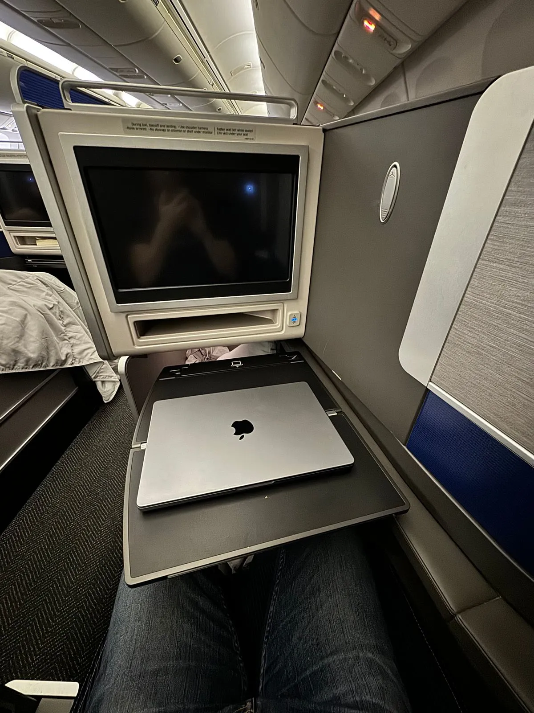
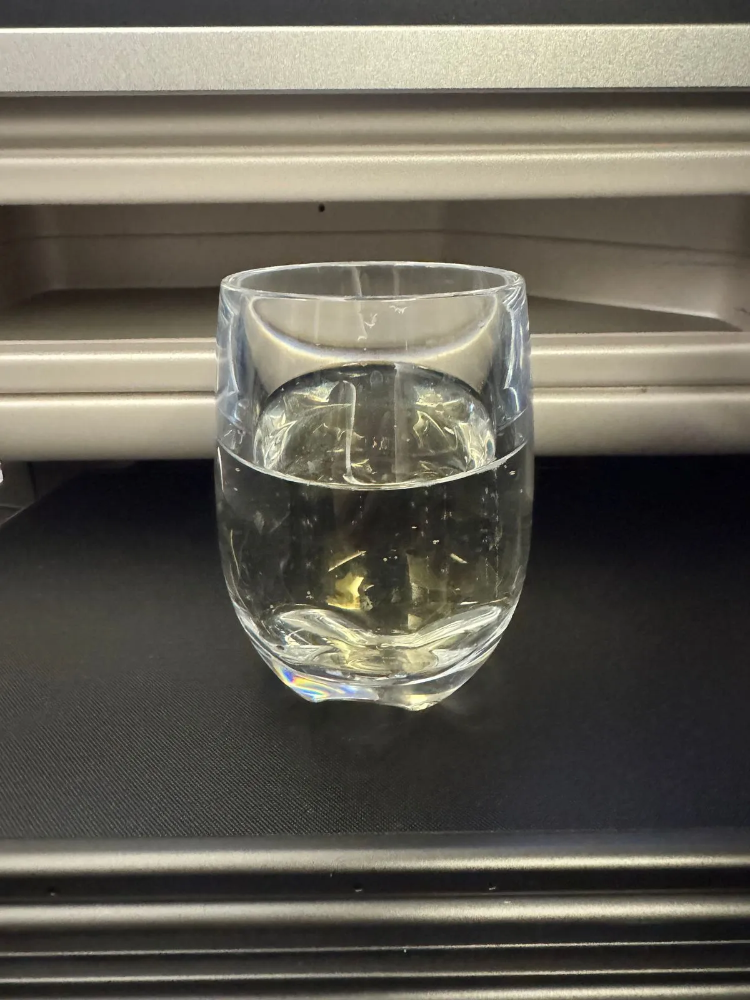
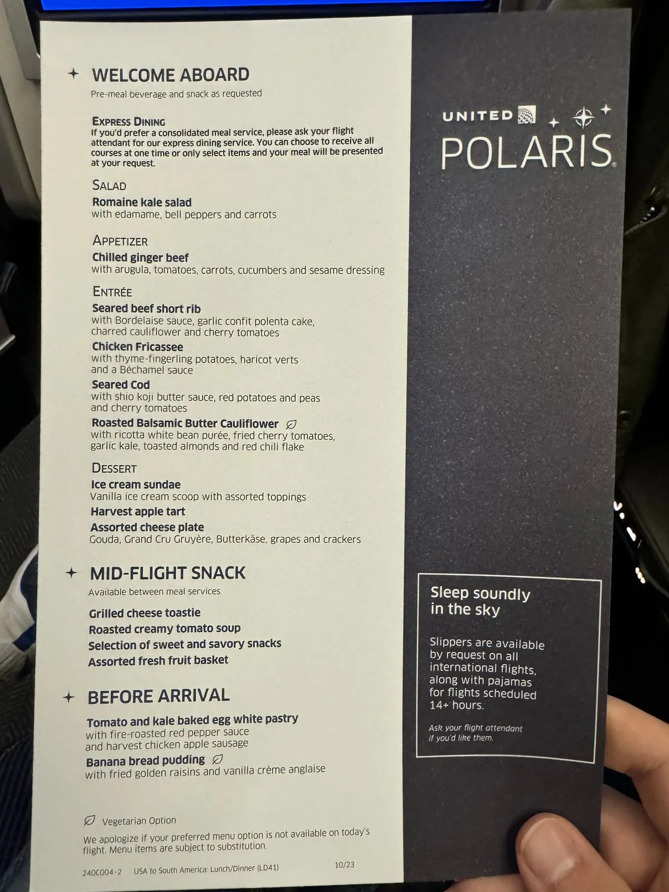
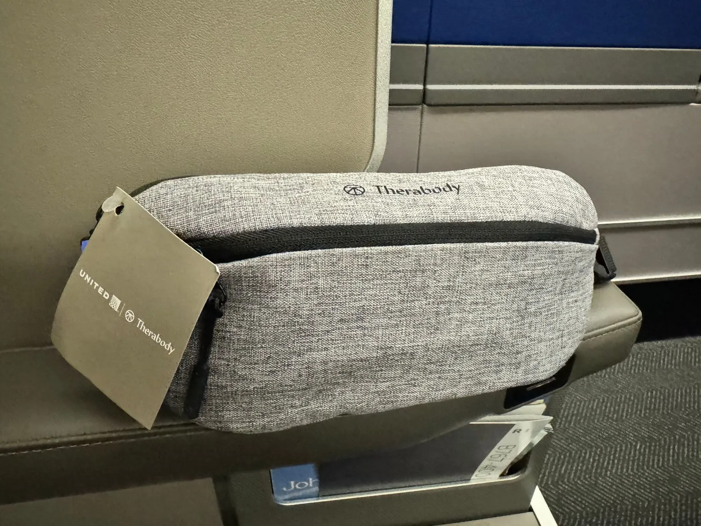

United recently finished their [Polaris Business](https://www.united.com/en/us/fly/travel/inflight/polaris.html) rollout to all planes in their fleet. It's a new concept for their business class product spanning everything from lounges to cabins to food and drink. I recently tried it out on a flight from Washington to São Paulo.

### In This Post

- [How I Booked This Flight](#how-i-booked-this-flight)
- [Seat And Cabin](#seat-and-cabin)
- [Food And Drink Service](#food-and-drink-service)
- [Amenity Kit](#amenity-kit)
- [Airport And Lounge](#airport-and-lounge)
- [IFE](#ife)
- [Sleep](#sleep)
- [Conclusion](#conclusion)
- [Read More](#read-more)

## How I Booked This Flight

You can [try AwardFares for free](https://awardfares.com/), and with the [Gold and Diamond tiers](https://awardfares.com/pricing), you can get access to premium features such as unlimited daily searches, alerts, seat maps, flight schedules, and more.

## Seat And Cabin

The seats are [layed out](https://www.united.com/ual/en/us/fly/travel/inflight/aircraft/767-300er.html) in 1-1-1 configuration, which is similar to SAS in some regards, with alternating seats being closer to the window and closer to the aisle. Sadly, I could only get a seat closer to the aisle, which, of course, has worse privacy compared to those slightly closer to the windows. That being said, the privacy overall is very good, with each seat being surrounded by high walls, making it hard to see anyone apart from your nearest neighbor.

<figure>

</figure>

Since the cabin is almost brand new everything is in good condition and the seats are very comfortable. The seats also offer good amounts of storage space with a large compartment under the footrest and a clever bottle holder next to where your head ends up when sleeping. A very good way of knowing where the water is if you wake up thirsty while sleeping. My only complaint would be that the table is very small and fitting both a 14" laptop and dinner was a challenge and that the seat is a bit narrow when sleeping.

<figure>

</figure>

## Food And Drink Service

I opted for the expedited service since the flight was late in the evening, and I had just come from a long layover in Washington and was eager to sleep. The dinner was decent, but nothing stood out, and neither did the way it was served with a plastic cover, similar to how it would look in Economy Class. The breakfast was a lot better, as has always been my experience on US airlines.

The wine selection is decent, with even real Champagne (The kind that's from the region of France called Champagne) being on offer. However, the way of serving it was... interesting. It was served in "glass" made of thick plastic, the kind you would expect someone to keep their toothbrush in. This certainly took away from the premium experience that a business class flight usually is.

<figure>

</figure>

## Amenity Kit

The amenity kit was certainly a nice surprise and a bit creative in being delivered in a sling bag (Or fanny pack as some would put it). It contained the usual suspects of ear plugs, eye mask, socks, toothbrush, and toothpaste as well as some hand cream and lip balm. As usual with the socks that come with amenity kits they are made of a large amount of polyester which makes them very uncomfortable to wear and very sweaty. All in all nothing stood out in the contents but the bag I'll certainly be reusing.

## Airport And Lounge

If you're flying from any of United's major hubs (Chicago, Houston, Los Angeles, Newark, San Francisco, or Washington) in the US, you will have access to the United Polaris Lounge. Arguably, one of the best business class lounges in the world, offering not just a great environment to work or wait in but also an excellent selection of wines, spirits, and craft beer as well as a full restaurant with à la carte menu. As a beer geek, I always enjoy grabbing a craft beer or two, and the selection is rotated with some regularity, so you can always find something new to try.

## IFE

I didn't use the IFE beyond turning off the screen. The only thing I noticed was that the screen seemed very unresponsive to my actions on the remote control, and since the screen is quite far away, it's not possible to use the touch screen.

## Sleep

I slept like a baby on this flight; with the flight being about 10 hours long, I got a whole night's sleep and then some. The seat was comfortable, although narrow, especially in the foot well. I struggled to fit my feet comfortably in any other position than with the toes pointing straight up. The bedding was quite comfortable and a nice touch, although not quite as lovely as, for example, SAS.

## Conclusion

The United Polaris Business Class is a product full of contrasts. On the one hand, it offers access to lounges on par with some first-class lounges; on the other hand, wine is served in plastic glasses, and the dinner service is very basic. The seat is comfortable and offers privacy, but the table is too small and narrow. The bedding is comfortable, but the pillow is too small. The IFE is good, but the screen is too far away to use the touch screen. Overall, I would say that the United Polaris is a solid product, but it's not a product that stands out in any way, and it lacks the refinement of some of the better Asian airlines.

## Read More

Make sure to also check these posts out

- [United MileagePlus Sweet Spots (2023)](https://blog.awardfares.com/mileageplus-sweet-spots/)
- [How To Find Cheap Award Flights And Identify Good Redemptions (Step-by-step)](https://blog.awardfares.com/how-to-find-cheap-award-flights/)
- [Seat Maps: Getting The Perfect Seat Even Before Booking](https://blog.awardfares.com/seatmaps-guide/)
- [Demystifying Award Charts: All You Need To Know (2023)](https://blog.awardfares.com/demystifying-award-charts/)

