American Express cardholders in [Sweden](https://www.americanexpress.com/se/kreditkort/sas-eurobonus-premium) and [Norway](https://www.americanexpress.com/nb-no/kredittkort/sas-elite/) have access to a valuable benefit: 2-for-1 vouchers (or *companion ticket*) for flights on SAS and Star Alliance partners. The SAS Amex 2-for-1 Voucher is a testament to the many years of synergy between Scandinavian Airlines (SAS) and American Express; offering a unique advantage to EuroBonus members, quite rare in the market these days.

This benefit lets the cardholder book a flight and bring a companion along on the same flight, only paying taxes and fees for the second ticket, **or** you can book a flight for half-price for one person. It can be used for booking almost any cabin class (Economy, Premium Economy, Business, or First Class, subject to availability) on SAS-operated flights and Star Alliance partners.

Most vouchers expire every year on December 31st. As we get close to the date, we cover the basics of these unique instruments and the best routes to plan your redemptions before they expire. Let's get started!

  TIME UNTIL NEXT VOUCHER EXPIRATION

### In This Post

- [The Basics Of Amex 2-for-1 Vouchers (Or Companion Ticket)](#the-basics-of-amex-2-for-1-vouchers-or-companion-ticket)
- [Best Routes To Use A 2-for-1 Voucher (Our Top Picks)](#best-routes-to-use-a-2-for-1-voucher-our-top-picks)
- [How To Search For SAS EuroBonus Awards With AwardFares](#how-to-search-for-sas-eurobonus-awards-with-awardfares)
- [Read More](#read-more)

## The Basics Of Amex 2-for-1 Vouchers (Or Companion Ticket)

The American Express (Amex) 2-for-1 vouchers are a unique type of companion voucher for SAS Amex cardholders in Sweden and Norway. A companion voucher is a benefit offered by some credit cards that allows you to book a second seat on a flight for a companion for no additional cost or at a significantly reduced cost.

Historically, the Amex 2-for-1 vouchers have been very lucrative for SAS EuroBonus members and a fantastic way to reduce the award prices on luxury cabins such as Lufthansa First Class and others. With the recent announcement of [SAS leaving Star Alliance](https://blog.awardfares.com/sas-acquisition/), it's not clear for how long members will benefit from these unique vouchers.

### What Amex Cards Offer The Voucher?

In both Sweden and Norway, these vouchers are offered to all SAS Amex Elite and SAS Amex Premium cardholders, after meeting the qualification requirements.

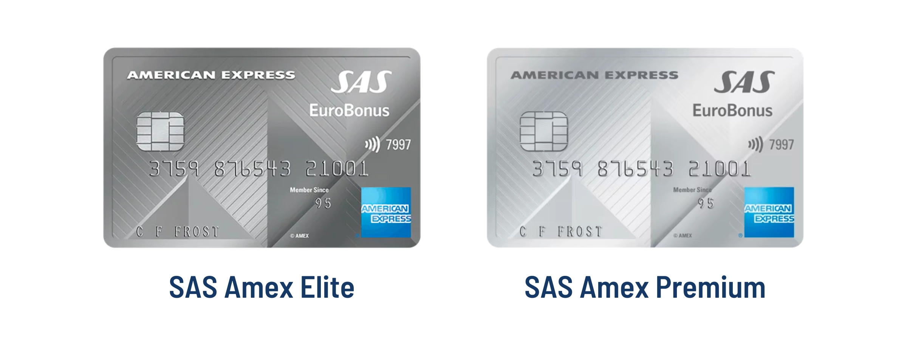

### How The Voucher Works

The voucher allows the cardholder to book two tickets for the price of one, using only points for the second ticket. This is applicable on flights operated by SAS and also Star Alliance member airlines (although in practice, there are some airlines that never release availability because they haven't reached an agreement, such as Singapore Airlines).

Reservations can generally be made online, through SAS website, or the special Star Alliance award search landing page. It's also possible to book via the SAS call center.

### How To Qualify For A Voucher

Overall, the conditions are straightforward. As a cardholder, you get a voucher each time you spend 150.000 SEK/NOK in a year. For the SAS Amex Premium card, you can get a maximum of **one** voucher a year, while up to **two** vouchers if you are a SAS Amex Elite holder.

Note that it is also possible to apply for both the SAS Amex Premium and SAS Amex Elite **at the same time**. This is not against Amex Terms and Conditions, as long as you pay for the maintenance fees. Then, you can get **up to three** vouchers in total, if you meet the qualification requirements on each card (450.000 SEK/NOK).

| Country | Card | Qualification Requirements |
|---------|---------------------------------------|----------------------------|
| Sweden  | SAS Amex Premium                       | Get one voucher after spending 150.000 SEK during a calendar year. |
| Sweden  | SAS Amex Elite                         | Get one voucher after spending 150.000 SEK, and another voucher after spending 300.000 SEK during a calendar year.  |
| Norway  | SAS Amex Premium                       | Get one voucher after spending 150.000 NOK during a calendar year. |
| Norway  | SAS Amex Elite                         | Get one voucher after spending 150.000 NOK, and another voucher after spending 300.000 SEK during a calendar year. |

### Validity

The American Express 2-for 1 voucher is valid from the date you receive your voucher until the end of the following calendar year. For example, if you reach your voucher already on 31 July 2023, you can book from that date until 31 December 2024. Please note that even if the booking must be made before the expiration date, the trip itself can be completed after the expiration date.

### How To Use The 2-for-1 Voucher

For SAS flights, you can book your American Express 2-for-1 voucher online or by phone.

No ticket or booking fee is charged for online bookings. A booking fee of 375 SEK/NOK per person is charged for telephone booking (except when booking is not possible online).

A ticket fee of 450 SEK/NOK per person will be charged on all Star Alliance bookings. An additional booking fee of 375 SEK/NOK per person will be charged for bookings made by telephone (except when booking is not possible online).

For EuroBonus Diamond members (EBD), the 375kr fee is waived, but not the 450kr fee on Star Alliance flights.

For Star Alliance online bookings: [Book here](https://www.flysas.com/en/eurobonus/star-alliance-award-trips/).

### Limitations And Considerations

- Excluded Fees: Additional fees, such as taxes and surcharges, are typically not covered by the voucher and must be paid separately.
- Cancellation/Change Policies: As long as the cancellation has been made at least 24 hours before the start of the EuroBonus trip. The American Express 2-for-1 voucher will be released back to the owner of the offer's EuroBonus account
- The owner of the American Express 2-for-1 voucher can use the offer to book for family or friends. The EuroBonus points will be deducted from the account that received the offer.
- Stopovers are only allowed if they are shorter than 24 hours. Stopovers longer than 24 hours are not allowed with the American Express 2-for-1 voucher.
- The validity of American Express 2-for-1 voucher cannot be extended.
- Full Terms and Conditions: [Here for Sweden](https://www.americanexpress.com/content/dam/amex/se/documents/villkor/eurobonus-poangrabatt.pdf), and [here for Norway](https://www.americanexpress.com/content/dam/amex/no/documents/vilkar/companion-ticket.pdf).

----

### 2-for-1 vs. Fly Premium

In Sweden and Norway, the SAS EuroBonus World Mastercard Premium offers a benefit called [**Fly Premium**](https://saseurobonusmastercard.se/korten/korttjanst/fly-premium/), where, for SAS flights, you can upgrade to Business Class or Premium Economy for free, unlimited times!

In this case, it might be more beneficial for members who can make use of both benefits to use the 2-for-1 vouchers on Star Alliance flights over SAS flights, as you maximize your redemption value.

## Best Routes To Use A 2-for-1 Voucher (Our Top Picks)

Here we picked a few of our favorite routes to use the Amex 2-for-1 voucher, to serve as inspiration. There are plenty of other destinations available, feel free to reach out to us with your examples [on social](https://www.instagram.com/awardfares/), and we'll share them!

On all these redemptions, you will get a great **cents-per-point** (CPM) rate, compared to the price of the tickets in cash. If you want to learn more about redemption rates, the CPM calculation, and how to identify good award flight redemptions, [check our full guide here](https://blog.awardfares.com/how-to-find-cheap-award-flights/).

### On Scandinavian Airlines SAS

#### 1. [Tokyo (A350-900)](https://awardfares.com/search?zone:Scandinavia.HND.;a:SK;o:departs;so:a;z:sas)

- **Example Route**: [Copenhagen (CPH) to Tokyo (HND) in Business Class](https://awardfares.com/search?CPH.HND.;a:SK;z:sas#)
- **Price (Standard)**: 100k points round trip (50k one-way)
- **Price (Using Voucher)**: 50k points round trip per person (25k one-way)

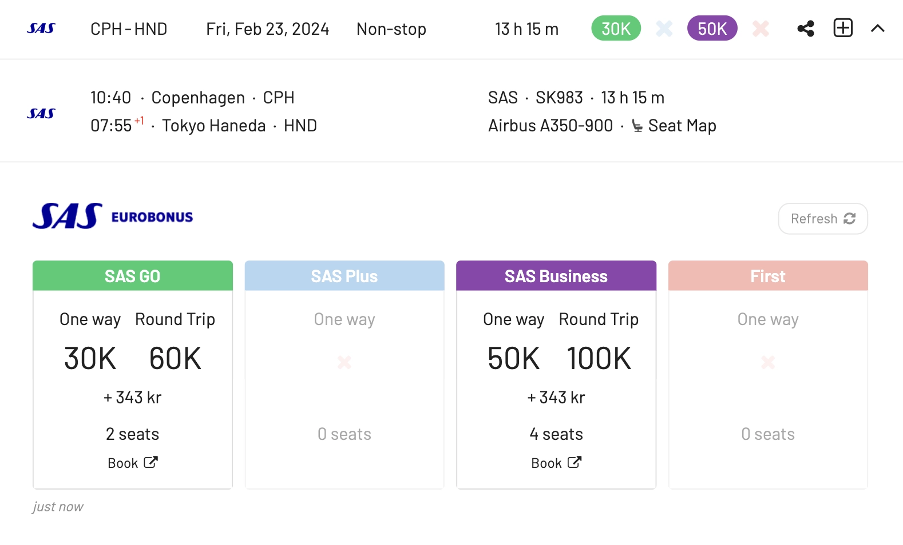

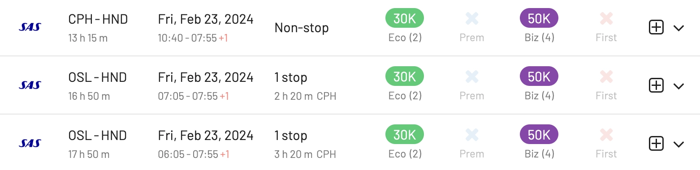

#### 2. [San Francisco (A330-300)](https://awardfares.com/search?zone:Scandinavia.SFO.;a:SK;o:departs;so:a;z:sas)

- **Example Route**: [Copenhagen (CPH) to San Francisco (SFO) in Business Class](https://awardfares.com/search?CPH.SFO.;a:SK;z:sas#)
- **Price (Standard)**: 100k points round trip (50k one-way)
- **Price (Using Voucher)**: 50k points round trip per person (25k one-way)

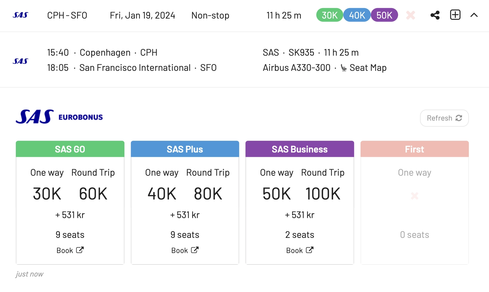

#### 3. [Los Angeles (A350-900)](https://awardfares.com/search?zone:Scandinavia.LAX.;a:SK;o:departs;so:a;z:sas)

- **Example Route**: [Stockholm (ARN) to Los Angeles (HND) in SAS Plus (Premium Economy)](https://awardfares.com/search?ARN.LAX.;a:SK;z:sas#)
- **Price (Standard)**: 80k points round trip (40k one-way)
- **Price (Using Voucher)**: 40k points round trip per person (20k one-way)

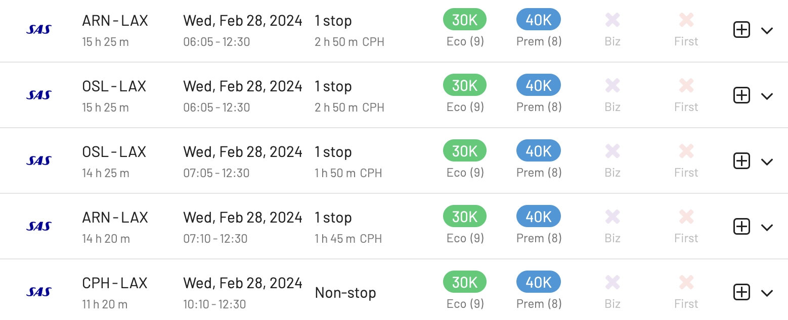

#### 4. [Miami (A330-300)](https://awardfares.com/search?zone:Scandinavia.MIA.;a:SK;o:departs;so:a;z:sas)

- **Example Route**: [Stockholm (ARN) to Miami (MIA) in Business Class](https://awardfares.com/search?ARN.MIA.;a:SK;z:sas#)
- **Price (Standard)**: 100k points round trip (50k one-way)
- **Price (Using Voucher)**: 50k points round trip per person (25k one-way)

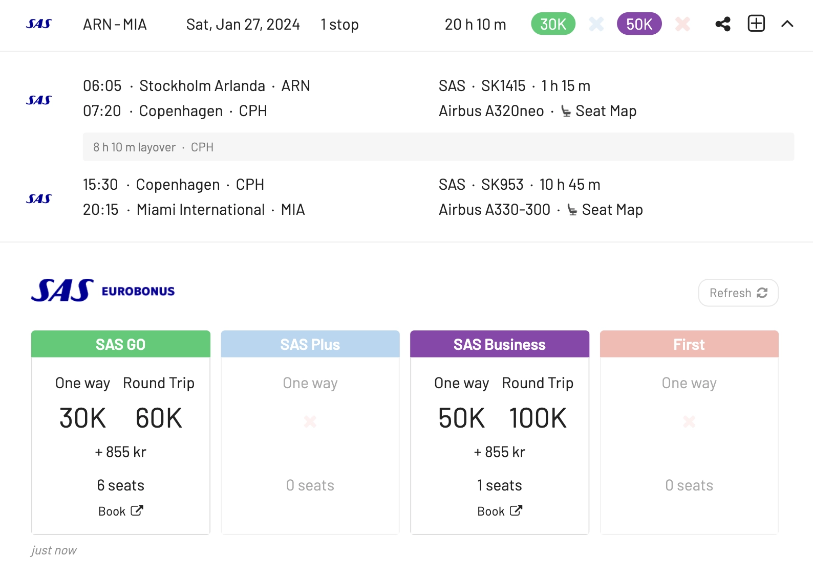

#### 5. [New York (A350-900)](https://awardfares.com/search?zone:Scandinavia.EWR.;a:SK;o:departs;so:a;z:sas)

- **Example Route**: [Copenhagen (CPH) to New York (EWR) in Business Class](https://awardfares.com/search?CPH.EWR.;a:SK;z:sas#)
- **Price (Standard)**: 100k points round trip (50k one-way)
- **Price (Using Voucher)**: 50k points round trip per person (25k one-way)

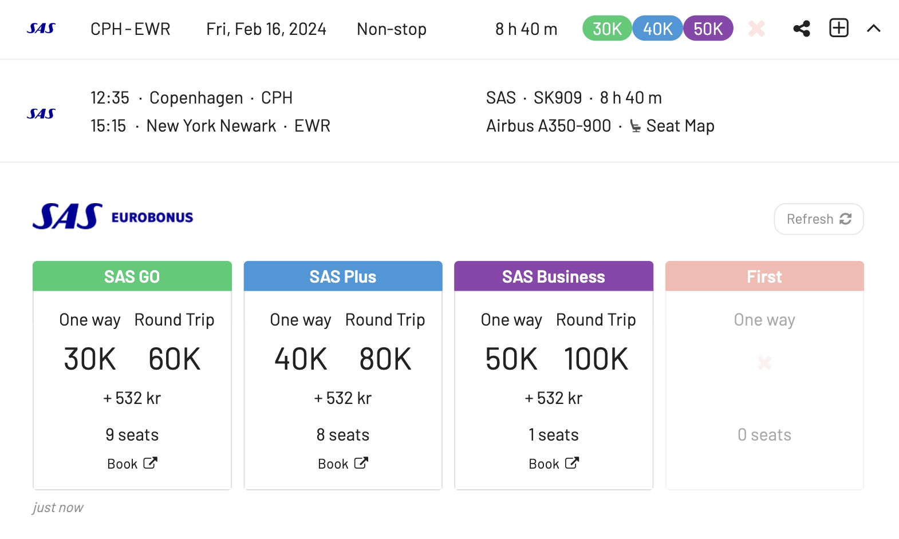

### On Star Alliance Airlines

#### 1. [Lufthansa First Class](https://awardfares.com/search?..;c:first;a:LH;z:sas#)

- **Example Route**: [Frankfurt (FRA) to Buenos Aires (EZE)](https://awardfares.com/search?FRA.EZE.;a:LH;o:business;so:a;z:sas#). Longest route, almost 14h!
- **Price (Standard)**: 165k points round trip (99k one-way)
- **Price (Using Voucher)**: 82k points round trip per person (49k one-way)

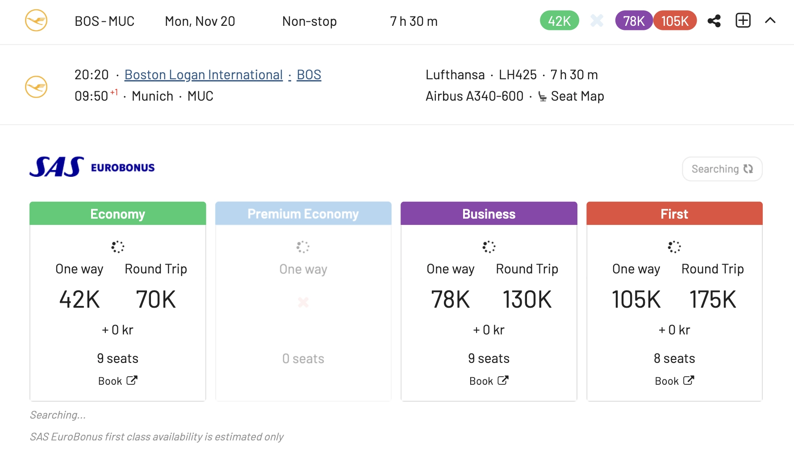

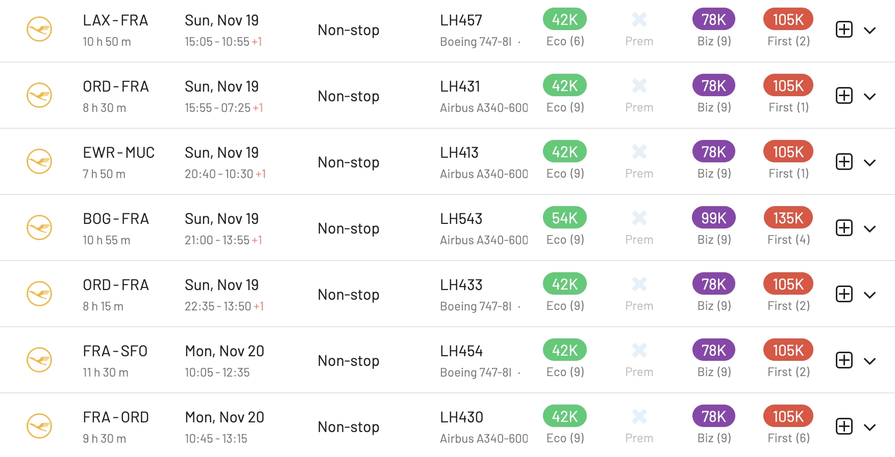

#### 2. [ANA The Room Business Class (777-300ER)](https://awardfares.com/search?..;a:NH;o:departs;so:a;z:sas#)

- **Example Route**: [Chicago (ORD) to Tokyo (HND)](https://awardfares.com/search?ORD.area:TYO.;a:NH;o:business;so:a;z:sas#)
- **Price (Standard)**: 165k points round trip (99k one-way)
- **Price (Using Voucher)**: 82k points round trip per person (49k one-way)

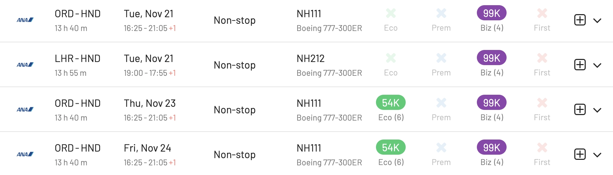

#### 3. [EVA Air 777-300ER Business Class](https://awardfares.com/search?..;c:business;a:BR;z:sas#)

- **Example Route**: [London (LHR) to Bangkok (BKK)](https://awardfares.com/search?LHR.BKK.;a:BR;o:business;so:a;z:sas)
- **Price (Standard)**: 165k points round trip (99k one-way)
- **Price (Using Voucher)**: 82k points round trip per person (49k one-way)

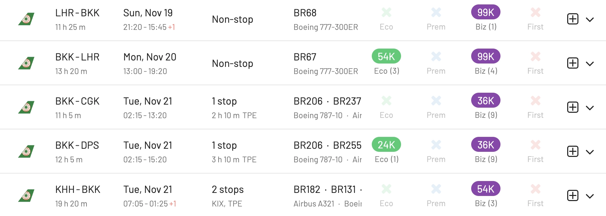

#### 4. [United Polaris Business Class On The 777-300ER](https://awardfares.com/search?..;c:business;a:UA;e:77W;z:sas#)

- **Example Route**: [San Francisco (SFO) to Sydney (SYD)](https://awardfares.com/search?SFO.SYD.;a:UA;o:business;so:a;z:sas)
- **Price (Standard)**: 165k points round trip (99k one-way)
- **Price (Using Voucher)**: 82k points round trip per person (49k one-way)

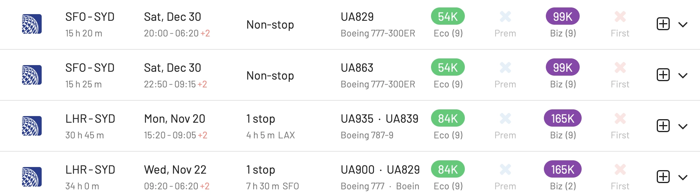

## How To Search For SAS EuroBonus Awards With AwardFares

1. Go to [AwardFares](https://awardfares.com/signup).
2. Under Frequent Flyer Program, choose **SAS EuroBonus Only**.
3. Enter your departure area or city (e.g., **Stockholm**).
4. Enter your destination airport (e.g., **Los Angeles**).
5. Choose a date, or use the Timeline view to explore flights for different dates.

That's it! You will see the full result list on the list below.

### Upgrade for more features

You can [try AwardFares for free](https://awardfares.com/). We are rolling out new features and improvements regularly, so [sign up for our monthly newsletter](https://awardfares.com/newsletter) to stay on top of the latest news, announcements, and pro-tips.

With our [Gold and Diamond tiers](https://awardfares.com/pricing), you can access premium features such as unlimited daily searches, alerts, seat maps, flight schedules, and more!

## Read More

Make sure to also check these posts out

- [How To Find Cheap Award Flights And Identify Good Redemptions (Step-by-step)](https://blog.awardfares.com/how-to-find-cheap-award-flights/)
- [Seat Maps: Getting The Perfect Seat Even Before Booking](https://blog.awardfares.com/seatmaps-guide/)
- [10 Tips For Booking An Award Trip In 2023](https://blog.awardfares.com/award-trip-tips/)
- [Demystifying Award Charts: All You Need To Know (2023)](https://blog.awardfares.com/demystifying-award-charts/)
- [Ultimate Guide to Award Release Dates](https://blog.awardfares.com/ultimate-guide-to-award-release-dates)

