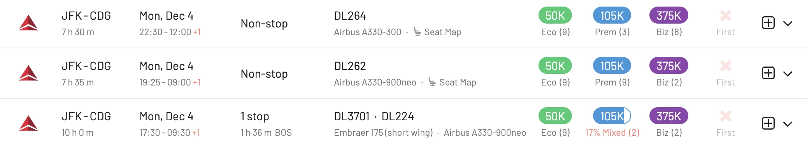
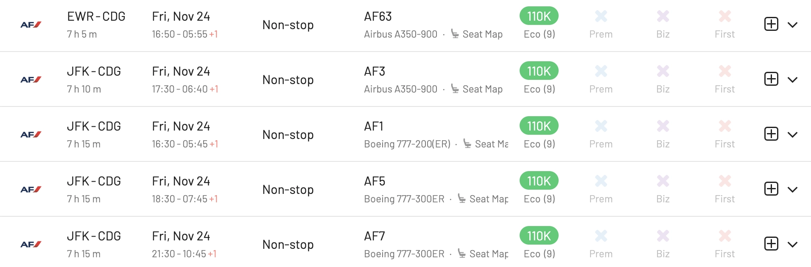
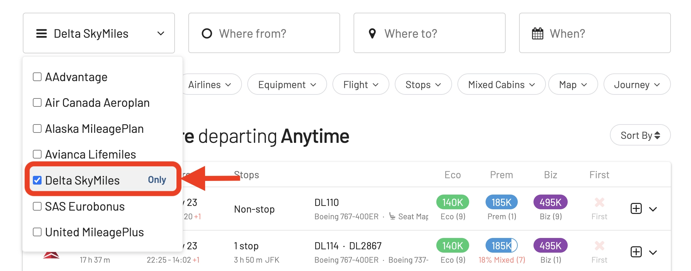
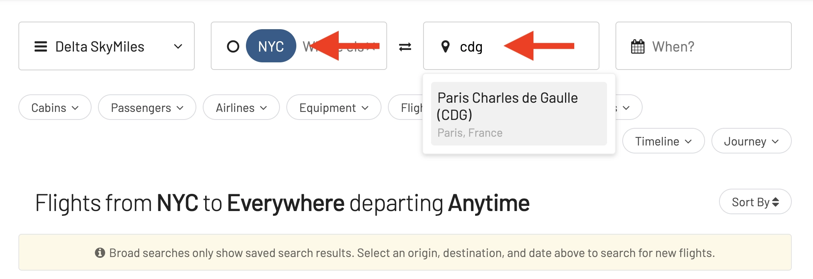
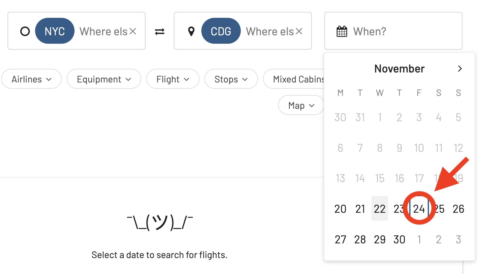
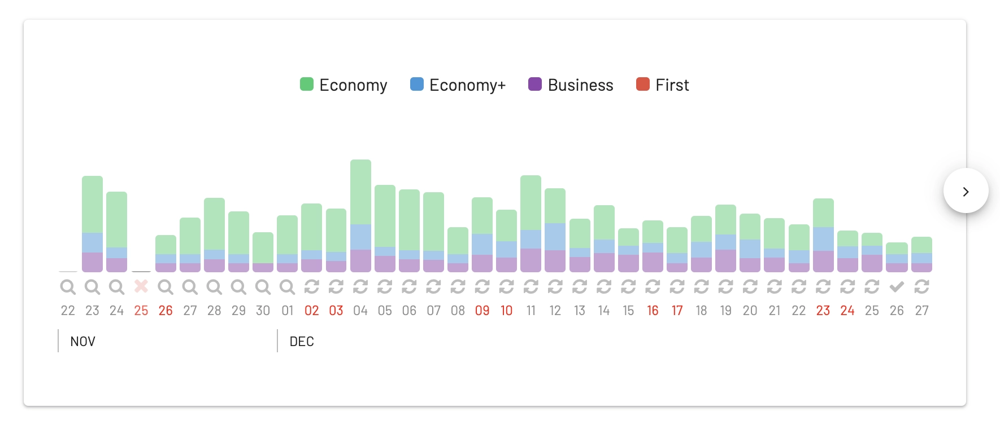
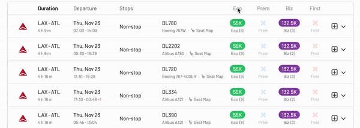
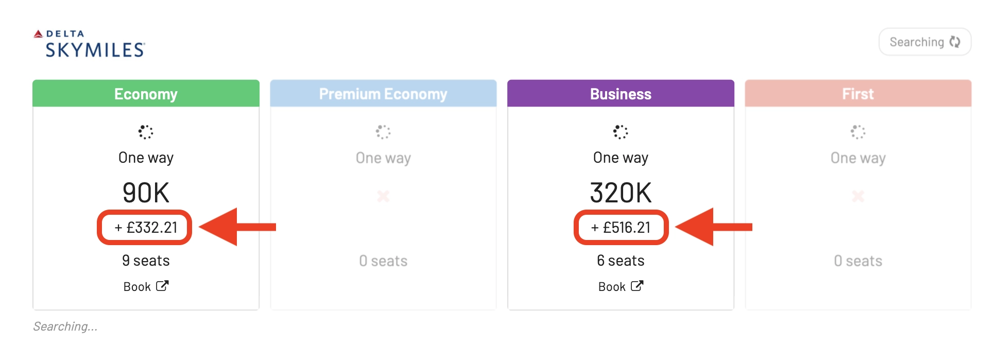
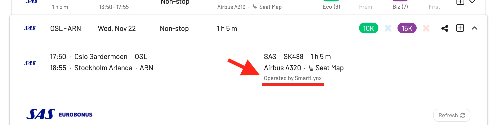
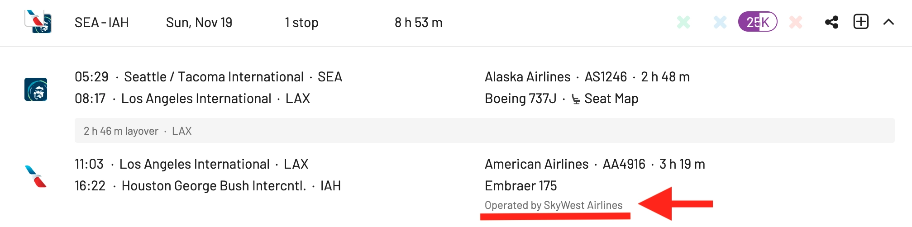

Delta SkyMiles has been one of the most acclaimed frequent flyer programs in the United States, carving out a reputation for its flexibility, lack of blackout dates, and a wide array of redemption options. Despite recently upsetting a large portion of their members with [major changes for 2024](https://www.delta.com/us/en/skymiles/medallion-program/2024-program-updates), it still remains among the best options to redeem award flights on SkyTeam airlines, and stands strong for great earning options and seat availability.

In this update, we are glad to announce support for SkyMiles award flights in AwardFares! Our first SkyTeam partner (with more to come).

### What's new?

- [Introducing Delta SkyMiles Award Search](#introducing-delta-skymiles-award-search)
- [How To Find Cheap Delta SkyMiles Award Flights](#how-to-find-cheap-delta-skymiles-award-flights)
- [More Improvements: *"Operated By"*](#more-improvements-operated-by)
- [Get Started](#get-started)
- [Read More](#read-more)

## Introducing Delta SkyMiles Award Search

We're excited to announce that AwardFares now supports the Delta SkyMiles program! You can now tap into one of the coolest and most flexible frequent flyer programs around to scout out your next adventure. Delta SkyMiles is all about giving you a myriad of options, destinations, and partner airlines, and we're bringing all that directly to your fingertips.

### Redeem on Delta Air Lines

Once you select Delta SkyMiles, you will see all seats availbe on Delta Air Lines flights, and their prices including taxes and fees required to book.

AwardFares will display prices and availability in all cabin types including Economy, Premium Economy, Business and First Class (domestica and international).

Add **Delta** to the **Airline** filter to only display Delta-operated flights.

### Redeem on SkyTeam Airlines

In addition to searching on Delta Air Lines, AwardFares will show availability across al SkyTeam and other SkyMiles partner airlines.

As we can see below, we can search for seats on Air France or KLM from New York to Paris.

## How To Find Cheap Delta SkyMiles Award Flights

### 1. Go to [AwardFares](https://awardfares.com/signup)

Creating an account is optional, but it's also free, and it gives you access to more features. Make sure to [sign up for one here](https://awardfares.com/signup).

### 2. Select your favorite **Frequent Flyer Program**

Tap on the **Loyalty Program** field and select Delta SkyMiles as your loyalty program.

### 3. Add a Route

Use the **Origin** and **Destination** fields to add one (or more) airports to search for flights between those locations. AwardFares will search for award flights with any number of stops. In addition, you can use the **Stops** filter to search for non-stop flights only.

In the example below, we search for flights [between New York City and Paris](https://awardfares.com/search?area:NYC.area:CDG.;so:a;z:delta). Note that we use the metropolitan area codes **NYC** and **CDG** to get results to and from any airport in New York (JFK, EWR, LGA) and Paris (CDG, ORY).

### 4. Explore dates

If you have a particular date in mind, add it by tapping on the **Calendar** field.

If you don't have a set date, you can take advantage of AwardFare's **Timeline View** to explore the seat availability across different days. The Timeline View displays how many seats are available for each day of the week/month. The bars are color-coded, so it's easy to distinguish between cabin classes (Economy, Business, First). You can also trigger new searches by tapping the refresh icon underneath each day.

In addition, you can also tap anywhere on the flight to display more details in an expanded view, such as aircraft type, and even [get the current seat maps](https://blog.awardfares.com/seatmaps-guide/) to see which seats are free versus occupied!

### 5. Sort by Price

Whether you are exploring dates using the Timeline View or have selected a specific day, AwardFares will show you the available seats (with real-time data) within seconds in the result list below.

You can tap on the different header columns to sort the results by price. Use the **Eco**, **Prem**, **Biz**, and **First** class tags to find cheap awards across multiple dates, itineraries, and airlines.

### 6. Book on Delta's Website

Once you have identified the flights you want go to the airline's website and make the booking. Remember that some of these itineraries are not bookable online for specific programs (e.g., mixed-cabin awards). In those situations, you will need to call their service center.

### Taxes and Fees

When you tap on a flight, the detailed view will show you more details about it, including availability, taxes, and fees required to book the award. Note that the currency will be adjusted depending on the departure country (if the currency is officially supported by Delta, otherwise price will be shown in USD).

For example, in this case, the departure city is London (LHR), thus the fees are shown in GBP (£):

## More Improvements: *"Operated By"*

Along with this release, we also took the opportunity flights will now show *"Operated by"* information when flights are performed by a subsidiary or partner airline (e.g., SAS Connect, Cityjet, SmartLynx for SAS, Republic Airways or American Eagle for American, etc.).

## Get Started

You can [try AwardFares for free](https://awardfares.com/). We are rolling out new features and improvements regularly, so [sign up to our monthly newsletter](https://awardfares.com/newsletter) to stay on top of the latest news, announcements, and pro-tips.

With our [premium features on Gold and Diamond](https://awardfares.com/pricing), you can get access to premium features such unlimited daily searches, alerts, seat maps, flight schedules, and more!

## Read More

Make sure to also check these posts out

- [How To Find Cheap Award Flights And Identify Good Redemptions (Step-by-step)](https://blog.awardfares.com/how-to-find-cheap-award-flights/)
- [Seat Maps: Getting The Perfect Seat Even Before Booking](https://blog.awardfares.com/seatmaps-guide/)
- [Ultimate Guide to Award Release Dates](https://blog.awardfares.com/ultimate-guide-to-award-release-dates)
- [What Airlines Have Changed Or Left Alliances? A History of Departures and Switches](https://blog.awardfares.com/airline-alliances-changes/)