Winter is a magical time of year, transforming landscapes into winter wonderlands and inviting adventurers to explore the season's beauty. It's also ideal for a snow-filled getaway: embrace the magic of the mountains and indulge in exhilarating ski and snowboard adventures.

In this blog post, we curated a list of breathtaking cities that are not only accessible through the use of miles or points but also boast some of the most exhilarating ski and snow activities. The list includes the nearest airports and suggested frequent flyer programs to help you book your flights. Let's start!

## Our Top 10 Winter Destinations and How to Get There

### 1. Aspen, Colorado, USA

Aspen is a premier destination for skiing and snowboarding, offering luxurious resorts and vibrant nightlife. It's a perfect spot for a winter getaway because it has fantastic ski slopes and a fun vibe after the skiing. It's a great mix of fancy and outdoorsy, making it great for ski lovers, families, or folks looking to chill in a beautiful mountain town.

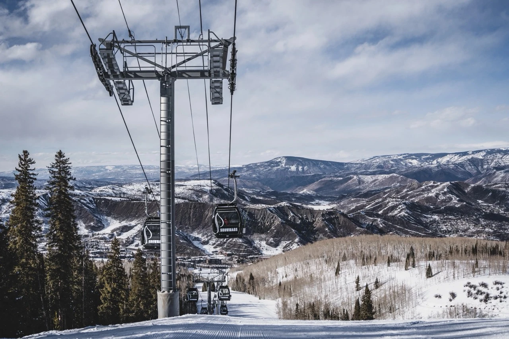

#### How to fly to Aspen?

- **Nearest Airport**: [Aspen/Pitkin County Airport (ASE)](https://awardfares.com/search?.ASE.)
- **Frequent Flyer Program**: MileagePlus, Aeroplan, AAdvantage, Flying Blue.

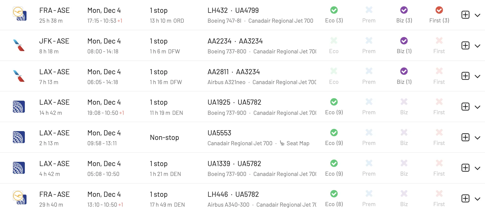

### 2. Whistler, British Columbia, Canada

Whistler in British Columbia is a winter wonderland famous for having one of North America's largest ski resorts and a cool, laid-back mountain vibe. It's not just about the epic slopes; the village has dozens of shops, restaurants, and activities, making it a top pick for a fun and active winter vacation.

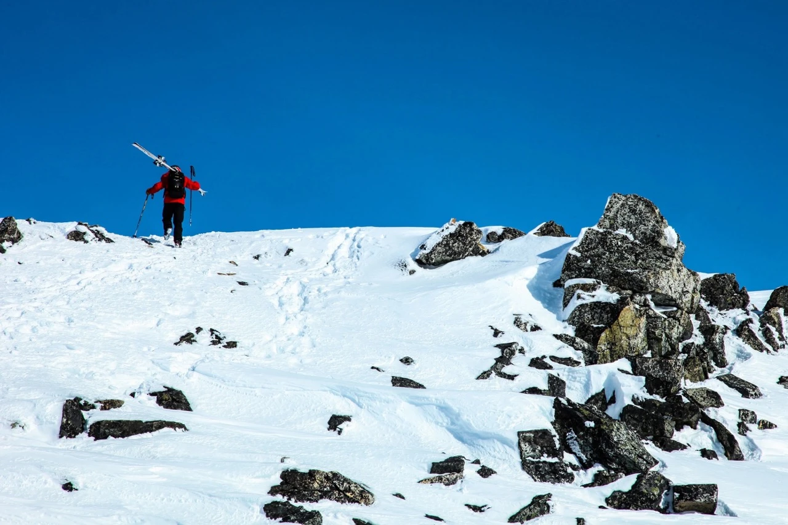

#### How to fly to Whistler?

- **Nearest Airport**: [Vancouver International Airport (YVR)](https://awardfares.com/search?.YVR.)
- **Frequent Flyer Program**: Aeroplan, Flying Blue, AAdvantage, MileagePlus.

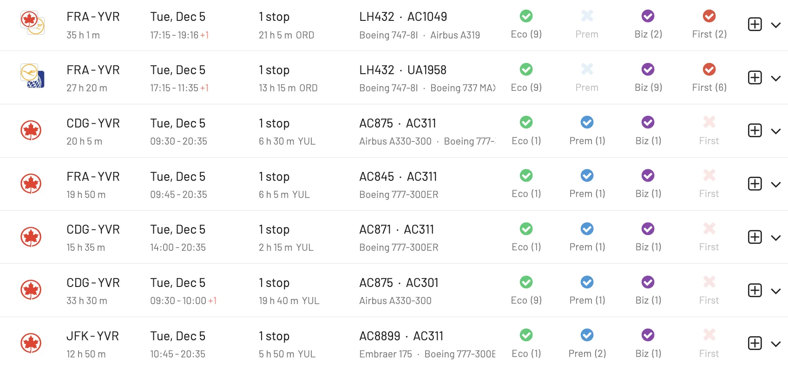

### 3. Åre, Sweden

Åre is a renowned ski resort town in Sweden, nestled in the mountains of Jämtland, known for its stunning alpine landscapes and vibrant ski culture. The town boasts a lively atmosphere with a mix of modern amenities and traditional Swedish charm, attracting visitors year-round.

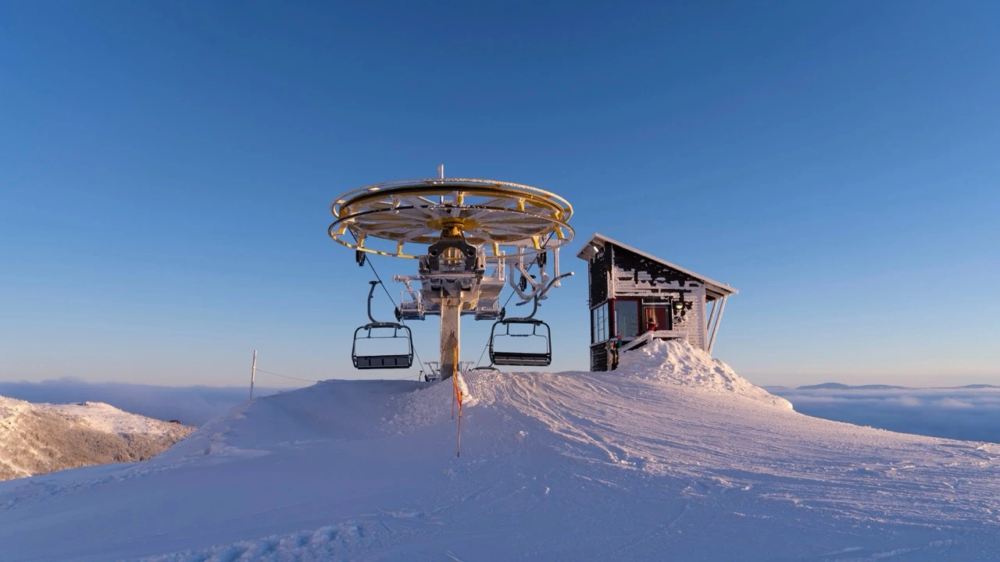

#### How to fly to Åre?

- **Nearest Airport**: [Östersund Airport (OSD)](https://awardfares.com/search?.YVR.)
- **Frequent Flyer Program**: EuroBonus, Flying Blue, MileagePlus.

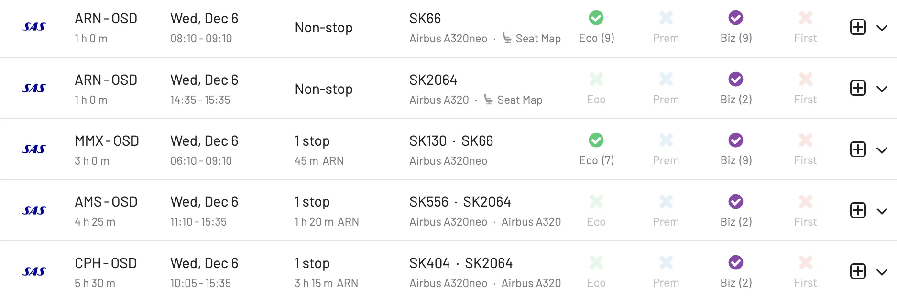

### 4. Zermatt, Switzerland

Zermatt in Switzerland is a must-visit for its jaw-dropping views of the Matterhorn and some of the best skiing in the Alps. The car-free village is charming, with cozy spots to eat and relax after a day in the snow.

#### How to fly to Zermatt?

- **Nearest Airport**: [Geneva Airport (GVA)](https://awardfares.com/search?.GVA.) or [Zurich Airport (ZRH)](https://awardfares.com/search?.ZRH.)
- **Frequent Flyer Program**: EuroBonus, MileagePlus.

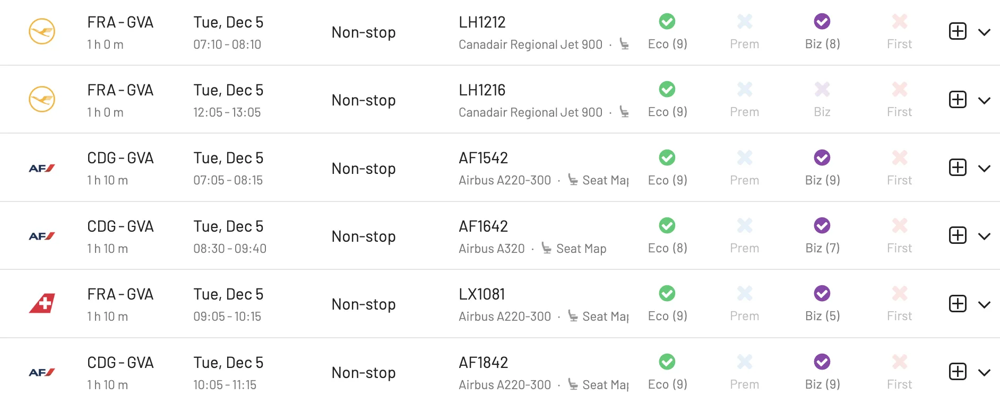

### 5. Banff, Alberta, Canada

Banff is a real gem in the Canadian Rockies, offering stunning snowy landscapes and winter activities such as skiing, snowboarding, and ice skating on frozen lakes. The town is cozy and quaint, with excellent boutique shops and restaurants. Plus, the hot springs are perfect for warming up after a chilly day outdoors.

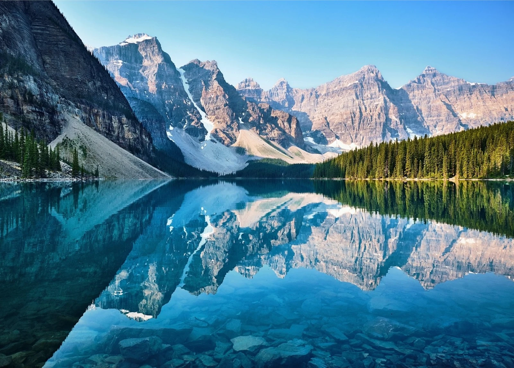

#### How to fly to Banff?

- **Nearest Airport**: [Calgary International Airport (YYC)](https://awardfares.com/search?.YYC.)
- **Frequent Flyer Program**: Aeroplan, Flying Blue, SkyMiles, MileagePlan.

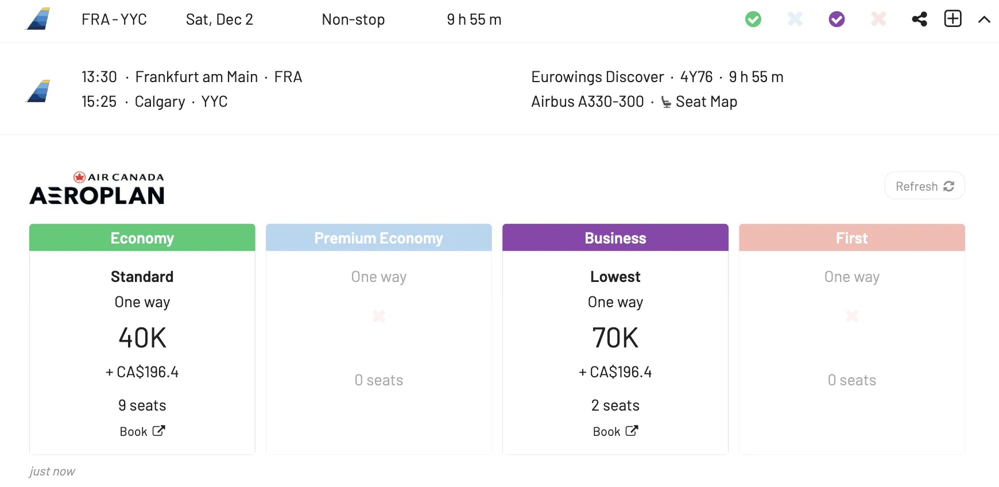

### 6. Niseko, Japan

Niseko in Japan is a paradise for powder hounds, famous for its incredibly light and fluffy snow that makes skiing and snowboarding here a dream. Plus, the area offers a unique blend of thrilling slopes and traditional Japanese culture, complete with relaxing *onsens* (hot springs) to soak in after a day on the mountains.

#### How to fly to Niseko?

- **Nearest Airport**: [New Chitose Airport (CTS)](https://awardfares.com/search?.CTS.)
- **Frequent Flyer Program**: MileagePlus, EuroBonus.

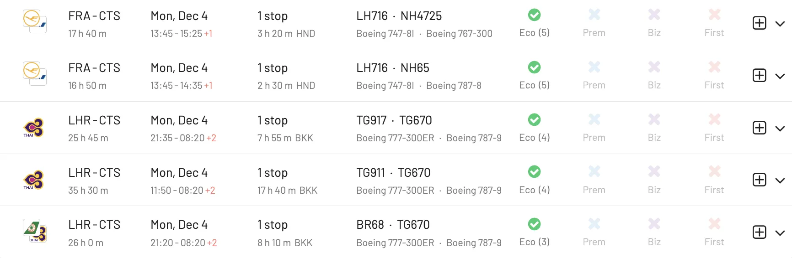

### 7. Reykjavik, Iceland

Reykjavik, Iceland, is an excellent choice if you're into stunning natural wonders like the Northern Lights, geothermal hot springs, and unique landscapes. The Viking city is full of hidden landmarks, with a vibrant arts scene, great food, and a bunch of cozy spots to hang out.

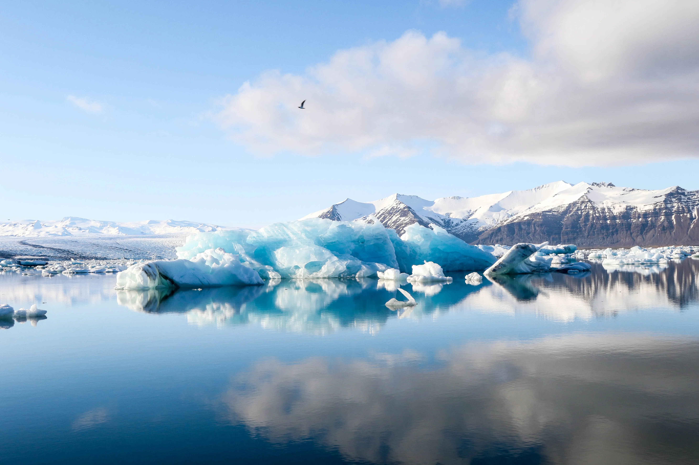

#### How to fly to Reykjavik?

- **Nearest Airport**: [Keflavik International Airport (KEF)](https://awardfares.com/search?.KEF.)
- **Frequent Flyer Program**: EuroBonus, SkyMiles, Flying Blue.

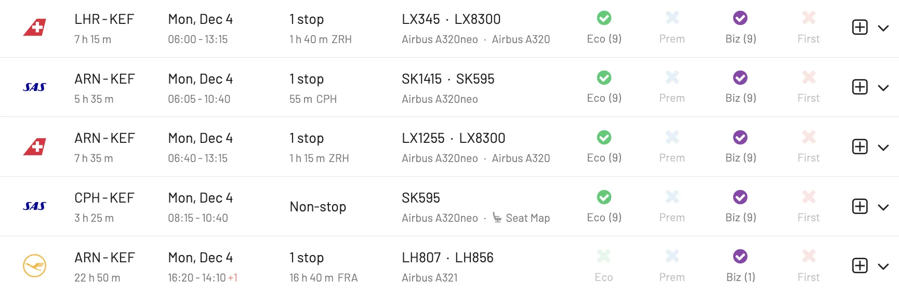

### 8. Lake Tahoe, California/Nevada, USA

Lake Tahoe, straddling California and Nevada, is a winter playground offering some of the best skiing and snowboarding in the U.S., along with breathtaking lake views. Beyond the slopes, the area is packed with fun, from lively casinos on the Nevada side to cozy mountain lodges perfect for relaxing after a day in the snow.

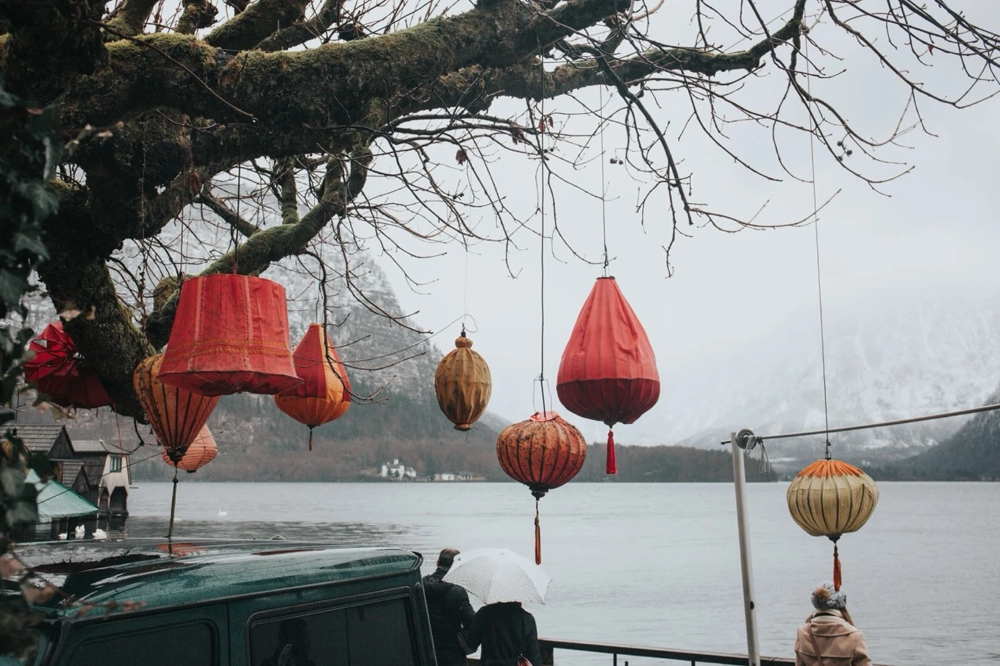

#### How to fly to Lake Tahoe?

- **Nearest Airport**: [Reno-Tahoe International Airport (RNO)](https://awardfares.com/search?.RNO.)
- **Frequent Flyer Program**: MileagePlus, AAdvantage, Mileage Plan, SkyMiles.

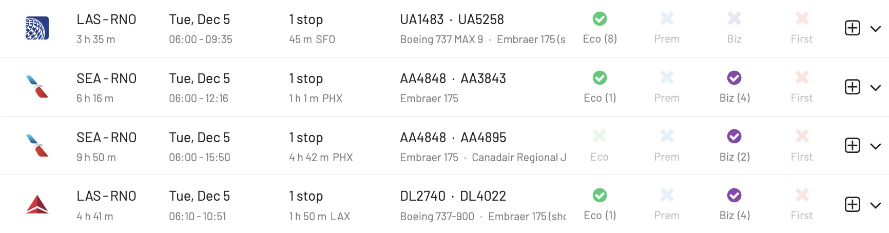

### 9. Courchevel, France

Courchevel in France is a top pick for a classy ski experience; it is part of the world's largest ski area with slopes for all skill levels and some seriously chic after-ski spots. The village oozes luxury with its high-end shops, gourmet restaurants, and stunning alpine views, making it a winter wonderland for both skiers and non-skiers alike.

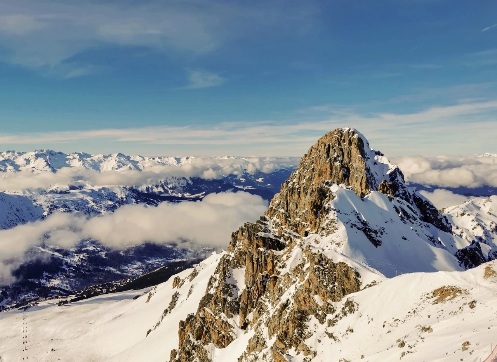

#### How to fly to Courchevel?

- **Nearest Airport**: [Geneva Airport (GVA)](https://awardfares.com/search?.GVA.) or [Lyon–Saint Exupéry Airport (LYS)](https://awardfares.com/search?.LYS.)
- **Frequent Flyer Program**: EuroBonus, Flying Blue.

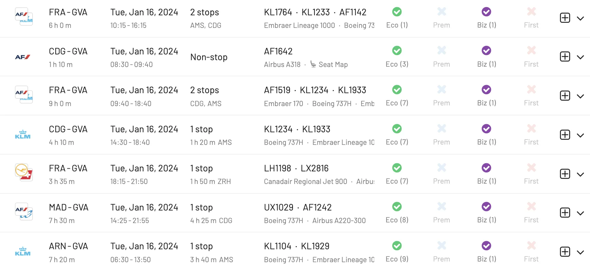

### 10.  St. Moritz, Switzerland

St. Moritz in Switzerland is the epitome of alpine luxury, offering top-notch skiing and a world-famous bobsled run, all set in a stunning mountain landscape. This resort town is also famous for its high-end shopping, gourmet dining, and vibrant social scene that attracts a chic international crowd.

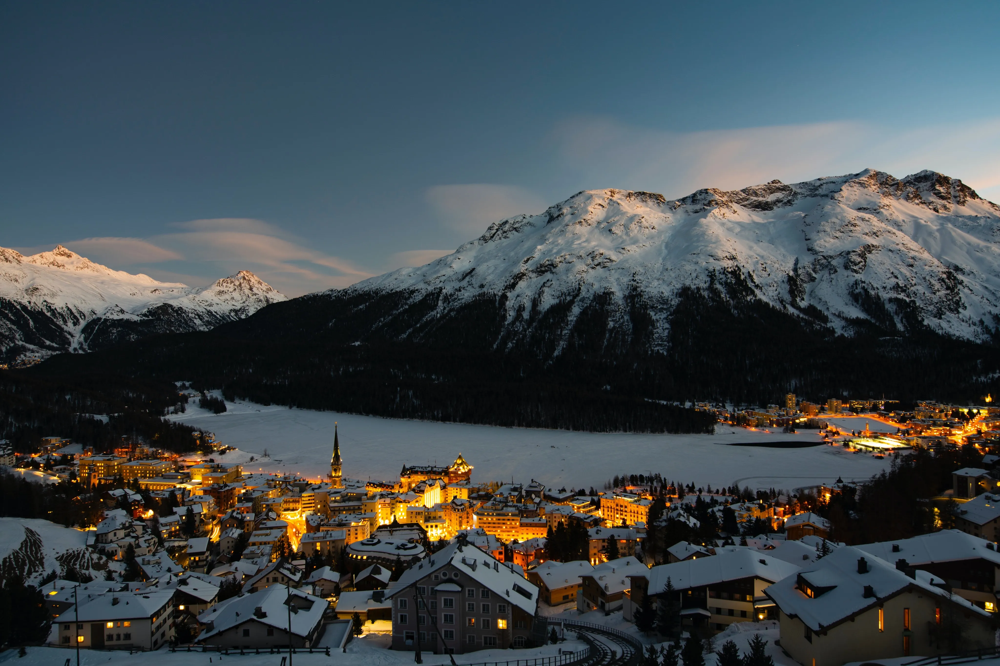

#### How to fly to St. Moritz?

- **Nearest Airport**: [Zurich Airport (ZRH)](https://awardfares.com/search?.ZRH.)
- **Frequent Flyer Program**: EuroBonus, MileagePlus.

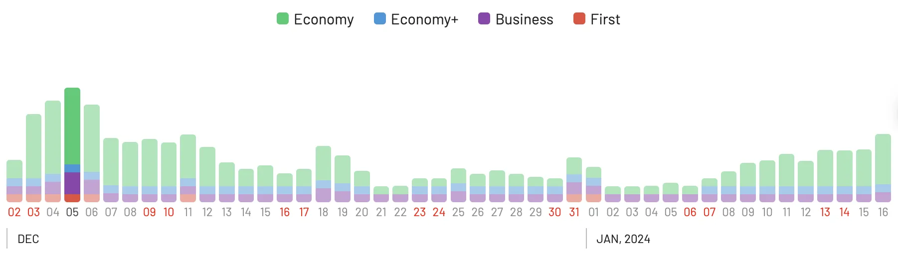

## Find flights with AwardFares

AwardFares lets you find award flights across different frequent flyer programs in just seconds, and with a few clicks. You can [get started for free](https://awardfares.com/), even without creating an account!

As we are rolling out new features every week, make sure to [sign up for our monthly newsletter](https://awardfares.com/newsletter) to stay on top of the latest and pro guides.

With our [Gold and Diamond tiers](https://awardfares.com/pricing), you can access premium features such as unlimited daily searches, alerts, seat maps, flight schedules, and more.

## Read more

Our guides have all the information you need to be a pro travel hacker and explore the world on points. Here are some related posts you might enjoy:

- [How To Find Cheap Award Flights And Identify Good Redemptions (Step-by-step)](https://blog.awardfares.com/how-to-find-cheap-award-flights/)
- [Holiday Award Travel 2023: Using Dynamic Pricing to Your Advantage](https://blog.awardfares.com/xmas-2023/)
- [Demystifying Award Charts: All You Need To Know (2023)](https://blog.awardfares.com/demystifying-award-charts/)
- [Ultimate Guide to Award Release Dates](https://blog.awardfares.com/ultimate-guide-to-award-release-dates)

Notes

- *Images from Unsplash*