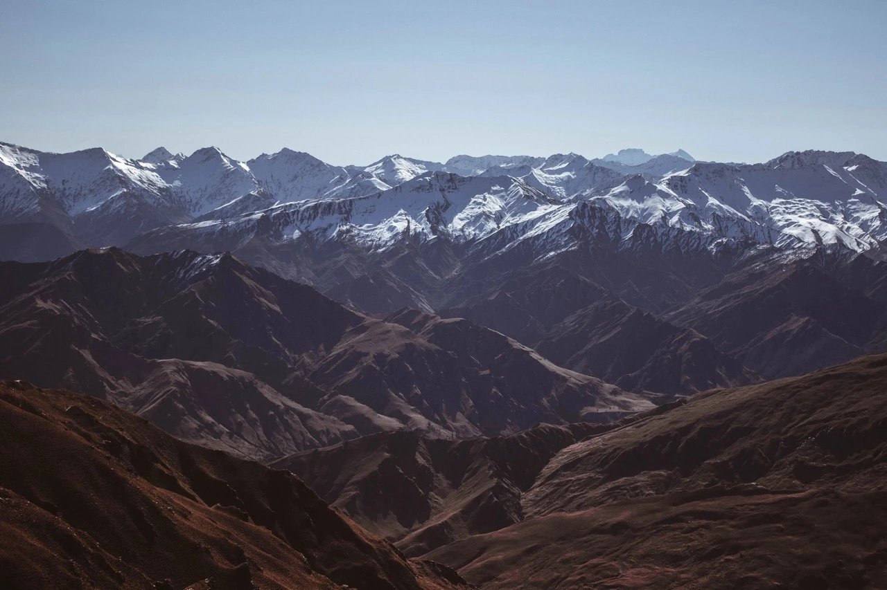

Winter travel can be a delightful experience, especially when you can leverage your points and miles for both the journey and the stay. Here's a guide to the top 10 winter destinations, complete with the nearest airports and suggested frequent flyer programs to help you book your flights.

## Our Top 10 Winter Destinations and How to Get There

### 1. Aspen, Colorado, USA

Aspen is a premier destination for skiing and snowboarding, offering luxurious resorts and vibrant nightlife. A perfect spot for a winter getaway because it's got amazing ski slopes and a really fun vibe after the skiing's done. It's a great mix of fancy and outdoorsy, making it super cool for both ski lovers and folks just looking to chill in a beautiful mountain town.

*Image from Unsplash*

- **Nearest Airport**: Aspen/Pitkin County Airport (ASE)
- **Frequent Flyer Program**: United MileagePlus, Air Canada Aeroplan, American Airlines AAdvantage, Air France/KLM Flying Blue.

### 2. Whistler, British Columbia, Canada

Whistler in British Columbia is a winter wonderland, famous for having one of the largest ski resorts in North America and a really cool, laid-back mountain vibe. It's not just about the epic slopes; the village has tons of shops, restaurants, and activities that make it a top pick for anyone looking for a fun and active winter vacation.

*Image from Unsplash*

- **Nearest Airport**: Vancouver International Airport (YVR)
- **Frequent Flyer Program**: Air Canada Aeroplan, Air France-KLM FlyingBlue, American AAdvantage, United MileagePlus British Airways Executive Club

### 3. Zermatt, Switzerland

Zermatt in Switzerland is a must-visit for its jaw-dropping views of the Matterhorn and some of the best skiing in the Alps. It's not just the slopes that are awesome – the car-free village is super charming, filled with cozy spots to eat and relax after a day in the snow.

*Image from Unsplash*

- **Nearest Airport**: Geneva Airport (GVA) or Zurich Airport (ZRH)
- **Frequent Flyer Program**: SAS EuroBonus, United MileagePlus, or Lufthansa Miles & More.

### 4. Banff, Alberta, Canada

Banff is a real gem in the Canadian Rockies, offering stunning snowy landscapes and a bunch of winter activities like skiing, snowboarding, and ice skating on frozen lakes. It's not just about the sports though; the town itself is super quaint, with lots of cool shops and restaurants, plus the hot springs are perfect for warming up after a chilly day outdoors.

*Image from Unsplash*

- **Nearest Airport**: Calgary International Airport (YYC)
- **Frequent Flyer Program**: Air Canada Aeroplan, WestJet Rewards

### 5. Niseko, Japan

Niseko in Japan is a paradise for powder hounds, famous for its incredibly light and fluffy snow that makes skiing and snowboarding here a dream. Plus, the area offers a unique blend of thrilling slopes and traditional Japanese culture, complete with relaxing onsens (hot springs) to soak in after a day on the mountains.

*Image from Unsplash*

- **Nearest Airport**: New Chitose Airport (CTS)
- **Frequent Flyer Program**: United MileagePlus, SAS EuroBonus, ANA Mileage Club, JAL Mileage Bank.

### 6. Reykjavik, Iceland

Reykjavik, Iceland, is a great choice if you're into stunning natural wonders like the Northern Lights, geothermal hot springs, and unique landscapes. It's not just about nature though; the city itself is super cool, with a vibrant arts scene, great food, and a bunch of cozy spots to hang out in after a day of exploring.

*Image from Unsplash*

- **Nearest Airport**: Keflavik International Airport (KEF)
- **Frequent Flyer Program**: Delta SkyMiles, Air France-KLM FlyingBoue, Icelandair Saga Club.

### 7. Lake Tahoe, California/Nevada, USA

Lake Tahoe, straddling California and Nevada, is a winter playground offering some of the best skiing and snowboarding in the U.S., along with breathtaking lake views. It's not just the slopes that are great – the area is packed with fun, from lively casinos on the Nevada side to cozy mountain lodges perfect for relaxing after a day in the snow.

*Image from Unsplash*

- **Nearest Airport**: Reno-Tahoe International Airport (RNO)
- **Frequent Flyer Program**: Southwest Rapid Rewards or United MileagePlus

### 8. Courchevel, France

Courchevel in France is a top pick for a classy ski experience, part of the world's largest ski area with slopes for all skill levels and some seriously chic après-ski spots. It's not just about hitting the slopes; the village oozes luxury with its high-end shops, gourmet restaurants, and stunning alpine views that make it a winter wonderland for both skiers and non-skiers alike.

*Image from Unsplash*

- Nearest Airport: Geneva Airport (GVA) or Lyon–Saint Exupéry Airport (LYS)
- Frequent Flyer Program: Air France-KLM Flying Blue or British Airways Executive Club

### 9. Queenstown, New Zealand

Queenstown, New Zealand, is a winter hotspot, offering some of the Southern Hemisphere's best skiing and snowboarding against a backdrop of incredible mountain scenery. But there's more to it than just the slopes – this lively town is also known for its adventure sports, buzzing nightlife, and nearby wineries, making it a great all-around winter destination.

*Image from Unsplash*

- **Nearest Airport**: Queenstown Airport (ZQN)
- **Frequent Flyer Program**: United MileagePlus, American AAdvantage, Air New Zealand Airpoints or Qantas Frequent Flyer.

### 10.  St. Moritz, Switzerland

St. Moritz in Switzerland is the epitome of alpine luxury, offering top-notch skiing and a world-famous bobsled run, all set in a stunning mountain landscape. It's not just about the sports; this resort town is also famous for its high-end shopping, gourmet dining, and a vibrant social scene that attracts a chic international crowd.

*Image from Unsplash*

- **Nearest Airport**: Zurich Airport (ZRH)
- **Frequent Flyer Program**: SAS EuroBonus, United MileagePlus, Lufthansa Miles & More.

## Get started, and stay tuned

You can [try AwardFares for free](https://awardfares.com/). We are rolling out new features and improvements regularly, so [sign up for our monthly newsletter](https://awardfares.com/newsletter) to stay on top of the latest news, announcements, and pro tips.

With our [Gold and Diamond tiers](https://awardfares.com/pricing), you can access premium features such as unlimited daily searches, alerts, seat maps, flight schedules, and more!

## Read more

Make sure to also check these posts out

- [How To Find Cheap Award Flights And Identify Good Redemptions (Step-by-step)](https://blog.awardfares.com/how-to-find-cheap-award-flights/)
- [Seat Maps: Getting The Perfect Seat Even Before Booking](https://blog.awardfares.com/seatmaps-guide/)
- [10 Tips For Booking An Award Trip In 2023](https://blog.awardfares.com/award-trip-tips/)
- [Demystifying Award Charts: All You Need To Know (2023)](https://blog.awardfares.com/demystifying-award-charts/)
- [Ultimate Guide to Award Release Dates](https://blog.awardfares.com/ultimate-guide-to-award-release-dates)