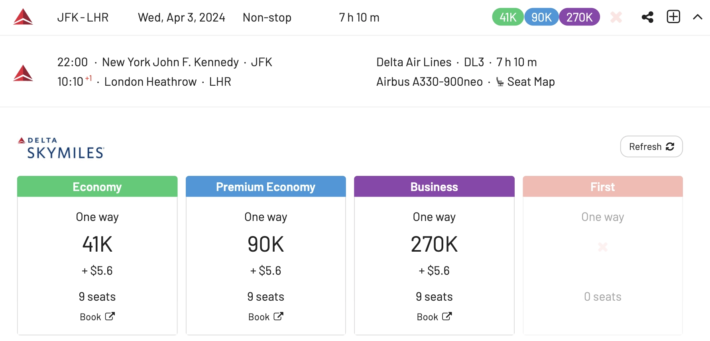
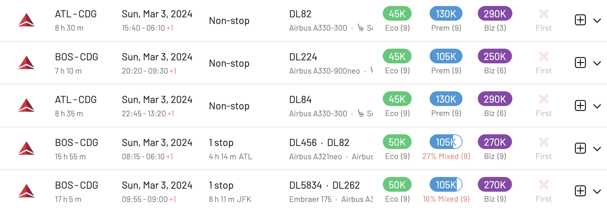
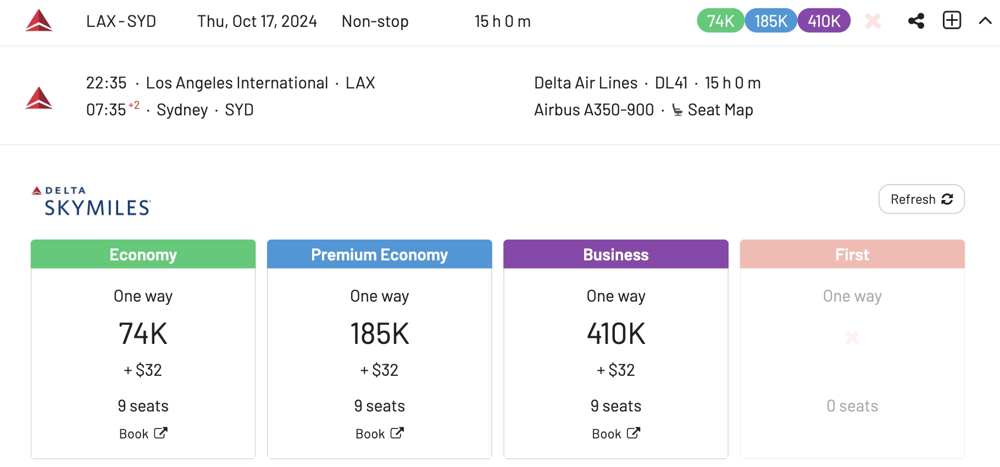
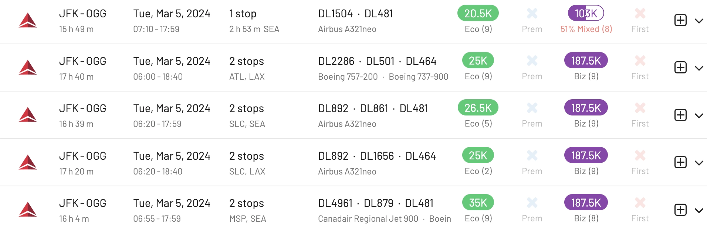
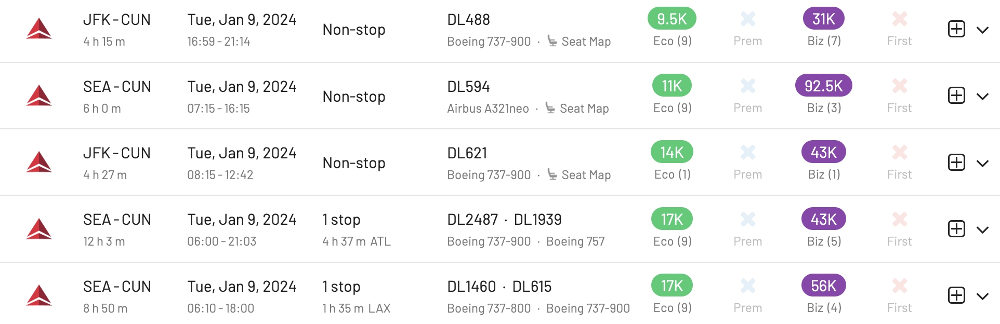
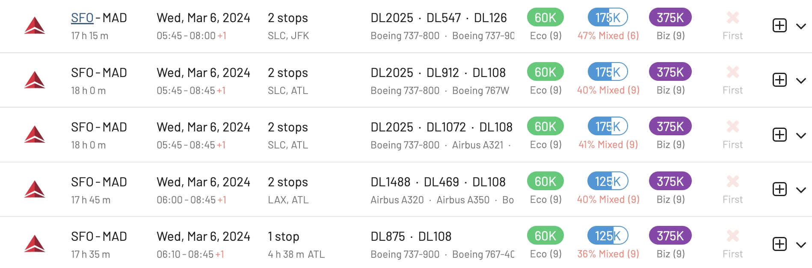
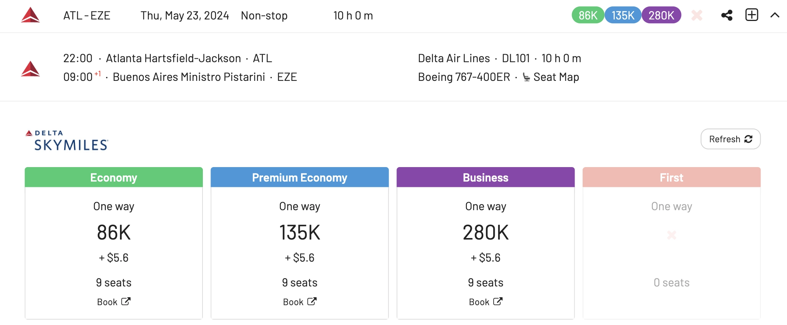
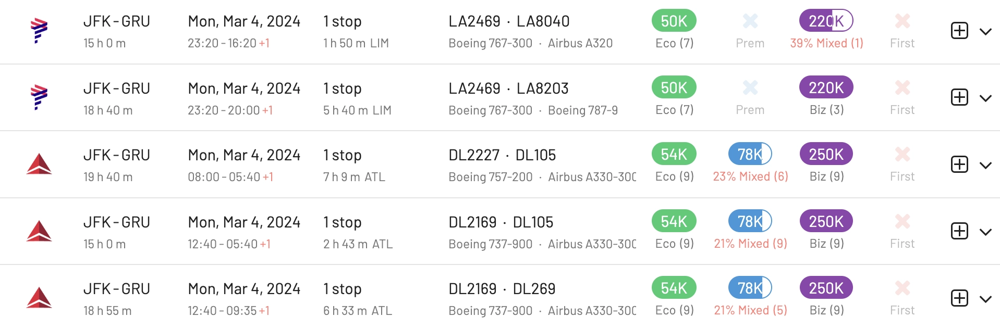
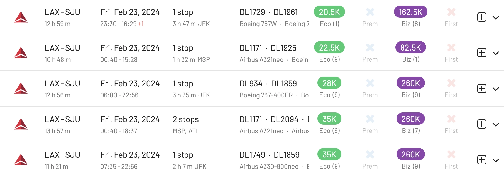
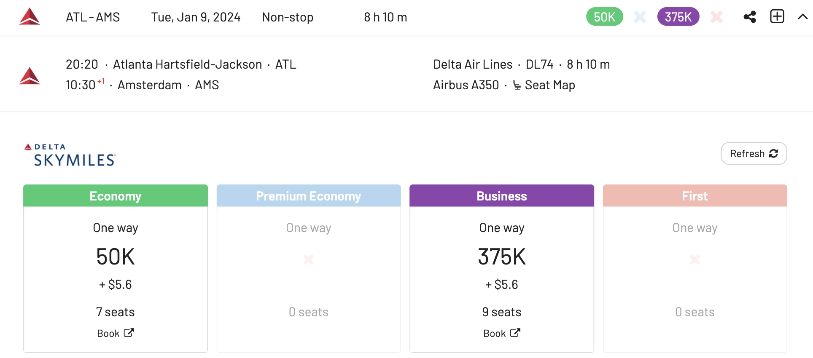

Delta SkyMiles, the loyalty program of Delta Air Lines, has one of the widest arrays of redemption options, not only when it comes to routes, but also partner airlines. Recent announcements had upset a large portion of their members with major changes for 2024, because it will be harder and more expensive to qualify for elite status.

However, SkyMiles remains a solid program for US-based members, especially considering that there are several ongoing credit card offers with sign up bonuses of up to 100k or even 150k when combining multiple cards.

If you have 100,000 Delta SkyMiles at your disposal, or you are planning on getting them soon through some of the current offers, this post is for you. We'll cover the best SkyMiles sweets spots, as well as how to determine how much are your miles worth, and how to find good redemptions using AwardFares.

### In This Post

- [Get 100,000 SkyMiles In 90 Days (Or More)](#get-100000-skymiles-in-90-days-or-more)
- [How Much Are 100k Delta SkyMiles Worth?](#how-much-are-100k-delta-skymiles-worth)
- [Top Redemptions For Your Delta SkyMiles (Under 100k)](#top-redemptions-for-your-delta-skymiles-under-100k)
- [Airbus A350-900 and A330-900neo: Delta's Newest Airplanes and Cabins.](#airbus-a350-900-and-a330-900neo-deltas-newest-airplanes-and-cabins)
- [Get started today](#get-started-today)
- [Read more](#read-more)

## Get 100,000 SkyMiles In 90 Days (Or More)

If you are interested in learning how to rack up a ton of SkyMiles in a few months, here are some great resources to check out before this post:

- [How To Earn 100,000 Delta SkyMiles [In 90 Days]](https://upgradedpoints.com/travel/airlines/earn-100k-delta-skymiles/) *by Upgraded Points*
- [New Delta Limited Time Offers: How to Maximize Up to 100,000 SkyMiles](https://www.nerdwallet.com/article/travel/new-delta-limited-time-offers-how-to-maximize-up-to-100000-skymiles) *by NerdWallet*

## How Much Are 100k Delta SkyMiles Worth?

The value of Delta SkyMiles varies depending on how you redeem them. Typically you need to look at **the price of the flight in cash**, and compare it to **how many miles you are spending** to book the award flight.

However, a good rule of thumb is to consider that the average value of a SkyMile is around **1.1 cents** (USD). This means that 100,000 SkyMiles are worth about $1100 (USD).

### Calculate The Value Of Your SkyMiles (Tool)

The mini tool below lets you calculate the value of your SkyMiles redemption in cents per mile (CPM).

Just enter:

- The price of your flight in cash (use Google Flights or Delta's Website).
- The price of your flight in SkyMiles (use AwardFares or Delta's Website).
- The taxes and fees required to book a flight using SkyMiles (use AwardFares or Delta's Website).

**Tip**: If the CPM value you see is over 1.1 cent, then you are getting a relatively good redemption. The higher, the better.

    <label for="cashPrice">Cash Price of Ticket ($): </label>
    <input type="number" id="cashPrice" placeholder="e.g., 500">
      
    <label for="taxesFees">Taxes and Fees: </label>
    <input type="number" id="taxesFees" placeholder="e.g., 50">
      
    <label for="milesUsed">Number of SkyMiles Needed: </label>
    <input type="number" id="milesUsed" placeholder="e.g., 25000">
      
    <button class="btn" onclick="calculateCPM()">Calculate CPM</button>
      
    <label for="result">CPM (cents-per-mile): </label>
    <input type="text" id="result" readonly>

## Top Redemptions For Your Delta SkyMiles (Under 100k)

Here are some of our favorite routes in which to burn your SkyMiles. Click on the title to search for availability on that route using AwardFares.

### 1. [New York (JFK) to London (LHR) -- 66,000 miles round-trip](https://awardfares.com/search?JFK.LHR.;a:DL;z:delta)

You can book the same route operated by the A330-900neo, starting at 82,000 miles in Economy (round-trip).

### 2. Atlanta (ATL) or Boston (BOS) to Paris (CDG) - 90,000 miles round-trip

### 3. Los Angeles (LAX) to Sydney, Australia (SYD) - 74,000 miles one-way

### 4. New York (JFK) to Kahului (OGG) - 41,000 miles round-trip

### 5. New York (JFK) or Seattle (SEA)  to Cancun (CUN) - 19,000 miles round trip

### 6. San Francisco (SFO) to Madrid (MAD) - 60,000 miles one-way

### 7. Atlanta (ATL) to Buenos Aires (EZE) - 86,000 miles one-way

### 8. New York (JFK) to São Paulo (GRU) - 100,000 miles round trip

Operated by LATAM in Economy Class. There are also options on Delta Air Lines for 104k SkyMiles in Economy.

### 9. Los Angeles (LAX) to Puerto Rico (SJU) - 41,000 miles round-trip

### 10. Atlanta (ATL) to Amsterdam (AMS) - 100,000 miles round-trip

On Delta's A350-900.

## Airbus A350-900 and A330-900neo: Delta's Newest Airplanes and Cabins.

Scoring an award flight on a new plane is double reward!

Delta's recently introduced A330-900neos and A350-900 are typically used on long-haul, transoceanic routes. Both aircraft are fuel efficient and among the most comfortable for long-haul flights.

They are equipped with Delta's signature flat-bed seats in Delta One, as well as Delta Premium Select, Delta Comfort+, and Main Cabin seating. All cabins have in-seat power and in-seat video. Delta's A330-900neos also offer onboard Wi-Fi for purchase.

The Airbus A330-900neo is powered by Rolls-Royce Trent 7000 engines. It has a range of up to 11,130 nautical miles (20,799 km) and can seat up to 293 passengers. It is one of the quietest twin-engine airliners in the world.

### Routes On The A330-900neo

Delta Air Lines operates the Airbus A330-900neo on a variety of routes, including:

**Transatlantic**: New York (JFK) to London (Heathrow), New York (JFK) to Paris (Charles de Gaulle), Atlanta (Hartsfield-Jackson) to Amsterdam (Schiphol), Los Angeles (LAX) to Frankfurt (am Main).

**Transpacific**: Los Angeles (LAX) to Sydney (Kingsford Smith), Seattle (SEA) to Tokyo (Narita), Detroit (DTW) to Tokyo (Narita), Seattle (SEA) to Seoul (Incheon).

**Latin America**: New York (JFK) to São Paulo (Guarulhos), Atlanta (Hartsfield-Jackson) to Rio de Janeiro (Galeão), Los Angeles (LAX) to Santiago (Arturo Merino Benítez).

**US Domestic**: New York (JFK) to Los Angeles (LAX).

### Routes On The A350-900

Delta Air Lines operates the Airbus A350-900 on routes such as:

**Transatlantic**: Atlanta (ATL) to London (LHR), Paris (CDG), Amsterdam (AMS), Frankfurt (FRA), Rome (FCO), Barcelona (BCN), and more.

**Transpacific**: Atlanta (ATL) to Seoul (ICN), Tokyo (NRT), Shanghai (PVG), Beijing (PEK).

**Africa**: Atlanta (ATL) to Johannesburg (JNB), Lagos (LOS).

**Australia**: Atlanta (ATL) to Sydney (SYD) and Melbourne (MEL).

**Latin America**: Atlanta (ATL) to São Paulo (GRU), Rio de Janeiro (GIG), and Santiago (SCL).

### Find SkyMiles Awards On The A330-900neo or A350-900

AwardFares lets you quickly and intuitively set advanced filters to see the flights you want in just seconds.

Here's how to filter results by a specific aircraft type. Let's say you only want to fly on Delta's new A330-900neo or A350-900.

## Get started today

AwardFares lets you find award flights across different frequent flyer programs in just seconds, and with a few clicks. You can [get started for free](https://awardfares.com/), even without creating an account!

As we are rolling out new features every week, make sure to [sign up for our monthly newsletter](https://awardfares.com/newsletter) to stay on top of the latest and pro guides.

With our [Gold and Diamond tiers](https://awardfares.com/pricing), you can access premium features such as unlimited daily searches, alerts, seat maps, flight schedules, and more.

## Read more

Our guides have all the information you need to be a pro travel hacker and explore the world on points. Here are some related posts you might enjoy:

- [Delta SkyMiles Award Search Now Available (New Features)](https://blog.awardfares.com/introducing-delta/)
- [How To Find Cheap Award Flights And Identify Good Redemptions (Step-by-step)](https://blog.awardfares.com/how-to-find-cheap-award-flights/)
- [Demystifying Award Charts: All You Need To Know (2023)](https://blog.awardfares.com/demystifying-award-charts/)
- [Ultimate Guide to Award Release Dates](https://blog.awardfares.com/ultimate-guide-to-award-release-dates)

