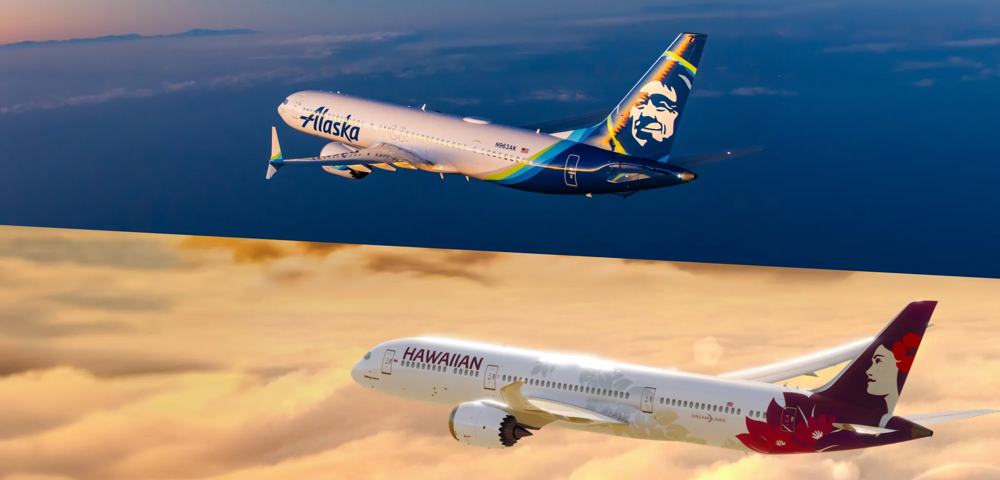
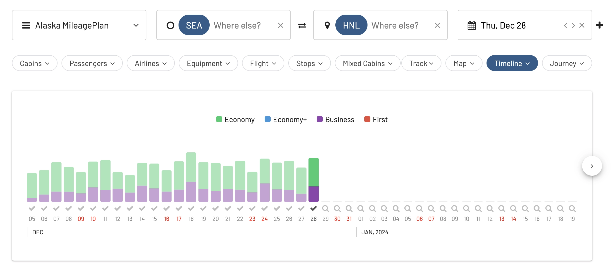
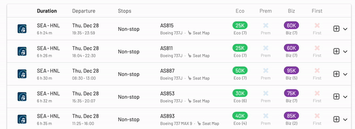

Big news in the airline industry! Alaska Airlines is on the brink of a [massive $1.9 billion acquisition of Hawaiian Airlines](https://news.alaskaair.com/newsroom/alaska-airlines-and-hawaiian-airlines-to-combine-expanding-benefits-and-choice-for-travelers-throughout-hawaii-and-the-west-coast/). This move is not just a headline-grabber; it's a potential game-changer for frequent flyers, especially those in love with the Hawaii-U.S. mainland routes.

## What Does This Mean for Award Flight Seekers?

If you're an [Alaska Mileage Plan](https://awardfares.com/search?..;z:alaska) member, this acquisition could be music to your ears. Here's why:

- **Expanded Route Options**. The combined force of Alaska and Hawaiian Airlines will cover an impressive network of over 330 routes. This expansion means more choices for your award flights, especially if you're eyeing Hawaii or the U.S. mainland.
- **Increased Market Share**. Together, these airlines will hold about 6.15% of the U.S. market. This consolidation could lead to more availability and potentially better redemption options for your miles.
- **Overlap on Key Routes**. There's a significant overlap in the Hawaii-mainland U.S. network between the two airlines. Alaska serves 12 of the 28 routes in Hawaiian’s network, which could lead to more competitive award pricing and availability.
- **Enhanced International Reach**. Hawaiian Airlines brings to the table 10 international destinations across seven countries, including spots in the Asia-Pacific region. This expansion means more exotic destinations could be within your reach using award flights.
- **Potential Hub Advantages**. Post-acquisition, Honolulu is set to become Alaska's second-largest hub. This shift could mean more flights, better connections, and more award seat availability from this key location.
- **Hawaiian in Oneworld**. As Alaska Airlines is a member of Oneworld, the acquisition might be the first step to seeing Hawaiian in the alliance, also benefiting other Oneworld partners and programs such as AAdvantage, and others.

## What's Next?

While this deal is still pending regulatory approval, its completion could reshape the landscape for award travel, particularly for those with a penchant for Pacific destinations. Alaska Airlines' commitment to maintaining separate brands post-acquisition ensures that the unique offerings of both airlines remain intact, potentially benefiting frequent flyers even more.

## A Look at the Numbers

Alaska is currently the fifth-largest airline in the U.S. domestic market, with Hawaiian not far behind. The combined group would control **over 40% of the seat capacity** on Hawaii-U.S. mainland routes.

Both airlines serve numerous overlapping routes, particularly from Honolulu and Maui, increasing options for travelers.

## Our Final Thoughts

This acquisition is more than just a corporate maneuver; it's a promising development for award travelers. With increased route options, a stronger presence in key markets, and an expanded international footprint, the Alaska-Hawaiian combo could open new doors for your next award flight adventure.

## How To Search For Alaska Mileage Plan Awards with AwardFares

1. Go to [AwardFares](https://awardfares.com/search).
2. Under Frequent Flyer Program, choose **Alaska Mileage Plan**.
3. Enter your departure area or city (e.g., **Seattle**).
4. Enter your destination airport (e.g., **Honolulu**).
5. Choose a date, or use the Timeline view to explore flights for different dates.

That's it! You will see the full result list on the list below.

### Sort by price: Find the cheapest Mileage Plan awards

Use the search header to sort by award price and see the cheapest Mileage Plan awards first.

## Get started

You can [try AwardFares for free](https://awardfares.com/). We are rolling out new features and improvements regularly, so [sign up for our monthly newsletter](https://awardfares.com/newsletter) to stay on top of the latest news, announcements, and pro tips.

With our [Gold and Diamond tiers](https://awardfares.com/pricing), you can access premium features such as unlimited daily searches, alerts, seat maps, flight schedules, and more!

## Read more

Our guides have all the information you need to be a pro travel hacker and explore the world on points. Here are some related posts you might enjoy:

- [Alaska Airlines Mileage Plan Partner Redemptions Made Easy (2023)](https://blog.awardfares.com/alaska-partners-2023/)
- [Alaska Mileage Plan Updates (June 2023)](https://blog.awardfares.com/alaska-mileageplan-updates-june-2023/)
- [How To Find Cheap Award Flights And Identify Good Redemptions (Step-by-step)](https://blog.awardfares.com/how-to-find-cheap-award-flights/)
- [Ultimate Guide to Award Release Dates](https://blog.awardfares.com/ultimate-guide-to-award-release-dates)