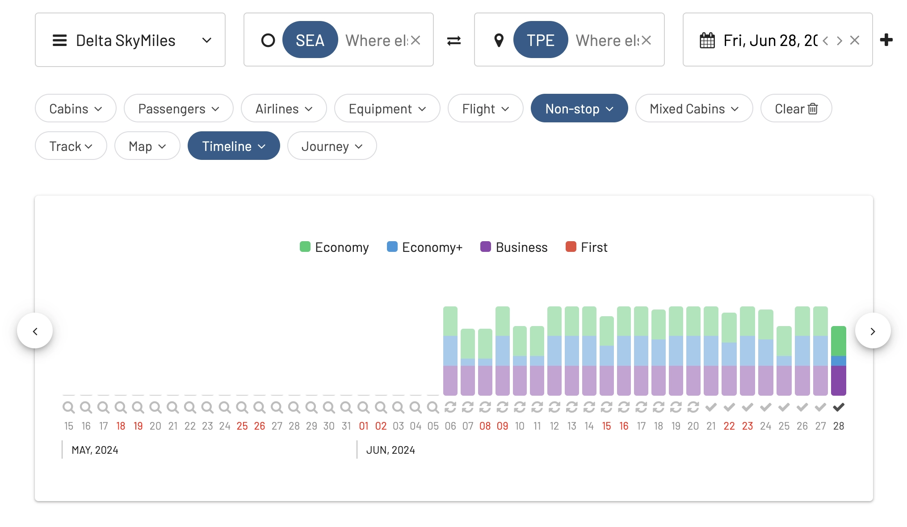
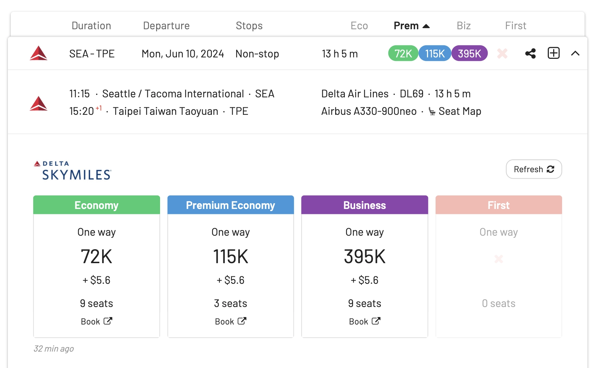
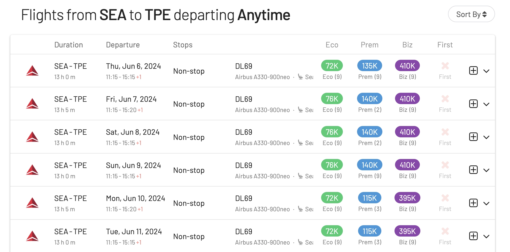
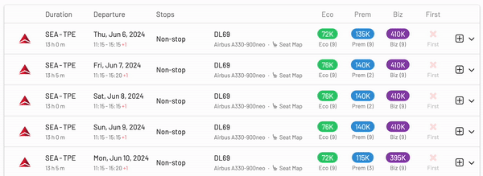

Delta Air Lines [just announced](https://news.delta.com/delta-fly-taipei-seattle-hub) that it will enhance its Asian network by introducing a daily direct flight from [Seattle (SEA) to Taiwan Taoyuan International Airport (TPE)](https://awardfares.com/search?SEA.TPE.2024-06-06;o:duration;so:a;z:delta), starting June 6, 2024, subject to government approval. This route marks a significant milestone as Delta's first nonstop flight from the U.S. to Taipei and signifies the airline's return to TPE since its last operation through Narita in 2017.

## 90 Years of History and Growth

2023 marks Delta's 90th anniversary in Seattle, tracing back to Northwest Airways' operations in 1933. Delta's journey in Seattle began in 1980, and today, the airline boasts over 160 daily departures to 50 global destinations from SEA. The introduction of the Taipei service further solidifies Seattle's role as a vital gateway for Delta's operations across the Pacific. This addition to Delta's trans-Pacific portfolio is expected to boost both business and leisure travel, reinforcing Seattle's status as a key international hub.

## Extensive Network Growth

Delta's expansion isn't limited to Seattle. In 2023, the airline has significantly increased its presence across Asia and the Pacific. This includes additional flights to ICN from ATL, expanded services to China, resumed flights to HND, and new routes like the LAX to Auckland service. These strategic moves demonstrate Delta's commitment to offering comprehensive connectivity in the region.

## Awards Already Available

Using AwardFares, we see there's already plenty of seats available on the non-stop route SEA-TPE using SkyMiles miles, and even other SkyTeam partners.

We've seen awards from 72k SkyMiles in Economy, 115k in Premium Economy and 395k miles in Business Class (Delta One) on the A330-900neo [one way prices].

## A New Level of Comfort and Connectivity

Passengers on the new Taipei route will enjoy the Airbus A330-900neo, equipped with Delta One Suites, Delta Premium Select, and other cabin options, ensuring a premium travel experience. Additionally, Delta's joint venture with Korean Air expands customer options, providing access to 80 destinations in Asia through ICN. This partnership, along with Delta's continuous investment in its fleet and services, underscores the airline's dedication to enhancing the passenger experience and its global network.

## Search For Delta SkyMiles Plan Awards: Seattle to Taipei

1. Go to [AwardFares](https://awardfares.com/search).
2. Under Frequent Flyer Program, choose [**Delta SkyMiles**](https://awardfares.com/search?..;z:delta).
3. Enter your departure area or city (e.g., [**Seattle**](https://awardfares.com/search?SEA..;z:delta)).
4. Enter your destination airport (e.g., [**Taipei**](https://awardfares.com/search?SEA.TPE.;z:delta)).
5. Under Stops choose [**Non-stop only**](https://awardfares.com/search?SEA.TPE.;x:0;z:delta).
6. Choose a date, or use the Timeline view to explore flights for different dates.

That's it! You will see the full result list on the list below.

### Sort by price: Finding the cheapest SkyMiles awards

Use the search header to sort by award price and see the cheapest Delta SkyMiles awards first (in any cabin class).

## Get started, and stay tuned

You can [try AwardFares for free](https://awardfares.com/). We are rolling out new features and improvements regularly, so [sign up for our monthly newsletter](https://awardfares.com/newsletter) to stay on top of the latest news, announcements, and pro tips.

With our [Gold and Diamond tiers](https://awardfares.com/pricing), you can access premium features such as unlimited daily searches, alerts, seat maps, flight schedules, and more!

## Read more

Our guides have all the information you need to be a pro travel hacker and explore the world on points. Here are some related posts you might enjoy:

- [What To Do With 100k Delta SkyMiles? A 2024 Guide To Finding SkyMiles Sweet Spots.](https://blog.awardfares.com/100k-skymiles/)
- [Delta SkyMiles Award Search Now Available (New Features)](https://blog.awardfares.com/introducing-delta/)
- [Seat Maps: Getting The Perfect Seat Even Before Booking](https://blog.awardfares.com/seatmaps-guide/)
- [Demystifying Award Charts: All You Need To Know](https://blog.awardfares.com/demystifying-award-charts/)
