We're thrilled to announce that AwardFares now supports the Flying Blue program! This exciting integration means that our users can now effortlessly track and redeem their Flying Blue miles for flights with Air France, KLM, and a host of other partner airlines. With its incredible [Promo Rewards](#flying-blue-promo-rewards) at crazy rates, multiple transfer partners, and the [future incorporation of more airlines and routes (e.g., SAS)](https://blog.awardfares.com/sas-acquisition/), Flying Blue stands as one of the best programs to look into during 2024.

We are firmly closing up 2023, now supporting a total of 8 programs and dozens of new features to make award search smooth and easy. Thanks for joining us!

### What's New?

- [Introducing Flying Blue Award Search](#introducing-flying-blue-award-search)
- [Flying Blue Promo Rewards](#flying-blue-promo-rewards)
- [How To Find Cheap Flying Blue Awards](#how-to-find-cheap-flying-blue-awards)
- [A Few Considerations](#a-few-considerations)
- [More Improvements](#more-improvements)
- [Get started](#get-started)
- [Read more](#read-more)

## Introducing Flying Blue Award Search

[**Flying Blue**](https://www.flyingblue.com/) is the official frequent flyer program of Air France and KLM, two of Europe's leading airlines. Several other carriers, such as Transavia and TAROM also embrace it.

Renowned for its flexibility and generous rewards, Flying Blue allows members to earn miles through flights, hotel stays, car rentals, and everyday purchases with various partners. The program was recently restructured into tiers Explorer, Silver, Gold, and Platinum – each offering escalating privileges and perks, such as priority boarding, lounge access, and extra baggage allowance, enhancing the travel experience for frequent flyers.

However, since it has been the program of multiple airlines, the entry point for booking award flights is confusing: there are multiple portals to source the data from, Air Franc and KLM, plus a standalone landing page that hosts the program details and profile. This makes it confusing to find award flights and use your points.

Our latest update lets you search awards quickly, see prices across multiple dates, and then redirect you to the corresponding portal to make booking a breeze. Here's what the process looks like.

### Redeem on Air France or KLM

When Flying Blue is selected, AwardFares will display all seats available, prices, and availability in all cabin types, including Economy, Premium Economy, Business, and First Class (domestic and international).

Add **Air France** or **KLM** on the **Airline** filter to display flights operated only by these airlines:

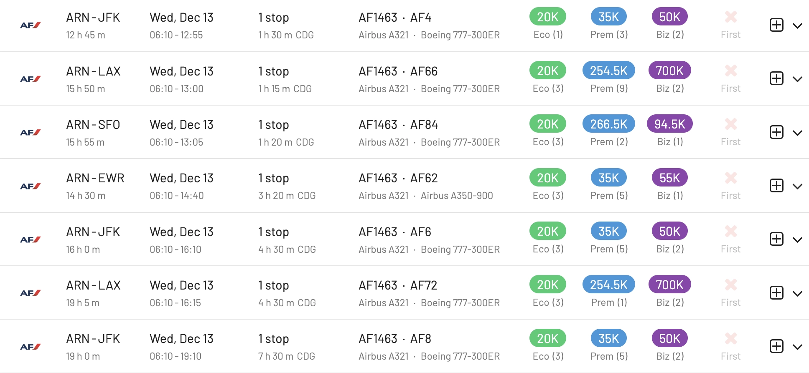

### Redeem on SkyTeam Airlines

In addition to searching on AF and KL, AwardFares will show availability across all SkyTeam and other SkyMiles partner airlines. For example, it's easy to search on airlines such as GOL, Aerolíneas Argentinas, Aeroméxico, etc.

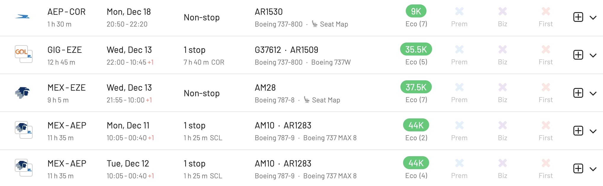

## Flying Blue Promo Rewards

The [Flying Blue Promo Rewards](https://www.flyingblue.com/en/spend/flights/rewards) is a unique feature of the Flying Blue program, offering members the opportunity to redeem their accumulated miles for flights at significantly reduced rates. Flying Blue releases a new set of Promo Rewards each month, typically including a curated selection of destinations where members can enjoy discounts ranging from 20% to 50% off the usual miles required for award tickets.

These promotions include destinations across the globe, both short-haul and long-haul flights, and also in different travel classes, including Economy, Premium Economy, and Business Class. The specific destinations and discounts vary each month, and members get notified via email with the latest selection.

These tickets are generally non-refundable and non-changeable, but they're a great way to maximize the value of your Flying Blue miles.

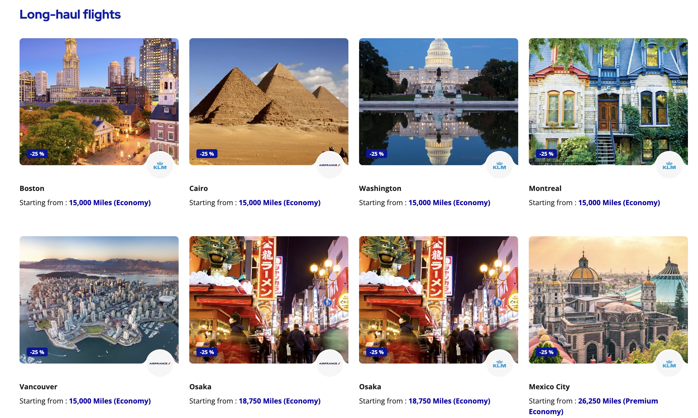

The great news is that AwardFares supports these Promo rewards **natively**. This means that, unlike other programs, you'll see the discounted rates (with the promotion already applied) directly in the search results. It's **the easiest way to search for Flying Blue Promo Rewards**!.

Every month, once you get the email announcement (or you check Flying Blue's website), you can see which destinations are part of the promo and simply search for availability using AwardFares.

For example, here are flights from several cities in [Europe to Boston](https://awardfares.com/search?ARN.LAX,SFO,area:NYC.;o:economy;so:a;z:flyingblue), which is 15k points (one-way) with a 25% discount as part of the December 2023 Promo Rewards.

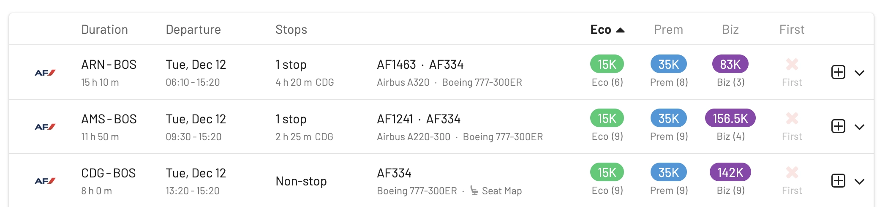

## How To Find Cheap Flying Blue Awards

### 1. Go to [AwardFares](https://awardfares.com/signup)

Creating an account is optional, but it's also free, and it gives you access to more features. Make sure to [sign up for one here](https://awardfares.com/signup).

### 2. Select Flying Blue under **Frequent Flyer Program**

Tap on the **Loyalty Program** field and select AF/KLM Flying Blue as your loyalty program.

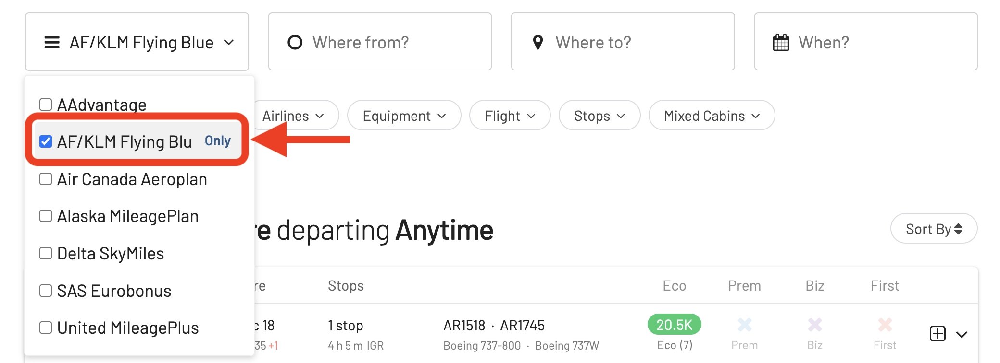

### 3. Add a Route

Use the **Origin** and **Destination** fields to add one (or more) airports to search for flights between those locations. AwardFares will search for award flights with any number of stops. In addition, you can use the **Stops** filter to search for non-stop flights only.

In the example below, we search for flights [between Amsterdam and Paris to New York](https://awardfares.com/search?area:NYC.area:CDG.;so:a;z:delta).

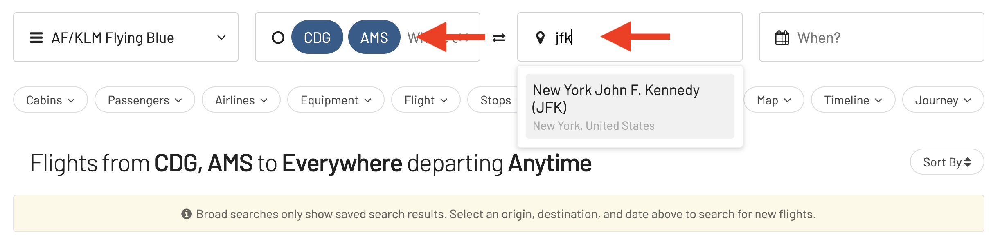

### 4. Choose or explore dates

If you have a particular date in mind, add it by tapping on the **Calendar** field.

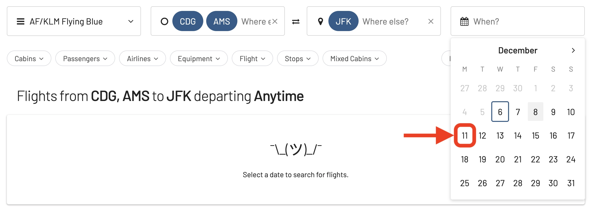

If you don't have a set date, you can take advantage of AwardFare's **Timeline View** to explore seat availability across different days. The Timeline View displays how many seats are available for each day of the week/month. The bars are color-coded, so it's easy to distinguish between cabin classes (Economy, Business, First). You can also trigger new searches by tapping the refresh icon underneath each day.

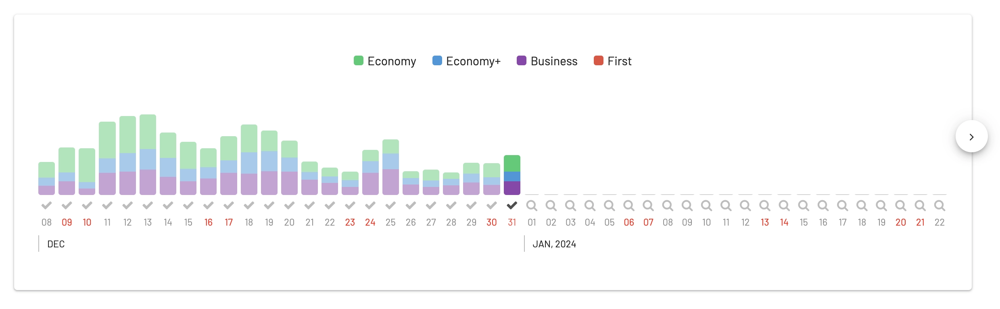

In addition, you can tap anywhere on the flight to display more details in an expanded view, such as aircraft type, and even [get the current seat maps](https://blog.awardfares.com/seatmaps-guide/) to see which seats are free versus occupied!

### 5. Sort by Price

Whether you are exploring dates using the Timeline View or have selected a specific day, AwardFares will show you the available seats (with real-time data) within seconds in the result list below.

You can tap on the different header columns to sort the results by price. Use the **Eco**, **Prem**, **Biz**, and **First** class tags to find cheap awards across multiple dates, itineraries, and airlines.

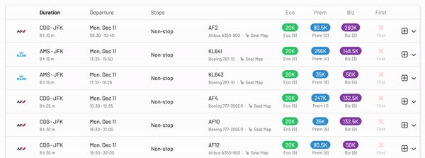

### 6. Book on Air France Website

One of the slightly confusing parts of Flying Blue as a loyalty program is that they have multiple portals, both through Air France and KLM's website.

Once you have identified the flight(s) you want, tap on the **Book** button, and AwardFares will redirect you to Air France website, setting your query directly, so you don't have to redo the search. Simply login and complete the booking1.

 - *(1) Remember that AwardFares will never ask for the login credentials of any of your frequent flyer programs to work.*

## A Few Considerations

### Taxes and Fees

When you tap on a flight, the detailed view will show you more details about it, including availability, taxes, and fees required to book the award. Note that the currency will be shown in Euros (€).

### Mixed Cabins

While AwardFares displays mixed-cabin award availability, in the current integration with Flying Blue through the Air France portal, it's not possible to source this data before the booking process. Hence, you won't see this information about mixed cabins directly in AwardFares' search results. As a reminder, the results will show this note in the expanded view:

*Flights booked with KLM/Air France Flying Blue might contain mixed segments.*

### Multiple Booking Portals

AwardFares primarily shows awards available through the Air France portal, which, in our experience, yields more accurate and complete results than KLM’s site. However, in a few cases and for very specific partner airlines, the KLM portal displays flights not found through AF’s site. This might be due to cooperation agreements between the airlines and other implementation details.

## More Improvements

### Sort alerts

It's now possible to sort alerts, which can be useful when trying to find a specific one.

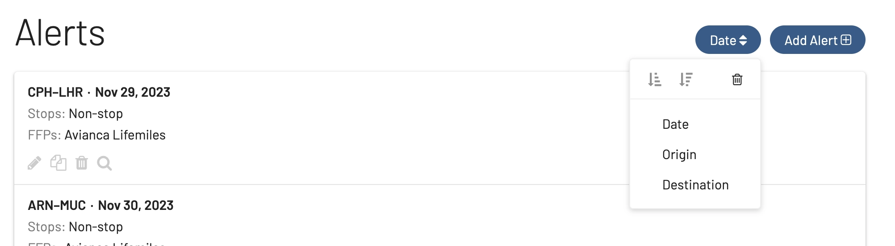

### Stopovers with Self-transfers

Airport changes and self-transfers are now clearly shown in the stops info. E.g., in this case one of the trips arrives in EWR and continues from JFK, AwardFares now shows EWR-JFK instead of JFK.

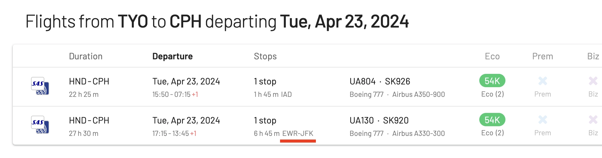

## Get started

You can [try AwardFares for free](https://awardfares.com/). We are rolling out new features and improvements regularly, so [sign up for our monthly newsletter](https://awardfares.com/newsletter) to stay on top of the latest news, announcements, and pro tips.

With our [Gold and Diamond tiers](https://awardfares.com/pricing), you can access premium features such as unlimited daily searches, alerts, seat maps, flight schedules, and more!

## Read more

Our guides have all the information you need to be a pro travel hacker and explore the world on points. Here are some related posts you might enjoy:

- [How To Find Cheap Award Flights And Identify Good Redemptions (Step-by-step)](https://blog.awardfares.com/how-to-find-cheap-award-flights/)
- [Delta SkyMiles Award Search Now Available (New Features)](https://blog.awardfares.com/introducing-delta/)
- [Seat Maps: Getting The Perfect Seat Even Before Booking](https://blog.awardfares.com/seatmaps-guide/)
- [Demystifying Award Charts: All You Need To Know (2023)](https://blog.awardfares.com/demystifying-award-charts/)
- [Ultimate Guide to Award Release Dates](https://blog.awardfares.com/ultimate-guide-to-award-release-dates)