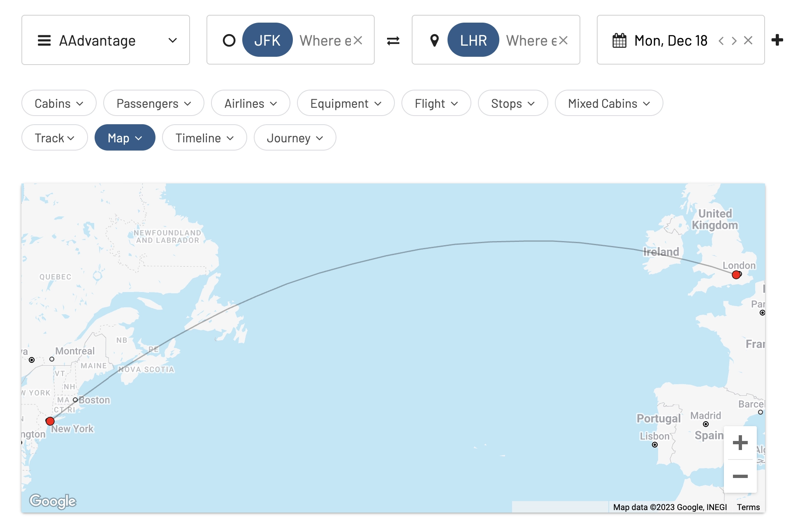
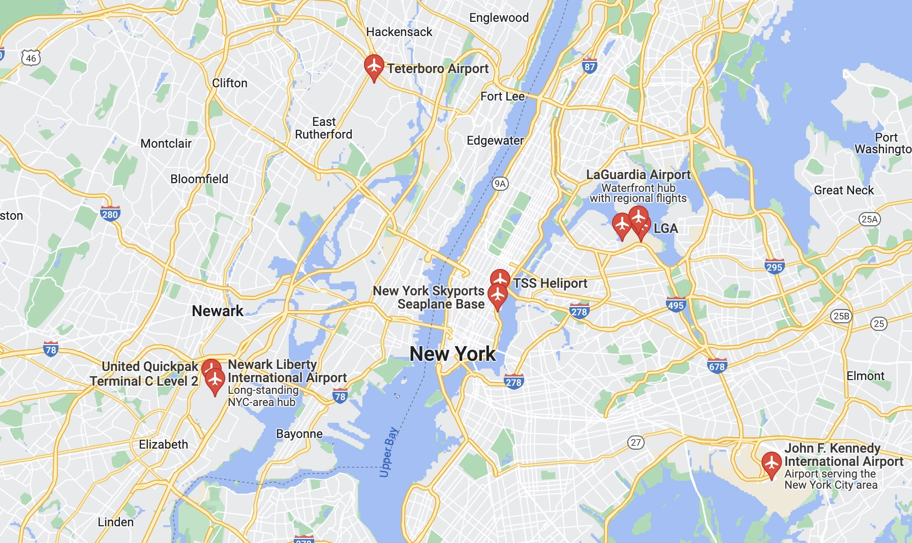
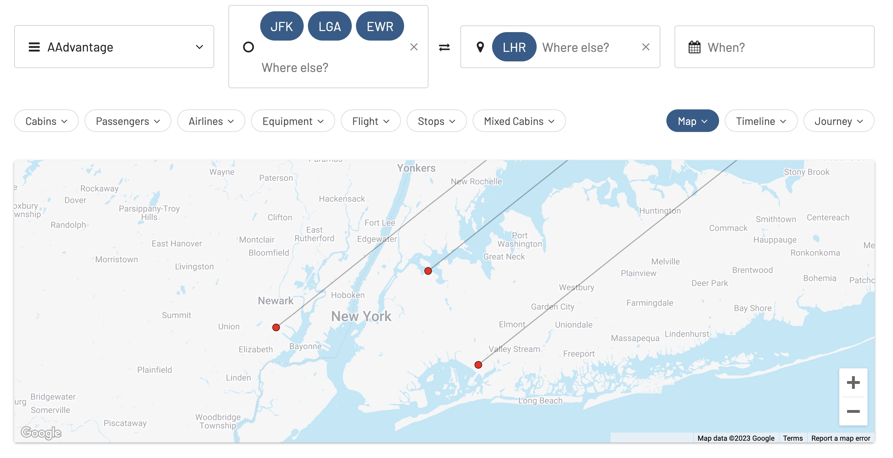
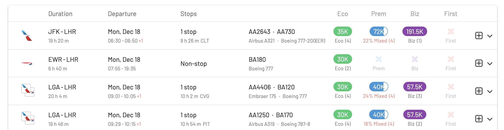
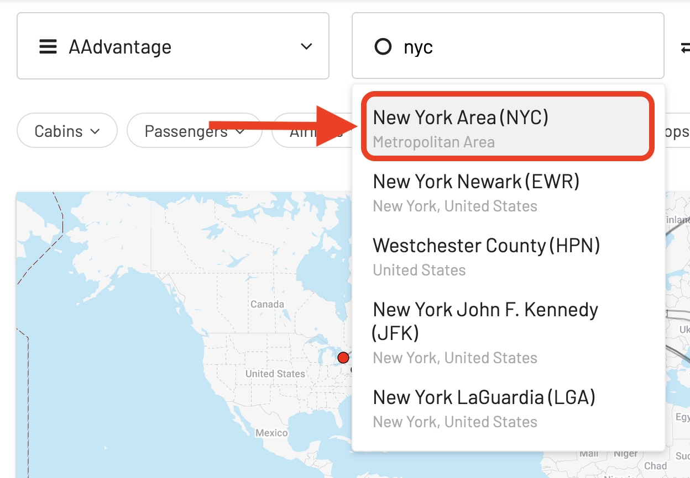
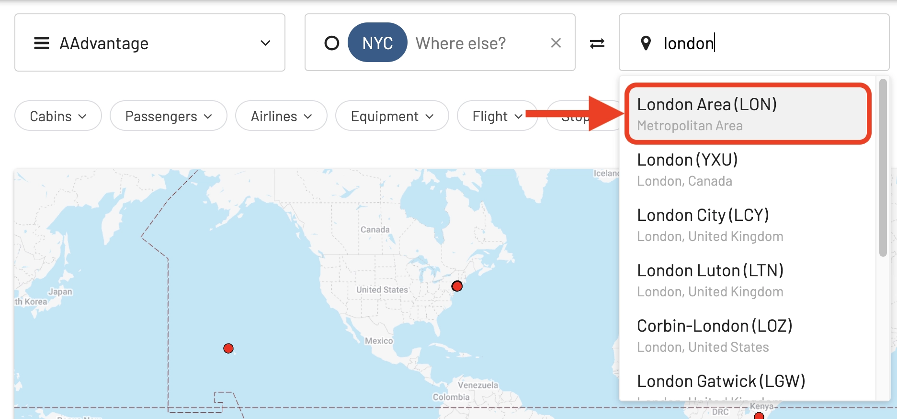

AwardFares' **Wide Search** feature is one of the most powerful we've ever released: it lets you search for award flights between entire regions or areas at once, which is a huge time saver. Interestingly, it's also one of the most underutilized features.

In this article, we cover everything you should know about wide award searches so that you can leverage their maximum power and always score an award on the routes you want. Let's start!

## Understanding Wide Search

Traditionally, when searching for award flights, you would have to specify your exact departure and arrival cities/airports. This can be limiting, especially if you're flexible with your travel plans or if award availability is scarce.

Here's an example of a traditional search [between New York and London, using AAdvantage](https://awardfares.com/search?JFK.LHR.;z:aadvantage). In this case, the departure airport is JFK, and the destination airport is Heathrow.

However, if you want to depart from New York, there are other airports to choose from, such as Newark (EWR) and La Guardia (LGA), as we can see below.

If we try searching from these airports, we might find more award seats available, or even at a better redemption rate. One option is to add those airports in the **Where From/Origin** field in AwardFares. Simply add EWR and LGA to the list below, as we see in the picture below:

In the result list, you'll now see flights from all these airports

However, this is cumbersome, as it forces us to know the names of the airports or cities in that area. The list can become lengthy, and we might not be aware of other airports in the area.

Wide Award Search changes this by allowing you to search for award flights between entire regions or areas, rather than specific cities. This approach broadens your search parameters, increasing your chances of finding available award seats.

## How To Use Wide Search

Instead of adding the airports manually, you can simply write the **name** of a Metropolitan area, for example, **type New York City (NYC)** for *any* airport in New York.

As you type, AwardFares' auto-suggest will clearly show you that it is a Metro Area option in the dropdown menu.

Immediately, as we zoom in, we see that searching from NYC also includes more airports and options available, such as New York Stewart International Airport.

In a similar way, we can perform a wide search on our **Destination** city. In this case, we replace LHR for **London (LON)**, which will also search award flights beyond Heathrow, including airports like Gatwick (LGW), Standstedt (STN), and others.

*ps. Wide searches also works for regions, such as countries (e.g., Belgium) or award chart zones/areas (e.g., Scandinavia).*

## Examples of Known Metro Areas

### New York Metropolitan Area, USA

1. John F. Kennedy International Airport (JFK): JFK is the primary international airport serving New York City.
2. LaGuardia Airport (LGA): Mainly handles domestic flights and is closer to Manhattan.
3. Newark Liberty International Airport (EWR): Located in New Jersey, it serves both domestic and international flights.

### Greater Tokyo Area, Japan

1. Tokyo Haneda Airport (HND): Handles a significant number of domestic flights and an increasing number of international flights.
2. Narita International Airport (NRT): Primarily serves international flights and is located further from central Tokyo.

### London Metropolitan Area, UK

1. Heathrow Airport (LHR): London's main airport, handling the majority of international flights.
2. Gatwick Airport (LGW): The second busiest airport in the UK, serving both international and domestic flights.
3. London City Airport (LCY): Located in the heart of London, primarily serving business travelers.

### Greater Paris (Île-de-France), France

1. Charles de Gaulle Airport (CDG): The largest airport in France and a major international hub.
2. Orly Airport (ORY): Handles a mix of domestic and international flights, located closer to the city center.

### Los Angeles Metropolitan Area, USA

1. Los Angeles International Airport (LAX): The primary airport for international and domestic flights.
2. Hollywood Burbank Airport (BUR): Serves domestic flights and is closer to the Hollywood area.
3. Long Beach Airport (LGB): A smaller airport, mainly for domestic flights.

### Greater Stockholm Metropolitan Area, Sweden

1. Arlanda Airport (ARN): This is the main international airport serving Stockholm. It is located in the Sigtuna Municipality, approximately 40 kilometers north of Stockholm city center. Arlanda handles the majority of international and long-haul flights to and from Stockholm.
2. Bromma Airport (BMA): Bromma is located just 7.5 kilometers west of Stockholm city center and primarily serves domestic flights. It is the closest airport to the city center and is popular for short-haul flights.
3. Skavsta Airport (NYO): Located near Nyköping, about 100 kilometers southwest of Stockholm, Skavsta primarily serves low-cost carriers and cargo operators. It is a popular choice for budget travelers.
4. Västerås Airport (VST): Situated near Västerås, about 110 kilometers west of Stockholm, this airport is used by a few low-cost airlines and for general aviation.

### São Paulo Metropolitan Area, Brazil

1. São Paulo/Guarulhos–Governador André Franco Montoro International Airport (GRU): The main international airport.
2. Congonhas-São Paulo Airport (CGH): Mainly handles domestic flights and is located closer to the city center.

### Greater Buenos Aires Metropolitan Area, Argentina

1. Ministro Pistarini International Airport (EZE): Commonly known as Ezeiza International Airport, it is the main international gateway to Argentina. Located about 22 kilometers south-southwest of Buenos Aires, it handles the majority of the international traffic coming into and out of the country.
2. Jorge Newbery Airfield (AEP): Also known as Aeroparque, this airport is located in the city of Buenos Aires itself, just a few kilometers from the downtown area. It mainly handles domestic flights and some regional flights to neighboring countries.

## Pro Tips for Mastering Wide Search

* **Combine with alerts**. Set up award availability alerts for your desired route with *Wide Search* enabled. This way, you'll be notified instantly when award seats open up during your three-day window, giving you a head start on booking.
* **Be flexible**. Remember, the wider your search window, the higher your chances of finding award seats. Consider expanding your date range beyond just one day before and after for even more options.
* **Play with filters**. Use filters strategically to narrow down your wide search results and find the award seats that perfectly match your preferences.
* **Consider Alternative Airports**. Wide searches might reveal availability in nearby airports that you hadn't considered.
* **Understand Your Miles**. Know the value and rules of your frequent flyer program to make the most of your miles. Some programs offer connecting flights to airports within the same metro area or region, adding extra cost to the total price in miles.

## Get started, and stay tuned

You can [try AwardFares for free](https://awardfares.com/). We are rolling out new features and improvements regularly, so [sign up for our monthly newsletter](https://awardfares.com/newsletter) to stay on top of the latest news, announcements, and pro tips.

With our [Gold and Diamond tiers](https://awardfares.com/pricing), you can access premium features such as unlimited daily searches, alerts, seat maps, flight schedules, and more!

## Read more

Our guides have all the information you need to be a pro travel hacker and explore the world on points. Here are some related posts you might enjoy:

- [How To Find Cheap Award Flights And Identify Good Redemptions (Step-by-step)](https://blog.awardfares.com/how-to-find-cheap-award-flights/)
- [Seat Maps: Getting The Perfect Seat Even Before Booking](https://blog.awardfares.com/seatmaps-guide/)
- [10 Tips For Booking An Award Trip In 2023](https://blog.awardfares.com/award-trip-tips/)
- [Demystifying Award Charts: All You Need To Know (2023)](https://blog.awardfares.com/demystifying-award-charts/)
- [Ultimate Guide to Award Release Dates](https://blog.awardfares.com/ultimate-guide-to-award-release-dates)